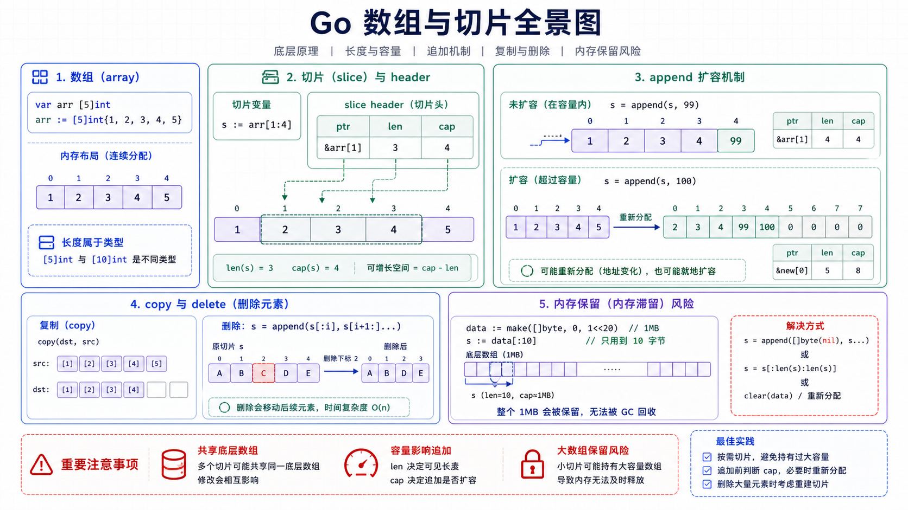

## 数组

数组是固定长度、元素类型相同的连续内存区域。



```go
var nums [3]int
nums[0] = 1
nums[1] = 2
nums[2] = 3
```

数组长度是类型的一部分，`[3]int` 和 `[4]int` 是不同类型。

```go
var a [3]int
var b [4]int
// a = b // 编译错误：类型不同
```

### 初始化

```go
names := [3]string{"api", "worker", "cron"}
auto := [...]int{1, 2, 3} // 编译器推断长度
```

### 数组传参

数组作为参数传递时会复制整个数组。

```go
func change(arr [3]int) {
    arr[0] = 100 // 修改的是副本
}
```

如果数组很大，或者需要修改原数组，可以传指针。但在日常业务中，切片更常用。

---

## 切片

切片是对底层数组的一段视图，包含三个重要信息：

| 字段 | 说明 |
|------|------|
| 指针 | 指向底层数组中的起始元素 |
| 长度 `len` | 当前可访问元素数量 |
| 容量 `cap` | 从起始元素到底层数组末尾的容量 |

```go
items := []string{"a", "b", "c"}
fmt.Println(len(items), cap(items))
```

切片本身是一个小描述符，复制切片不会复制底层数组。

---

## 创建切片

### 字面量

```go
names := []string{"api", "worker"}
```

### make

```go
buf := make([]byte, 0, 1024)
```

`make([]T, len, cap)` 会创建底层数组，并返回切片。

### 从数组或切片截取

```go
arr := [5]int{1, 2, 3, 4, 5}
s := arr[1:4] // [2 3 4]
```

截取结果和原数组共享底层数据。

```go
s[0] = 100
fmt.Println(arr) // [1 100 3 4 5]
```

---

## nil 切片和空切片

```go
var a []int       // nil 切片
b := []int{}     // 空切片
c := make([]int, 0)
```

三者长度都是 0，但只有 `a == nil` 为 true。

```go
fmt.Println(len(a), a == nil) // 0 true
fmt.Println(len(b), b == nil) // 0 false
```

多数业务中 nil 切片和空切片都可以正常 `append`。对 JSON 输出有要求时要注意差异：nil 切片通常编码为 `null`，空切片编码为 `[]`。

---

## append 扩容

```go
items := make([]int, 0, 2)
items = append(items, 1)
items = append(items, 2)
items = append(items, 3) // 容量不足时可能分配新底层数组
```

扩容规则是运行时实现细节，不应该依赖“永远 2 倍扩容”。大致规律是小切片扩容更激进，大切片增长比例会降低，并且会受到元素大小和内存分配器影响。

因此代码里只需要记住两点：

1. `append` 必须接收返回值。
2. 扩容后可能不再共享原底层数组。

```go
func add(items []int, value int) []int {
    items = append(items, value)
    return items
}
```

---

## copy 复制

`copy(dst, src)` 返回实际复制的元素数量。

```go
src := []int{1, 2, 3}
dst := make([]int, len(src))
n := copy(dst, src)
fmt.Println(n, dst)
```

复制切片可以避免共享底层数组带来的意外修改。

```go
func clone(items []int) []int {
    cloned := make([]int, len(items))
    copy(cloned, items)
    return cloned
}
```

Go 1.21 起也可以使用标准库 `slices.Clone`。

---

## 删除元素

不保持顺序：

```go
func deleteFast(items []int, i int) []int {
    items[i] = items[len(items)-1]
    return items[:len(items)-1]
}
```

保持顺序：

```go
func deleteStable(items []int, i int) []int {
    copy(items[i:], items[i+1:])
    return items[:len(items)-1]
}
```

如果元素包含指针，删除后最好清理尾部引用，帮助 GC 回收。

```go
func deletePtr(items []*User, i int) []*User {
    copy(items[i:], items[i+1:])
    items[len(items)-1] = nil // 清理不再使用的引用
    return items[:len(items)-1]
}
```

---

## 内存保留问题

小切片可能引用一个很大的底层数组，导致大数组无法被 GC 回收。

```go
func firstKB(data []byte) []byte {
    return data[:1024] // 仍然引用整个 data 的底层数组
}
```

如果只想保留小片段，应复制一份。

```go
func firstKBCopy(data []byte) []byte {
    part := data[:1024]
    result := make([]byte, len(part))
    copy(result, part)
    return result
}
```

---

## 预分配容量

当能预估元素数量时，提前设置容量可以减少扩容和拷贝。

```go
func collectIDs(users []User) []int64 {
    ids := make([]int64, 0, len(users))
    for _, user := range users {
        ids = append(ids, user.ID)
    }
    return ids
}
```

不要盲目预分配过大容量，否则会浪费内存。

---

## 多维切片

```go
matrix := [][]int{
    {1, 2, 3},
    {4, 5, 6},
}
```

每一行都是独立切片，长度可以不同。

```go
jagged := [][]int{
    {1},
    {2, 3},
    {4, 5, 6},
}
```

如果需要紧凑连续内存，可以用一维切片模拟二维数组。

```go
rows, cols := 3, 4
grid := make([]int, rows*cols)

set := func(r, c, value int) {
    grid[r*cols+c] = value
}

set(1, 2, 99)
```

---

## 小结

1. 数组长度是类型的一部分，传参会复制。
2. 切片是底层数组的视图，复制切片不会复制底层数据。
3. `append` 可能分配新数组，必须接收返回值。
4. 删除指针元素时清理尾部引用，避免内存保留。
5. 大数组截取小切片后如需长期保存，应复制需要的部分。
6. 能预估长度时合理预分配容量，减少扩容成本。
