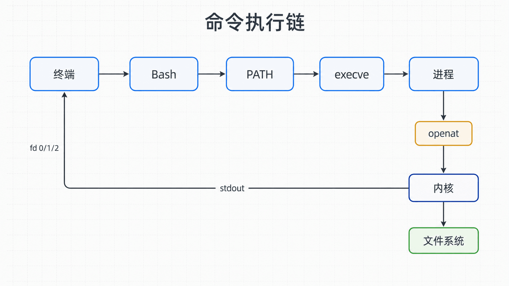
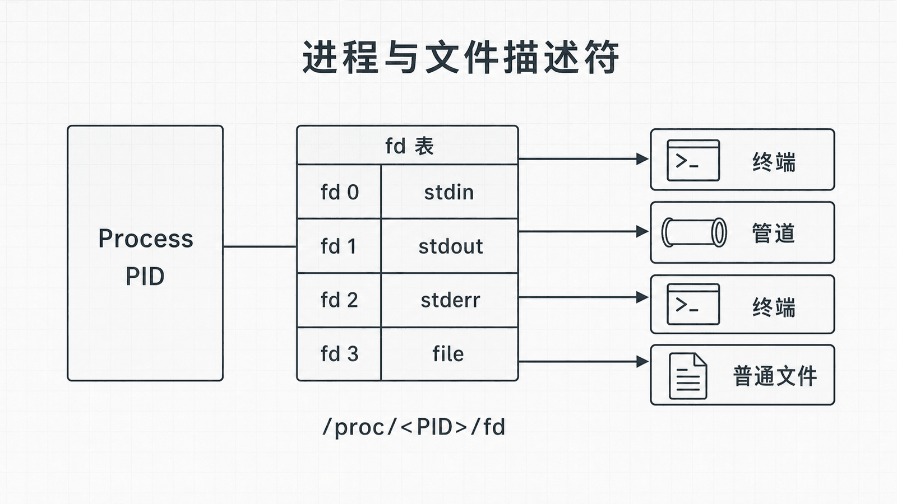

## 前置知识与学习目标

本文面向会使用终端和基本编程、但尚未系统学习 Linux 的开发者。你不需要掌握内核源码；只需知道程序会读取输入、执行计算并产生输出。

读完后，你应该能够：

- 区分 Linux 内核、发行版、Shell 和普通应用；
- 解释一条命令如何变成进程，并通过系统调用访问文件；
- 说清 PID、文件描述符、路径和挂载点分别描述什么；
- 使用 `man`、`type`、`ps`、`/proc` 为后续排障收集第一批证据。

全系列使用同一个案例：主机 `app01` 上以服务账户 `demo` 运行 `demo-web.service`，静态文件位于 `/srv/demo-web`，HTTP 监听端口为 `8080`，管理员账户为 `ops`。

## 真实场景

`ops` 登录 `app01` 后执行：

```bash
cat /srv/demo-web/index.html
```

屏幕上出现文件内容，看似只有一步。实际上 Bash 需要解析参数、找到 `cat` 可执行文件、创建进程；`cat` 再请求内核打开文件、读取字节并写到终端。如果路径不存在、权限不足或文件系统没有挂载，失败位置完全不同。

这就是本篇的核心问题：一条命令究竟经过了哪些层？

## 核心机制

Linux 严格来说是内核。日常所说的“Linux 系统”通常还包含 GNU 工具、系统服务、软件包管理器和发行版配置。Ubuntu、Debian、RHEL、Rocky Linux 等发行版共享许多内核接口，但包名、默认服务和配置工具可能不同。

用户空间程序不能随意访问硬件或其他进程的内存。它通过系统调用请求内核完成受保护的操作，例如：

- `openat`：按路径打开文件；
- `read`：从文件描述符读取字节；
- `write`：向文件、管道、套接字或终端写字节；
- `execve`：用另一个程序替换当前进程映像；
- `fork`/`clone`：创建新的执行上下文。

Shell 是命令解释器，Bash 是 Shell 的一种实现。Shell 负责解析命令、展开变量和启动程序；内核负责进程调度、内存、文件系统、网络和设备访问。

<!-- figure-anchor:l01-a01 -->

<!-- figure-managed:l01-f01:start -->



<!-- figure-managed:l01-f01:end -->

## 关键对象与状态变化

<!-- figure-anchor:l01-a02 -->

<!-- figure-managed:l01-f02:start -->



<!-- figure-managed:l01-f02:end -->

执行 `cat /srv/demo-web/index.html` 时，可以按下面的状态链理解：

1. 终端把输入交给 Bash。
2. Bash 将命令拆成程序名 `cat` 和一个路径参数。
3. Bash 按 `PATH` 查找可执行文件，例如 `/usr/bin/cat`。
4. 内核创建或复用进程上下文，`execve` 加载程序。
5. `cat` 请求内核打开路径，得到一个非负整数文件描述符。
6. `read` 从该描述符读取数据，`write` 写到标准输出。
7. 程序以退出状态结束，Bash 取得状态并显示下一次提示符。

每个进程都有 PID，并维护自己的文件描述符表。约定上，`0` 是标准输入、`1` 是标准输出、`2` 是标准错误。`/proc/<PID>/fd/` 能看到这些描述符当前指向的对象。

路径并不直接等于磁盘位置。根目录 `/` 是目录树起点，其他文件系统可以挂载到树中的目录。FHS 给出 `/etc`、`/var`、`/usr`、`/srv` 等目录的常见职责；发行版可能通过符号链接或合并 `/usr` 实现同一逻辑。

## 最小实践

以下命令只读，不会修改系统：

```bash
type -a cat
command -v cat
ps -o pid,ppid,user,stat,comm -p "$$"
printf 'shell pid=%s\n' "$$"
ls -l "/proc/$$/fd"
cat /proc/filesystems | head
findmnt -T /srv 2>/dev/null || findmnt -T /
```

预期结果：`type` 和 `command -v` 给出命令来源；`ps` 显示当前 Shell 的 PID、父 PID 和状态；`/proc/$$/fd` 至少包含 `0`、`1`、`2`；`findmnt` 给出路径所在的文件系统和挂载点。

需要查询命令来源时，优先使用本机文档：

```bash
man 1 cat
man 2 openat
man 5 proc
apropos "list processes"
```

手册页编号区分同名主题：第 1 节通常是用户命令，第 2 节是系统调用，第 5 节是文件格式。

## 输入、输出与失败边界

输入是命令文本和路径；输出包括标准输出、标准错误和退出状态。立即记录三者，往往比反复重试更有价值：

```bash
cat /srv/demo-web/index.html
status=$?
printf 'exit=%s\n' "${status}"
```

常见失败需要分层解释：

| 现象                        | 可能层次     | 首个验证动作                       |
| --------------------------- | ------------ | ---------------------------------- |
| `command not found`         | Shell 查找   | `type -a COMMAND`、检查 `PATH`     |
| `No such file or directory` | 路径或挂载   | `namei -l PATH`、`findmnt -T PATH` |
| `Permission denied`         | 身份或权限   | `id`、`namei -l PATH`              |
| 进程卡住                    | IO、锁或等待 | `ps -o stat,wchan -p PID`          |

本文不要求执行 `strace`。它会增加开销，也可能暴露参数中的敏感信息；需要时应先在测试环境使用，并限制跟踪范围。

## 常见误区与适用边界

- “Linux 就是 Ubuntu”：Ubuntu 是发行版，Linux 是其内核核心。
- “Shell 就是终端”：终端负责输入输出，Shell 解释命令，两者可以独立替换。
- “一切都是普通文件”：很多接口表现为文件描述符，但套接字、管道、设备和普通文件的语义不同。
- “看到路径就知道磁盘”：挂载、命名空间和符号链接都会改变路径解析结果。
- `/proc` 是内核暴露的虚拟文件系统，不是保存到磁盘的普通目录。

## 本篇自检

<details>
<summary>1. Bash 与 Linux 内核分别负责什么？</summary>

Bash 解析并展开命令、启动程序；内核执行受保护的进程、内存、文件系统、网络和设备操作。

</details>

<details>
<summary>2. 文件描述符 1 和路径 `/srv/demo-web/index.html` 有什么区别？</summary>

路径用于查找对象；文件描述符是进程打开对象后得到的句柄。描述符 1 约定为标准输出，并不固定指向某个路径。

</details>

<details>
<summary>3. `cat` 报权限不足时，为什么不应立即使用 sudo？</summary>

sudo 会改变身份并掩盖真正的权限设计问题。应先用 `id`、`namei -l` 和挂载信息定位哪个路径组件拒绝访问。

</details>

## 本篇总结

一条命令不是直接“操作磁盘”，而是经过终端、Shell、程序、系统调用、内核对象和文件系统。PID、退出状态、文件描述符、路径与挂载点构成了后续排障的共同语言。

## 下一篇衔接

下一篇进入 Shell 的日常使用层：路径如何展开，标准流如何被管道和重定向重新连接，以及怎样安全地查找和处理文本。

## 资料来源

- [Linux Foundation: Introduction to Linux](https://training.linuxfoundation.org/training/introduction-to-linux/)
- [Filesystem Hierarchy Standard 3.0](https://refspecs.linuxfoundation.org/FHS_3.0/fhs-3.0.html)
- [Linux man-pages project](https://www.kernel.org/doc/man-pages/)
- [Linux Kernel documentation: The /proc Filesystem](https://docs.kernel.org/filesystems/proc.html)
