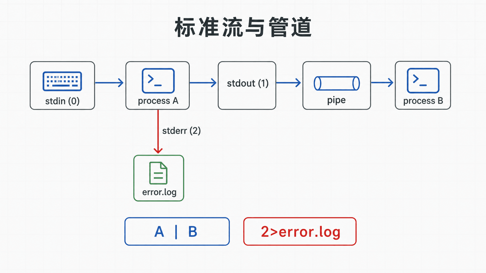
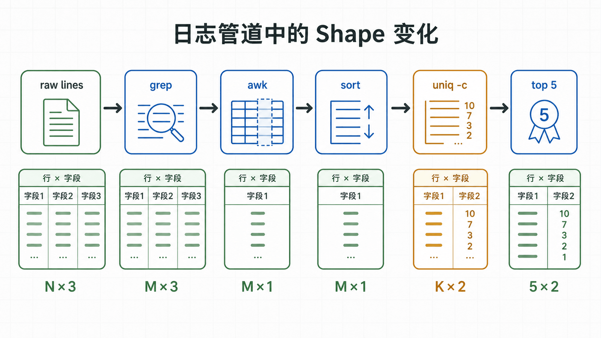

## 前置知识与学习目标

你应已理解进程、路径和文件描述符的基本含义。本文不追求背诵命令，而是回答：怎样把多个小工具组合成可观察、可撤销的数据处理流程？

完成后，你能够解释相对路径、通配符、标准流和管道，能用 `find`、`grep`、`sort`、`uniq`、`cut`、`awk` 处理日志，并避免因空格、换行或错误重定向造成数据损坏。

## 真实场景

`demo-web.service` 通过 journald 输出访问日志。为了先练习普通文件，`ops` 导出一份测试日志到 `/tmp/demo-web.log`，需要统计出现次数最多的客户端地址，同时把错误信息单独保存。

直接复制一条很长的“命令大全”很难排错。更可靠的方法是先定义输入和期望输出，再逐段构建流水线。

## 核心机制

Shell 在启动程序之前会处理引用、变量和通配符。`*.log` 是由 Shell 展开成多个路径，而不是由 `grep` 自己理解。包含空格的变量若没有双引号，可能被拆成多个参数；以 `-` 开头的文件名还可能被误当成选项。

每个进程默认拥有三个数据流：

- 标准输入 `stdin`，文件描述符 0；
- 标准输出 `stdout`，文件描述符 1；
- 标准错误 `stderr`，文件描述符 2。

管道 `|` 把左侧进程的标准输出连接到右侧进程的标准输入。它默认不传递标准错误，也不等于“先生成一个完整临时文件”。

<!-- figure-anchor:l02-a01 -->

<!-- figure-managed:l02-f01:start -->



<!-- figure-managed:l02-f01:end -->

## 关键对象与状态变化

下面的统计流程把同一份数据逐步变形：

```text
原始日志行
→ 只保留包含 "client=" 的行
→ 提取 client 字段
→ 排序
→ 相邻值计数
→ 按次数倒序
→ 前 5 项
```

<!-- figure-anchor:l02-a02 -->

<!-- figure-managed:l02-f02:start -->



<!-- figure-managed:l02-f02:end -->

每一步都应能单独运行并检查 Shape：这里的 Shape 不是张量，而是“行数 × 字段”。例如 `grep` 后仍是一行一条记录，`cut` 后变成一行一个地址，`uniq -c` 后变成“计数 + 地址”两列。

## 最小实践

先创建不含敏感数据的测试输入：

```bash
log_file="/tmp/demo-web.log"
printf '%s\n' \
  'status=200 client=192.0.2.20 path=/' \
  'status=500 client=192.0.2.30 path=/health' \
  'status=200 client=192.0.2.20 path=/docs' \
  > "${log_file}"

grep -F 'client=' -- "${log_file}" \
  | awk '{for (i=1; i<=NF; i++) if ($i ~ /^client=/) {sub(/^client=/, "", $i); print $i}}' \
  | sort \
  | uniq -c \
  | sort -nr \
  | head -n 5
```

预期第一行包含 `2 192.0.2.20`。`--` 明确结束选项，双引号确保路径只作为一个参数。

文件查找应先打印、再行动：

```bash
find /srv/demo-web -type f -name '*.html' -print
```

确需批量处理时，优先使用 `-exec ... {} +` 或 NUL 分隔，避免文件名中的空格和换行：

```bash
find /srv/demo-web -type f -name '*.html' -print0 \
  | xargs -0 -r grep -lF -- 'TODO'
```

## 输入、输出与失败边界

重定向发生在命令执行前。`command > file` 会先截断 `file`，即使命令随后失败。因此不要把输入和输出指向同一个文件：

```bash
# 错误示例：grep 启动前 app.conf 已被清空
# grep -v '^#' app.conf > app.conf

tmp="$(mktemp)"
trap 'rm -f "${tmp}"' EXIT
grep -v '^#' app.conf > "${tmp}"
mv -- "${tmp}" app.conf
trap - EXIT
```

验证：比较 `wc -l app.conf` 和抽样内容。回滚：在修改真实配置前使用 `cp -a app.conf app.conf.bak`，并验证备份可读。

只想保存错误时使用 `2>error.log`；要把标准输出和标准错误写入同一文件，使用 `>all.log 2>&1`，顺序不可随意交换。

## 常见误区与适用边界

- `cat file | grep pattern` 通常可简化为 `grep pattern file`，但 `cat` 并非“永远错误”，拼接多文件时很自然。
- `grep -R` 会递归读取大量内容；在根目录或含二进制文件的目录执行前必须收窄范围。
- `ls` 的输出面向人类，不适合可靠解析文件名；自动化使用 `find -print0`。
- 文本工具按字节、字符或 locale 处理数据的方式可能不同，解析机器协议时应固定格式和 locale。
- 复杂结构化数据应使用对应解析器，不要用正则表达式勉强解析 JSON、YAML 或 XML。

## 本篇自检

<details>
<summary>1. 管道默认会把左侧的标准错误交给右侧吗？</summary>

不会。`|` 默认只连接标准输出；需要合并时要显式重定向，并理解合并后可能丢失错误通道的语义。

</details>

<details>
<summary>2. 为什么 `find ... -print0 | xargs -0` 更安全？</summary>

它使用 NUL 分隔路径，不会把文件名中的空格、引号或换行误认为记录边界。

</details>

<details>
<summary>3. 为什么不能使用 `command file > file` 就地改写？</summary>

Shell 会在命令读取输入前截断输出文件。应写入临时文件、验证后原子替换，并保留备份。

</details>

## 本篇总结

命令行的力量来自稳定的数据契约：明确每一步的输入、输出、分隔符和退出状态。引用变量、先打印后修改、使用安全的路径分隔和临时文件，能避免多数“命令看似正确却破坏数据”的事故。

## 下一篇衔接

下一篇解释内核如何结合 UID、GID、权限位和进程凭据做访问控制，并讨论 sudo、信号和作业控制。

## 资料来源

- [GNU Coreutils manual](https://www.gnu.org/software/coreutils/manual/coreutils.html)
- [GNU Grep manual](https://www.gnu.org/software/grep/manual/grep.html)
- [GNU Findutils manual](https://www.gnu.org/software/findutils/manual/html_mono/find.html)
- [GNU Bash manual: Redirections](https://www.gnu.org/software/bash/manual/html_node/Redirections.html)
