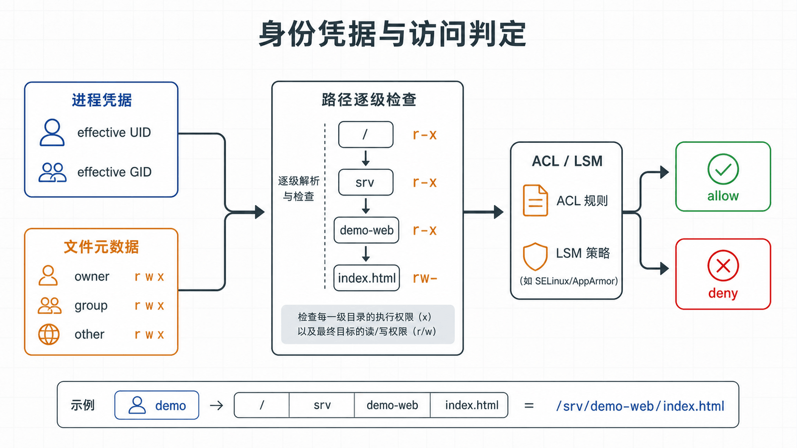
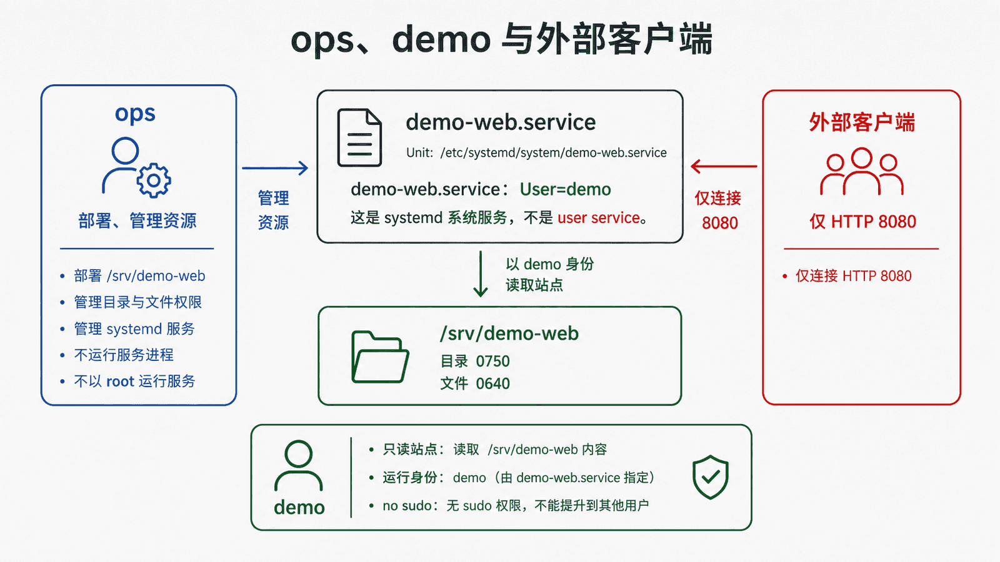

## 前置知识与学习目标

你应理解进程、路径和文件描述符。本文将身份与进程放在一起讲，因为权限检查发生在“某个进程尝试访问某个对象”的瞬间。

读完后，你能够区分用户、组和进程凭据，解释 `rwx` 对文件与目录的不同含义，设计 `ops` 与 `demo` 的职责边界，并使用温和信号停止进程。

## 真实场景

若让 `demo-web.service` 直接以 `root` 运行，读取静态文件当然容易，但 Web 进程一旦被利用，攻击者也获得了不必要的系统权限。正确目标是：`ops` 负责部署，`demo` 只读站点文件并运行服务，其他用户不能修改内容。

## 核心机制

账户记录身份，进程携带实际和有效 UID/GID，文件保存所有者 UID、组 GID 与权限位。内核在访问时比较这些信息，而不是比较用户名文本。

对普通文件：`r` 允许读取内容，`w` 允许修改内容，`x` 允许作为程序执行。对目录：`r` 允许列出名称，`w` 允许创建或删除目录项，`x` 允许穿过目录并访问已知名称。目录只有 `r` 没有 `x`，通常仍无法读取其中的文件。

<!-- figure-anchor:l03-a01 -->

<!-- figure-managed:l03-f01:start -->



<!-- figure-managed:l03-f01:end -->

`sudo` 是受策略约束的提权入口，不等于“任何命令前都加 sudo”。应通过 `visudo` 配置最小命令范围，并保留审计记录。服务账户通常不应拥有交互式登录 Shell。

## 关键对象与状态变化

<!-- figure-anchor:l03-a02 -->

<!-- figure-managed:l03-f02:start -->



<!-- figure-managed:l03-f02:end -->

为贯穿案例规划状态：

```text
ops:   可通过 sudo 部署和重启 demo-web.service
demo:  可读取 /srv/demo-web，不能 sudo，不能交互登录
其他:  只能通过网络访问 8080，不能读取部署目录
```

进程从父进程继承许多属性。发送信号不会“直接删除进程”，而是向进程或进程组传递事件。`SIGTERM` 请求优雅退出，进程可以清理资源；`SIGKILL` 无法捕获，只应在进程拒绝正常退出时使用。

Shell 作业控制中的前台、后台和进程组适用于交互会话；长期服务应交给 systemd，而不是依赖 `nohup command &`。

## 最小实践

以下命令只读取状态：

```bash
id
id demo 2>/dev/null || true
namei -l /srv/demo-web/index.html
stat -c '%A %a %U:%G %n' /srv/demo-web /srv/demo-web/index.html
ps -eo pid,ppid,user,group,stat,comm --sort=pid | head
```

测试环境中创建服务账户时，不同发行版参数略有差异。RHEL 系可使用：

```bash
sudo useradd --system --home-dir /srv/demo-web --shell /sbin/nologin demo
sudo install -d -o ops -g demo -m 0750 /srv/demo-web
sudo install -o ops -g demo -m 0640 index.html /srv/demo-web/index.html
```

输入是账户名、目录和权限模式；输出应由 `id demo`、`namei -l` 和 `stat` 验证。若组名或路径错误，立即停止，不要通过 `chmod 777` 绕过。

发送信号时先确认 PID 对应的程序和启动时间：

```bash
ps -o pid,lstart,user,comm,args -p PID
kill -TERM PID
```

## 输入、输出与失败边界

修改用户、组或 sudo 策略可能导致失去管理入口。安全顺序是：

1. 保持现有管理员会话；
2. 使用 `visudo -c` 检查语法；
3. 开启第二个会话验证新权限；
4. 验证成功后再收紧旧入口。

回滚依赖修改前的 `/etc/passwd`、`/etc/group` 和 sudoers 片段备份，以及可访问的控制台。不要直接编辑主 sudoers 文件后退出唯一会话。

删除目录项的权限主要由父目录决定，因此“文件只读”并不保证不能被拥有父目录写权限的人删除。

## 常见误区与适用边界

- `chmod 777` 不是通用修复，会把写入和执行权限开放给所有用户。
- `chown -R` 可能跨越意外挂载点或修改应用生成文件，执行前应列出范围。
- `kill -9` 跳过清理、刷新和优雅关闭，只是最后手段。
- 服务账户、普通登录账户和管理员账户职责不同，不应共用一个 root 身份。
- 传统权限位无法表达所有策略；ACL、SELinux/AppArmor、容器和挂载选项还会增加约束。遇到权限位正确却仍被拒绝时，应检查这些层。

## 本篇自检

<details>
<summary>1. 目录的执行权限表示什么？</summary>

表示可以穿过目录并访问已知名称，不是“运行目录”。没有它，即使知道文件名也通常无法访问。

</details>

<details>
<summary>2. 为什么服务不应默认以 root 运行？</summary>

服务漏洞的影响范围与进程权限相关。最小权限账户能限制读取、修改和控制系统资源的能力。

</details>

<details>
<summary>3. SIGTERM 与 SIGKILL 的关键区别是什么？</summary>

SIGTERM 可被进程处理以完成清理；SIGKILL 由内核强制终止，进程无法捕获或清理。

</details>

## 本篇总结

权限不是文件上的孤立数字，而是进程凭据、路径每一级权限和额外安全机制共同作用的结果。账户分工、最小 sudo 范围和优雅信号构成可靠服务管理的基础。

## 下一篇衔接

下一篇把长期进程交给 systemd，观察 Unit 依赖、启动状态、自动重启和 journald 日志如何形成可诊断的生命周期。

## 资料来源

- [Red Hat: Managing users and groups](https://docs.redhat.com/en/documentation/red_hat_enterprise_linux/9/html/configuring_basic_system_settings/managing-users-and-groups_configuring-basic-system-settings)
- [GNU Coreutils: File permissions](https://www.gnu.org/software/coreutils/manual/html_node/File-permissions.html)
- [Linux man-pages: credentials(7)](https://man7.org/linux/man-pages/man7/credentials.7.html)
- [sudo project documentation](https://www.sudo.ws/docs/)
