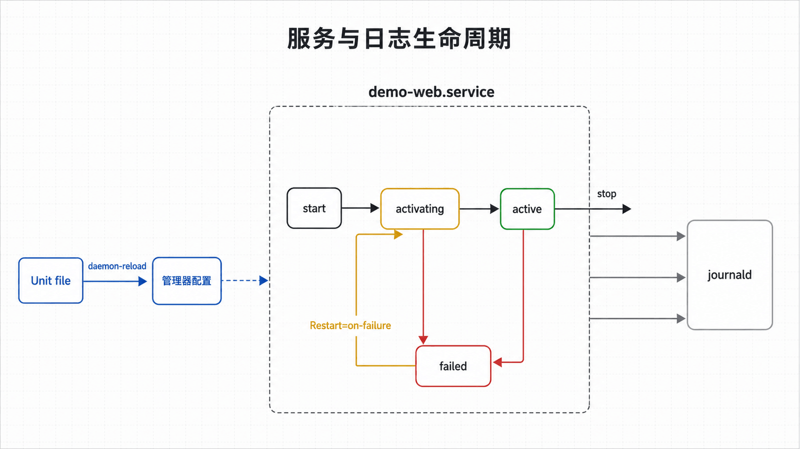
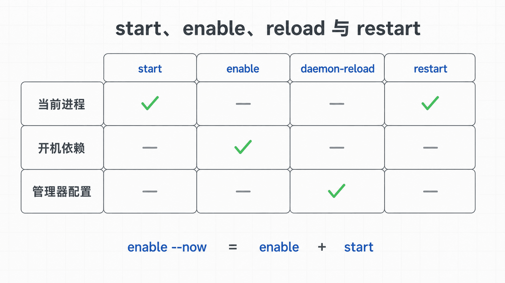

## 前置知识与学习目标

你应理解服务账户、进程、信号和标准流。本文完成后，你能够读懂一个 service Unit，区分启动、启用和运行状态，并用 `systemctl` 与 `journalctl` 定位失败阶段。

## 真实场景

开发者在终端执行 `python3 -m http.server 8080` 时服务正常，但关闭会话后进程消失；重启主机后也不会自动恢复。将它交给 systemd 后，又可能出现路径、账户、端口或依赖错误。

问题不只是“怎么启动”，而是怎样让启动、停止、失败和日志形成明确的状态机。

## 核心机制

systemd 以 Unit 表示服务、套接字、挂载点、定时器和目标状态。`demo-web.service` 是 service Unit；`multi-user.target` 是一组系统状态与依赖的汇合点。

`systemctl start` 立即启动，`enable` 创建开机依赖，二者不是同一动作。`enable --now` 才同时执行。Unit 文件修改后需要 `daemon-reload`，但它不会自动重启服务。

<!-- figure-anchor:l04-a01 -->

<!-- figure-managed:l04-f01:start -->



<!-- figure-managed:l04-f01:end -->

## 关键对象与状态变化

<!-- figure-anchor:l04-a02 -->

<!-- figure-managed:l04-f02:start -->



<!-- figure-managed:l04-f02:end -->

一个服务常见状态如下：

```text
inactive → activating → active
                 ↘ failed
active → deactivating → inactive
active --异常退出--> failed / auto-restart
```

systemd 记录主进程 PID、退出原因和 Unit 结果。journald 收集服务的标准输出、标准错误和结构化元数据，因此日志可以按 Unit、启动批次、时间和优先级过滤。

`After=` 只描述顺序，`Requires=`/`Wants=` 描述依赖拉入强度。把两者混为一谈，会得到“顺序正确但依赖没启动”或“不必要的强耦合”。

## 最小实践

测试环境中的 Unit：

```ini
[Unit]
Description=Demo static web service
After=network.target

[Service]
Type=simple
User=demo
Group=demo
WorkingDirectory=/srv/demo-web
ExecStart=/usr/bin/python3 -m http.server 8080 --directory /srv/demo-web
Restart=on-failure
RestartSec=3s
NoNewPrivileges=yes
PrivateTmp=yes

[Install]
WantedBy=multi-user.target
```

将文件保存为 `/etc/systemd/system/demo-web.service` 前，先确认 `/usr/bin/python3`、用户 `demo` 和目录存在。变更流程：

```bash
sudo systemd-analyze verify /etc/systemd/system/demo-web.service
sudo systemctl daemon-reload
sudo systemctl start demo-web.service
systemctl status demo-web.service --no-pager
journalctl -u demo-web.service -n 50 --no-pager
curl -fsS http://127.0.0.1:8080/
```

验证成功后才执行：

```bash
sudo systemctl enable demo-web.service
systemctl is-enabled demo-web.service
```

## 输入、输出与失败边界

输入包括 Unit 文件、可执行路径、身份、工作目录和环境；输出包括 Unit 状态、主进程退出码、日志与监听端口。

排障顺序：

1. `systemctl status` 获取结果和最近日志；
2. `journalctl -u ... -b` 限定当前启动；
3. 核对 `ExecStart` 的绝对路径、用户和目录权限；
4. 检查 `ss -lntp 'sport = :8080'` 是否端口冲突；
5. 以服务用户手动执行最小命令，仅用于测试环境。

修改前备份 Unit：

```bash
sudo cp -a /etc/systemd/system/demo-web.service \
  /etc/systemd/system/demo-web.service.bak
```

回滚时恢复备份，执行 `daemon-reload` 和 `restart`，再重复状态、日志和 HTTP 验证。若新服务持续崩溃，应先 `stop`，避免重启风暴污染日志。

## 常见误区与适用边界

- `enable` 不代表当前正在运行，`active` 也不代表已启用开机启动。
- `daemon-reload` 只让管理器重读 Unit，不会应用到已运行进程。
- `Restart=always` 可能掩盖配置错误并形成高频重启，应设置间隔并观察失败原因。
- `network.target` 只表示网络栈启动，不保证远端网络可用；只有确实需要时才依赖 `network-online.target`。
- 不要用 `nohup` 替代服务管理器承担长期守护、资源限制和日志职责。

## 本篇自检

<details>
<summary>1. `systemctl enable` 与 `start` 的区别是什么？</summary>

`enable` 配置未来启动时的依赖关系，`start` 立即启动当前实例；两者可独立成功或失败。

</details>

<details>
<summary>2. 修改 Unit 后为什么需要 `daemon-reload`？</summary>

systemd 管理器缓存已加载的 Unit 定义，需要显式重读磁盘配置；随后仍需重启或 reload 具体服务。

</details>

<details>
<summary>3. 服务启动失败时，最先看哪两处？</summary>

先看 `systemctl status UNIT` 的结果和最近日志，再用 `journalctl -u UNIT -b` 查看当前启动批次的完整证据。

</details>

## 本篇总结

可靠服务管理依赖明确的 Unit、受限身份、可观察状态和按 Unit 过滤的日志。启动、启用、重载配置与重启进程是四个不同动作。

## 下一篇衔接

下一篇进入服务数据所在的存储层，解释块设备、文件系统、挂载、`fstab`、容量和 inode 如何影响 `/srv/demo-web`。

## 资料来源

- [systemd.service manual](https://www.freedesktop.org/software/systemd/man/latest/systemd.service.html)
- [systemctl manual](https://www.freedesktop.org/software/systemd/man/latest/systemctl.html)
- [journalctl manual](https://www.freedesktop.org/software/systemd/man/latest/journalctl.html)
- [Red Hat: Managing systemd](https://docs.redhat.com/en/documentation/red_hat_enterprise_linux/9/html/configuring_basic_system_settings/managing-systemd_configuring-basic-system-settings)
