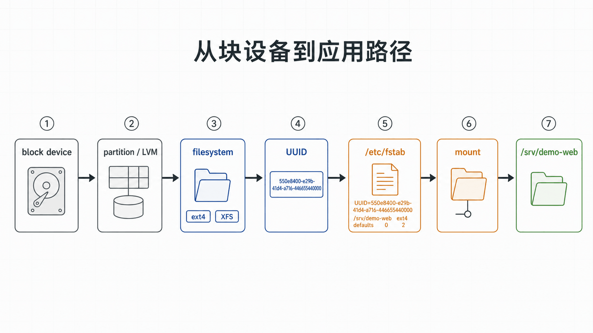
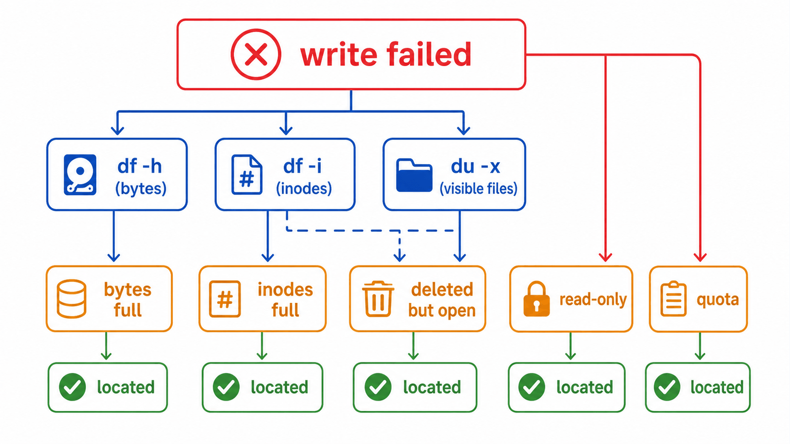

## 前置知识与学习目标

你应理解目录树、路径、权限和 systemd。读完后，你能够解释设备、分区、文件系统和挂载点的关系，安全规划 `/srv/demo-web` 的持久挂载，并区分“字节耗尽”和“inode 耗尽”。

## 真实场景

`demo-web.service` 报告无法写入缓存，`df -h` 看似还有空间；另一次重启后 `/srv/demo-web` 变成空目录。两个现象分别可能来自 inode 耗尽和挂载失败，单看目录内容无法判断。

## 核心机制

块设备提供按块读写的存储。设备可以包含分区，分区或逻辑卷上创建文件系统，文件系统再挂载到目录树中的挂载点。应用访问的是路径，内核根据挂载表把路径解析到具体文件系统。

设备名如 `/dev/sdb1` 可能因发现顺序改变；长期配置优先使用文件系统 UUID。`/etc/fstab` 描述持久挂载，systemd 会据此生成 mount Unit。

<!-- figure-anchor:l05-a01 -->

<!-- figure-managed:l05-f01:start -->



<!-- figure-managed:l05-f01:end -->

## 关键对象与状态变化

<!-- figure-anchor:l05-a02 -->

<!-- figure-managed:l05-f02:start -->



<!-- figure-managed:l05-f02:end -->

从新磁盘到应用路径的状态链通常是：

```text
块设备 → 分区或 LVM → 文件系统 → UUID → fstab → 挂载点 → 应用文件
```

`df` 从已挂载文件系统角度统计块和 inode；`du` 遍历目录项累加可见文件大小。两者不一致时，要考虑已删除但仍被进程打开的文件、挂载覆盖、稀疏文件和权限不可见目录。

inode 保存文件元数据并关联数据块。大量小文件可能先耗尽 inode，即使字节容量仍有剩余。

## 最小实践

只读盘点：

```bash
lsblk --fs
findmnt -T /srv/demo-web
df -hT /srv/demo-web
df -ih /srv/demo-web
du -xhd1 /srv/demo-web 2>/dev/null | sort -h
```

准备持久挂载前，先取得 UUID 并备份：

```bash
sudo blkid /dev/sdb1
sudo cp -a /etc/fstab /etc/fstab.bak.$(date +%F-%H%M%S)
```

示例条目：

```ini
UUID=11111111-2222-3333-4444-555555555555 /srv/demo-web ext4 defaults,nofail 0 2
```

不要复制示例 UUID。编辑后先验证而不是重启：

```bash
sudo findmnt --verify --verbose
sudo systemctl daemon-reload
sudo mount /srv/demo-web
findmnt -T /srv/demo-web
```

## 输入、输出与失败边界

输入是设备身份、文件系统类型、UUID、挂载点和选项；输出是挂载表、可用容量、inode 与内核日志。

在已有数据的目录上挂载文件系统会遮住原目录内容，而不是删除它。卸载后原内容会重新可见。这种情况可能让人误判数据丢失。

挂载失败时：

```bash
findmnt --verify --verbose
journalctl -b -p warning..alert --no-pager
dmesg --level=err,warn | tail -n 50
```

回滚：卸载测试挂载、恢复 `/etc/fstab` 备份、`daemon-reload`，然后再次运行 `findmnt --verify`。若设备含未知数据，不执行 `mkfs`、`fsck -y` 或重新分区；先制作镜像或交给存储恢复流程。

## 常见误区与适用边界

- `df` 与 `du` 统计视角不同，不一致不代表某个命令错误。
- `/dev/sdX` 不是稳定身份，自动化应使用 UUID、LABEL 或受控的持久设备名。
- `mount` 成功不代表重启后一定成功，必须验证 `fstab` 和生成的 Unit。
- `nofail` 可以避免非关键磁盘阻塞启动，但也可能让应用在缺失数据盘时错误运行，应配合服务依赖和健康检查。
- 本文不展开 RAID、LVM 快照、NFS 一致性和数据库 fsync 策略；这些需要独立容量与恢复设计。

## 本篇自检

<details>
<summary>1. 为什么长期挂载不建议直接写 `/dev/sdb1`？</summary>

设备名可能随硬件发现顺序变化；文件系统 UUID 更稳定，并能避免把错误设备挂到生产路径。

</details>

<details>
<summary>2. `df -h` 有空间但无法创建文件，还应检查什么？</summary>

检查 `df -i` 的 inode 使用率、目录权限、只读挂载、配额以及内核日志。

</details>

<details>
<summary>3. 挂载后原目录文件“消失”意味着被删除了吗？</summary>

不一定。新文件系统会覆盖挂载点的路径视图，卸载后原目录内容通常重新可见。

</details>

## 本篇总结

应用路径背后是一条从块设备到挂载点的映射链。安全存储操作必须先识别设备和数据，再修改配置、即时验证，并准备不依赖重启的回滚路径。

## 下一篇衔接

下一篇把前五篇的命令组合成可靠 Bash 脚本，重点处理展开、引用、退出状态、临时文件、trap 和行为测试。

## 资料来源

- [Red Hat: Managing file systems](https://docs.redhat.com/en/documentation/red_hat_enterprise_linux/9/html-single/managing_file_systems/managing_file_systems)
- [util-linux: findmnt manual](https://man7.org/linux/man-pages/man8/findmnt.8.html)
- [fstab(5)](https://man7.org/linux/man-pages/man5/fstab.5.html)
- [systemd.mount manual](https://www.freedesktop.org/software/systemd/man/latest/systemd.mount.html)
