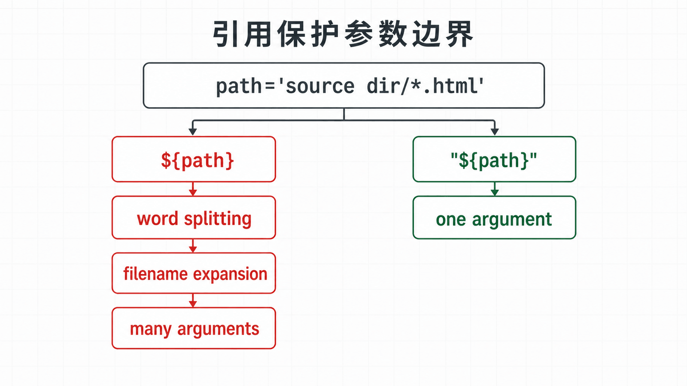
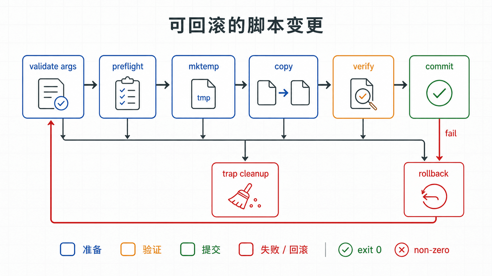

## 前置知识与学习目标

你应会使用路径、管道、重定向和权限命令。本文明确使用 Bash，而不是承诺兼容所有 POSIX `sh`。

读完后，你能够解释引用为何影响参数数量，正确处理位置参数和数组，设计清晰的退出状态，并为临时文件、失败路径和核心行为编写最小测试。

## 真实场景

`ops` 需要发布 `/srv/demo-web`：把一个源目录复制到临时目录，确认存在 `index.html`，再替换目标内容。若脚本在复制一半时失败，不能留下半成品；若路径包含空格，也不能误删其他目录。

## 核心机制

Bash 读取命令后先分词和解析，再执行多种展开，随后处理重定向并启动命令。变量展开之后若未被双引号保护，还可能发生单词拆分和文件名展开。

因此 `"${path}"` 与 `${path}` 不是风格差异：前者通常保持一个参数，后者可能变成零个、一个或多个参数。遍历脚本参数使用 `"$@"`，遍历数组使用 `"${array[@]}"`。

<!-- figure-anchor:l06-a01 -->

<!-- figure-managed:l06-f01:start -->



<!-- figure-managed:l06-f01:end -->

`set -euo pipefail` 是有用的基线，不是异常处理器。`-e` 在条件、逻辑列表、命令替换等上下文存在例外；预期失败应显式放入 `if`，并检查退出状态。

## 关键对象与状态变化

<!-- figure-anchor:l06-a02 -->

<!-- figure-managed:l06-f02:start -->



<!-- figure-managed:l06-f02:end -->

可靠脚本应把状态分成：

```text
参数验证 → 前置检查 → 创建临时资源 → 执行变更
                                ↘ 失败清理
                        验证 → 提交 → 正常清理
```

函数通过标准输出返回数据，通过退出状态表示成功或失败。日志写到标准错误，避免污染命令替换捕获的数据。

## 最小实践

下面是可在临时目录测试的完整脚本：

```bash
#!/usr/bin/env bash
set -Eeuo pipefail

usage() {
  printf 'usage: %s SOURCE TARGET\n' "${0##*/}" >&2
}

main() {
  if (($# != 2)); then
    usage
    return 64
  fi

  local source_dir="$1"
  local target_dir="$2"

  if [[ ! -f "${source_dir}/index.html" ]]; then
    printf 'missing: %s\n' "${source_dir}/index.html" >&2
    return 66
  fi

  local parent tmp backup=""
  parent="$(dirname -- "${target_dir}")"
  mkdir -p -- "${parent}"
  tmp="$(mktemp -d "${parent}/.demo-web.XXXXXX")"

  cleanup() {
    rm -rf -- "${tmp}"
  }
  trap cleanup EXIT

  cp -a -- "${source_dir}/." "${tmp}/"
  [[ -s "${tmp}/index.html" ]]

  if [[ -e "${target_dir}" ]]; then
    backup="${target_dir}.bak.$(date +%Y%m%d%H%M%S)"
    mv -- "${target_dir}" "${backup}"
  fi

  if ! mv -- "${tmp}" "${target_dir}"; then
    [[ -n "${backup}" ]] && mv -- "${backup}" "${target_dir}"
    return 1
  fi
  trap - EXIT
  printf 'deployed: %s\n' "${target_dir}"
}

main "$@"
```

最小行为测试：

```bash
test_root="$(mktemp -d)"
trap 'rm -rf -- "${test_root}"' EXIT
mkdir -p "${test_root}/source dir"
printf '<h1>ok</h1>\n' > "${test_root}/source dir/index.html"

bash ./deploy-demo.sh \
  "${test_root}/source dir" \
  "${test_root}/target dir"

test -s "${test_root}/target dir/index.html"
```

## 输入、输出与失败边界

脚本输入是两个目录参数；成功输出部署路径并返回 0；参数错误返回 64，缺少输入文件返回 66，变更失败返回非零。

危险操作前必须同时满足：目标非空、位于允许的父目录、已打印将要修改的对象。生产版本还应拒绝 `/`、`.` 和符号链接逃逸，并避免不同文件系统之间把 `mv` 误认为原子操作。

语法验证：

```bash
bash -n deploy-demo.sh
```

调试可临时使用 `bash -x`，但跟踪会把展开后的参数写到日志，可能泄露密码或令牌。敏感脚本应使用脱敏日志，而不是永久开启 `set -x`。

## 常见误区与适用边界

- `set -e` 不能替代每个关键操作的显式错误处理。
- `|| true` 会吞掉失败，应只用于确实允许失败且有注释的命令。
- `eval` 会再次解析字符串，容易造成命令注入；优先使用数组构造参数。
- 变量不是可靠的任意二进制容器，Bash 字符串不能包含 NUL。
- 大型数据处理、复杂并发或长期服务不适合继续堆在 Shell 中，应切换到更合适的语言和运行时。

## 本篇自检

<details>
<summary>1. 为什么遍历参数要写 `for arg in "$@"`？</summary>

双引号中的 `$@` 为每个原始参数保留独立边界，包括空格；未引用时会再次拆分和展开。

</details>

<details>
<summary>2. 函数应如何分别返回数据和成功状态？</summary>

数据写到标准输出，成功或失败使用 0/非零退出状态；诊断信息写到标准错误。

</details>

<details>
<summary>3. `trap ... EXIT` 解决了什么问题？</summary>

无论正常结束还是中途失败，都能统一清理临时资源；提交成功后可解除 trap，避免删除正式结果。

</details>

## 本篇总结

可靠 Bash 的关键不是语法数量，而是参数边界、退出状态、临时资源和提交点。严格模式、显式判断、trap 与行为测试必须一起使用。

## 下一篇衔接

下一篇把自动化对象扩展到网络，沿网卡、地址、路由、DNS、监听端口、防火墙和客户端请求逐层排障。

## 资料来源

- [GNU Bash Reference Manual](https://www.gnu.org/software/bash/manual/bash.html)
- [Bash manual: Shell Expansions](https://www.gnu.org/software/bash/manual/html_node/Shell-Expansions.html)
- [Bash manual: Bourne Shell Builtins](https://www.gnu.org/software/bash/manual/html_node/Bourne-Shell-Builtins.html)
- [ShellCheck project](https://www.shellcheck.net/)
