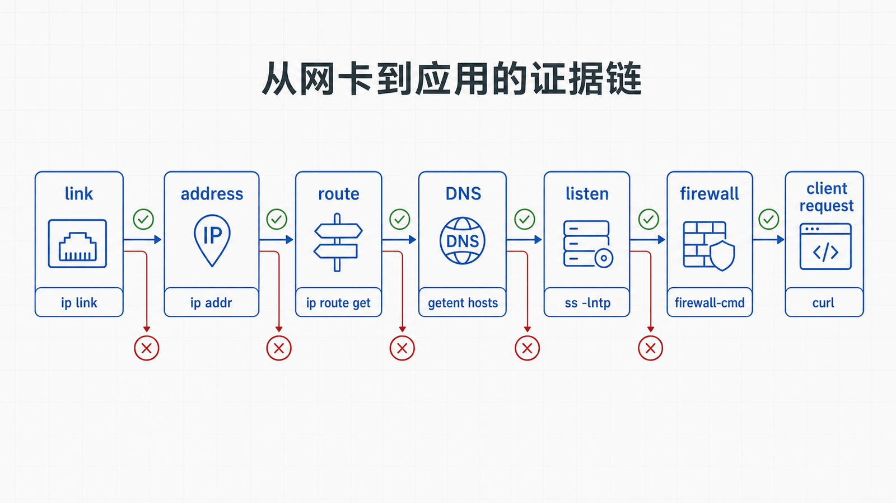
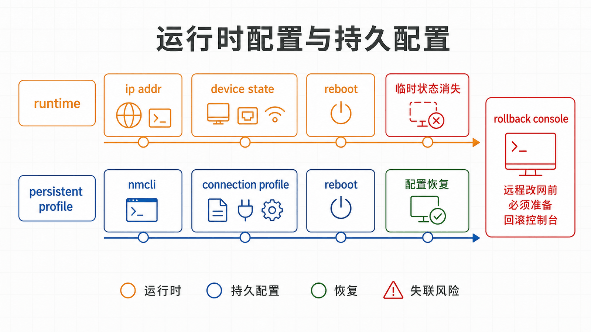

## 前置知识与学习目标

你应理解进程、systemd、日志和标准流。本文不完整讲解 TCP/IP 协议，而是训练主机侧的可操作诊断顺序。

完成后，你能够区分网络接口、IP 地址、路由、DNS、监听套接字和防火墙，判断 `127.0.0.1:8080` 与 `0.0.0.0:8080` 的差别，并为临时与持久配置选择不同工具。

## 真实场景

在 `app01` 本机执行 `curl http://127.0.0.1:8080` 成功，但另一台主机访问 `http://192.0.2.10:8080` 超时。这个现象不能仅凭“ping 通不通”判断，至少涉及服务监听地址、路由和防火墙。

## 核心机制

发送请求前，主机需要确定目标地址、选择路由和出口接口。服务端内核收到数据包后，根据协议、目标地址和端口寻找监听套接字；主机防火墙可以在数据包到达应用前丢弃或拒绝它。

DNS 只负责把名称解析为地址，不保证该地址可达或端口正在监听。ICMP `ping` 与 TCP 8080 是不同协议路径。

<!-- figure-anchor:l07-a01 -->

<!-- figure-managed:l07-f01:start -->



<!-- figure-managed:l07-f01:end -->

## 关键对象与状态变化

<!-- figure-anchor:l07-a02 -->

<!-- figure-managed:l07-f02:start -->

![比较 127.0.0.1、0.0.0.0 与 [::] 的可达边界](./images/l07-f02-listen-address-boundary.png)

<!-- figure-managed:l07-f02:end -->

排障按从本机确定性状态到远端交互推进：

1. `ip link`：链路是否启用；
2. `ip address`：接口是否拥有预期地址；
3. `ip route get TARGET`：内核会选择哪条路由；
4. `getent ahosts NAME`：系统解析器得到什么；
5. `ss -lntp`：进程监听哪个地址和端口；
6. 防火墙：对应 zone/规则是否允许；
7. `curl` 或 `nc`：从实际客户端验证应用协议。

<!-- figure-anchor:l07-a03 -->

<!-- figure-managed:l07-f03:start -->



<!-- figure-managed:l07-f03:end -->

监听 `127.0.0.1:8080` 只接受本机回环流量；`0.0.0.0:8080` 表示所有 IPv4 本地地址；`[::]:8080` 的 IPv4 兼容行为受系统配置影响，不能一概而论。

## 最小实践

只读诊断：

```bash
ip -br link
ip -br address
ip route
ip route get 192.0.2.20
getent ahosts app01.example.com
sudo ss -lntp 'sport = :8080'
curl -v --connect-timeout 3 http://127.0.0.1:8080/
```

RHEL 系 NetworkManager 持久配置示例：

```bash
nmcli connection show
nmcli connection show "System eth0"
```

变更静态地址会中断连接。只有具备控制台或备用会话时才执行：

```bash
sudo nmcli connection modify "System eth0" \
  ipv4.method manual \
  ipv4.addresses 192.0.2.10/24 \
  ipv4.gateway 192.0.2.1 \
  ipv4.dns 192.0.2.53
sudo nmcli connection up "System eth0"
```

文档地址 `192.0.2.0/24` 不能照搬到真实网络。

## 输入、输出与失败边界

网络变更前导出连接配置，记录当前地址、路由、DNS 和防火墙：

```bash
nmcli --show-secrets connection export "System eth0" > /root/System-eth0.nmconnection
ip address show
ip route show
```

导出文件可能包含密钥，权限必须为 600 且不得提交仓库。回滚通过控制台导入旧配置并重新激活；远程会话中不应在没有备用入口时修改默认路由或管理接口。

firewalld 测试先确认当前 zone：

```bash
sudo firewall-cmd --get-active-zones
sudo firewall-cmd --zone=public --add-port=8080/tcp
sudo firewall-cmd --zone=public --query-port=8080/tcp
```

这是运行时规则，重载后消失，适合短期验证。确认业务需要后再使用 `--permanent` 并 reload。回滚使用对应的 `--remove-port`。

## 常见误区与适用边界

- ping 成功不代表 TCP 端口开放，ping 失败也可能只是 ICMP 被过滤。
- 端口监听不代表防火墙放行，防火墙放行也不代表应用正在监听。
- `/etc/resolv.conf` 可能由 NetworkManager 或 systemd-resolved 管理，直接编辑可能被覆盖。
- 不要同时用 firewalld、原始 nftables 和 iptables 前端随意修改同一规则集。
- 云安全组、负载均衡器、容器网络和上游 ACL 位于主机之外，主机证据正常时需要沿路径继续检查。

## 本篇自检

<details>
<summary>1. 本机能访问 127.0.0.1:8080，远端超时，首先核对什么？</summary>

先用 `ss -lntp` 核对是否只监听回环地址，再检查主机防火墙、路由和外部网络策略。

</details>

<details>
<summary>2. DNS 解析成功能证明服务可用吗？</summary>

不能。它只证明名称得到地址；路由、端口、TLS 和应用仍可能失败。

</details>

<details>
<summary>3. 为什么远程修改默认路由前必须准备控制台？</summary>

错误路由会立即切断当前 SSH 会话和回滚通道，控制台或带外管理提供独立恢复路径。

</details>

## 本篇总结

网络排障不是随机尝试命令，而是逐层验证链路、地址、路由、解析、监听、防火墙和应用协议。每一层都要保存实际输出，避免用下一层现象替代上一层证据。

## 下一篇衔接

下一篇在这条网络路径上加入 SSH 协议，区分主机身份与用户身份，并实践密钥、跳板机和端口转发。

## 资料来源

- [Red Hat: Configuring and managing networking](https://docs.redhat.com/en/documentation/red_hat_enterprise_linux/9/html-single/configuring_and_managing_networking/index)
- [ip-route(8)](https://man7.org/linux/man-pages/man8/ip-route.8.html)
- [ss(8)](https://man7.org/linux/man-pages/man8/ss.8.html)
- [firewalld documentation](https://firewalld.org/documentation/)
