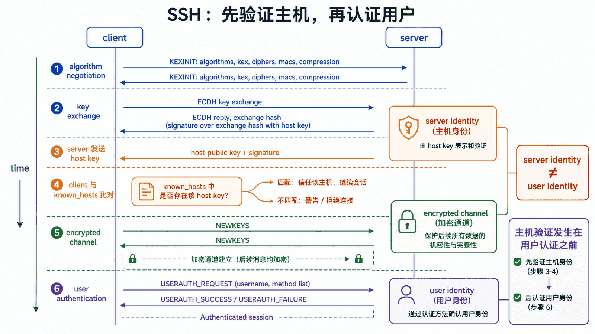
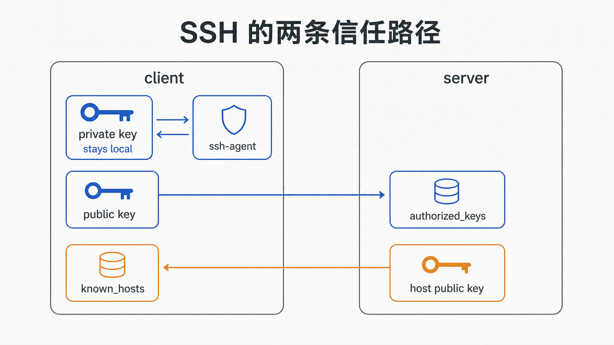
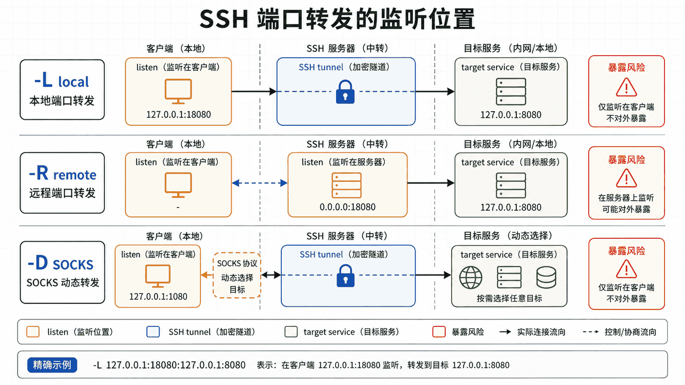

## 前置知识与学习目标

你应理解用户权限、服务、监听端口、路由和防火墙。读完后，你能够区分主机密钥与用户密钥，解释首次连接提示的安全意义，使用 `~/.ssh/config` 与 `ProxyJump`，并判断本地、远程和动态转发的信任边界。

## 真实场景

`app01` 只允许从跳板机 `bastion.example.com` 进入，`demo-web` 的 8080 端口不向公网开放。`ops` 需要通过 SSH 登录和临时访问该端口，同时不能绕过主机身份验证。

## 核心机制

SSH 传输层先协商版本和算法，再通过密钥交换建立会话密钥，并使用服务器主机密钥证明“对端是哪台服务器”。随后用户认证证明“客户端代表哪个账户”。这两个身份问题不能混为一谈。

首次连接时，客户端尚无可信主机指纹，通常使用 TOFU：人工通过独立渠道核对指纹后写入 `known_hosts`。后续指纹变化可能是正常换钥，也可能是中间人攻击，不能直接删除记录继续连接。

<!-- figure-anchor:l08-a01 -->

<!-- figure-managed:l08-f01:start -->



<!-- figure-managed:l08-f01:end -->

## 关键对象与状态变化

<!-- figure-anchor:l08-a02 -->

<!-- figure-managed:l08-f02:start -->



<!-- figure-managed:l08-f02:end -->

```text
版本/算法协商 → 密钥交换 → 验证主机密钥
→ 加密通道 → 用户认证 → 会话/命令/转发通道
```

用户私钥留在客户端，公钥写入服务器账户的 `authorized_keys`。`ssh-agent` 保存解密后的签名能力；Agent 转发会让远端主机在会话期间请求本地 Agent 签名，因此只应对明确可信的主机开启。

<!-- figure-anchor:l08-a03 -->

<!-- figure-managed:l08-f03:start -->



<!-- figure-managed:l08-f03:end -->

本地转发 `-L` 在客户端监听，远程转发 `-R` 在服务器侧监听，动态转发 `-D` 创建 SOCKS 代理。转发改变可达性，不自动增加应用层认证。

## 最小实践

生成密钥并核对权限：

```bash
ssh-keygen -t ed25519 -a 64 -f ~/.ssh/app01_ops
chmod 700 ~/.ssh
chmod 600 ~/.ssh/app01_ops
chmod 644 ~/.ssh/app01_ops.pub
```

客户端配置：

```ssh-config
Host bastion
    HostName bastion.example.com
    User ops
    IdentityFile ~/.ssh/app01_ops
    IdentitiesOnly yes

Host app01
    HostName 192.0.2.10
    User ops
    ProxyJump bastion
    IdentityFile ~/.ssh/app01_ops
    IdentitiesOnly yes
    ServerAliveInterval 60
```

验证解析后的配置：

```bash
ssh -G app01 | grep -E '^(hostname|user|proxyjump|identityfile) '
ssh -vv app01
```

通过跳板机访问内网 Web 服务：

```bash
ssh -N -L 127.0.0.1:18080:127.0.0.1:8080 app01
curl -fsS http://127.0.0.1:18080/
```

## 输入、输出与失败边界

服务端收紧配置前，必须保留已登录会话、控制台入口和经过验证的公钥。建议写入独立 drop-in，并先检查有效配置：

```bash
sudo sshd -t
sudo sshd -T | grep -E '^(passwordauthentication|permitrootlogin|pubkeyauthentication) '
```

典型策略：禁止 root 直接登录、启用公钥认证、在确认密钥可用后再关闭密码认证，并用 `AllowUsers`/`AllowGroups` 收窄范围。重启或 reload 后从第二个终端建立新会话，成功后才关闭旧会话。

回滚：恢复 `sshd_config` 或 drop-in 备份，通过控制台执行 `sshd -t` 后 reload。不要在唯一 SSH 会话中直接关闭密码登录。

客户端报主机密钥变化时，先通过云控制台、配置管理或管理员渠道核对新指纹；只有确认服务器确实换钥后才使用 `ssh-keygen -R HOST` 更新记录。

## 常见误区与适用边界

- `StrictHostKeyChecking no` 会削弱主机身份验证，不应作为长期默认配置。
- 私钥不能通过 `ssh-copy-id` 发送到服务器；分发的是 `.pub` 公钥。
- Agent 转发不是跳板机的必要条件，`ProxyJump` 通常不需要远端接触本地 Agent。
- 改 SSH 端口只能减少噪声，不能替代密钥、最小权限、补丁和审计。
- 端口转发可能绕过原有网络分区，应受 `AllowTcpForwarding`、`PermitOpen` 和审计策略约束。

## 本篇自检

<details>
<summary>1. 主机密钥和用户密钥分别证明什么？</summary>

主机密钥证明服务器身份；用户密钥证明客户端有权代表某个远端账户，验证方向不同。

</details>

<details>
<summary>2. `ProxyJump` 为什么通常不需要 `ForwardAgent yes`？</summary>

客户端自行通过跳板建立到目标的连接并完成认证，私钥或 Agent 不需要暴露给跳板机。

</details>

<details>
<summary>3. 本地转发命令中的第一个地址表示什么？</summary>

表示客户端本地监听地址和端口；绑定到 `127.0.0.1` 可避免把隧道意外开放给其他主机。

</details>

## 本篇总结

SSH 的安全来自两次身份判断：先确认服务器，再认证用户。密钥、known_hosts、跳板和转发都应围绕最小暴露、独立核对与可回滚配置设计。

## 下一篇衔接

下一篇处理“服务可以访问但很慢”的问题：先用 CPU、内存、IO 和网络指标定位瓶颈，再讨论 sysctl 与 cgroups。

## 资料来源

- [OpenSSH ssh(1)](https://man.openbsd.org/ssh)
- [OpenSSH ssh_config(5)](https://man.openbsd.org/ssh_config)
- [OpenSSH sshd_config(5)](https://man.openbsd.org/sshd_config)
- [OpenSSH release notes](https://www.openssh.com/releasenotes.html)
