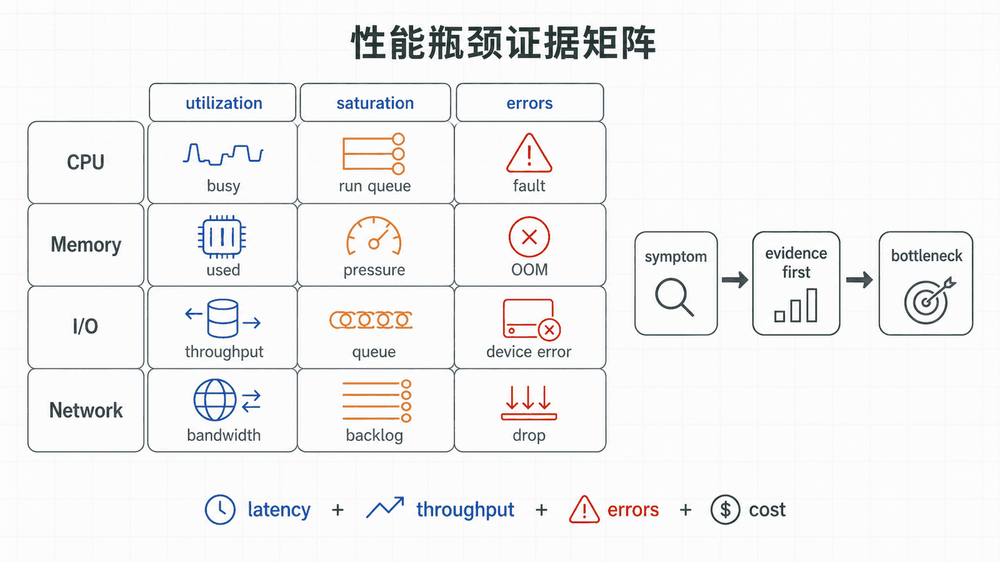
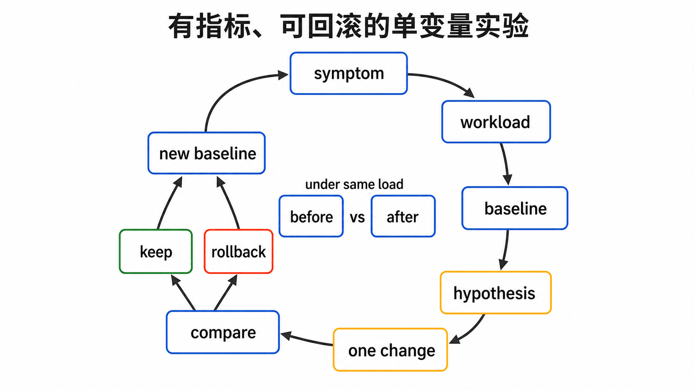
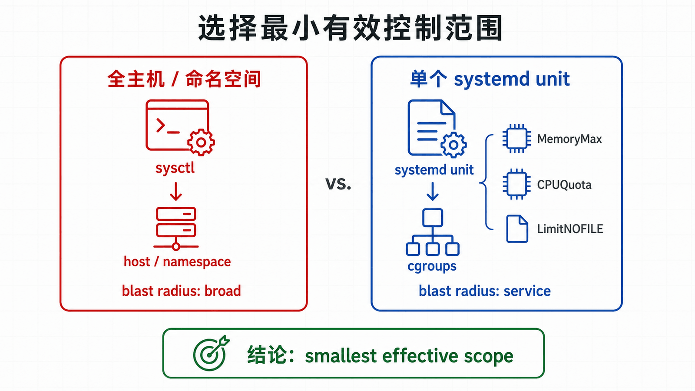

## 前置知识与学习目标

你应理解进程、systemd、存储和网络证据链。本文不提供“万能参数”，而是建立从用户症状到资源瓶颈、实验变更和回滚的闭环。

读完后，你能够为 `demo-web.service` 定义基线，区分 CPU 饱和、内存压力、IO 等待和网络队列问题，并选择服务级限制还是全局 sysctl。

## 真实场景

用户报告 `demo-web` 偶发超时。平均 CPU 只有 30%，有人建议直接增大所有网络队列、关闭安全缓解并把文件描述符调到百万。没有基线和瓶颈证据时，这些修改可能无效，甚至把故障推迟到更危险的规模。

## 核心机制

性能是特定负载、资源和目标的关系。先定义响应时间、吞吐、错误率和资源成本，再观察资源的利用率、饱和度与错误。

- CPU：运行队列、用户/系统时间、上下文切换；
- 内存：可用内存、回收、缺页、swap 与 OOM；
- 存储：延迟、队列、吞吐和文件系统容量；
- 网络：丢包、重传、队列、监听积压和连接状态。

<!-- figure-anchor:l09-a01 -->

<!-- figure-managed:l09-f01:start -->



<!-- figure-managed:l09-f01:end -->

## 关键对象与状态变化

<!-- figure-anchor:l09-a02 -->

<!-- figure-managed:l09-f02:start -->



<!-- figure-managed:l09-f02:end -->

诊断闭环：

```text
用户症状 → 固定工作负载 → 采集基线 → 定位资源
→ 提出单一假设 → 小范围变更 → 比较指标 → 保留或回滚
```

<!-- figure-anchor:l09-a03 -->

<!-- figure-managed:l09-f03:start -->



<!-- figure-managed:l09-f03:end -->

sysctl 修改内核全局或命名空间参数；systemd 的 `MemoryMax=`、`CPUQuota=`、`TasksMax=` 和 `LimitNOFILE=` 把约束放到具体 Unit。能在服务边界解决的问题，通常不应先扩大整台主机的全局上限。

## 最小实践

建立 60 秒基线前，记录负载条件和版本：

```bash
date --iso-8601=seconds
uname -r
systemctl show demo-web.service \
  -p MainPID -p MemoryCurrent -p TasksCurrent -p CPUUsageNSec
uptime
vmstat 1 5
pidstat -p "$(systemctl show -p MainPID --value demo-web.service)" 1 5
iostat -xz 1 5
ss -s
```

部分工具来自 `sysstat`，未安装时应记录缺失，不在事故中临时引入未经审核的软件源。

服务级资源控制示例：

```ini
[Service]
MemoryHigh=256M
MemoryMax=320M
CPUQuota=100%
TasksMax=128
LimitNOFILE=8192
```

使用 drop-in：

```bash
sudo systemctl edit demo-web.service
sudo systemd-analyze verify demo-web.service
sudo systemctl daemon-reload
sudo systemctl restart demo-web.service
systemctl show demo-web.service -p MemoryHigh -p MemoryMax -p CPUQuotaPerSecUSec
```

## 输入、输出与失败边界

每次实验只改变一个假设相关变量，并保存变更前后相同负载下的 P50/P95/P99、吞吐、错误率和资源指标。平均值会掩盖尾延迟。

sysctl 先临时验证：

```bash
sysctl net.core.somaxconn
sudo sysctl -w net.core.somaxconn=4096
sysctl net.core.somaxconn
```

回滚使用记录的原值。只有收益可重复且风险可接受时，才写入 `/etc/sysctl.d/99-demo-web.conf` 并执行 `sysctl --system`。参数含义必须以当前内核文档为准，旧发行版与新内核不可直接照搬。

降低 `MemoryMax` 可能触发服务内 OOM；提高文件描述符上限可能掩盖泄漏；扩大队列可能增加内存和排队延迟。所有改动必须配套错误率和日志监控。

## 常见误区与适用边界

- CPU 利用率低不代表没有单核饱和、锁等待或 IO 等待。
- “free 很少”不等于内存不足，Linux 会把空闲内存用于缓存，应结合 available、回收和 swap 观察。
- 参数越大不等于吞吐越高，队列会把拒绝转化为更长等待。
- `mitigations=off` 会关闭部分 CPU 漏洞缓解，不应作为通用性能方案。
- 一次压测的改善不等于生产收益；缓存预热、数据规模和并发模型必须可比。

## 本篇自检

<details>
<summary>1. 为什么调优前必须固定工作负载？</summary>

只有输入规模、并发和版本可比，变更前后的指标差异才可能归因于调优，而不是负载变化。

</details>

<details>
<summary>2. 何时优先使用 systemd/cgroups 而不是全局 sysctl？</summary>

当目标是限制或保障某个服务的 CPU、内存、任务数和文件描述符时，服务级边界影响更小、回滚更清楚。

</details>

<details>
<summary>3. 提高队列上限有什么潜在副作用？</summary>

会增加内存占用和排队时间，可能把快速失败变成长尾超时，并掩盖下游处理能力不足。

</details>

## 本篇总结

调优是受控实验，不是参数收藏。可靠流程从用户指标开始，定位资源、提出单一假设、比较相同负载下的数据，并保留立即回滚的原值与配置。

## 下一篇衔接

最后一篇把这些方法应用到已经 EOL 的 CentOS 7：重点不是继续堆参数，而是限制暴露、维持可恢复性并完成迁移。

## 资料来源

- [Red Hat: Monitoring and managing system status and performance](https://docs.redhat.com/en/documentation/red_hat_enterprise_linux/9/html-single/monitoring_and_managing_system_status_and_performance/monitoring_and_managing_system_status_and_performance)
- [Linux Kernel: Documentation for /proc/sys](https://docs.kernel.org/admin-guide/sysctl/index.html)
- [systemd.resource-control manual](https://www.freedesktop.org/software/systemd/man/latest/systemd.resource-control.html)
- [proc_pressure(5)](https://man7.org/linux/man-pages/man5/proc_pressure.5.html)
