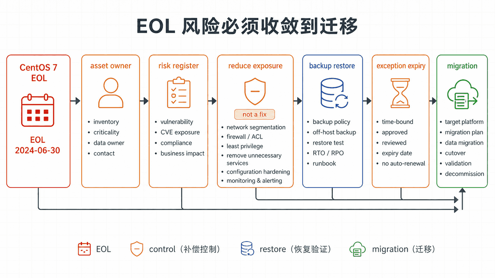
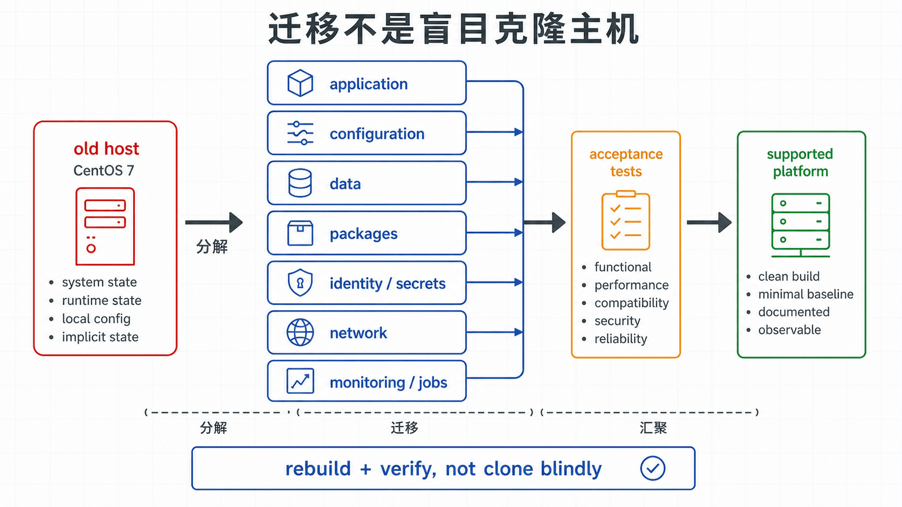

## 前置知识与学习目标

你应已完成前九篇，理解权限、systemd、存储、网络、SSH 和性能变更。CentOS Linux 7 已于 2024 年 6 月 30 日停止维护，本文只讨论存量系统治理，不建议新部署。

读完后，你能够建立资产和风险清单，区分临时缓解与真正修复，执行带备份、验证和回滚的应急变更，并设计迁移退出门槛。

## 真实场景

`app01` 仍运行 CentOS 7，承载只能在旧运行时工作的 `demo-web`。业务无法本周迁移，但安全扫描发现高危问题。团队需要同时做到：不假装系统仍受支持，不因仓促调参中断业务，并让每项临时措施服务于明确的退出计划。

## 核心机制

EOL 意味着常规安全更新和错误修复停止。把仓库切换到 vault 只能取得历史包，不能获得新的安全更新。网络隔离、WAF、最小权限和监控是补偿控制，不会把已知漏洞“修复”。

治理顺序：

1. 识别主机、业务、数据、负责人和依赖；
2. 记录无法更新的风险与截止日期；
3. 收敛网络暴露和管理员入口；
4. 验证备份、恢复和带外控制台；
5. 只做必要、可观察、可回滚的变更；
6. 在新平台重建并迁移，而不是无限延长例外。

<!-- figure-anchor:l10-a01 -->

<!-- figure-managed:l10-f01:start -->



<!-- figure-managed:l10-f01:end -->

## 关键对象与状态变化

<!-- figure-anchor:l10-a02 -->

<!-- figure-managed:l10-f02:start -->



<!-- figure-managed:l10-f02:end -->

迁移不是简单的原地大版本升级。应分离：

```text
应用代码与配置
数据与备份
系统包与第三方仓库
身份、证书和密钥
网络与防火墙
监控、日志和定时任务
```

目标状态是在受支持发行版上通过相同验收用例，而不是让新主机“看起来像旧主机”。旧环境在回退窗口结束后应下线并销毁凭据。

## 最小实践

只读资产盘点：

```bash
cat /etc/centos-release
uname -r
rpm -qa --qf '%{NAME}\t%{VERSION}-%{RELEASE}\t%{ARCH}\n' | sort
yum repolist all
systemctl list-unit-files --state=enabled
ss -lntup
findmnt
df -hT
crontab -l 2>/dev/null || true
```

结果应保存到受控资产库，过滤令牌、密码和私钥。随后为每个监听端口登记调用方、业务必要性和收敛计划。

紧急 SSH 变更仍遵循安全门：

```bash
sudo cp -a /etc/ssh/sshd_config /etc/ssh/sshd_config.bak.$(date +%F-%H%M%S)
sudo sshd -t
sudo systemctl reload sshd
```

执行前必须有第二个会话或控制台；执行后从新会话验证密钥登录，再关闭旧入口。回滚时恢复备份、运行 `sshd -t` 并 reload。

## 输入、输出与失败边界

存量变更单至少记录：问题证据、影响范围、负责人、原值、新值、验证指标、回滚命令和例外到期日。没有到期日的补偿控制很容易变成永久债务。

备份只有经过恢复演练才构成恢复能力。至少验证：

- 应用配置能在隔离环境恢复；
- 数据校验和或业务抽样正确；
- 密钥和证书有独立备份与轮换方案；
- 恢复时间和数据丢失窗口满足业务要求。

不要为了启用 BBR、更新单个库或追求跑分，随意替换生产内核和核心系统包。无法在等价环境演练时，应把风险提交给业务决策，而不是伪装成“常规优化”。

## 常见误区与适用边界

- vault 仓库不是持续安全支持，只是历史包归档。
- 防火墙和内网隔离降低暴露面，但不能消除主机内部或供应链风险。
- 原地修改越多，迁移时越难复现；所有例外必须进入配置和资产记录。
- CentOS Stream、RHEL、Rocky Linux、AlmaLinux、Ubuntu LTS 和 Debian 的生命周期与兼容策略不同，应按应用认证、支持合同和运维能力选择。
- 本文不是合规豁免建议；受监管系统应由安全、法务和业务负责人共同批准例外。

## 本篇自检

<details>
<summary>1. 切换到 vault 仓库能让 CentOS 7 重新获得安全更新吗？</summary>

不能。vault 保存历史内容，不会为 CentOS Linux 7 发布新的常规安全更新。

</details>

<details>
<summary>2. 什么条件下补偿控制才算可治理？</summary>

它需要明确风险、负责人、验证指标、监控、回滚和到期日，并且不能替代最终迁移计划。

</details>

<details>
<summary>3. 为什么迁移完成后还要保留有限回退窗口？</summary>

需要验证真实流量、数据一致性和依赖；窗口结束后应关闭旧流量、轮换凭据并下线旧主机，避免双环境长期漂移。

</details>

## 本篇总结

CentOS 7 的正确方向不是继续“优化”到看似现代，而是诚实登记 EOL 风险、收敛暴露、验证恢复、控制每次变更，并把系统迁移到受支持平台。

## 下一篇衔接

本篇完成系列闭环。后续可基于同一个 `demo-web.service` 继续学习配置管理、容器、可观测性和自动化发布；这些主题应建立在本系列的身份、服务、存储、网络与回滚基础上。

## 资料来源

- [CentOS Project: CentOS Linux lifecycle](https://www.centos.org/centos-linux/)
- [CentOS Project: End dates for CentOS Linux 7](https://blog.centos.org/2023/04/end-dates-are-coming-for-centos-stream-8-and-centos-linux-7/)
- [Red Hat Enterprise Linux life cycle](https://access.redhat.com/support/policy/updates/errata)
- [Red Hat: Converting from an RPM-based Linux distribution to RHEL](https://docs.redhat.com/en/documentation/red_hat_enterprise_linux/9/html/converting_from_an_rpm-based_linux_distribution_to_rhel/index)
