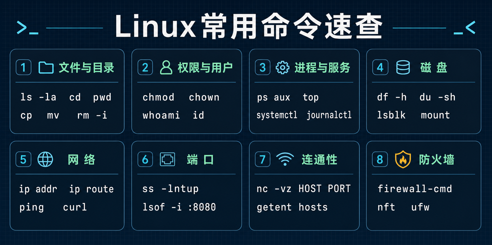

## Linux 简介

Linux 是开源的 Unix-like 操作系统内核，由 Linus Torvalds 于 1991 年发布。日常所说的 Linux 系统一般是 Linux 内核加 GNU 工具、系统服务、包管理器和发行版配置共同组成的操作系统。

本文面向刚接触 Linux 的读者，覆盖日常运维中最常用的目录、文件、权限、用户、进程、服务、磁盘和网络命令。命令中的 `PATH`、`PID`、`HOST`、`PORT` 等大写单词是占位符，执行时需要替换成实际值。



## 系统架构

```text
┌──────────────────────────────────────┐
│           用户应用程序               │
├──────────────────────────────────────┤
│         Shell / 图形界面              │
├──────────────────────────────────────┤
│       系统库与系统调用接口           │
├──────────────────────────────────────┤
│             Linux 内核               │
├──────────────────────────────────────┤
│             硬件设备                 │
└──────────────────────────────────────┘
```

Shell 负责解释命令，内核负责进程、内存、文件系统、网络和设备管理。

## 目录结构

| 目录    | 说明                           |
| ------- | ------------------------------ |
| `/`     | 根目录，文件系统起点           |
| `/bin`  | 基本用户命令                   |
| `/sbin` | 系统管理命令                   |
| `/etc`  | 系统配置文件                   |
| `/home` | 普通用户家目录                 |
| `/root` | root 用户家目录                |
| `/var`  | 可变数据，例如日志、缓存、队列 |
| `/tmp`  | 临时文件目录                   |
| `/usr`  | 用户程序、库和文档             |
| `/proc` | 内核和进程信息的虚拟文件系统   |
| `/dev`  | 设备文件                       |
| `/mnt`  | 临时挂载点                     |
| `/opt`  | 第三方或可选应用               |

## 文件操作

### 目录操作

```bash
ls -la
cd /path/to/directory
pwd
mkdir directory_name
rmdir empty_directory
```

删除目录前先确认路径：

```bash
rm -ri directory_name
```

`rm -rf` 会递归强制删除，适合脚本中的受控路径，不应作为初学者默认删除命令。

### 文件操作

```bash
touch filename
cp source dest
cp -r source_dir dest_dir
mv source dest
rm filename
cat filename
less filename
head -n 10 filename
tail -n 10 filename
tail -f filename
```

大文件查看优先使用 `less`、`head`、`tail`，不要直接 `cat` 巨大日志。

### 文件搜索

```bash
find /path -name "*.txt"
grep -R "pattern" /path
locate filename
which command
command -v command
```

`locate` 依赖索引数据库，结果可能不是实时的。

## 文件权限

### 权限表示

```text
drwxr-xr-x
│└─┬─┘└─┬─┘└─┬─┘
│  │     │     └── 其他用户权限
│  │     └──────── 所属组权限
│  └────────────── 所有者权限
└───────────────── 文件类型
```

| 字符 | 说明               |
| ---- | ------------------ |
| `d`  | 目录               |
| `-`  | 普通文件           |
| `r`  | 读权限，数字值 4   |
| `w`  | 写权限，数字值 2   |
| `x`  | 执行权限，数字值 1 |

### 修改权限

```bash
chmod 755 script.sh
chmod u+x script.sh
chown user:group filename
```

不要为了省事使用 `chmod 777`。它会给所有用户读、写、执行权限，通常会扩大安全风险。

## 用户管理

```bash
sudo useradd -m username
sudo passwd username
sudo usermod -aG group username
sudo userdel username
su - username
sudo command
```

查看当前身份：

```bash
whoami
who
id
groups
```

`useradd -m` 会同时创建用户家目录。涉及系统用户和 sudo 权限的修改，建议先确认发行版约定。例如 Debian/Ubuntu 常用 `sudo` 组及交互式的 `adduser`，RHEL/CentOS 系常用 `wheel` 组。

## 进程管理

### 查看进程

```bash
ps aux
ps -ef
top
htop
```

`htop` 不是所有系统默认安装。

### 操作进程

```bash
kill PID
kill -TERM PID
kill -9 PID
killall processname
command &
nohup command &
```

优先使用默认的 `SIGTERM` 优雅停止。`kill -9` 会跳过进程清理逻辑，只应在进程无法正常退出时使用。

## 系统服务

多数现代 Linux 发行版使用 systemd：

```bash
sudo systemctl start servicename
sudo systemctl stop servicename
sudo systemctl restart servicename
systemctl status servicename
sudo systemctl enable servicename
sudo systemctl disable servicename
journalctl -u servicename
```

查看服务失败原因时，`systemctl status` 和 `journalctl -u` 通常一起使用。

## 磁盘管理

```bash
df -h
du -sh /path
lsblk
blkid
mount /dev/sdb1 /mnt
umount /mnt
```

挂载生产磁盘前，应确认设备名、文件系统类型和是否已有数据。设备名如 `/dev/sdb` 可能随启动顺序变化，长期配置建议使用 UUID。

## 网络管理

### 查看网络

```bash
ip -br addr
ip link
ip route
ping -c 4 8.8.8.8
curl -I https://example.com
```

`ip -br addr` 以简洁格式显示网卡和 IP 地址，`ip link` 显示网卡是否启用，`ip route` 显示路由表。`ping` 用于检查基本网络连通性，`curl -I` 用于检查 HTTP/HTTPS 服务是否响应。

`ip` 和 `ss` 是现代系统中更推荐的工具。`ifconfig`、`netstat` 在很多发行版中属于兼容工具或需要额外安装。

### 查询端口和占用进程

```bash
# 列出 TCP/UDP 监听端口，并显示关联进程
sudo ss -lntup

# 查询正在监听 8080 端口的 TCP 进程
sudo ss -lntp 'sport = :8080'

# 使用 lsof 查询同一端口（部分系统需要额外安装）
sudo lsof -nP -iTCP:8080 -sTCP:LISTEN

# 查看已经建立的 TCP 连接
ss -ant state established
```

`ss` 常用参数如下：

| 参数 | 含义                                                  |
| ---- | ----------------------------------------------------- |
| `-l` | 只显示监听中的套接字                                  |
| `-n` | 直接显示数字 IP 和端口，不解析名称                    |
| `-t` | 显示 TCP 套接字                                       |
| `-u` | 显示 UDP 套接字                                       |
| `-p` | 显示占用端口的进程；查看其他用户的进程通常需要 `sudo` |

如果系统没有 `lsof`，也可以使用 `sudo fuser -v 8080/tcp` 查询端口占用。发现端口被占用后，应先确认进程用途，再通过服务管理器或 `SIGTERM` 停止进程，不要直接使用 `kill -9`。

### DNS 和远程端口测试

```bash
# 使用系统配置的解析方式查询域名
getent hosts example.com

# 查看更详细的 DNS 记录（可能需要安装 dnsutils 或 bind-utils）
dig example.com

# 测试远程主机的 443 端口
nc -vz example.com 443

# 查看到目标主机的网络路径（部分系统需要额外安装）
tracepath example.com
```

`ping` 成功不代表某个 TCP 端口一定可用，`ping` 失败也可能只是目标主机禁用了 ICMP。测试具体服务时，应结合 `nc`、`curl` 或对应的客户端命令。

### 网络排障顺序

遇到“服务无法访问”时，可以按以下顺序逐层检查：

1. 使用 `ip -br addr` 确认网卡和 IP 地址。
2. 使用 `ip route` 确认默认路由和目标路由。
3. 使用 `getent hosts` 确认域名可以解析。
4. 在服务端使用 `sudo ss -lntup` 确认进程正在监听正确的地址和端口。
5. 检查防火墙是否放行对应端口。
6. 在客户端使用 `nc -vz HOST PORT` 或 `curl` 测试远程服务。

注意监听地址的区别：`127.0.0.1:8080` 只能从本机访问，`0.0.0.0:8080` 表示监听所有 IPv4 网卡，`[::]:8080` 表示监听 IPv6 地址，其是否同时接受 IPv4 连接取决于系统配置。

### 临时配置 IP

```bash
sudo ip addr add 192.168.1.100/24 dev eth0
sudo ip link set eth0 up
```

临时配置重启后会丢失。永久配置需要使用发行版的网络管理方式，例如 NetworkManager、netplan 或系统网络配置文件。

## 防火墙

### firewalld

```bash
sudo firewall-cmd --state
sudo firewall-cmd --list-all
sudo firewall-cmd --permanent --add-service=http
sudo firewall-cmd --permanent --add-port=8080/tcp
sudo firewall-cmd --reload
```

### iptables

```bash
sudo iptables -L -n -v
sudo iptables -A INPUT -p tcp --dport 80 -j ACCEPT
```

iptables 命令直接影响防火墙规则。生产环境修改前应确认现有规则和持久化方式，避免断开 SSH 连接。

### nftables 和 ufw

现代发行版通常以 nftables 作为底层防火墙框架，部分系统中的 `iptables` 命令实际使用 nftables 后端。Ubuntu 等发行版也常用 ufw 简化规则管理：

```bash
sudo nft list ruleset
sudo ufw status verbose
sudo ufw allow 8080/tcp
```

不要同时使用多个前端随意修改同一套规则。端口已经监听并不代表防火墙已放行；防火墙已放行也不代表应用正在监听，应分别检查。

## 小结

Linux 入门应先掌握目录结构、权限、用户、进程、服务、磁盘和网络这些基础概念。网络问题应按照“网卡与 IP → 路由 → DNS → 服务监听 → 防火墙 → 远程测试”的顺序排查。执行删除、权限、防火墙、磁盘挂载等命令前，先确认目标对象和回滚方式。
