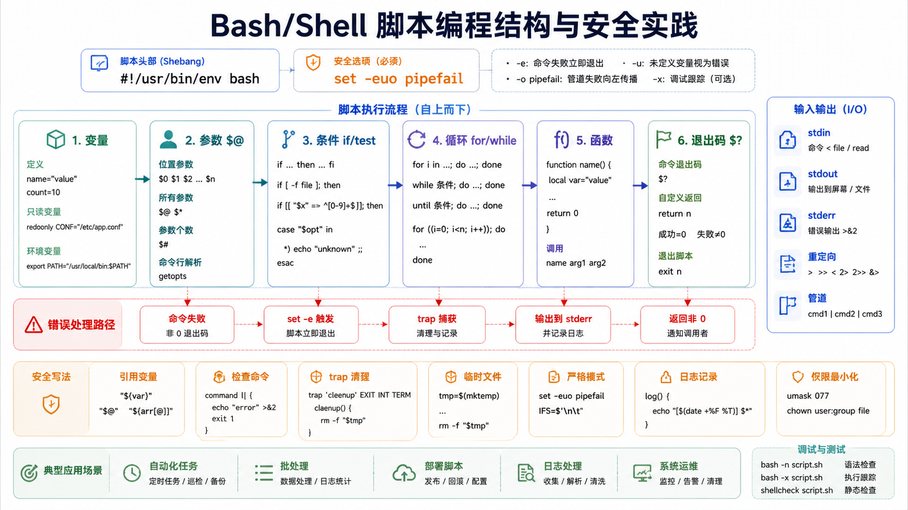

## 简介

Shell 是用户与操作系统交互的命令解释器。Linux 自动化脚本通常使用 Bash 编写，因此本文示例默认使用 Bash。



## 脚本开头

推荐写法：

```bash
#!/usr/bin/env bash
set -euo pipefail
```

| 选项 | 说明 |
|------|------|
| `-e` | 命令失败时退出脚本 |
| `-u` | 使用未定义变量时报错 |
| `-o pipefail` | 管道中任意命令失败时让整个管道失败 |

这些选项适合多数自动化脚本，但如果脚本需要主动处理失败命令，应局部使用 `if` 或 `|| true` 明确表达意图。

## 变量

### 定义与使用

```bash
name="John"
age=25
readonly PI="3.14159"

echo "Name: ${name}"
echo "Age: ${age}"
```

变量赋值时等号两边不能有空格。读取变量时建议使用 `"${var}"`，避免空格和通配符导致意外拆分。

### 环境变量

```bash
echo "${PATH}"
echo "${HOME}"
echo "${USER}"

export APP_ENV="production"
```

### 特殊变量

| 变量 | 说明 |
|------|------|
| `$0` | 脚本名称 |
| `$1` ... `$9` | 第 1 到第 9 个参数 |
| `$#` | 参数个数 |
| `$*` | 所有参数，双引号中会合成一个字符串 |
| `$@` | 所有参数，双引号中保留独立参数 |
| `$?` | 上一条命令退出状态 |
| `$$` | 当前 Shell 进程 ID |

遍历参数时优先使用：

```bash
for arg in "$@"; do
  echo "arg=${arg}"
done
```

## 运算

### 整数运算

```bash
a=10
b=5

echo "$((a + b))"
echo "$((a - b))"
echo "$((a * b))"
echo "$((a / b))"
echo "$((a % b))"

((a++))
((a += 5))
```

Bash 原生算术只支持整数。

### 浮点运算

```bash
echo "scale=2; 10 / 3" | bc
awk 'BEGIN {printf "%.2f\n", 10 / 3}'
```

## 条件判断

### 字符串、数字和文件测试

```bash
str=""
a=10
b=20

[[ "${str}" == "" ]]
[[ -z "${str}" ]]
[[ -n "${str}" ]]

[[ "${a}" -lt "${b}" ]]
[[ "${a}" -eq 10 ]]

[[ -e file ]]
[[ -f file ]]
[[ -d dir ]]
[[ -r file ]]
[[ -w file ]]
[[ -x script.sh ]]
```

在 Bash 中优先使用 `[[ ... ]]`，它比传统 `[ ... ]` 更不容易受到空变量和模式匹配影响。

### if 语句

```bash
if [[ "${a}" -gt "${b}" ]]; then
  echo "a > b"
elif [[ "${a}" -eq "${b}" ]]; then
  echo "a == b"
else
  echo "a < b"
fi
```

### case 语句

```bash
case "${1:-}" in
  start)
    echo "启动"
    ;;
  stop)
    echo "停止"
    ;;
  *)
    echo "用法: $0 {start|stop}"
    exit 1
    ;;
esac
```

## 循环

### for 循环

```bash
for i in 1 2 3 4 5; do
  echo "Number: ${i}"
done

for ((i = 0; i < 10; i++)); do
  echo "Count: ${i}"
done

arr=(apple banana orange)
for fruit in "${arr[@]}"; do
  echo "Fruit: ${fruit}"
done
```

### while 循环

```bash
i=1
while [[ "${i}" -le 5 ]]; do
  echo "Count: ${i}"
  ((i++))
done
```

读取文件时避免 `cat file | while ...` 造成子 Shell 变量作用域问题：

```bash
while IFS= read -r line; do
  echo "${line}"
done < file.txt
```

### until 循环

```bash
i=1
until [[ "${i}" -gt 5 ]]; do
  echo "Count: ${i}"
  ((i++))
done
```

## 函数

### 定义函数

```bash
hello() {
  echo "Hello, $1"
}

hello "World"
```

### 返回值

Shell 函数的 `return` 只能返回 0 到 255 的退出状态，不适合返回普通计算结果。需要返回数据时，用标准输出：

```bash
add() {
  local left="$1"
  local right="$2"
  echo "$((left + right))"
}

result="$(add 3 5)"
echo "${result}"
```

用退出状态表达成功或失败：

```bash
is_file() {
  local path="$1"
  [[ -f "${path}" ]]
}

if is_file "/etc/hosts"; then
  echo "文件存在"
fi
```

### 局部变量

```bash
demo() {
  local var="局部变量"
  echo "${var}"
}
```

## 字符串处理

```bash
str="Hello World"

echo "${#str}"          # 长度
echo "${str:0:5}"       # Hello
echo "${str:6}"         # World
echo "${str/World/Shell}"
echo "${str#Hello }"    # World
echo "${str% World}"    # Hello
```

## 数组

```bash
arr=(one two three)

echo "${arr[0]}"
printf '%s\n' "${arr[@]}"
echo "${#arr[@]}"

arr[0]="ONE"
arr+=(four five)
unset 'arr[1]'
```

遍历数组时使用 `"${arr[@]}"`，可以保留包含空格的元素。

## 输入输出

### echo 和 printf

```bash
echo "Hello"
printf "Name: %s, Age: %d\n" "Tom" 25
```

格式化输出优先使用 `printf`，可移植性和可控性更好。

### read

```bash
read -r -p "请输入姓名: " name
read -r -s -p "请输入密码: " password
printf '\n'
```

`-r` 可以避免反斜杠被解释。

### 重定向

```bash
command > file        # 覆盖输出
command >> file       # 追加输出
command < file        # 输入重定向
command 2> error.log  # 错误输出
command > all.log 2>&1
```

`&>` 是 Bash 支持的简写，但在追求 POSIX sh 兼容时不要使用。

### 管道

```bash
grep "pattern" file.txt | sort | uniq -c
ls -la | head -n 10
```

简单过滤文件时不需要 `cat file | grep pattern`，直接用 `grep "pattern" file` 更清晰。

## 常用命令

| 命令 | 说明 |
|------|------|
| `grep` | 模式匹配 |
| `sed` | 流编辑器 |
| `awk` | 文本处理 |
| `cut` | 字段提取 |
| `sort` | 排序 |
| `uniq` | 去重 |
| `wc` | 统计 |
| `xargs` | 构建参数列表 |
| `find` | 文件查找 |
| `tr` | 字符转换 |

## 小结

写 Shell 脚本时，最重要的是处理好失败、空格和输入边界。建议默认使用 `set -euo pipefail`、引用变量、用 `[[ ... ]]` 判断、用标准输出传递函数结果，并在危险命令前打印将要执行的对象。
