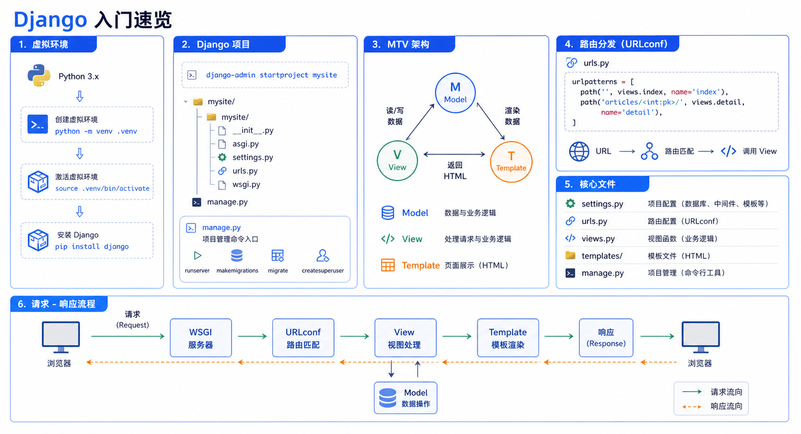

> Django 是一个高级 Python Web 框架，鼓励快速开发和简洁实用的设计。



## 虚拟环境

### 什么是虚拟环境

- 对真实Python解释器的拷贝版本
- 可以独立存在，运行Python代码
- 可以在计算机上创建多个虚拟环境

### 为什么要使用虚拟环境

- 保证真实环境的纯净性
- 框架的多版本共存
- 方便做框架的版本迭代
- 降低多框架共存的维护成本

### 安装与使用

<!-- snippet: id=django-getting-started-01 mode=display python=3.12-3.14 deps=stdlib -->
```bash
python -m pip install virtualenv
virtualenv myenv
cd myenv\Scripts
activate
deactivate
```

## MTV模型

- **Model**：模型，和数据库相关
- **Template**：模板，存放html文件，支持模板语法
- **View**：视图函数，处理请求

## 创建项目

### 终端创建

<!-- snippet: id=django-getting-started-02 mode=display python=3.12-3.14 deps=stdlib -->
```bash
django-admin startproject 项目名
cd 项目名
python3 manage.py runserver 127.0.0.1:8000
```

### 项目目录结构

<!-- snippet: id=django-getting-started-03 mode=display python=3.12-3.14 deps=stdlib -->
```text
项目名/
├── __init__.py
├── settings.py      # 配置总文件
├── urls.py          # URL配置
├── wsgi.py          # Web服务器网关接口
└── manage.py        # 项目管理器
```

### settings.py 核心配置

<!-- snippet: id=django-getting-started-04 mode=compile python=3.12-3.14 deps=stdlib -->
```python
import os

# 项目根目录
BASE_DIR = os.path.dirname(os.path.dirname(os.path.abspath(__file__)))

# 安全码
SECRET_KEY = '...'

# 调试模式
DEBUG = True
ALLOWED_HOSTS = []

# 已安装应用
INSTALLED_APPS = [
    'django.contrib.admin',
    'django.contrib.auth',
    'django.contrib.contenttypes',
    'django.contrib.sessions',
    'django.contrib.messages',
    'django.contrib.staticfiles',
]

# 中间件
MIDDLEWARE = [...]

# 数据库配置
DATABASES = {
    'default': {
        'ENGINE': 'django.db.backends.sqlite3',
        'NAME': os.path.join(BASE_DIR, 'db.sqlite3'),
    }
}
```

## 路由控制

### URLconf

<!-- snippet: id=django-getting-started-05 mode=compile python=3.12-3.14 deps=Django==6.0.7 -->
```python
from django.urls import path, re_path

urlpatterns = [
    path('articles/', views.articles),
    re_path(r'^articles/(\d{4})/(\d{2})/$', views.year_month),
]
```

### 无名分组

<!-- snippet: id=django-getting-started-06 mode=compile python=3.12-3.14 deps=stdlib -->
```python
# url: /articles/2024/05
re_path(r'^articles/(\d{4})/(\d{2})$', views.year_month)
# 视图函数
def year_month(request, year, month):
    ...
```

### 有名分组

<!-- snippet: id=django-getting-started-07 mode=compile python=3.12-3.14 deps=stdlib -->
```python
re_path(r'^articles/(?P<year>\d{4})/(?P<month>\d{2})$', views.year_month)
# 视图函数
def year_month(request, year, month):
    ...
```

### 路由分发

<!-- snippet: id=django-getting-started-08 mode=compile python=3.12-3.14 deps=stdlib -->
```python
# 主urls.py
path('blog/', include('blog.urls'))

# blog/urls.py
urlpatterns = [
    re_path(r'^test/$', views.test),
]
```

## 视图函数

### 基本结构

<!-- snippet: id=django-getting-started-09 mode=compile python=3.12-3.14 deps=Django==6.0.7 -->
```python
from django.shortcuts import render, HttpResponse, redirect

def index(request):
    return HttpResponse("Hello World")
```

### request对象

| 属性 | 说明 |
|------|------|
| `request.GET` | GET请求参数 |
| `request.POST` | POST请求参数 |
| `request.method` | 请求方法 |
| `request.path` | 请求路径 |
| `request.FILES` | 上传文件 |

### 响应方式

<!-- snippet: id=django-getting-started-10 mode=compile python=3.12-3.14 deps=stdlib -->
```python
# 直接返回
return HttpResponse("内容")

# 渲染模板
return render(request, 'index.html', {'name': '张三'})

# 重定向
return redirect('/home/')
```

## 小结

- Django 基于 MTV 模型组织代码
- 路由使用 URLconf 配置路径与视图的映射
- 视图函数处理请求并返回响应
- 使用虚拟环境管理项目依赖
