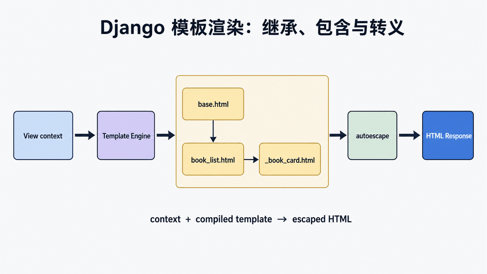

## 前置知识与学习目标

你需要知道 view、context 与 HTML。读完后应能解释模板查找、context 解析、自动转义和继承的调用关系；能用 `base.html`、`book_list.html` 与 `_book_card.html` 构造页面；能识别把数据库查询、授权或复杂业务塞进模板的错误边界。

> Django 模板系统用于将 Python 数据渲染成 HTML 页面。

## 模板语法

### 变量

语法：`{{ 变量名 }}`，使用点号`.`访问复杂数据结构的属性和方法。

<!-- snippet: id=django-template-system-01 mode=compile python=3.12-3.14 deps=stdlib -->

```python
def index(request):
    name = "hello"
    i = 200
    l = [11, 22, 33, 44, 55]
    d = {"name": "haiyan", "age": 20}

    class People:
        def __init__(self, name, age):
            self.name = name
            self.age = age
        def dream(self):
            return "你有梦想吗？"

    person = People("alex", 18)
    return render(request, "index.html", {"name": name, "person": person})
```

<!-- snippet: id=django-template-system-02 mode=display python=3.12-3.14 deps=stdlib -->

```html
<p>{{ name }}</p>
<p>{{ l.0 }}</p>
<p>{{ d.name }}</p>
<p>{{ person.name }}</p>
<p>{{ person.dream }}</p>
```

## 过滤器

语法：`{{ 变量|过滤器:参数 }}`

| 过滤器           | 说明       | 示例                           |
| ---------------- | ---------- | ------------------------------ |
| `default`        | 默认值     | `{{ name\|default:"空" }}`     |
| `length`         | 长度       | `{{ list\|length }}`           |
| `filesizeformat` | 文件大小   | `{{ size\|filesizeformat }}`   |
| `date`           | 日期格式化 | `{{ date\|date:"Y-m-d" }}`     |
| `truncatechars`  | 截断字符   | `{{ text\|truncatechars:10 }}` |
| `safe`           | 渲染HTML   | `{{ html\|safe }}`             |
| `add`            | 加法       | `{{ value\|add:5 }}`           |

## 标签

### for循环

<!-- snippet: id=django-template-system-03 mode=display python=3.12-3.14 deps=stdlib -->

```html

<li>{{ forloop.counter }} - {{ item }}</li>

<li>列表为空</li>

```

`forloop` 属性：

- `forloop.counter` - 当前循环计数（从1开始）
- `forloop.counter0` - 当前循环计数（从0开始）
- `forloop.first` - 是否第一次循环
- `forloop.last` - 是否最后一次循环

### if条件

<!-- snippet: id=django-template-system-04 mode=display python=3.12-3.14 deps=stdlib -->

```html

<p>欢迎 {{ user.username }}</p>

<p>工作人员</p>

<p>请登录</p>

```

### with别名

<!-- snippet: id=django-template-system-05 mode=display python=3.12-3.14 deps=stdlib -->

```html

<p>{{ name }}</p>

```

## 模板继承

### 基础模板

<!-- snippet: id=django-template-system-06 mode=display python=3.12-3.14 deps=stdlib -->

```html
<!-- base.html -->
<!DOCTYPE html>
<html>
  <head>
    <title>默认标题</title>
    
  </head>
  <body>
    <nav>导航栏</nav>
    
    <footer>页脚</footer>
    
  </body>
</html>
```

### 子模板

<!-- snippet: id=django-template-system-07 mode=display python=3.12-3.14 deps=stdlib -->

```html
 首页 
<h1>欢迎访问</h1>
<p>这里是首页内容</p>

```

## 模板导入

使用 `` 引入其他模板：

<!-- snippet: id=django-template-system-08 mode=display python=3.12-3.14 deps=stdlib -->

```html
<!-- 引入导航栏 -->


<!-- 可以传递参数 -->

```

> 模板继承与导入的区别：
>
> - 继承：子模板可以覆盖父模板的块
> - 导入：一个页面可以引入多个模板片段

## 小结

- `{{ }}` 用于输出变量
- `` 用于编写模板标签
- 过滤器处理变量输出格式
- `` 实现模板继承
- `` 引入模板片段

## 渲染机制与安全边界

<!-- figure:s02-f01:start -->



<!-- figure:s02-f01:end -->

`render(request, template_name, context)` 由配置的模板引擎查找并编译模板，再用 context 渲染。变量解析失败通常输出空字符串，容易掩盖拼写错误；关键页面应由测试断言。Django 模板默认对变量做 HTML 转义，`safe` 或关闭 autoescape 只能用于已经可信和清洗的内容。

模板继承定义页面骨架，include 复用局部片段；view 应准备好 `books` 与分页状态，模板不应在循环中发起不可见的关联查询。

## 常见误区与最小验收

- 过滤器用于展示转换，不承担权限、写操作或昂贵查询。
- `` 保护同源写表单，但不替代认证和授权。
- `` 比硬编码路径更能承受路由变化。
- 测试 block 覆盖、空列表、特殊字符转义、缺失 context 与无障碍标签。

## 自检题

1. 模板变量默认为什么要转义？
2. 继承与 include 的主要差异是什么？
3. 为什么循环访问 `book.publisher.name` 可能触发 N+1？

<details><summary>答案</summary>

1. 防止不可信文本被解释为 HTML/脚本。2. 继承覆盖骨架 block，include 嵌入局部片段。3. 关联对象可能惰性加载，每一行各发一次查询。

</details>

## 下一篇衔接与资料来源

下一篇把 context 中的硬编码书籍换成数据库模型和 QuerySet。

- [Django 模板语言](https://docs.djangoproject.com/en/6.0/ref/templates/language/)
- [模板内置标签与过滤器](https://docs.djangoproject.com/en/6.0/ref/templates/builtins/)
