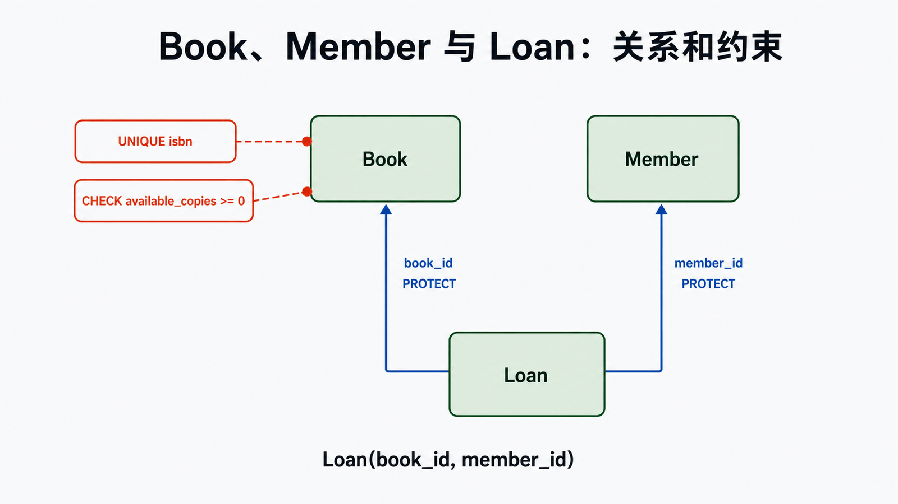
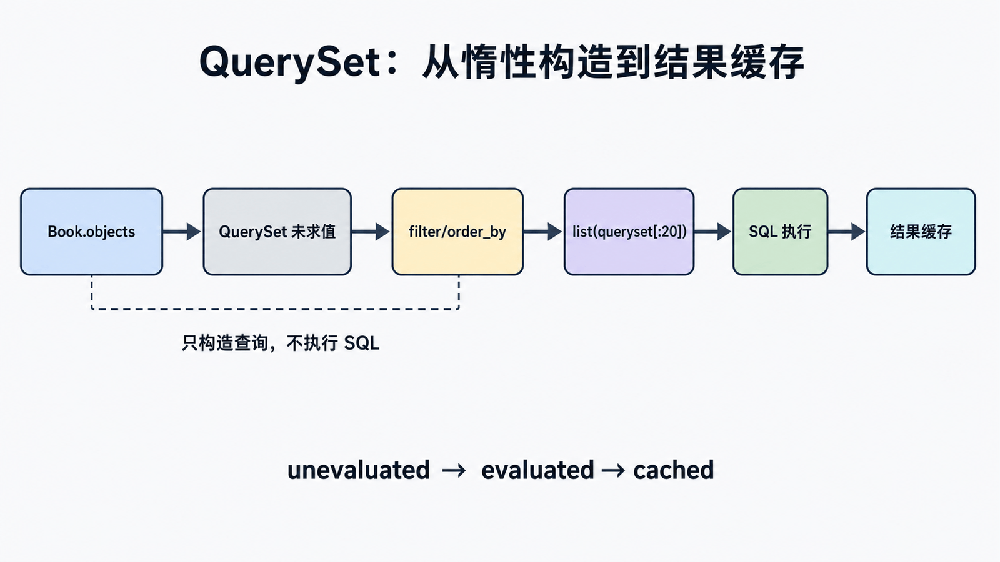

## 前置知识与学习目标

你需要会读基础 SQL，并完成前两篇的 URL、视图和模板。读完后应能：

1. 把 `Book`、`Member`、`Loan` 的约束翻译为模型和迁移。
2. 解释 Manager、QuerySet、SQL 与模型实例的关系，以及查询何时真正执行。
3. 完成可预测的 CRUD，并处理不存在、多条结果、并发和删除边界。

本篇只负责 ORM 基础；表达式、事务与关联加载在第 4 篇，性能证据在第 23 篇。

## 直觉：模型是映射，也是约束声明

<!-- figure:s03-f01:start -->



<!-- figure:s03-f01:end -->

ORM 不是“无需理解 SQL”。模型描述表、列和关系，QuerySet 构造查询，数据库仍负责执行、约束和事务。Python 类型检查不能替代数据库的唯一性、外键和检查约束。

<!-- snippet: id=django-orm-core-models mode=project python=3.12-3.14 deps=Django~=6.0 file=catalog/models.py -->

```python
from django.conf import settings
from django.db import models


class Book(models.Model):
    title = models.CharField(max_length=200, db_index=True)
    isbn = models.CharField(max_length=13, unique=True)
    available_copies = models.PositiveIntegerField(default=0)
    is_active = models.BooleanField(default=True)

    class Meta:
        ordering = ["title", "id"]
        constraints = [
            models.CheckConstraint(
                condition=models.Q(available_copies__gte=0),
                name="book_available_copies_gte_0",
            )
        ]

    def __str__(self):
        return self.title


class Loan(models.Model):
    member = models.ForeignKey(settings.AUTH_USER_MODEL, on_delete=models.PROTECT)
    book = models.ForeignKey(Book, on_delete=models.PROTECT, related_name="loans")
    borrowed_at = models.DateTimeField(auto_now_add=True)
    returned_at = models.DateTimeField(null=True, blank=True)
```

`on_delete=PROTECT` 表示存在借阅记录时拒绝删除用户或图书；它与“下架”不是一回事，业务通常通过 `is_active=False` 保留历史。`related_name="loans"` 让反向访问统一为 `book.loans.all()`。

## 迁移：状态变化要可审阅

```bash
python manage.py makemigrations catalog
python manage.py sqlmigrate catalog 0001
python manage.py migrate
python manage.py check
```

`makemigrations` 根据模型状态生成迁移文件，`migrate` 按依赖应用它。先审阅 `sqlmigrate` 和迁移计划；生产中的大表加列、建索引和回填数据可能锁表或耗时，不能因为命令简短就忽略发布风险。

## Manager、QuerySet 与惰性求值

<!-- figure:s03-f02:start -->



<!-- figure:s03-f02:end -->

`Book.objects` 是 Manager；`filter()` 返回可继续组合的 QuerySet。构造、过滤和排序通常不立即访问数据库，迭代、`list()`、`len()`、`bool()`、序列化或需要单值的操作才触发求值。

<!-- snippet: id=django-orm-core-queryset mode=project python=3.12-3.14 deps=Django~=6.0 -->

```python
queryset = Book.objects.filter(is_active=True).order_by("title", "id")
print(queryset.query)       # 观察 SQL 形状，不执行结果查询
first_page = list(queryset[:20])  # 此处执行带 LIMIT 的查询
```

QuerySet 被求值后会缓存结果；重新调用 `.all()` 可得到新的 QuerySet。不要把长寿命 QuerySet 当实时数据容器，也不要在模板循环里无意触发关联查询。

## CRUD：明确返回值与失败路径

```python
book = Book.objects.create(title="Django Internals", isbn="9780000000001")

book = Book.objects.get(pk=book.pk)  # 0 条抛 DoesNotExist，多条抛 MultipleObjectsReturned
books = Book.objects.filter(title__icontains="django")  # 0 条得到空 QuerySet

updated = Book.objects.filter(pk=book.pk).update(is_active=False)
deleted_count, details = Book.objects.filter(pk=book.pk).delete()
```

`create()` 返回实例；`update()` 返回匹配行数且不调用模型 `save()`；`delete()` 返回删除总数和按模型统计。若业务依赖自定义 `save()`、信号或逐对象校验，批量操作的语义不同。读后改写还存在并发窗口，需在第 4 篇使用事务和行锁。

## 常见误区与适用边界

- `null` 是数据库空值，`blank` 是表单验证选项；字符串字段通常用空串而非 `NULL`，除非有明确语义。
- `get()` 不是“取第一条”；若结果不唯一会抛异常。
- `save()` 默认可能更新多列，明确修改范围时使用 `update_fields`，但仍要考虑并发语义。
- 迁移文件是部署历史，已共享后不要随意删除或重写。
- QuerySet 惰性不是自动性能保证；查询数量和执行计划留到第 23 篇测量。

## 最小验证

在测试数据库中运行迁移，创建一本书，验证重复 ISBN 被唯一约束拒绝、负库存被检查约束拒绝、存在 Loan 时删除 Book 被保护。用 `assertNumQueries(1)` 验证一个简单列表只执行一次主查询。

## 自检题

1. `filter()` 与 `get()` 在零结果时有什么不同？
2. 为什么 `available_copies >= 0` 既要业务校验又要数据库约束？
3. `queryset = Book.objects.all()` 是否立即查询数据库？

<details><summary>答案</summary>

1. `filter()` 返回空 QuerySet，`get()` 抛 `DoesNotExist`。2. 业务校验给出友好错误，数据库约束保护所有写入路径和并发遗漏。3. 通常不会，直到发生求值操作。

</details>

## 本篇总结与下一篇

模型声明结构与约束，Manager 产生 QuerySet，数据库执行最终 SQL。下一篇在不重复这些基础的前提下，使用表达式、聚合、关联加载、事务和锁实现原子借阅。

## 资料来源

- [Django 模型](https://docs.djangoproject.com/en/6.0/topics/db/models/)
- [QuerySet API](https://docs.djangoproject.com/en/6.0/ref/models/querysets/)
- [迁移](https://docs.djangoproject.com/en/6.0/topics/migrations/)
