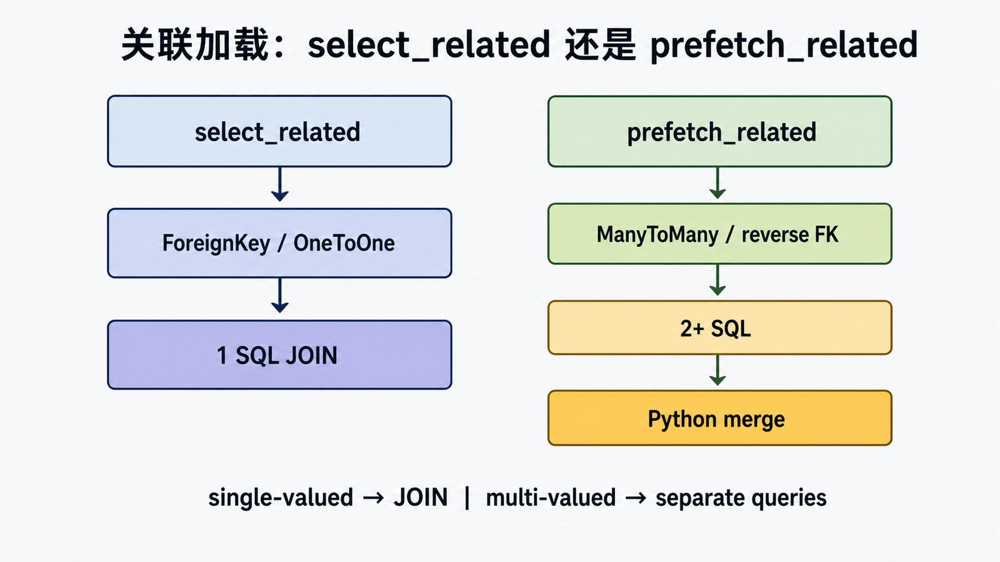
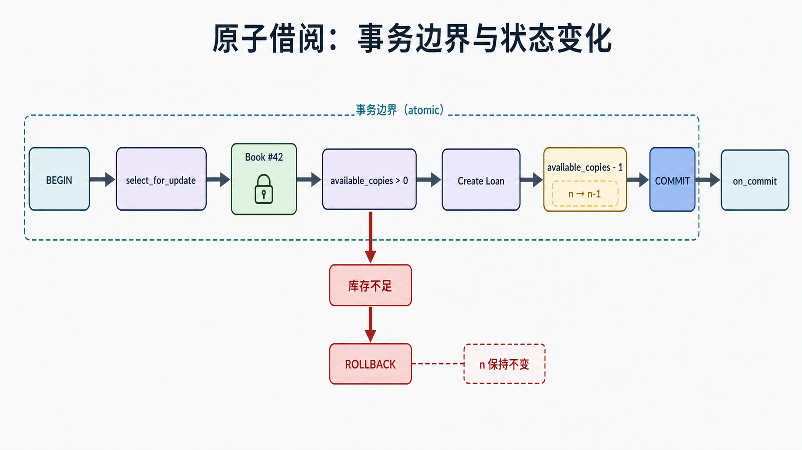

## 前置知识与学习目标

你需要掌握第 3 篇的模型、关系、Manager、QuerySet 与惰性求值。读完后应能：

1. 用 `Q`、`F`、`annotate()` 表达数据库端条件与计算。
2. 根据关系方向选择 `select_related()` 或 `prefetch_related()`。
3. 用 `transaction.atomic()`、`select_for_update()` 和约束保证借阅操作原子性。

本篇关注“复杂语义是否正确”，不把所有 API 变成性能技巧；性能必须在第 23 篇用证据判断。

## 数据库端表达式：避免读改写竞态

`Q` 组合 AND/OR/NOT 条件，`F` 引用当前行字段，让比较与更新发生在数据库端。

<!-- snippet: id=django-orm-advanced-expressions mode=project python=3.12-3.14 deps=Django~=6.0 -->

```python
from django.db.models import Count, F, Q

available = Book.objects.filter(Q(is_active=True) & Q(available_copies__gt=0))
popular = Book.objects.annotate(
    open_loans=Count("loans", filter=Q(loans__returned_at__isnull=True))
).filter(open_loans__gte=3)

updated = Book.objects.filter(pk=42, available_copies__gt=0).update(
    available_copies=F("available_copies") - 1
)
```

最后一个条件更新把“库存大于零”和“减一”放在同一 SQL 中，`updated == 0` 表示图书不存在或库存不足。与先读取 Python 值再保存相比，它缩小了并发窗口；多表写入仍需事务。

## 关联加载：两种机制，不是两个魔法开关

<!-- figure:s04-f01:start -->



<!-- figure:s04-f01:end -->

`select_related()` 对外键和一对一关系使用 SQL JOIN，适合单值关系；`prefetch_related()` 先执行主查询，再执行关联查询并在 Python 中合并，适合多值关系、反向外键和多对多。

```python
from django.db.models import Prefetch

open_loans = Loan.objects.filter(returned_at__isnull=True).select_related("member")
books = Book.objects.prefetch_related(
    Prefetch("loans", queryset=open_loans, to_attr="open_loans")
)
```

输出中每个 `book.open_loans` 是预取列表。主查询和预取查询之间并非一个原子快照；强一致读取需要结合数据库隔离级别和事务判断。不要同时调用 `.loans.filter(...)` 并期待复用 `to_attr` 的列表。

## 原子借阅：调用链与状态变化

<!-- figure:s04-f02:start -->



<!-- figure:s04-f02:end -->

输入为 `member_id`、`book_id`；成功输出 `Loan`，中间状态是被锁定的 `Book` 行；失败包括图书不存在、库存不足、约束冲突和事务回滚。

<!-- snippet: id=django-orm-advanced-borrow mode=project python=3.12-3.14 deps=Django~=6.0 file=loans/services.py -->

```python
from django.db import transaction

from catalog.models import Book
from .models import Loan


class OutOfStock(Exception):
    pass


@transaction.atomic
def borrow_book(*, member, book_id):
    book = Book.objects.select_for_update().get(pk=book_id, is_active=True)
    if book.available_copies < 1:
        raise OutOfStock(book_id)
    loan = Loan.objects.create(member=member, book=book)
    book.available_copies -= 1
    book.save(update_fields=["available_copies"])
    return loan
```

`atomic()` 成功时提交，异常越过边界时回滚。`select_for_update()` 必须在事务中使用，支持范围依数据库而异；SQLite 不能代表生产数据库的锁行为。发送邮件、发布任务等外部副作用应放入 `transaction.on_commit()`，避免数据库回滚后外部系统已经收到“成功”消息。

## 聚合、子查询与结果形状

`annotate()` 给当前结果的每一行增加计算列，`aggregate()` 把整个 QuerySet 汇总成一个字典。过滤和注解顺序会改变 SQL 与结果。复杂查询应先写出期望表格：一行代表 Book 还是 Loan？聚合前后基数是否变化？再检查 `str(queryset.query)` 与测试数据结果。

## 常见误区与适用边界

- `atomic()` 不会自动锁住所有读取；需要按竞争资源选择条件更新或行锁。
- 捕获数据库异常时不要在同一 `atomic` 块中继续查询，应该让异常越过该保存点后再处理。
- `select_related()` 不适合多值集合，`prefetch_related()` 也不是越多越好。
- 批量 `update()`/`bulk_create()` 不走逐对象 `save()` 语义，信号和默认值行为需查 API 合同。
- 事务越长，锁持有越久；不要把网络请求放在事务内。

## 最小行为测试

使用与生产相同的数据库后端测试：库存 1 时第一次借阅成功、第二次失败且库存不为负；创建 Loan 失败时库存回滚；`on_commit` 回调只在提交后执行；预取列表只包含未归还记录。并发测试需要两个真实连接，普通 `TestCase` 的外层事务可能掩盖行为。

## 自检题

1. `F("available_copies") - 1` 为什么比 Python 读改写更安全？
2. 预取多值关系为什么不能用 `select_related()`？
3. 为什么发送邮件应放到 `on_commit()`？

<details><summary>答案</summary>

1. 比较和更新可在数据库的一条条件语句中完成。2. JOIN 会放大行数，Django 用独立查询在 Python 中合并集合。3. 防止数据库回滚后外部副作用已经发生。

</details>

## 本篇总结与下一篇

高级 ORM 的重点是结果基数、事务边界和并发状态，而不是 API 数量。下一篇沿 `GET /books/42/` 追踪从服务器入口到响应返回的完整生命周期。

## 资料来源

- [查询表达式](https://docs.djangoproject.com/en/6.0/ref/models/expressions/)
- [数据库事务](https://docs.djangoproject.com/en/6.0/topics/db/transactions/)
- [QuerySet 关联加载 API](https://docs.djangoproject.com/en/6.0/ref/models/querysets/)
