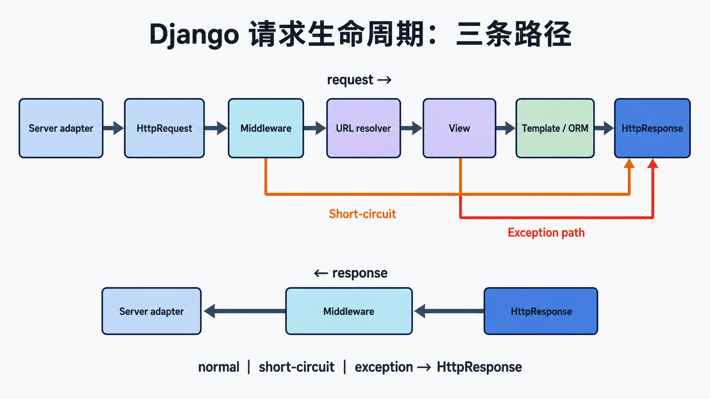

## 前置知识与学习目标

你需要掌握 URLconf、视图、模板和 ORM。读完后应能：

1. 画出服务器接口、handler、中间件、resolver、view 与 response 的调用链。
2. 说明 `HttpRequest`、URL 参数、数据库结果和 `HttpResponse` 在何处产生。
3. 区分正常、短路与异常路径，并用日志定位请求停在哪一层。

贯穿请求为 `GET /books/42/?format=html`。本篇解释框架链路；WSGI/ASGI 协议细节在第 6 篇，中间件扩展在第 10 篇。

## 总览：一次请求有三条路径

<!-- figure:s05-f01:start -->



<!-- figure:s05-f01:end -->

```text
Server adapter -> HttpRequest -> middleware(request)
  -> URL resolver -> view -> template/ORM -> HttpResponse
  -> middleware(response) -> server adapter
```

短路路径在某个中间件直接返回响应，不再进入 URL 与视图；异常路径把未处理异常交给异常中间件或框架错误响应。调试时先判断走的是哪条路径，再深入模块。

## 1. 服务器接口适配

WSGI 服务器传入 `environ` 与 `start_response`，ASGI 服务器传入 `scope`、`receive`、`send`。Django 的 WSGI/ASGI application 把协议对象适配成框架请求，再交给 handler。此时请求还没有匹配视图。

## 2. 建立 HttpRequest

请求对象包含 method、path、headers、GET、body、FILES 等。body 可能是流式输入，读取成本和大小必须受限。Session 与 `request.user` 不是原始 HTTP 字段，而是相应中间件在请求经过时附加的状态，因此中间件顺序会影响属性是否可用。

## 3. 构造中间件链

启动时 Django 按 `MIDDLEWARE` 构造嵌套 callable；请求按列表从上到下进入，响应反向返回。某层返回 `HttpResponse` 就形成短路。框架不会在每次请求重新导入中间件类。

## 4. URL 解析与视图调用

resolver 从根 URLconf 开始匹配 path，并产生 view callable、位置参数、命名参数和路由名。查询字符串不参与 path 匹配。

<!-- snippet: id=django-request-url-view mode=project python=3.12-3.14 deps=Django~=6.0 -->

```python
# catalog/urls.py
from django.urls import path
from . import views

urlpatterns = [path("books/<int:book_id>/", views.book_detail, name="book-detail")]

# catalog/views.py
from django.shortcuts import get_object_or_404, render
from .models import Book

def book_detail(request, book_id):
    book = get_object_or_404(Book, pk=book_id, is_active=True)
    return render(request, "catalog/book_detail.html", {"book": book})
```

`book_id=42` 来自 path converter，`format=html` 位于 `request.GET`。`get_object_or_404()` 在无结果时抛 `Http404`，框架将其转换为 404 响应；它不是数据库错误。

## 5. 模板与响应

`render()` 选择模板引擎，构造 context，渲染为字符串并返回 `HttpResponse`。模板访问惰性关系时可能在此触发 SQL，因此“视图函数已经返回”不等于所有数据库工作都提前完成。流式响应和文件响应有不同的迭代与关闭边界，不能假设 body 已全部驻留内存。

## 6. 响应回程与资源关闭

响应按中间件链反向经过安全头、压缩、会话保存等处理，随后由协议适配层写出状态、headers 和 body。响应关闭阶段会释放文件或请求完成资源。客户端断开并不保证服务器端工作立即取消，长任务不应依赖请求连接存活。

## 最小追踪实验

编写只记录 `request_id`、method、path、status、duration_ms 的中间件；在视图、模板和数据库查询处加入同一关联 ID。分别请求存在图书、不存在图书、未认证页面和被中间件短路的路径，观察进入/退出顺序。日志禁止记录 Cookie、Authorization 或完整请求体。

## 常见误区与适用边界

- `manage.py` 是命令入口，不是每个 HTTP 请求的入口。
- URL 解析不读取查询字符串。
- 404、403、业务冲突和 500 是不同失败类别，不应统一吞成 200。
- 不要依赖私有 handler 方法作为稳定扩展 API；用中间件、视图、信号等公开扩展点。
- 慢响应可能来自模板触发的惰性查询、外部 I/O 或响应序列化，不能只看视图函数行数。

## 自检题

1. 为什么 `request.user` 不是服务器适配层直接创建的？
2. 查询参数 `?format=json` 为什么不会命中另一条 path？
3. 中间件直接返回 403 后，视图是否还会执行？

<details><summary>答案</summary>

1. 它由认证中间件结合会话附加。2. resolver 只匹配 path。3. 不会，该层短路后进入响应回程。

</details>

## 本篇总结与下一篇

请求生命周期是一条可短路、可异常转换的嵌套调用链。下一篇下沉到 WSGI callable，明确服务器与 Django application 交换的对象，并对比 ASGI。

## 资料来源

- [Django 请求与响应对象](https://docs.djangoproject.com/en/6.0/ref/request-response/)
- [URL dispatcher](https://docs.djangoproject.com/en/6.0/topics/http/urls/)
- [中间件](https://docs.djangoproject.com/en/6.0/topics/http/middleware/)
