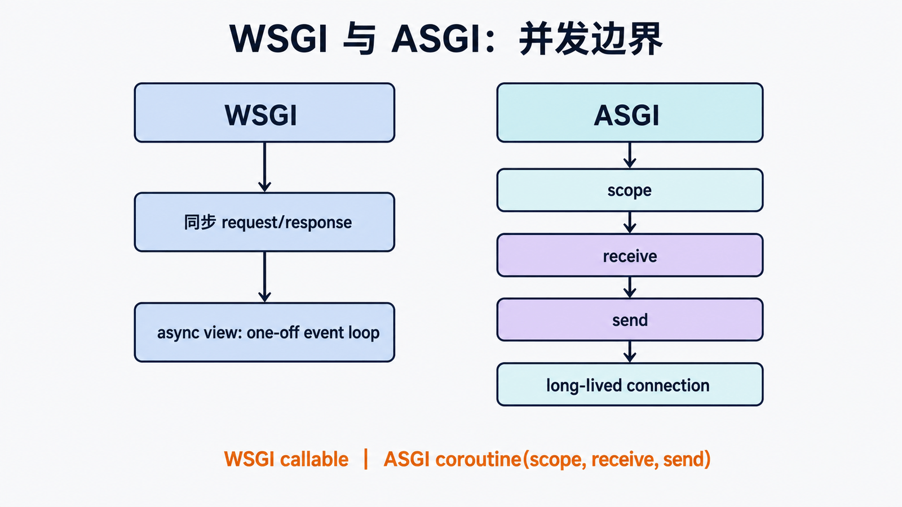

## 前置知识与学习目标

你需要理解 Python callable、HTTP 状态/头/body 和第 5 篇的请求生命周期。读完后应能：

1. 写出符合 PEP 3333 的最小 WSGI application。
2. 解释 `environ`、`start_response` 与返回字节迭代器的方向和约束。
3. 判断同步请求适合 WSGI，何时必须考虑 ASGI。

## WSGI 解决的唯一核心问题

<!-- figure:s06-f01:start -->

![WSGI Server 以 environ 和 start_response 调用 application，application 返回 iterable[bytes]](./images/s06-f01-wsgi-callable-contract.png)

<!-- figure:s06-f01:end -->

WSGI 是 Python Web 服务器与同步 Web 应用之间的接口合同。服务器负责 socket、HTTP 解析和并发模型；应用读取标准化环境，调用 `start_response()` 设置状态与响应头，并返回产生 bytes 的可迭代对象。它不规定路由、模板、数据库或部署进程数。

```text
Server -- environ,start_response --> application
Server <-- status,headers + iterable[bytes] -- application
```

## 最小可运行 application

<!-- snippet: id=django-wsgi-minimal-app mode=compile python=3.12-3.14 deps=stdlib -->

```python
def application(environ, start_response):
    method = environ["REQUEST_METHOD"]
    path = environ.get("PATH_INFO", "/")
    body = f"{method} {path}\n".encode("utf-8")
    start_response(
        "200 OK",
        [("Content-Type", "text/plain; charset=utf-8"),
         ("Content-Length", str(len(body)))],
    )
    return [body]
```

输入是两个参数，输出是字节可迭代对象。不能返回 `str`；`Content-Length` 以 bytes 长度计算。服务器应在完成后调用 iterable 的 `close()`（若存在）。错误发生在 headers 已发送前后，处理策略不同；不要手写生产服务器来学习后直接上线。

## environ 中的重要边界

`REQUEST_METHOD`、`PATH_INFO`、`QUERY_STRING`、`SERVER_NAME` 等来自 CGI 风格变量；`wsgi.input` 是请求体字节流；`wsgi.url_scheme` 指示 http/https；`wsgi.errors` 用于错误输出。缺失的可选 CGI 变量应省略而不是伪造。代理后的 Host、scheme 和客户端 IP 只有在可信代理正确重写并由 Django 安全配置时才可信。

## Django 的 WSGI application

`startproject` 生成 `config/wsgi.py`：它设置 `DJANGO_SETTINGS_MODULE`，再调用 `get_wsgi_application()`。应用服务器配置的目标通常是 `config.wsgi:application`。这个对象把 `environ` 适配成 `WSGIRequest`，进入第 5 篇的中间件与 URL 链，再把 `HttpResponse` 转回 WSGI 状态、头和字节迭代器。

<!-- snippet: id=django-wsgi-entry mode=project python=3.12-3.14 deps=Django~=6.0 file=config/wsgi.py -->

```python
import os
from django.core.wsgi import get_wsgi_application

os.environ.setdefault("DJANGO_SETTINGS_MODULE", "config.settings")
application = get_wsgi_application()
```

环境变量是进程级状态；同一进程承载多个站点时必须避免互相覆盖设置模块。

## WSGI 与 ASGI 的选择

<!-- figure:s06-f02:start -->



<!-- figure:s06-f02:end -->

WSGI 是同步调用合同。Django 可在 WSGI 下运行 async view，但会使用一次性事件循环，无法提供完整异步栈的长连接优势。ASGI 使用 `scope`、`receive`、`send`，支持异步服务器和长连接场景。选择 ASGI 后仍要检查同步中间件、ORM 调用和第三方库，否则上下文切换会抵消收益。

## 常见误区与适用边界

- WSGI 不是某个服务器；Gunicorn、uWSGI 等都可承载 WSGI application。
- `start_response()` 返回的旧式 `write()` callable 只为兼容，应用应返回 iterable。
- `environ` 不是任意字符串字典，其中请求体是文件状字节流。
- 反向代理头不是天然可信，必须限定可信代理链。
- WebSocket、长轮询和大量异步 I/O 不应勉强塞进 WSGI 心智模型。

## 最小验证

用标准库 `wsgiref.simple_server` 本地承载最小应用，分别请求 Unicode path、查询字符串与 POST body，确认 path/query/body 的来源不同、响应元素都是 bytes。该服务器只用于学习验证。

## 自检题

1. WSGI application 为什么返回 bytes 而不是 str？
2. `QUERY_STRING` 是否包含开头的 `?`？
3. async view 在 WSGI 下为什么不等于完整异步部署？

<details><summary>答案</summary>

1. HTTP body 是字节，编码必须由应用明确。2. 不包含。3. WSGI 是同步合同，Django 需为 async view 建立一次性事件循环，且同步组件仍会阻塞。

</details>

## 本篇总结与下一篇

WSGI 把服务器和同步应用解耦，核心只有调用方向、标准环境和字节响应。下一篇回到框架扩展点，判断信号何时能解耦事件通知、何时会隐藏控制流。

## 资料来源

- [PEP 3333](https://peps.python.org/pep-3333/)
- [Django WSGI 部署](https://docs.djangoproject.com/en/6.0/howto/deployment/wsgi/)
- [Django ASGI 部署](https://docs.djangoproject.com/en/6.0/howto/deployment/asgi/)
