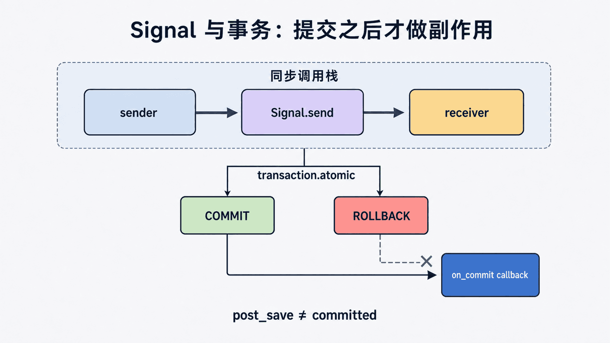

## 前置知识与学习目标

你需要理解模型保存、app 加载和事务。读完后应能解释 sender → signal → receiver 的同步分发，正确注册 receiver，并判断何时改用显式服务调用或任务队列。贯穿事件是“Loan 创建后记录审计”，核心借阅与扣库存仍保持显式调用。

## 信号简介

Django提供一种信号机制。其实就是观察者模式，又叫发布-订阅(Publish/Subscribe)。当发生一些动作的时候，发出信号，然后监听了这个信号的函数就会执行。

通俗来讲，就是一些动作发生的时候，信号允许特定的发送者去提醒一些接受者。用于在框架执行操作时解耦。

## Django内置信号

### Model signals

- `pre_init`：django的model执行其构造方法前，自动触发
- `post_init`：django的model执行其构造方法后，自动触发
- `pre_save`：django的model对象保存前，自动触发
- `post_save`：django的model对象保存后，自动触发
- `pre_delete`：django的model对象删除前，自动触发
- `post_delete`：django的model对象删除后，自动触发
- `m2m_changed`：django的model中使用m2m字段操作第三张表（add, remove, clear）前后，自动触发
- `class_prepared`：程序启动时，检测已注册的app中model类，对于每一个类，自动触发

### Management signals

- `pre_migrate`：执行migrate命令前，自动触发
- `post_migrate`：执行migrate命令后，自动触发

### Request/response signals

- `request_started`：请求到来前，自动触发
- `request_finished`：请求结束后，自动触发
- `got_request_exception`：请求异常后，自动触发

### Test signals

- `setting_changed`：使用test测试修改配置文件时，自动触发
- `template_rendered`：使用test测试渲染模板时，自动触发

### Database Wrappers

- `connection_created`：创建数据库连接时，自动触发

### 内置信号说明

Django提供了一系列的内建信号，允许用户的代码获得Django的特定操作的通知：

- `django.db.models.signals.pre_save`和`django.db.models.signals.post_save`：在模型`save()`方法调用之前或之后发送
- `django.db.models.signals.pre_delete`和`django.db.models.signals.post_delete`：在模型`delete()`方法或查询集的`delete()`方法调用之前或之后发送
- `django.db.models.signals.m2m_changed`：模型上的`ManyToManyField`修改时发送
- `django.core.signals.request_started`和`django.core.signals.request_finished`：Django建立或关闭HTTP请求时发送

## 内置信号的使用

对于Django内置的信号，仅需注册指定信号，当程序执行相应操作时，自动触发注册函数：

### 方式一：导入信号

<!-- snippet: id=django-signals-01 mode=compile python=3.12-3.14 deps=Django==6.0.7 -->

```python
from django.core.signals import request_finished
from django.core.signals import request_started
from django.core.signals import got_request_exception
from django.db.models.signals import class_prepared
from django.db.models.signals import pre_init, post_init
from django.db.models.signals import pre_save, post_save
from django.db.models.signals import pre_delete, post_delete
from django.db.models.signals import m2m_changed
from django.db.models.signals import pre_migrate, post_migrate
from django.test.signals import setting_changed
from django.test.signals import template_rendered
from django.db.backends.signals import connection_created
```

放到`__init__`里：

<!-- snippet: id=django-signals-02 mode=compile python=3.12-3.14 deps=Django==6.0.7 -->

```python
from django.db.models.signals import pre_save
import logging

def callBack(sender, **kwargs):
    print(sender)
    print(kwargs)
    # 创建对象写日志
    logging.basicConfig(level=logging.DEBUG)
    logging.debug('%s创建了一个%s对象' % (sender._meta.model_name, kwargs.get('instance').title))

pre_save.connect(callBack)
```

### 方式二：使用装饰器

<!-- snippet: id=django-signals-03 mode=compile python=3.12-3.14 deps=Django==6.0.7 -->

```python
from django.db.models.signals import pre_save
from django.dispatch import receiver

@receiver(pre_save)
def my_callback(sender, **kwargs):
    print("对象创建成功")
    print(sender)
    print(kwargs)
```

## 自定义信号

### 1. 定义信号

一般创建一个py文件，`toppings`和`size`是接受的参数：

<!-- snippet: id=django-signals-04 mode=compile python=3.12-3.14 deps=Django==6.0.7 -->

```python
import django.dispatch

pizza_done = django.dispatch.Signal(providing_args=["toppings", "size"])
```

### 2. 注册信号

<!-- snippet: id=django-signals-05 mode=compile python=3.12-3.14 deps=stdlib -->

```python
def callback(sender, **kwargs):
    print("callback")
    print(sender, kwargs)

pizza_done.connect(callback)
```

### 3. 触发信号

<!-- snippet: id=django-signals-06 mode=compile python=3.12-3.14 deps=stdlib -->

```python
from 路径 import pizza_done

pizza_done.send(sender='seven', toppings=123, size=456)
```

由于内置信号的触发者已经集成到Django中，所以其会自动调用，而对于自定义信号则需要开发者在任意位置触发。

**练习**：数据库添加一条记录时生成一个日志记录。

## 源码分析

Django中的signals和操作系统（linux）中的signal完全是两会事，后者的signal是软件中断，提供一种处理异步事件的方法，信号是系统定义好的，可用作进程间传递消息得一种方法，而django中的信号只是一个普通的类，不能跨进程，看其代码更像一个callback。

django signal类定义在`django/dispatch/dispatch.py`中：

<!-- snippet: id=django-signals-07 mode=compile python=3.12-3.14 deps=stdlib -->

```python
class Signal(object):

    def __init__(self, providing_args=None):
        # providing_args 定义receiver调用参数格式，为None也没关系
        self.receivers = []
        ...

    def connect(self, receiver, sender=None, weak=True, dispatch_uid=None):
        # 看清楚了，其实就是把receiver保存起来，receiver是一个函数对象，就是该signal的handler
        ...
        if dispatch_uid:
            lookup_key = (dispatch_uid, _make_id(sender))
        else:
            lookup_key = (_make_id(receiver), _make_id(sender))
        ...
        self.lock.acquire()
        try:
            for r_key, _ in self.receivers:
                if r_key == lookup_key:
                    break
            else:
                self.receivers.append((lookup_key, receiver))
        finally:
            self.lock.release()

    def disconnect(self, receiver=None, sender=None, weak=True, dispatch_uid=None):
        # 取消connect，把receiver从self.receivers删除就行了
        ...

    def send(self, sender, **named):
        # 在事件发生时调用，发出信号，如有receiver connect该信号，则调用之
        responses = []
        if not self.receivers:
            return responses
        for receiver in self._live_receivers(_make_id(sender)):
            response = receiver(signal=self, sender=sender, **named)
            responses.append((receiver, response))
        return responses

    def send_robust(self, sender, **named):
        # 基本同上
        ...

    def _live_receivers(self, senderkey):
        # 从self.receivers中找出相应的receiver
        ...

    def _remove_receiver(self, receiver):
        """Remove dead receivers from connections."""
        ...
```

## 事务、副作用与注册边界

<!-- figure:s07-f01:start -->



<!-- figure:s07-f01:end -->

receiver 默认在发送者调用栈中同步执行；一个慢 receiver 会让原请求变慢，异常也可能中断主流程。需要在数据库提交后发送通知时，应使用 `transaction.on_commit()`，而不是把 `post_save` 误当成“事务已经提交”。

receiver 通常在 `AppConfig.ready()` 中导入注册；`ready()` 可能在测试、命令和重载中多次执行，应使用稳定模块导入或 `dispatch_uid` 防重复。局部函数作为 receiver 时，还要理解默认弱引用可能被垃圾回收。

## 常见误区与适用边界

- 信号适合审计、缓存失效等横切通知，不适合隐藏关键业务顺序。
- `send()` 不是队列：没有持久化、重试、隔离或跨进程消费。
- `post_save` 可能来自脚本、Admin 或测试，receiver 不能假设存在 HTTP request。
- bulk 操作是否触发模型信号必须按 API 合同验证。

## 最小验证

测试 receiver 只注册一次、正确筛选 sender、事务回滚时不发外部通知、receiver 异常策略明确。

## 自检题

1. 信号为何会隐藏控制流？
2. `post_save` 为何不等于事务已提交？
3. 何时应使用任务队列？

<details><summary>答案</summary>

1. 调用方看不到所有 receiver。2. 外层事务仍可能回滚。3. 需要跨进程、持久化、重试或隔离耗时任务时。

</details>

## 本篇总结、衔接与资料来源

信号是同步进程内通知，不是核心业务编排器。下一篇用显式缓存键和失效策略处理热门书籍读取。

- [Django signals](https://docs.djangoproject.com/en/6.0/topics/signals/)
- [事务 on_commit](https://docs.djangoproject.com/en/6.0/topics/db/transactions/#performing-actions-after-commit)
