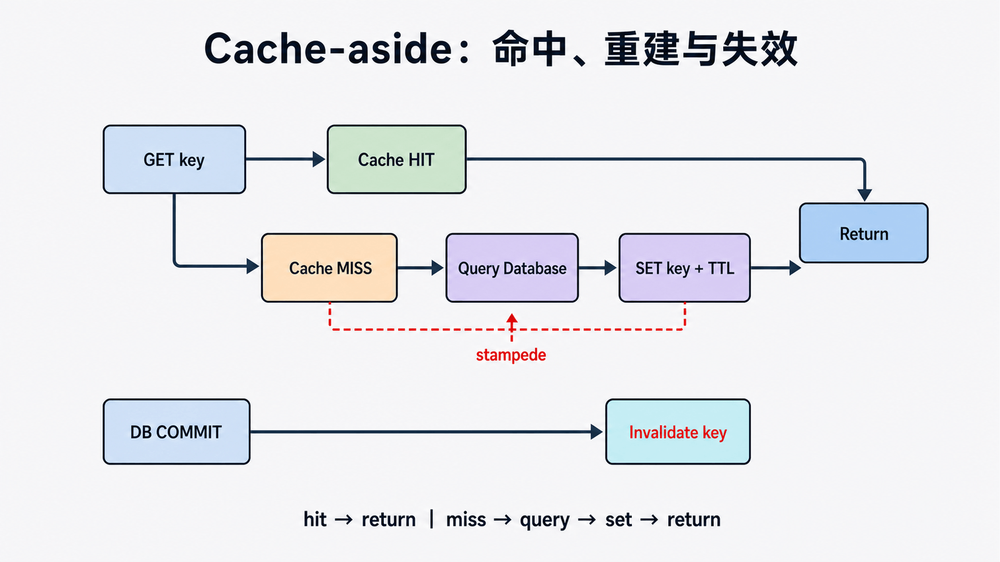

## 前置知识与学习目标

你需要理解 QuerySet、HTTP 响应和一致性。读完后应能从热门书籍列表选择站点级、视图级、模板片段或低层缓存；设计包含版本、租户和参数的键；解释 TTL、主动失效、击穿与多进程一致性。

## 缓存介绍

在动态网站中，用户所有的请求，服务器都会去数据库中进行相应的增、删、查、改、渲染模板、执行业务逻辑，最后生成用户看到的页面。

当一个网站的用户访问量很大的时候，每一次的后台操作都会消耗很多的服务端资源，所以必须使用缓存来减轻后端服务器的压力。

缓存是将一些常用的数据保存内存或者memcache中，在一定的时间内有人来访问这些数据时，则不再去执行数据库及渲染等操作，而是直接从内存或memcache的缓存中去取得数据，然后返回给用户。

## Django中的6种缓存方式

- 开发调试缓存
- 内存缓存
- 文件缓存
- 数据库缓存
- Memcache缓存（使用python-memcached模块）
- Memcache缓存（使用pylibmc模块）

经常使用的有文件缓存和Memcache缓存。

## Django6种缓存的配置

### 开发调试（此模式为开发调试使用，实际上不执行任何操作）

<!-- snippet: id=django-cache-mechanism-01 mode=compile python=3.12-3.14 deps=stdlib -->

```python
CACHES = {
    'default': {
        'BACKEND': 'django.core.cache.backends.dummy.DummyCache',  # 缓存后台使用的引擎
        'TIMEOUT': 300,  # 缓存超时时间（默认300秒，None表示永不过期，0表示立即过期）
        'OPTIONS': {
            'MAX_ENTRIES': 300,  # 最大缓存记录的数量（默认300）
            'CULL_FREQUENCY': 3,  # 缓存到达最大个数之后，剔除缓存个数的比例，即：1/CULL_FREQUENCY（默认3）
        },
    }
}
```

### 内存缓存（将缓存内容保存至内存区域中）

<!-- snippet: id=django-cache-mechanism-02 mode=compile python=3.12-3.14 deps=stdlib -->

```python
CACHES = {
    'default': {
        'BACKEND': 'django.core.cache.backends.locmem.LocMemCache',  # 指定缓存使用的引擎
        'LOCATION': 'unique-snowflake',  # 写在内存中的变量的唯一值
        'TIMEOUT': 300,  # 缓存超时时间（默认为300秒，None表示永不过期）
        'OPTIONS': {
            'MAX_ENTRIES': 300,  # 最大缓存记录的数量（默认300）
            'CULL_FREQUENCY': 3,  # 缓存到达最大个数之后，剔除缓存个数的比例，即：1/CULL_FREQUENCY（默认3）
        }
    }
}
```

### 文件缓存（把缓存数据存储在文件中）

<!-- snippet: id=django-cache-mechanism-03 mode=compile python=3.12-3.14 deps=stdlib -->

```python
CACHES = {
    'default': {
        'BACKEND': 'django.core.cache.backends.filebased.FileBasedCache',  # 指定缓存使用的引擎
        'LOCATION': '/var/tmp/django_cache',  # 指定缓存的路径
        'TIMEOUT': 300,  # 缓存超时时间（默认为300秒，None表示永不过期）
        'OPTIONS': {
            'MAX_ENTRIES': 300,  # 最大缓存记录的数量（默认300）
            'CULL_FREQUENCY': 3,  # 缓存到达最大个数之后，剔除缓存个数的比例，即：1/CULL_FREQUENCY（默认3）
        }
    }
}
```

### 数据库缓存（把缓存数据存储在数据库中）

<!-- snippet: id=django-cache-mechanism-04 mode=compile python=3.12-3.14 deps=stdlib -->

```python
CACHES = {
    'default': {
        'BACKEND': 'django.core.cache.backends.db.DatabaseCache',  # 指定缓存使用的引擎
        'LOCATION': 'cache_table',  # 数据库表
        'OPTIONS': {
            'MAX_ENTRIES': 300,  # 最大缓存记录的数量（默认300）
            'CULL_FREQUENCY': 3,  # 缓存到达最大个数之后，剔除缓存个数的比例，即：1/CULL_FREQUENCY（默认3）
        }
    }
}
```

**注意**：创建缓存的数据库表使用的语句：

<!-- snippet: id=django-cache-mechanism-05 mode=display python=3.12-3.14 deps=stdlib -->

```bash
python manage.py createcachetable
```

### Memcache缓存（使用python-memcached模块连接memcache）

Memcached是Django原生支持的缓存系统。要使用Memcached，需要下载Memcached的支持库python-memcached或pylibmc。

<!-- snippet: id=django-cache-mechanism-06 mode=compile python=3.12-3.14 deps=stdlib -->

```python
CACHES = {
    'default': {
        'BACKEND': 'django.core.cache.backends.memcached.MemcachedCache',  # 指定缓存使用的引擎
        'LOCATION': '192.168.10.100:11211',  # 指定Memcache缓存服务器的IP地址和端口
        'OPTIONS': {
            'MAX_ENTRIES': 300,  # 最大缓存记录的数量（默认300）
            'CULL_FREQUENCY': 3,  # 缓存到达最大个数之后，剔除缓存个数的比例，即：1/CULL_FREQUENCY（默认3）
        }
    }
}
```

LOCATION也可以配置成如下：

<!-- snippet: id=django-cache-mechanism-07 mode=display python=3.12-3.14 deps=stdlib -->

```text
'LOCATION': 'unix:/tmp/memcached.sock',  # 指定局域网内的主机名加socket套接字为Memcache缓存服务器

'LOCATION': [  # 指定一台或多台其他主机ip地址加端口为Memcache缓存服务器
    '192.168.10.100:11211',
    '192.168.10.101:11211',
    '192.168.10.102:11211',
]
```

### Memcache缓存（使用pylibmc模块连接memcache）

<!-- snippet: id=django-cache-mechanism-08 mode=compile python=3.12-3.14 deps=stdlib -->

```python
CACHES = {
    'default': {
        'BACKEND': 'django.core.cache.backends.memcached.PyLibMCCache',  # 指定缓存使用的引擎
        'LOCATION': '192.168.10.100:11211',  # 指定本机的11211端口为Memcache缓存服务器
        'OPTIONS': {
            'MAX_ENTRIES': 300,  # 最大缓存记录的数量（默认300）
            'CULL_FREQUENCY': 3,  # 缓存到达最大个数之后，剔除缓存个数的比例，即：1/CULL_FREQUENCY（默认3）
        },
    }
}
```

LOCATION也可以配置成如下：

<!-- snippet: id=django-cache-mechanism-09 mode=display python=3.12-3.14 deps=stdlib -->

```text
'LOCATION': '/tmp/memcached.sock',  # 指定某个路径为缓存目录

'LOCATION': [  # 分布式缓存，在多台服务器上运行Memcached进程，程序会把多台服务器当作一个单独的缓存，而不会在每台服务器上复制缓存值
    '192.168.10.100:11211',
    '192.168.10.101:11211',
    '192.168.10.102:11211',
]
```

**注意**：Memcached是基于内存的缓存，数据存储在内存中。所以如果服务器死机的话，数据就会丢失，所以Memcached一般与其他缓存配合使用。

## Django中的缓存应用

Django提供了不同粒度的缓存，可以缓存某个页面，可以只缓存一个页面的某个部分，甚至可以缓存整个网站。

### Model定义

<!-- snippet: id=django-cache-mechanism-10 mode=compile python=3.12-3.14 deps=stdlib -->

```python
class Book(models.Model):
    name = models.CharField(max_length=32)
    price = models.DecimalField(max_digits=6, decimal_places=1)
```

### 视图函数使用缓存

<!-- snippet: id=django-cache-mechanism-11 mode=compile python=3.12-3.14 deps=Django==6.0.7 -->

```python
from django.views.decorators.cache import cache_page
import time
from .models import *

@cache_page(15)  # 超时时间为15秒
def index(request):
    t = time.time()  # 获取当前时间
    bookList = Book.objects.all()
    return render(request, "index.html", locals())
```

### 模板中使用缓存

<!-- snippet: id=django-cache-mechanism-12 mode=display python=3.12-3.14 deps=stdlib -->

```html
  .. sidebar .. # 缓存的内容 
```

## Cache-aside 的状态变化

<!-- figure:s08-f01:start -->



<!-- figure:s08-f01:end -->

核心流程是读 key → miss 时查询数据库 → 写入带 TTL 的值 → 返回；写路径先提交数据库，再失效相关 key。缓存值是派生数据，数据库仍是事实来源。键应编码语义版本，例如 `library:v2:popular:{branch_id}:{page}`。

本地内存缓存只在单进程内共享；生产共享后端仍需考虑序列化、连接超时、淘汰和故障降级。

## 常见误区与适用边界

- 固定 TTL 不能解决所有一致性；重要写入应在 `on_commit()` 后失效。
- 并发 miss 可能重复重建，热点需要锁、单飞或提前刷新。
- 不缓存含用户权限的响应，除非键完整包含身份与授权维度。
- `DummyCache` 只用于禁用缓存；旧第三方后端示例应按当前文档核验。

## 最小验证

测试第一次 miss 查询数据库、第二次 hit 不查询、更新后失效、不同分馆/页码不串数据、后端不可用时行为可控。

## 自检题

1. TTL 为什么不能替代主动失效？
2. 本地内存缓存为何多 worker 不一致？
3. 为什么权限必须进入缓存语义？

<details><summary>答案</summary>

1. 过期前仍会读到旧值。2. 每个进程有独立内存。3. 否则可能把一个用户可见内容泄露给另一个用户。

</details>

## 本篇总结、衔接与资料来源

缓存难点是键、失效和并发重建，不是 `get/set`。下一篇建立源码包地图。

- [Django 缓存框架](https://docs.djangoproject.com/en/6.0/topics/cache/)
