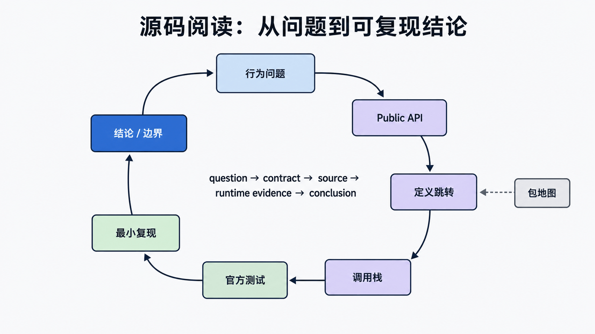

## 前置知识与学习目标

你需要掌握前八篇的公开 API。读完后应能从行为问题出发，经文档、定义跳转、调用栈和测试定位到 `conf`、`core`、`db`、`http`、`urls`、`apps` 等正确包，而不是背目录树。内部实现随版本变化，扩展代码应优先依赖公开接口。

## Django源码结构概览

Django是一个功能完善的Python Web框架，其源码结构清晰模块化。了解源码结构有助于深入理解Django的工作原理。

**Django源码目录位置**：

- 虚拟环境：`venv/lib/python3.x/site-packages/django/`
- 系统安装：`/usr/local/lib/python3.x/dist-packages/django/`

## 主要目录结构

<!-- snippet: id=django-source-code-structure-01 mode=display python=3.12-3.14 deps=stdlib -->

```text
django/
├── __init__.py              # 包初始化
├── apps/                    # 核心应用配置
├── conf/                    # 全局配置
├── core/                    # 核心功能
│   ├── cache/              # 缓存系统
│   ├── files/              # 文件处理
│   ├── handlers/            # 请求处理器
│   ├── mail/                # 邮件系统
│   ├── management/           # 管理命令
│   ├── serializers/         # 数据序列化
│   ├── signals/             # 信号系统
│   └── validators/          # 验证器
├── db/                      # 数据库
│   ├── backends/           # 数据库后端
│   ├── models/             # ORM模型
│   └── migrations/         # 数据迁移
├── forms/                   # 表单处理
├── http/                    # HTTP处理
│   ├── cookies.py          # Cookie处理
│   ├── requests.py         # 请求对象
│   └── responses.py        # 响应对象
├── middleware/              # 中间件
├── template/                # 模板引擎
├── urls/                    # URL路由
└── views/                   # 视图
```

## 核心模块详解

### 1. django/conf - 配置模块

**位置**：`django/conf/`

管理Django的全局配置。

<!-- snippet: id=django-source-code-structure-02 mode=compile python=3.12-3.14 deps=stdlib -->

```python
# django/conf/global_settings.py 部分配置
DEBUG = False
ALLOWED_HOSTS = []
DATABASES = {
    'default': {
        'ENGINE': 'django.db.backends.sqlite3',
        'NAME': '',
    }
}
SECRET_KEY = ''
INSTALLED_APPS = []
MIDDLEWARE = []
ROOT_URLCONF = ''
```

<!-- snippet: id=django-source-code-structure-03 mode=compile python=3.12-3.14 deps=Django==6.0.7 -->

```python
# 使用配置
from django.conf import settings

# 访问配置
print(settings.DEBUG)
print(settings.DATABASES)
```

### 2. django/core - 核心功能

#### 2.1 请求处理器

<!-- snippet: id=django-source-code-structure-04 mode=compile python=3.12-3.14 deps=stdlib -->

```python
# django/core/handlers/base.py
class BaseHandler:
    def load_middleware(self):
        """加载中间件"""
        pass

    def get_response(self, request):
        """处理请求并返回响应"""
        pass
```

#### 2.2 管理命令

<!-- snippet: id=django-source-code-structure-05 mode=compile python=3.12-3.14 deps=Django==6.0.7 -->

```python
# django/core/management/__init__.py
from django.core.management import execute_from_command_line

# 执行管理命令
execute_from_command_line(['manage.py', 'runserver'])
```

### 3. django/db - 数据库模块

#### 3.1 ORM模型

<!-- snippet: id=django-source-code-structure-06 mode=compile python=3.12-3.14 deps=stdlib -->

```python
# django/db/models/query.py
class QuerySet:
    def all(self):
        """返回所有对象"""
        return self.filter()

    def filter(self, *args, **kwargs):
        """过滤查询"""
        return self._filter(*args, **kwargs)

    def get(self, *args, **kwargs):
        """获取单个对象"""
        pass

    def create(self, **kwargs):
        """创建对象"""
        pass

    def exclude(self, *args, **kwargs):
        """排除查询"""
        pass
```

#### 3.2 数据库后端

<!-- snippet: id=django-source-code-structure-07 mode=compile python=3.12-3.14 deps=stdlib -->

```python
# django/db/backends/sqlite3/base.py
class DatabaseWrapper:
    def cursor(self):
        """获取数据库游标"""
        return self.ensure_connection()

    def ensure_connection(self):
        """确保连接存在"""
        if self.connection is None:
            return self.connect()
        return self.connection
```

### 4. django/http - HTTP处理

#### 4.1 请求对象

<!-- snippet: id=django-source-code-structure-08 mode=compile python=3.12-3.14 deps=stdlib -->

```python
# django/http/request.py
class HttpRequest:
    def __init__(self):
        self.method = None
        self.path = ''
        self.GET = QueryDict()
        self.POST = QueryDict()
        self.COOKIES = {}
        self.FILES = MultiValueDict()
        self.META = {}
        self.session = None
        self.user = None

    def get_host(self):
        """获取主机名"""
        pass

    def get_full_path(self):
        """获取完整路径"""
        pass
```

#### 4.2 响应对象

<!-- snippet: id=django-source-code-structure-09 mode=compile python=3.12-3.14 deps=stdlib -->

```python
# django/http/responses.py
class HttpResponse:
    def __init__(self, content='', content_type=None, status=200):
        self.content = content
        self.content_type = content_type
        self.status_code = status

    def __str__(self):
        return self.content
```

## 模块间关系

### 请求处理流程

1. **请求入口**：`django/core/handlers/` 处理HTTP请求
2. **URL路由**：`django/urls/` 将URL映射到视图
3. **视图处理**：`django/views/`执行业务逻辑
4. **模板渲染**：`django/template/` 生成HTML
5. **响应返回**：`django/http/` 返回HTTP响应

### 数据库操作流程

1. **模型定义**：`django/db/models/` 定义数据模型
2. **查询构建**：`QuerySet` 构建数据库查询
3. **SQL生成**：`django/db/backends/` 生成SQL语句
4. **数据库执行**：`DatabaseWrapper` 执行SQL
5. **结果处理**：`Cursor` 处理查询结果

## 常用模块使用

### 配置模块

<!-- snippet: id=django-source-code-structure-10 mode=compile python=3.12-3.14 deps=Django==6.0.7 -->

```python
from django.conf import settings
from django.conf import global_settings

# 获取配置
DEBUG = settings.DEBUG
DATABASES = settings.DATABASES

# 修改配置（不推荐在运行时修改）
settings.DEBUG = True
```

### 数据库模块

<!-- snippet: id=django-source-code-structure-11 mode=compile python=3.12-3.14 deps=Django==6.0.7 -->

```python
from django.db import models
from django.db.models import Q

# 定义模型
class Article(models.Model):
    title = models.CharField(max_length=200)
    content = models.TextField()
    created_at = models.DateTimeField(auto_now_add=True)

    class Meta:
        ordering = ['-created_at']

# 查询
articles = Article.objects.filter(Q(title__icontains='django'))
```

### HTTP模块

<!-- snippet: id=django-source-code-structure-12 mode=compile python=3.12-3.14 deps=Django==6.0.7 -->

```python
from django.http import HttpResponse, JsonResponse
from django.http import HttpRequest

# 返回HTML
def index(request):
    return HttpResponse('<h1>Hello World</h1>')

# 返回JSON
def api(request):
    return JsonResponse({'status': 'ok'})
```

### 视图模块

<!-- snippet: id=django-source-code-structure-13 mode=compile python=3.12-3.14 deps=Django==6.0.7 -->

```python
from django.views import View
from django.shortcuts import render, redirect

class ArticleView(View):
    def get(self, request):
        return render(request, 'article.html')

    def post(self, request):
        return redirect('/')
```

## 源码学习建议

1. **从入口开始**：从`manage.py`开始，了解程序启动流程
2. **理解请求流程**：理解从HTTP请求到响应的完整流程
3. **深入核心模块**：重点学习`conf`、`db`、`http`、`core`模块
4. **阅读测试代码**：Django的测试代码是学习源码的好资源
5. **动手实践**：修改源码并测试，加深理解

## 问题驱动的源码阅读法

<!-- figure:s09-f01:start -->



<!-- figure:s09-f01:end -->

以“`render()` 为什么可能触发 SQL”为例：先查公开合同，再跳转 `django.shortcuts.render`，跟到模板 backend 与 context 渲染，最后用最小测试和调用栈验证。记录输入、输出、状态与异常，不要从根目录顺序通读。

源码学习应固定 Django tag/commit，结合官方测试。复制内部函数到业务项目会失去安全修复和兼容保证；需要扩展时寻找 middleware、backend、field、template tag 等公开扩展点。

## 常见误区与验证

- 包名说明职责，不等于稳定内部调用层级。
- 只读源码不读测试，容易误判异常和边界。
- 在 site-packages 直接改源码难以复现；实验应使用 fork 和独立测试。

## 自检题

1. 为什么先读公开 API？
2. 如何证明函数真的在当前请求路径上？
3. 为什么不依赖私有下划线 API？

<details><summary>答案</summary>

1. 先确定稳定合同。2. 用调用栈、断点或最小测试。3. 私有实现可能随重构变化。

</details>

## 本篇总结、衔接与资料来源

目录地图缩小搜索范围，证据链解释行为。下一篇聚焦 middleware。

- [Django 源码仓库](https://github.com/django/django/tree/stable/6.0.x/django)
- [Django internals](https://docs.djangoproject.com/en/6.0/internals/)
