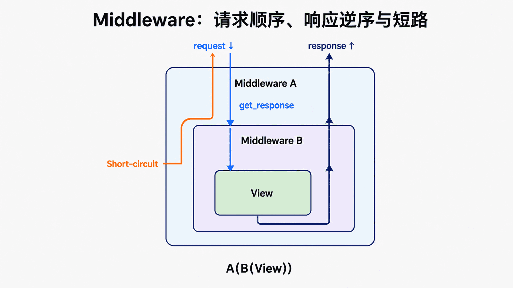

## 前置知识与学习目标

你需要理解第 5 篇的请求生命周期。读完后应能解释 middleware 的洋葱顺序、短路、view/exception/template-response 钩子，并实现一个始终写入 request-id 与耗时的现代 callable 中间件。中间件用于横切关注点，不承载借阅业务规则。

## 中间件概述

中间件顾名思义，是介于request与response处理之间的一道处理过程，相对比较轻量级，并且在全局上改变django的输入与输出。因为改变的是全局，所以需要谨慎使用，用不好会影响到性能。

Django中间件的定义：

<!-- snippet: id=django-component-3-middleware-01 mode=display python=3.12-3.14 deps=stdlib -->

```text
Middleware is a framework of hooks into Django's request/response processing.
It's a light, low-level "plugin" system for globally altering Django's input or output.
```

### 中间件是什么

- 中间件是介于request与response处理之间的一道处理过程
- 相对比较轻量级，并且在全局上改变django的输入与输出
- 因为改变的是全局，所以需要谨慎使用，用不好会影响到性能

### 中间件怎么用

1. 自定义中间件
2. 写一个类，继承MiddlewareMixin
3. 在类中写方法：process_request
4. 在settings中配置

### 5个方法（process_request，process_response）

**process_request(self, request)**

- 执行顺序：settings中中间件自上而下执行
- 请求来的时候会执行它
- request对象，就是本次请求的request对象，对它处理后，视图函数拿到的就是处理后的request对象

**process_view(self, request, callback, callback_args, callback_kwargs)**

- callback是视图函数
- callback_args, callback_kwargs是视图函数的参数
- 可以调用callback方法

**process_template_response(self, request, response)**（忘掉）

- 只有视图函数返回的对象中有render方法的时候，才会执行

**process_exception(self, request, exception)**

- 视图函数出错，会执行它

**process_response(self, request, response)**

- 执行顺序：settings中中间件自下而上执行
- 响应走的时候，会执行它
- request对象，就是本次请求的request对象
- response是响应对象（HttpResponse的对象）

**注意：** 如果process_request方法返回HttpResponse的对象，请求直接返回，按中间件方法执行顺序往回走。

## 中间件有什么用

如果你想修改请求，例如被传送到view中的**HttpRequest**对象。或者你想修改view返回的**HttpResponse**对象，这些都可以通过中间件来实现。

可能你还想在view执行之前做一些操作，这种情况就可以用middleware来实现。

## Django默认的中间件

在django项目的settings模块中，有一个MIDDLEWARE变量，其中每一个元素就是一个中间件：

<!-- snippet: id=django-component-3-middleware-02 mode=compile python=3.12-3.14 deps=stdlib -->

```python
MIDDLEWARE = [
    'django.middleware.security.SecurityMiddleware',
    'django.contrib.sessions.middleware.SessionMiddleware',
    'django.middleware.common.CommonMiddleware',
    'django.middleware.csrf.CsrfViewMiddleware',
    'django.contrib.auth.middleware.AuthenticationMiddleware',
    'django.contrib.messages.middleware.MessageMiddleware',
    'django.middleware.clickjacking.XFrameOptionsMiddleware',
]
```

## 现代中间件的最小合同

<!-- figure:s10-f01:start -->



<!-- figure:s10-f01:end -->

<!-- snippet: id=django-middleware-request-id mode=project python=3.12-3.14 deps=Django~=6.0 file=config/middleware.py -->

```python
import time
import uuid

class RequestIdMiddleware:
    def __init__(self, get_response):
        self.get_response = get_response

    def __call__(self, request):
        request.request_id = request.headers.get("X-Request-ID") or str(uuid.uuid4())
        started = time.perf_counter()
        response = self.get_response(request)
        response["X-Request-ID"] = request.request_id
        response["Server-Timing"] = f'app;dur={(time.perf_counter()-started)*1000:.1f}'
        return response
```

请求按列表从上到下进入，响应反向返回。若某层在 `get_response` 前返回，就短路内层。异常时可用 `try/finally` 记录耗时，但不要吞成成功响应。

## 常见误区与适用边界

- 顺序是行为：Session 必须先于 Authentication。
- 旧式 `MiddlewareMixin` 可兼容，新代码应先理解 callable 合同。
- 不记录 Cookie、Authorization、密码或完整 body。
- 同步/异步混合可能产生适配成本。
- 对象级授权不能只靠全局中间件。

## 最小验证

测试正常 200、404、view 异常、内层短路和两个中间件顺序，确认 request-id 始终存在。

## 自检题

1. 为什么响应顺序相反？
2. 短路后 view 是否执行？
3. 为什么顺序应被测试？

<details><summary>答案</summary>

1. 中间件是嵌套 callable。2. 不执行。3. 交换顺序会改变属性可用性、安全和响应处理。

</details>

## 本篇总结、衔接与资料来源

中间件是有顺序、可短路的洋葱调用链。下一篇解释开发服务器如何重建这条链。

- [Django middleware](https://docs.djangoproject.com/en/6.0/topics/http/middleware/)

每一个中间件都有具体的功能。

## 自定义中间件

中间件中主要有几个方法：

<!-- snippet: id=django-component-3-middleware-03 mode=compile python=3.12-3.14 deps=stdlib -->

```python
process_request(self, request)
process_view(self, request, callback, callback_args, callback_kwargs)
process_template_response(self, request, response)
process_exception(self, request, exception)
process_response(self, request, response)
```

### process_request和process_response

当用户发起请求的时候会依次经过所有的中间件，这个时候的请求是process_request，最后到达views的函数中，views函数处理后，在依次穿过中间件，这个时候是process_response，最后返回给请求者。

### 第一步：导入

<!-- snippet: id=django-component-3-middleware-04 mode=compile python=3.12-3.14 deps=Django==6.0.7 -->

```python
from django.utils.deprecation import MiddlewareMixin
```

### 第二步：自定义中间件

<!-- snippet: id=django-component-3-middleware-05 mode=compile python=3.12-3.14 deps=Django==6.0.7 -->

```python
from django.utils.deprecation import MiddlewareMixin
from django.shortcuts import HttpResponse

class Md1(MiddlewareMixin):

    def process_request(self, request):
        print("Md1请求")

    def process_response(self, request, response):
        print("Md1返回")
        return response

class Md2(MiddlewareMixin):

    def process_request(self, request):
        print("Md2请求")
        # return HttpResponse("Md2中断")

    def process_response(self, request, response):
        print("Md2返回")
        return response
```

### 第三步：在view中定义一个视图函数（index）

<!-- snippet: id=django-component-3-middleware-06 mode=compile python=3.12-3.14 deps=stdlib -->

```python
def index(request):
    print("view函数...")
    return HttpResponse("OK")
```

### 第四步：在settings.py的MIDDLEWARE里注册自己定义的中间件

<!-- snippet: id=django-component-3-middleware-07 mode=compile python=3.12-3.14 deps=stdlib -->

```python
MIDDLEWARE = [
    'django.middleware.security.SecurityMiddleware',
    # 其他中间件...
    'app名.middleware.Md1',
    'app名.middleware.Md2',
]
```

**结果：**

<!-- snippet: id=django-component-3-middleware-08 mode=display python=3.12-3.14 deps=stdlib -->

```text
Md1请求
Md2请求
view函数...
Md2返回
Md1返回
```

**注意：** 如果当请求到达请求2的时候直接不符合条件返回，即`return HttpResponse("Md2中断")`，程序将把请求直接发给中间件2返回，然后依次返回到请求者，结果如下：

返回Md2中断的页面，后台打印如下：

<!-- snippet: id=django-component-3-middleware-09 mode=display python=3.12-3.14 deps=stdlib -->

```text
Md1请求
Md2请求
Md2返回
Md1返回
```

### 总结

1. 中间件的process_request方法是在执行视图函数之前执行的
2. 当配置多个中间件时，会按照MIDDLEWARE中的注册顺序，也就是列表的索引值，从前到后依次执行的
3. 不同中间件之间传递的request都是同一个对象
4. 多个中间件中的process_response方法是按照MIDDLEWARE中的注册顺序倒序执行的

### process_view

`process_view(self, request, view_func, view_args, view_kwargs)`

该方法有四个参数：

- request：是HttpRequest对象
- view_func：是Django即将使用的视图函数（它是实际的函数对象，而不是函数的名称作为字符串）
- view_args：将传递给视图的位置参数的列表
- view_kwargs：将传递给视图的关键字参数的字典

Django会在调用视图函数之前调用process_view方法。

它应该返回None或一个HttpResponse对象。如果返回None，Django将继续处理这个请求，执行任何其他中间件的process_view方法，然后在执行相应的视图。如果它返回一个HttpResponse对象，Django不会调用适当的视图函数。它将执行中间件的process_response方法并将应用到该HttpResponse并返回结果。

<!-- snippet: id=django-component-3-middleware-10 mode=compile python=3.12-3.14 deps=Django==6.0.7 -->

```python
process_view(self, request, callback, callback_args, callback_kwargs)

from django.utils.deprecation import MiddlewareMixin
from django.shortcuts import HttpResponse
```

### process_exception

当视图函数发生异常时，会调用process_exception方法。

<!-- snippet: id=django-component-3-middleware-11 mode=compile python=3.12-3.14 deps=Django==6.0.7 -->

```python
from django.utils.deprecation import MiddlewareMixin
from django.shortcuts import HttpResponse

class ExceptionMiddleware(MiddlewareMixin):

    def process_exception(self, request, exception):
        print('exception:', exception)
        return HttpResponse(str(exception))
```

## 完整示例

### middleware.py

<!-- snippet: id=django-component-3-middleware-12 mode=compile python=3.12-3.14 deps=Django==6.0.7 -->

```python
from django.utils.deprecation import MiddlewareMixin
from django.shortcuts import HttpResponse, redirect

class AuthMiddleware(MiddlewareMixin):
    """用户登录验证中间件"""

    def process_request(self, request):
        # 排除不需要验证的路径
        if request.path in ['/login/', '/register/']:
            return None

        # 检查用户是否登录
        if not request.user.is_authenticated:
            return redirect('/login/')

        return None

class LoggingMiddleware(MiddlewareMixin):
    """请求日志中间件"""

    def process_request(self, request):
        print(f'请求路径: {request.path}')
        return None

    def process_response(self, request, response):
        print(f'响应状态: {response.status_code}')
        return response
```

### settings.py

<!-- snippet: id=django-component-3-middleware-13 mode=compile python=3.12-3.14 deps=stdlib -->

```python
MIDDLEWARE = [
    'django.middleware.security.SecurityMiddleware',
    'django.contrib.sessions.middleware.SessionMiddleware',
    'django.middleware.common.CommonMiddleware',
    'django.middleware.csrf.CsrfViewMiddleware',
    'django.contrib.auth.middleware.AuthenticationMiddleware',
    'django.contrib.messages.middleware.MessageMiddleware',
    'django.middleware.clickjacking.XFrameOptionsMiddleware',

    # 自定义中间件
    'app.middleware.LoggingMiddleware',
    'app.middleware.AuthMiddleware',
]
```
