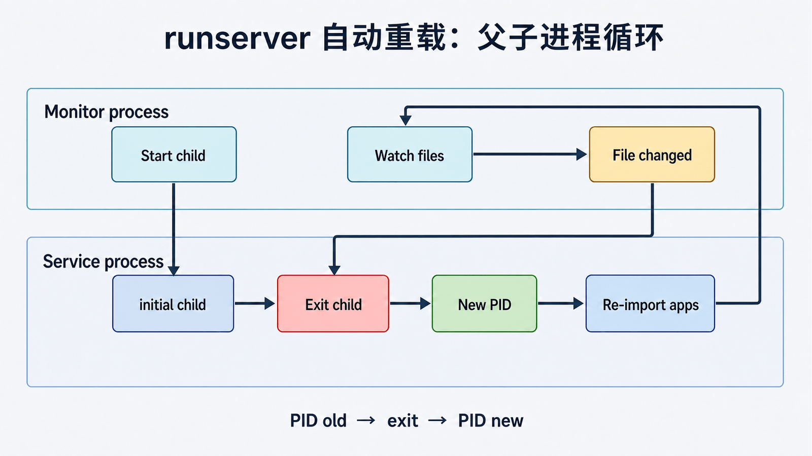

## 前置知识与学习目标

你需要知道进程、线程、模块导入和 Django 启动。读完后应能：

1. 区分监视进程与真正服务请求的子进程。
2. 解释文件变化如何触发退出、重启和应用重新初始化。
3. 诊断“启动代码执行两次”、导入异常和无法监视的文件。

## 直觉：重载是重建运行时，不是热修改对象

<!-- figure:s11-f01:start -->



<!-- figure:s11-f01:end -->

保存 `catalog/views.py` 后，Django 不会在旧进程中逐个替换函数。autoreload 观察相关 Python/模板/翻译文件，检测变化后结束服务进程并创建一个干净进程，重新导入 settings、apps、models 和 URLconf。这样比在活跃对象图上打补丁更可预测。

```text
Monitor process -> start child -> child serves requests
       ^                            |
       |---- file changed / exit ---|
```

## 监视器与触发路径

Django 可使用基于文件时间戳的 `StatReloader`；安装并可用时也可使用 Watchman 相关实现。实际监视集合来自已加载模块和显式观察的文件。语法错误发生时，autoreload 会保留错误文件以便后续修改能再次触发重载。

环境标志用于区分外层监视流程和内层服务流程，因此顶层模块代码可能在启动链的不同阶段出现多次。不要依赖“导入一次”完成发邮件、创建任务或不可幂等写入。

## 可观察实验

<!-- snippet: id=django-autoreload-observe mode=project python=3.12-3.14 deps=stdlib file=catalog/apps.py -->

```python
import os
from django.apps import AppConfig


class CatalogConfig(AppConfig):
    name = "catalog"

    def ready(self):
        print("catalog ready", os.getpid())
```

启动 `python manage.py runserver`，记录 PID；修改 `views.py` 后再记录。你会看到服务进程 PID 变化并重新执行 `ready()`。这个打印只用于实验，生产初始化应使用日志且保持幂等。加 `--noreload` 可判断异常是否与重载有关。

## 常见故障与边界

- 启动副作用重复：把任务启动、数据库写入移出模块顶层和 `ready()`，使用独立 worker 或显式管理命令。
- 新文件不触发：确认它已被导入或被观察，检查编辑器的原子替换行为和文件系统事件支持。
- 语法错误后循环：直接读取第一个 traceback，修复导入错误，不要用吞异常维持假运行。
- 线程未退出：开发重载不是线程生命周期管理器，后台线程应有停止协议；更好的做法是独立进程。
- 生产禁止依赖 autoreload；应用服务器使用受控优雅重启与健康检查。

## 最小行为测试

修改一个视图并确认新响应出现；制造语法错误，确认错误可见且修复后恢复；用 PID 证明是进程重建；加 `--noreload` 对照；确认没有重复创建任务或写入数据库。

## 自检题

1. 自动重载为什么优先重启进程而不是替换函数对象？
2. `ready()` 为什么必须幂等且避免数据库查询？
3. `--noreload` 对诊断有什么价值？

<details><summary>答案</summary>

1. 模块间对象、注册表和引用关系复杂，干净重建更可预测。2. 它可能在命令、测试和重启中多次执行，且启动阶段数据库状态未必可用。3. 它能隔离问题是否由父子进程或文件监视引起。

</details>

## 本篇总结与下一篇

autoreload 的本质是“监视变化并重建服务进程”。下一篇进入每次重建都会执行的 `Apps.populate()`，观察应用、模型和 `ready()` 的三阶段注册。

## 资料来源

- [Django runserver](https://docs.djangoproject.com/en/6.0/ref/django-admin/#runserver)
- [django.utils.autoreload 源码](https://github.com/django/django/blob/stable/6.0.x/django/utils/autoreload.py)
