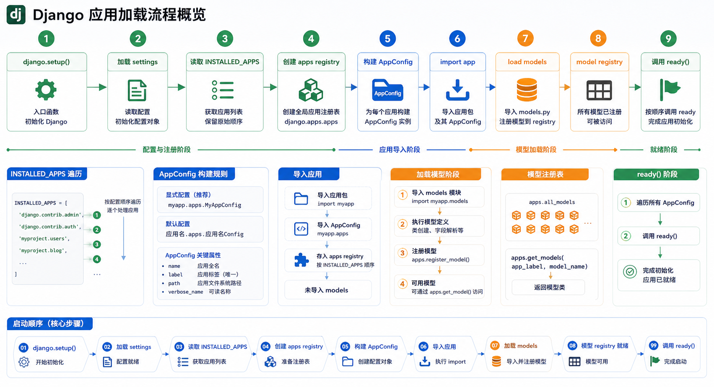

## django.setup() 启动程序

> Django 的初始化入口，位于 `django/__init__.py`

<!-- snippet: id=django-app-loading-process-01 mode=compile python=3.12-3.14 deps=Django==6.0.7 -->
```python
def setup(set_prefix=True):
    from django.apps import apps
    from django.conf import settings
    from django.utils.log import configure_logging

    # 配置日志系统
    configure_logging(settings.LOGGING_CONFIG, settings.LOGGING)
    # 加载已安装应用的核心方法
    apps.populate(settings.INSTALLED_APPS)
```

- `configure_logging`：配置日志信息，跳过
- `apps.populate()`：加载 `settings.INSTALLED_APPS` 中的自定义模块以及 `models` 模块，并保存在 `django.apps` 中

> `Apps` 是一个全局类实例，是已安装应用的注册表，存储配置信息并维护模型列表，定义于 `django.apps.registry`



<!-- snippet: id=django-app-loading-process-02 mode=compile python=3.12-3.14 deps=stdlib -->
```python
apps = Apps(installed_apps=None)
```

其中，`populate(self, installed_apps=None)`是它的主要方法，这个方法导入每个应用模块，再导入每个模型。这个函数是线程安全的：

<!-- snippet: id=django-app-loading-process-03 mode=compile python=3.12-3.14 deps=stdlib -->
```python
def populate(self, installed_apps=None):
    # 防止重复初始化
    if self.ready:
        return

    with self._lock:
        if self.ready:
            return

        # 检查是否处于原始状态，确保顺序与 INSTALLED_APPS 一致
        if self.app_configs:
            raise RuntimeError("populate() isn't reentrant")

        # 加载应用配置和应用模块
        for entry in installed_apps:
            if isinstance(entry, AppConfig):
                app_config = entry
            else:
                # 工厂模式创建 AppConfig 实例
                app_config = AppConfig.create(entry)

            # 检测标签唯一性
            if app_config.label in self.app_configs:
                raise ImproperlyConfigured(
                    "Application labels aren't unique, "
                    "duplicates: %s" % app_config.label)

            self.app_configs[app_config.label] = app_config

        # 检测应用名唯一性
        counts = Counter(
            app_config.name for app_config in self.app_configs.values())
        duplicates = [
            name for name, count in counts.most_common() if count > 1]
        if duplicates:
            raise ImproperlyConfigured(
                "Application names aren't unique, "
                "duplicates: %s" % ", ".join(duplicates))

        self.apps_ready = True  # 应用加载完毕

        # 导入模型模块
        for app_config in self.app_configs.values():
            all_models = self.all_models[app_config.label]
            app_config.import_models(all_models)

        self.clear_cache()
        self.models_ready = True

        # 调用各应用的 ready() 方法
        for app_config in self.get_app_configs():
            app_config.ready()

        self.ready = True
```

在`for`循环中，使用`AppConfig.create(entry)`加载`settings.INSTALLED_APPS`里面的各模块，并保存在`self.app_configs`中。实例化每个app的配置管理对象有什么好处呢？注意，`create`方法是`classmethod`的，这是一个工厂模式，它根据参数来构造出`AppConfig(app_name, app_module)`这样的实例。

其中：

- `app_name`表示`INSTALLED_APPS`中指定的应用字符串
- `app_module`表示根据`app_name`加载到的module

在`AppConfig`实例的初始化方法中，会记录这些"应用的标签"、"文件路径"等信息，最终将这些实例会保存在其属性`app_configs`中。接着每个`AppConfig`实例会加载其指定模块的`models`，`all_models`定义为`all_models = defaultdict(OrderedDict)`。

## 模型的加载

> 模型的加载在 `populate()` 函数中实现

<!-- snippet: id=django-app-loading-process-04 mode=compile python=3.12-3.14 deps=stdlib -->
```python
# 遍历所有应用配置，加载各应用的模型
for app_config in self.app_configs.values():
    all_models = self.all_models[app_config.label]
    app_config.import_models(all_models)
```

`import_models` 方法在 `AppConfig` 中定义：

<!-- snippet: id=django-app-loading-process-05 mode=compile python=3.12-3.14 deps=stdlib -->
```python
MODELS_MODULE_NAME = 'models'

def import_models(self, all_models):
    self.models = all_models

    # 检查是否存在 models 模块并动态导入
    if module_has_submodule(self.module, MODELS_MODULE_NAME):
        models_module_name = '%s.%s' % (self.name, MODELS_MODULE_NAME)
        self.models_module = import_module(models_module_name)
```

> 最终 `self.models` 以 `OrderedDict` 形式存储加载的模型对象

<!-- snippet: id=django-app-loading-process-06 mode=display python=3.12-3.14 deps=stdlib -->
```text
OrderedDict([
    ('permission', <class 'django.contrib.auth.models.Permission'>),
    ('group', <class 'django.contrib.auth.models.Group'>),
    ('user', <class 'django.contrib.auth.models.User'>)
])
```

## 小结

> Django app 加载过程是线程安全的，确保应用和模型的正确加载顺序

| 步骤 | 说明                          |
| ---- | ----------------------------- |
| 1    | 调用 `django.setup()` 初始化 Django |
| 2    | 通过 `Apps.populate()` 加载已安装应用 |
| 3    | 为每个 app 创建 `AppConfig` 实例 |
| 4    | 加载各 app 的 models 模块       |
| 5    | 调用各 app 的 `ready()` 方法    |

---
