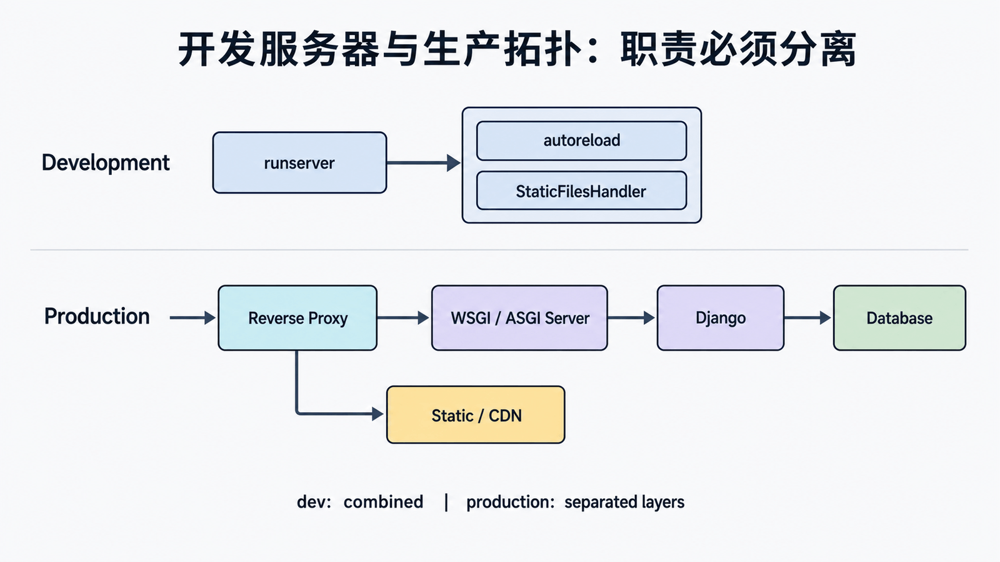

## 前置知识与学习目标

你需要掌握请求生命周期、WSGI/ASGI、自动重载和 app registry。读完后应能：

1. 区分开发服务器、静态文件包装器、应用服务器和反向代理。
2. 把 502、404、500、静态资源失败与超时定位到正确层。
3. 解释为何开发拓扑不能靠“加进程”直接变成生产拓扑。

## 开发拓扑

`runserver` 把自动重载、开发 HTTP server、Django application 和在特定条件下的 `StaticFilesHandler` 组合起来，目标是快速反馈。它可能在代码变化后重建进程，静态服务也只面向开发便利。

```text
Browser -> runserver -> StaticFilesHandler? -> WSGIHandler -> Django
                    \-> autoreload monitors source files
```

这条链能帮助学习 handler，但没有生产安全、容量或稳定性承诺。

## 生产拓扑

<!-- figure:s13-f01:start -->



<!-- figure:s13-f01:end -->

```text
Client -> TLS/Reverse Proxy -> WSGI or ASGI server -> Django
                         |                      |-> Database
                         |-> static/CDN         |-> Cache/queue/storage
```

反向代理处理 TLS、连接、静态资产、大小限制和部分安全头；应用服务器管理 worker、超时和优雅重启；Django 处理路由、认证和业务；数据库、缓存、队列与媒体存储各自持久化。层与层之间必须有明确的超时、连接和健康合同。

## 职责矩阵

| 层             | 输入/输出                      | 典型失败              | 证据                       |
| -------------- | ------------------------------ | --------------------- | -------------------------- |
| DNS/TLS/代理   | 域名、连接、HTTP               | 证书、502、上传过大   | 代理 access/error log      |
| 应用服务器     | socket 与 application callable | worker 超时、启动失败 | worker 日志、PID、健康检查 |
| Django         | request/response               | 404、403、500         | request-id、异常、路由     |
| 数据与外部依赖 | SQL/缓存/任务/对象             | 超时、锁、不可用      | 慢查询、池指标、队列指标   |

遇到 502 时先证明代理能否连接 socket；遇到 Django 404 时看 URL resolver；静态 404 则检查收集目录和代理 alias。不要从所有故障都“重启 Django”开始。

## 同步与异步结构

WSGI worker 适合典型同步 Django 请求；ASGI 为 async view、长连接和异步服务器提供接口。只换服务器不改变同步 ORM 或阻塞库。混合栈还可能触发同步/异步切换，应在真实负载下测量。

## 最小分层验证

1. `curl -I https://library.example.com/static/app.css` 验证代理静态路径。
2. `curl --unix-socket /run/library/gunicorn.sock http://localhost/health/` 绕过代理验证应用服务器。
3. 请求只返回进程信息的存活端点，再请求带关键依赖的就绪端点。
4. 用同一 request-id 串联代理与 Django 日志，定位耗时分布。

## 常见误区与适用边界

- `StaticFilesHandler` 不是生产静态服务器。
- 应用服务器 worker 数不是固定公式，受 CPU、I/O、数据库连接和内存约束。
- 健康检查不能无限依赖所有下游，否则一次依赖抖动会造成级联摘除。
- 客户端断开不必然取消数据库或外部请求。
- 代理 IP/协议头只有在可信代理正确覆盖时才可信。

## 自检题

1. 代理返回 502 与 Django 返回 500 的定位起点有何不同？
2. 为什么 `runserver` 能服务静态文件不代表生产也应如此？
3. 换成 ASGI 服务器后，同步数据库调用会自动变成非阻塞吗？

<details><summary>答案</summary>

1. 502 先查代理到 upstream 的连接，500 查应用异常。2. 开发包装器只为便利，没有生产能力承诺。3. 不会，仍需异步兼容的调用路径或受控适配。

</details>

## 本篇总结与下一篇

服务器结构是一组有边界的层，而不是一个“大 Django 进程”。下一篇进入应用安全层，区分认证、会话和授权，并规划自定义用户模型。

## 资料来源

- [Django 部署概览](https://docs.djangoproject.com/en/6.0/howto/deployment/)
- [runserver](https://docs.djangoproject.com/en/6.0/ref/django-admin/#runserver)
- [staticfiles runserver](https://docs.djangoproject.com/en/6.0/ref/contrib/staticfiles/#runserver)
