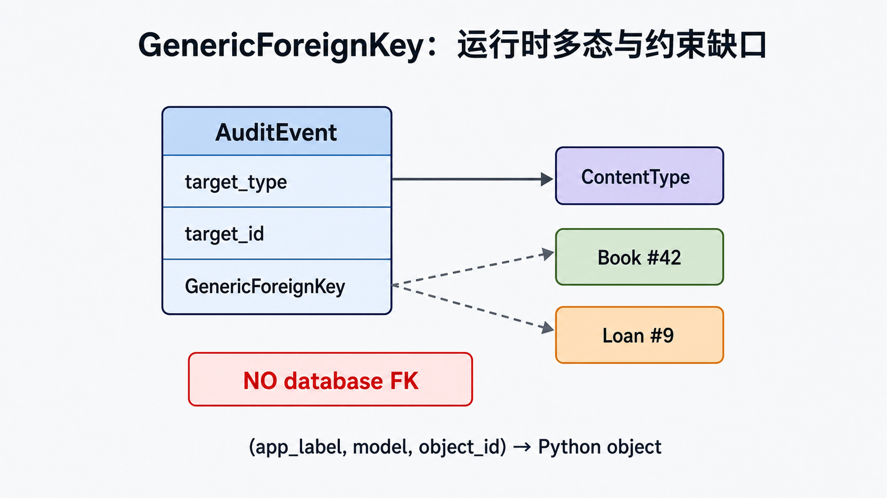

## 前置知识与学习目标

你需要理解模型关系、app registry 和权限。读完后应能：

1. 解释 `ContentType(app_label, model)` 如何标识一个已安装模型类。
2. 使用 `get_for_model()` 和自然键获取模型元数据。
3. 判断何时使用普通外键、多张明确事件表，何时才接受通用关系的灵活性代价。

贯穿示例是 `AuditEvent`，它可指向 `Book` 或 `Loan`；核心业务模型仍优先普通外键。

## ContentType 是模型类的元数据表

启用 `django.contrib.contenttypes` 后，迁移会为已安装模型维护记录。`ContentType` 标识模型类，不标识某个业务对象。权限系统用它把 `add/change/delete/view` 权限关联到模型。

<!-- snippet: id=django-contenttype-lookup mode=project python=3.12-3.14 deps=Django~=6.0 -->

```python
from django.contrib.contenttypes.models import ContentType
from catalog.models import Book

book_type = ContentType.objects.get_for_model(Book)
assert book_type.app_label == "catalog"
assert book_type.model == "book"
assert book_type.model_class() is Book
```

序列化时可使用 `(app_label, model)` 自然键，而不要把不同环境的数值主键当成稳定协议。

## GenericForeignKey 的三列关系

<!-- figure:s15-f01:start -->



<!-- figure:s15-f01:end -->

通用关系由 `content_type`、`object_id` 和 Python 描述符 `content_object` 组合。

<!-- snippet: id=django-contenttype-audit-model mode=project python=3.12-3.14 deps=Django~=6.0 file=audit/models.py -->

```python
from django.conf import settings
from django.contrib.contenttypes.fields import GenericForeignKey
from django.contrib.contenttypes.models import ContentType
from django.db import models


class AuditEvent(models.Model):
    actor = models.ForeignKey(settings.AUTH_USER_MODEL, on_delete=models.PROTECT)
    action = models.CharField(max_length=80)
    target_type = models.ForeignKey(ContentType, on_delete=models.PROTECT)
    target_id = models.PositiveBigIntegerField()
    target = GenericForeignKey("target_type", "target_id")
    created_at = models.DateTimeField(auto_now_add=True)

    class Meta:
        indexes = [models.Index(fields=["target_type", "target_id"])]
```

创建事件时可传 `target=book`。读取 `event.target` 会根据类型再查目标表，列表页可能形成 N+1；应按访问模式预取或分组加载，并用查询预算验证。

## 最大代价：数据库无法建立通用外键

数据库不能让一列有时引用 `catalog_book`、有时引用 `loans_loan`，因此 `target_id` 没有到目标表的真实外键约束。目标删除后可能留下悬空引用；跨目标 JOIN、级联和查询优化也更困难。`GenericRelation` 只提供反向 Python API，不会补回数据库级完整性。

如果目标类型是有限且稳定的，优先选择：

- 明确的 `book`/`loan` 可空外键加“恰有一个非空”的检查约束；
- 每类事件独立表；
- 领域级事件载荷与不可变标识，而非实时对象引用。

## GenericRelation 的可选反向访问

```python
from django.contrib.contenttypes.fields import GenericRelation

class Book(models.Model):
    # 其他字段省略
    audit_events = GenericRelation(
        "audit.AuditEvent",
        content_type_field="target_type",
        object_id_field="target_id",
        related_query_name="book",
    )
```

显式添加反向关系会影响删除语义，必须用测试确认是否级联删除审计记录；合规审计通常不应跟随业务对象删除，应保存独立不可变快照。

## 常见误区与适用边界

- `ContentType` 不是“自动快速连表”，它只是模型类型元数据。
- `GenericForeignKey` 不能作为普通字段直接用于所有 QuerySet filter 语法。
- 目标对象类型和 ID 都来自外部输入时必须做允许列表和对象级授权。
- 清理悬空引用需要可审计任务，不能假设数据库自动处理。
- 不要为了少建几张表牺牲核心交易数据的外键完整性。

## 最小行为测试

创建分别指向 Book/Loan 的事件，验证解析目标；删除/归档目标时验证预期保留策略；测试非法 ContentType 被拒绝；列表查询锁定预算；使用自然键 fixture 验证跨环境稳定性。

## 自检题

1. `ContentType` 标识对象还是模型类？
2. GenericForeignKey 为什么没有数据库外键保证？
3. 只有 Book 与 Loan 两类目标时，何时应改用明确外键？

<details><summary>答案</summary>

1. 模型类。2. 同一 `target_id` 列可指向不同表，关系数据库无法声明一个普通 FK。3. 当类型集合稳定、完整性与 JOIN 重要时应优先明确建模。

</details>

## 本篇总结与下一篇

ContentType 提供类型元数据，通用关系用完整性和查询能力换灵活性。下一篇用 Form 把不可信借阅输入转换成可验证 Python 值。

## 资料来源

- [ContentTypes framework](https://docs.djangoproject.com/en/6.0/ref/contrib/contenttypes/)
- [Django 权限系统](https://docs.djangoproject.com/en/6.0/topics/auth/default/#permissions-and-authorization)
