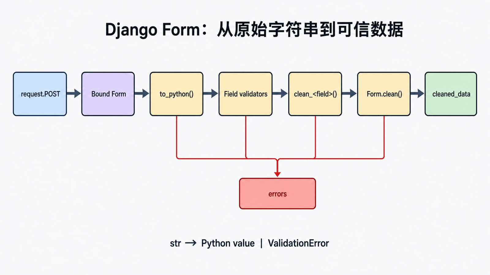
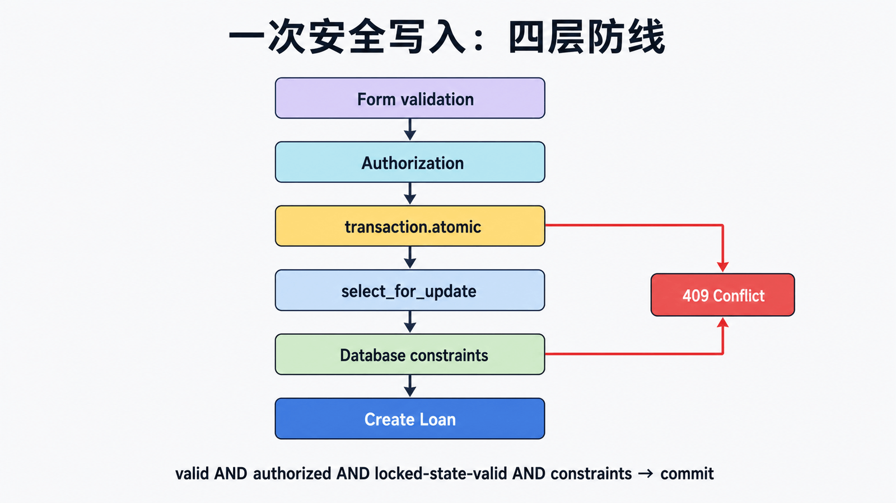

## 前置知识与学习目标

你需要知道 POST 请求、模型和 CSRF。读完后应能：

1. 解释未绑定表单、绑定表单、`is_valid()`、`errors` 与 `cleaned_data` 的状态变化。
2. 区分字段转换、`clean_<field>()`、`clean()` 与数据库约束的职责。
3. 完成一个借阅表单，并测试无效输入、并发冲突和成功重定向。

贯穿示例是 `library_site` 的借阅操作：成员提交 `book` 与 `due_at`，服务端必须确认日期合法、书仍可借且当前用户有权限。

## 直觉：Form 是不可信输入与业务代码之间的边界

`request.POST` 只是一组字符串，不能直接用于模型写入。Form 先声明允许出现的字段，再依次完成解析、字段校验和跨字段校验。只有 `is_valid()` 返回 `True` 后，`cleaned_data` 才是可使用的 Python 值；表单验证通过也不代表授权和并发条件已满足。

状态可以概括为：

```text
unbound -> bind(request.POST) -> full_clean()
                              -> errors 非空
                              -> cleaned_data 可用
```

## 核心机制：验证调用链

<!-- figure:s16-f01:start -->



<!-- figure:s16-f01:end -->

以普通 `Form` 为例，`is_valid()` 会触发一次 `full_clean()`。每个字段先运行字段类型的 `to_python()`、内置校验器和 `Field.clean()`；随后运行 `clean_<field>()`；所有字段完成后才运行表单级 `clean()`。某字段失败时，它不会出现在 `cleaned_data` 中，因此跨字段校验必须使用 `.get()`。

<!-- snippet: id=django-form-loan mode=project python=3.12-3.14 deps=Django~=6.0 file=loans/forms.py -->

```python
from django import forms
from django.utils import timezone

from catalog.models import Book


class LoanForm(forms.Form):
    book = forms.ModelChoiceField(queryset=Book.objects.order_by("title"))
    due_at = forms.DateTimeField()

    def clean_due_at(self):
        due_at = self.cleaned_data["due_at"]
        if due_at <= timezone.now():
            raise forms.ValidationError("归还时间必须晚于当前时间。")
        return due_at

    def clean(self):
        cleaned = super().clean()
        book = cleaned.get("book")
        if book is not None and not book.is_active:
            self.add_error("book", "该书已下架。")
        return cleaned
```

输入 `book="12"`、`due_at="2026-08-01 18:00"` 后，成功时 `cleaned_data["book"]` 是 `Book` 实例，`cleaned_data["due_at"]` 是时区感知的 `datetime`，不再是原始字符串。错误可通过 `form.errors.as_data()` 保留错误码与 `ValidationError`，面向 JSON 时不要解析已经渲染的 HTML 错误列表。

## 视图：验证、授权、事务各守一层

<!-- figure:s16-f02:start -->



<!-- figure:s16-f02:end -->

<!-- snippet: id=django-form-loan-view mode=project python=3.12-3.14 deps=Django~=6.0 file=loans/views.py -->

```python
from django.contrib.auth.decorators import login_required
from django.db import transaction
from django.http import HttpResponseConflict
from django.shortcuts import redirect, render
from django.views.decorators.http import require_http_methods

from catalog.models import Book
from .forms import LoanForm
from .models import Loan


@login_required
@require_http_methods(["GET", "POST"])
def create_loan(request):
    form = LoanForm(request.POST or None)
    if request.method == "POST" and form.is_valid():
        with transaction.atomic():
            book = Book.objects.select_for_update().get(
                pk=form.cleaned_data["book"].pk
            )
            if book.available_copies < 1:
                return HttpResponseConflict("库存刚刚发生变化，请重试。")
            Loan.objects.create(
                member=request.user,
                book=book,
                due_at=form.cleaned_data["due_at"],
            )
            book.available_copies -= 1
            book.save(update_fields=["available_copies"])
        return redirect("loan-detail", pk=book.pk)
    return render(request, "loans/create.html", {"form": form})
```

模板中的 POST 表单必须包含 ``。成功后重定向遵循 Post/Redirect/Get，避免刷新重复提交。`select_for_update()` 和事务负责“验证后库存被别人借走”的竞态；Form 本身无法消除竞态。

## Form 与 ModelForm 的边界

`ModelForm` 适合字段主要来自单个模型的编辑页，`Meta.fields` 应显式白名单。它会运行模型字段验证和唯一性检查，但仍不会替你完成对象级授权、跨对象事务或高并发锁定。密码必须用 `set_password()` 或 `create_user()`，不能把明文赋给模型字段。

## 常见误区与适用边界

- `form.is_valid()` 不是授权检查；“数据格式正确”不等于“当前用户可操作”。
- 不要在 GET 上执行写入，也不要仅依赖 HTML 的 `required`、`min`、`max`。
- 不要重复调用昂贵校验；一次请求内表单清洗结果会缓存。
- 文件上传还要限制大小、探测内容类型、重命名并放在不可执行位置。
- 大型 API 更适合明确的 JSON schema/序列化层；Form 的默认错误和渲染模型主要面向 HTML 表单。

## 最小行为测试

测试至少覆盖：过去日期返回字段错误；下架图书被拒绝；未登录被重定向；库存竞态返回 `409`；成功时创建一条 `Loan`、库存减一并重定向。数据库约束应作为最后防线，而不是省略应用校验的理由。

## 自检题

1. 为什么不能在 `is_valid()` 之前读取 `cleaned_data`？
2. `clean()` 里为什么应使用 `cleaned.get("book")`？
3. Form 已验证库存大于零，为什么视图里仍需事务和行锁？

<details><summary>答案</summary>

1. 清洗链尚未完成，类型转换和错误收集都没有可靠结果。2. 字段校验失败时该键可能不存在。3. 验证和写入之间存在并发窗口，必须在数据库事务中重新确认并锁定状态。

</details>

## 本篇总结与下一篇

Form 把原始输入转换为带错误证据的 Python 值；授权、事务和数据库约束继续守住各自边界。下一篇把书籍列表交给 `Paginator`，讨论稳定排序、计数、切片与非法页码。

## 资料来源

- [Django 表单 API](https://docs.djangoproject.com/en/6.0/ref/forms/api/)
- [表单与字段验证](https://docs.djangoproject.com/en/6.0/ref/forms/validation/)
- [ModelForm](https://docs.djangoproject.com/en/6.0/topics/forms/modelforms/)
