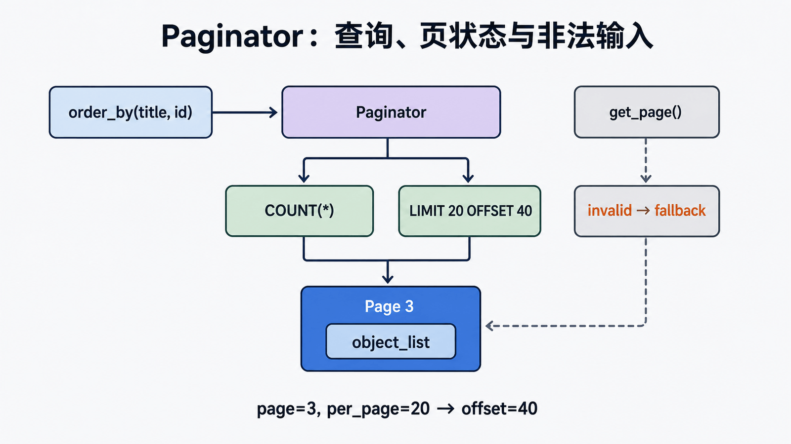

## 前置知识与学习目标

你需要理解 QuerySet、GET 参数和模板。读完后应能解释 `COUNT` 与切片查询、用稳定排序构造书籍分页、处理非法/越界页码，并判断何时用省略页码或 keyset 分页。

## Django的分页器（paginator）简介

在页面显示分页数据，需要用到Django分页器组件：

<!-- snippet: id=django-component-1-paginator-01 mode=compile python=3.12-3.14 deps=Django==6.0.7 -->

```python
from django.core.paginator import Paginator
```

### Paginator对象

<!-- snippet: id=django-component-1-paginator-02 mode=compile python=3.12-3.14 deps=stdlib -->

```python
paginator = Paginator(user_list, 10)

# per_page: 每页显示条目数量
# count:    数据总个数
# num_pages: 总页数
# page_range: 总页数的索引范围，如: (1,10),(1,200)
# page:     page对象
```

### page对象

<!-- snippet: id=django-component-1-paginator-03 mode=compile python=3.12-3.14 deps=stdlib -->

```python
page = paginator.page(1)

# has_next              是否有下一页
# next_page_number      下一页页码
# has_previous          是否有上一页
# previous_page_number  上一页页码
# object_list           分页之后的数据列表
# number                当前页
# paginator             paginator对象
```

## 应用View层

<!-- snippet: id=django-component-1-paginator-04 mode=compile python=3.12-3.14 deps=Django==6.0.7 -->

```python
from django.shortcuts import render, HttpResponse
from app01.models import *
from django.core.paginator import Paginator, EmptyPage, PageNotAnInteger

def index(request):
    '''
    批量导入数据:
    Booklist=[]
    for i in range(100):
        Booklist.append(Book(title="book"+str(i), price=30+i*i))
    Book.objects.bulk_create(Booklist)
    '''

    '''
    分页器的使用:
    book_list = Book.objects.all()
    paginator = Paginator(book_list, 10)

    print("count:", paginator.count)           # 数据总数
    print("num_pages", paginator.num_pages)    # 总页数
    print("page_range", paginator.page_range)  # 页码的列表

    page1 = paginator.page(1)  # 第1页的page对象
    for i in page1:  # 遍历第1页的所有数据对象
        print(i)

    print(page1.object_list)  # 第1页的所有数据

    page2 = paginator.page(2)

    print(page2.has_next())             # 是否有下一页
    print(page2.next_page_number())     # 下一页的页码
    print(page2.has_previous())         # 是否有上一页
    print(page2.previous_page_number())  # 上一页的页码

    # 抛错
    page = paginator.page(12)   # error: EmptyPage
    page = paginator.page("z")   # error: PageNotAnInteger
    '''

    book_list = Book.objects.all()
    paginator = Paginator(book_list, 10)
    page = request.GET.get('page', 1)
    currentPage = int(page)

    try:
        print(page)
        book_list = paginator.page(page)
    except PageNotAnInteger:
        book_list = paginator.page(1)
    except EmptyPage:
        book_list = paginator.page(paginator.num_pages)

    return render(request, "index.html", {"book_list": book_list, "paginator": paginator, "currentPage": currentPage})
```

## 模版层 index.html

<!-- snippet: id=django-component-1-paginator-05 mode=display python=3.12-3.14 deps=stdlib -->

```html
<!DOCTYPE html>
<html lang="en">
  <head>
    <meta charset="UTF-8" />
    <title>Title</title>
    <link
      rel="stylesheet"
      href="https://cdn.bootcss.com/bootstrap/3.3.7/css/bootstrap.min.css"
      integrity="sha384-BVYiiSIFeK1dGmJRAkycuHAHRg32OmUcww7on3RYdg4Va+PmSTsz/K68vbdEjh4u"
      crossorigin="anonymous"
    />
  </head>
  <body>
    <div class="container">
      <h4>分页器</h4>
      <ul>
        
        <li>{{ book.title }} -----{{ book.price }}</li>
        
      </ul>

      <ul class="pagination" id="pager">
        
        <li class="previous">
          <a href="/index/?page={{ book_list.previous_page_number }}">上一页</a>
        </li>
        
        <li class="previous disabled"><a href="#">上一页</a></li>
          
        <li class="item active">
          <a href="/index/?page={{ num }}">{{ num }}</a>
        </li>
        
        <li class="item"><a href="/index/?page={{ num }}">{{ num }}</a></li>
          
        <li class="next">
          <a href="/index/?page={{ book_list.next_page_number }}">下一页</a>
        </li>
        
        <li class="next disabled"><a href="#">下一页</a></li>
        
      </ul>
    </div>
  </body>
</html>
```

## 扩展：自定义页码范围

显示左5右5，总共11个页码的情况：

<!-- snippet: id=django-component-1-paginator-06 mode=compile python=3.12-3.14 deps=stdlib -->

```python
'''
显示左5，右5，总共11个页，
1 如果总页码大于11
    1.1 if 当前页码减5小于1，要生成1到12的列表（顾头不顾尾，共11个页码）
        page_range = range(1, 12)
    1.2 elif 当前页码+5大于总页码，生成当前页码减10，到当前页码加1的列表（顾头不顾尾，共11个页码）
        page_range = range(paginator.num_pages-10, paginator.num_pages+1)
    1.3 else 生成当前页码-5，到当前页码+6的列表
        page_range = range(current_page_num-5, current_page_num+6)
2 其它情况，生成的列表就是pageinator的page_range
    page_range = paginator.page_range
'''

def index(request):
    book_list = Book.objects.all()
    paginator = Paginator(book_list, 15)
    page = request.GET.get('page', 1)
    currentPage = int(page)

    # 如果页数十分多时，换另外一种显示方式
    if paginator.num_pages > 11:
        if currentPage - 5 < 1:
            pageRange = range(1, 11)
        elif currentPage + 5 > paginator.num_pages:
            pageRange = range(currentPage - 5, paginator.num_pages + 1)
        else:
            pageRange = range(currentPage - 5, currentPage + 5)
    else:
        pageRange = paginator.page_range
```

## 使用Bootstrap样式显示分页

<!-- snippet: id=django-component-1-paginator-07 mode=display python=3.12-3.14 deps=stdlib -->

```html
<nav aria-label="Page navigation">
  <ul class="pagination">
    
    <li>
      <a
        href="?page={{ book_list.previous_page_number }}"
        aria-label="Previous"
      >
        <span aria-hidden="true">&laquo;</span>
      </a>
    </li>
      
    <li class="active"><a href="?page={{ num }}">{{ num }}</a></li>
    
    <li><a href="?page={{ num }}">{{ num }}</a></li>
      
    <li>
      <a href="?page={{ book_list.next_page_number }}" aria-label="Next">
        <span aria-hidden="true">&raquo;</span>
      </a>
    </li>
    
  </ul>
</nav>
```

## 稳定排序、查询与状态

<!-- figure:s17-f01:start -->



<!-- figure:s17-f01:end -->

分页前必须使用完整稳定排序，例如 `order_by("title", "id")`；只按可重复的 title 排序时，数据变化可能让记录跨页跳动。`Paginator` 通常需要一次总数查询和一次当前页切片查询。`get_page()` 对非法页码做友好回退，`page()` 则抛 `PageNotAnInteger`/`EmptyPage`，应按接口合同选择。

```python
queryset = Book.objects.filter(is_active=True).order_by("title", "id")
paginator = Paginator(queryset, 20, orphans=2)
page_obj = paginator.get_page(request.GET.get("page"))
```

模板保留其他筛选参数，给当前页 `aria-current="page"`。海量深分页时 OFFSET/COUNT 可能昂贵；连续浏览可用完整排序键 `(title, id)` 做 keyset，但不支持任意跳页。

## 常见误区与验证

- 无 `order_by` 的数据库结果没有稳定顺序。
- 不把所有页码一次渲染；使用 `get_elided_page_range()`。
- 页大小必须有上限，避免客户端请求百万行。
- 测试空集、第一页、末页、非法页码、删除/插入后的稳定性和查询预算。

## 自检题

1. 为什么排序要追加 id？
2. `get_page()` 与 `page()` 的错误策略有何不同？
3. keyset 分页牺牲什么？

<details><summary>答案</summary>

1. 打破 title 相同的并列。2. 前者回退，后者抛异常。3. 通常不能任意跳页或直接给出精确总页数。

</details>

## 本篇总结、衔接与资料来源

分页是稳定排序、计数、切片和容错的合同。下一篇解释全局 settings 为何延迟初始化。

- [Paginator](https://docs.djangoproject.com/en/6.0/ref/paginator/)
