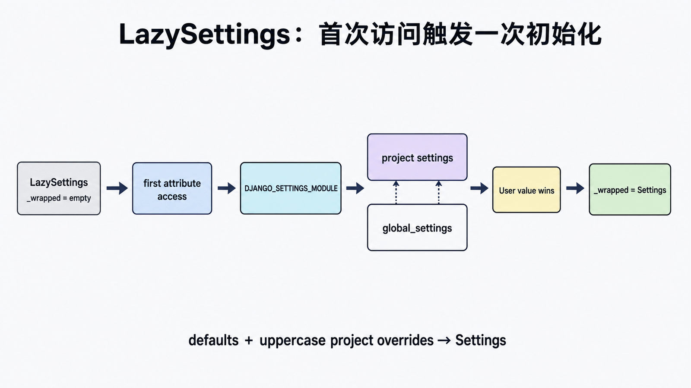

## 前置知识与学习目标

你需要理解环境变量、模块导入和 app 初始化。读完后应能解释 `LazySettings` 的未初始化/已包装状态、`DJANGO_SETTINGS_MODULE`、默认设置与项目覆盖顺序，并用 `override_settings()` 隔离测试。本文不建议在请求期间修改全局配置。

## 关于动态导入模块（importlib）

### 动态导入模块方法1：**import**

> 用于动态导入模块，主要应用于反射或延迟加载场景

- `__import__(module)` 等价于 `import module`

**示例：** 创建 `lib/aa.py`，然后在同级模块中动态导入：

<!-- snippet: id=django-settings-lazy-loading-01 mode=compile python=3.12-3.14 deps=stdlib -->

```python
# lib/aa.py
class C(object):
    def __str__(self):
        return 'C language'
```

<!-- snippet: id=django-settings-lazy-loading-02 mode=compile python=3.12-3.14 deps=stdlib -->

```python
# 动态导入模块
lib = __import__('lib.aa')  # 等价于 import lib
c = lib.aa.C()
print(c)
```

### 动态导入模块方法2：import importlib

<!-- snippet: id=django-settings-lazy-loading-03 mode=compile python=3.12-3.14 deps=stdlib -->

```python
import importlib
aa = importlib.import_module('lib.aa')
c = aa.C()
print(c)
```

## 起步

Django 根据不同的 `subcommand` 加载不同的模块。`settings.py` 中的 `INSTALLED_APPS` 用于加载应用模块。

## settings 的懒加载

> 采用懒加载机制，避免循环引用，只在需要时才加载配置

<!-- snippet: id=django-settings-lazy-loading-04 mode=compile python=3.12-3.14 deps=stdlib -->

```python
# django.conf.settings
settings = LazySettings()

class LazySettings(LazyObject):
    def _setup(self, name=None):
        # 从环境变量获取配置文件路径
        settings_module = os.environ.get(ENVIRONMENT_VARIABLE)
        self._wrapped = Settings(settings_module)

    def __getattr__(self, name):
        # 首次访问时触发加载
        if self._wrapped is empty:
            self._setup(name)
        return getattr(self._wrapped, name)
```

> Django 使用 `LazyObject` 代理类实现懒加载，`_setup` 为实际加载函数

`LazySettings` 重写了 `__getattr__` 方法，访问 `settings.INSTALLED_APPS` 时，实际从 `Settings(settings_module)` 实例获取属性。

## 配置文件的加载

> 环境变量 `DJANGO_SETTINGS_MODULE` 在 `manage.py` 中定义

<!-- snippet: id=django-settings-lazy-loading-05 mode=compile python=3.12-3.14 deps=stdlib -->

```python
os.environ.setdefault("DJANGO_SETTINGS_MODULE", "webui.settings")
```

`Settings` 类加载配置文件：

<!-- snippet: id=django-settings-lazy-loading-06 mode=compile python=3.12-3.14 deps=stdlib -->

```python
class Settings(BaseSettings):
    def __init__(self, settings_module):
        # 加载默认配置
        for setting in dir(global_settings):
            if setting.isupper():
                setattr(self, setting, getattr(global_settings, setting))

        self.SETTINGS_MODULE = settings_module

        # 动态导入用户配置文件
        mod = importlib.import_module(self.SETTINGS_MODULE)

        self._explicit_settings = set()
        # 用户配置覆盖默认配置
        for setting in dir(mod):
            if setting.isupper():
                setattr(self, setting, getattr(mod, setting))
                self._explicit_settings.add(setting)
```

> 加载顺序：先 `global_settings` 默认配置 → 再用用户配置覆盖

## 小结

| 特性       | 说明                       |
| ---------- | -------------------------- |
| 加载机制   | 懒加载（首次访问时加载）   |
| 实现方式   | `LazyObject` 代理类        |
| 配置优先级 | 用户配置 > 默认配置        |
| 优点       | 避免循环引用，提高启动效率 |

## 状态变化与覆盖边界

<!-- figure:s18-f01:start -->



<!-- figure:s18-f01:end -->

`from django.conf import settings` 得到代理对象；首次访问属性时 `_setup()` 读取 `DJANGO_SETTINGS_MODULE`，加载 `global_settings`，再用项目 settings 中的大写名称覆盖。手工 `settings.configure()` 适合独立使用场景，但不能与环境模块初始化混用。

设置应在进程启动时确定。测试使用 `override_settings(LIBRARY_PAGE_SIZE=5)`，不要直接赋值后忘记恢复。密钥来自环境/密钥系统，代码只读取，不在日志或错误页回显。

## 常见误区与验证

- 懒加载主要解决初始化时机与代理访问，不是“每次读取都重新导入”。
- 只有大写名称被当作设置。
- 多环境 settings 模块应保持可审阅覆盖，不要在导入时访问网络。
- 运行时修改全局 settings 会产生线程和测试污染。

## 自检题

1. 首次属性访问时发生什么？
2. 用户设置与 global_settings 谁优先？
3. 测试为何用 override_settings？

<details><summary>答案</summary>

1. 代理加载并包装真实 Settings。2. 用户项目设置覆盖默认值。3. 它提供隔离与自动恢复。

</details>

## 本篇总结、衔接与资料来源

LazySettings 把统一导入路径与延迟初始化结合。下一篇在 Fetch/JSON 请求中应用 CSRF、认证和配置边界。

- [Django settings](https://docs.djangoproject.com/en/6.0/topics/settings/)
- [Settings reference](https://docs.djangoproject.com/en/6.0/ref/settings/)
- [override_settings](https://docs.djangoproject.com/en/6.0/topics/testing/tools/#django.test.override_settings)
