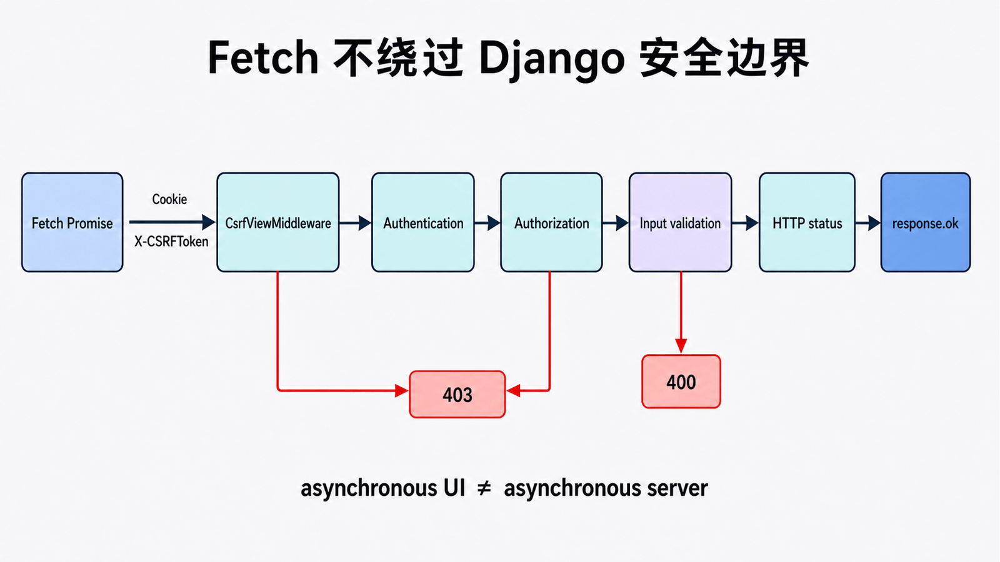
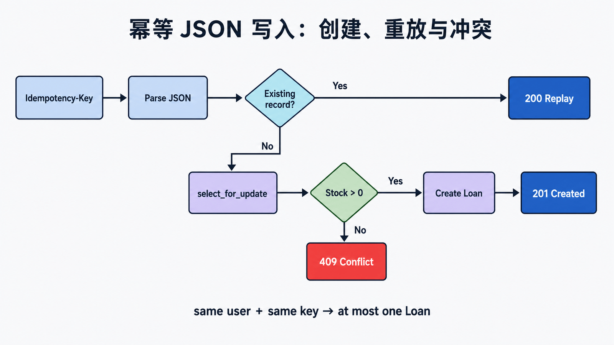

## 前置知识与学习目标

你需要知道认证、CSRF、Form/JSON 校验和 HTTP 状态码。读完后应能解释：

1. “Ajax 请求”为什么仍是普通 HTTP，请求异步与 Django `async def` 有何不同。
2. Fetch 如何携带 CSRF token，服务端如何建立稳定的 JSON 错误合同。
3. 写接口怎样处理大小限制、重复提交、数据库事务和并发冲突。

贯穿请求为 `POST /api/loans/`，输入 `{ "book_id": 42 }`，成功返回 `201` 与借阅 ID。

## 核心机制：浏览器异步不改变服务端安全边界

<!-- figure:s19-f01:start -->



<!-- figure:s19-f01:end -->

Ajax 是历史名称；现代浏览器通常使用 Fetch。页面不刷新，只表示 JavaScript 在等待 Promise，认证、授权、CSRF、输入校验和事务一个都没有消失。`response.ok` 只覆盖 2xx，网络错误与 4xx/5xx 也必须分别处理。

<!-- snippet: id=django-fetch-loan mode=display python=3.12-3.14 deps=stdlib -->

```javascript
const response = await fetch("/api/loans/", {
  method: "POST",
  headers: {
    "Content-Type": "application/json",
    "X-CSRFToken": csrfToken,
    "Idempotency-Key": crypto.randomUUID(),
  },
  credentials: "same-origin",
  body: JSON.stringify({ book_id: 42 }),
});

const payload = await response.json().catch(() => ({}));
if (!response.ok) {
  throw new Error(payload.error?.message ?? `HTTP ${response.status}`);
}
```

同源 Cookie 认证下，Django 的 `CsrfViewMiddleware` 会把 Cookie 与 `X-CSRFToken`/表单 token 做校验。不要为了“让 Ajax 能用”给写接口加 `csrf_exempt`；跨域问题也不能靠关闭 CSRF 解决。

## JSON 视图：输入、输出与失败边界

<!-- figure:s19-f02:start -->



<!-- figure:s19-f02:end -->

<!-- snippet: id=django-json-loan-view mode=project python=3.12-3.14 deps=Django~=6.0 file=loans/api.py -->

```python
import json

from django.contrib.auth.decorators import login_required
from django.db import IntegrityError, transaction
from django.http import JsonResponse
from django.views.decorators.http import require_POST

from catalog.models import Book
from .models import IdempotencyRecord, Loan


def error(code, message, status):
    return JsonResponse({"error": {"code": code, "message": message}}, status=status)


@login_required
@require_POST
def create_loan(request):
    if len(request.body) > 16_384:
        return error("payload_too_large", "请求体超过 16 KiB。", 413)
    try:
        data = json.loads(request.body)
        book_id = int(data["book_id"])
    except (UnicodeDecodeError, json.JSONDecodeError, KeyError, TypeError, ValueError):
        return error("invalid_json", "book_id 必须是整数。", 400)

    key = request.headers.get("Idempotency-Key", "")
    if not key or len(key) > 64:
        return error("invalid_idempotency_key", "缺少有效幂等键。", 400)

    try:
        with transaction.atomic():
            record, created = IdempotencyRecord.objects.get_or_create(
                user=request.user, key=key
            )
            if not created:
                return JsonResponse(record.response_body, status=200)
            book = Book.objects.select_for_update().get(pk=book_id, is_active=True)
            if book.available_copies < 1:
                return error("out_of_stock", "暂无可借库存。", 409)
            loan = Loan.objects.create(member=request.user, book=book)
            book.available_copies -= 1
            book.save(update_fields=["available_copies"])
            record.response_body = {"loan_id": loan.pk}
            record.save(update_fields=["response_body"])
    except Book.DoesNotExist:
        return error("book_not_found", "图书不存在。", 404)
    except IntegrityError:
        return error("conflict", "请求与当前状态冲突。", 409)
    return JsonResponse({"loan_id": loan.pk}, status=201)
```

这里的关键中间状态是“幂等键是否第一次出现”和“锁定后的库存”。生产实现还应给 `(user, key)` 建唯一约束，并记录请求摘要，防止同一键被用于不同正文。

## `async def` 的适用边界

浏览器 Fetch 与视图是否异步互不决定。Django 支持异步视图，但在 WSGI 下会为其创建一次性事件循环；要获得异步栈优势应部署 ASGI，并确认中间件和调用库也是异步兼容的。事务密集、同步 ORM 路径不一定因改写成 `async def` 而更快。

## 常见误区与适用边界

- `JsonResponse` 默认要求顶层为 `dict`；返回列表需明确 `safe=False`，通常仍建议用带版本字段的对象。
- 不要把异常堆栈、模型字段全集或授权细节返回给客户端。
- `200` 不是万能状态：创建用 `201`，校验错误用 `400`，未认证用 `401/登录跳转`，无权用 `403`，状态冲突用 `409`。
- 前端禁用按钮只能改善体验，不能替代服务端幂等。
- 上传文件应使用 `multipart/form-data` 和 `request.FILES`，并独立实施大小、类型、像素与存储隔离。

## 最小行为测试

使用开启 CSRF 检查的 Django test client 覆盖：缺失 CSRF、未登录、错误 JSON、超限正文、图书不存在、库存冲突、首次 `201`、同键重试不重复创建。再用数据库约束证明两个并发请求不能把库存减成负数。

## 自检题

1. Fetch 成功发出请求，为什么仍可能进入 `catch` 之外的错误分支？
2. 为什么禁用提交按钮不能提供幂等性？
3. 把同步视图改成 `async def` 为什么不一定提高吞吐？

<details><summary>答案</summary>

1. Fetch 对 4xx/5xx 通常仍正常解析响应，必须检查 `response.ok`。2. 重试、双标签页、代理和客户端故障都可绕过 UI 状态。3. WSGI、同步中间件、同步 ORM 或阻塞库会保留同步瓶颈并引入切换成本。

</details>

## 本篇总结与下一篇

Ajax 改变的是页面交互，不是 HTTP 安全与一致性。下一篇区分站点静态资产和用户上传媒体，确定开发与生产环境中谁负责服务这些文件。

## 资料来源

- [Django CSRF 指南](https://docs.djangoproject.com/en/6.0/howto/csrf/)
- [JsonResponse](https://docs.djangoproject.com/en/6.0/ref/request-response/#jsonresponse-objects)
- [Django 异步支持](https://docs.djangoproject.com/en/6.0/topics/async/)
