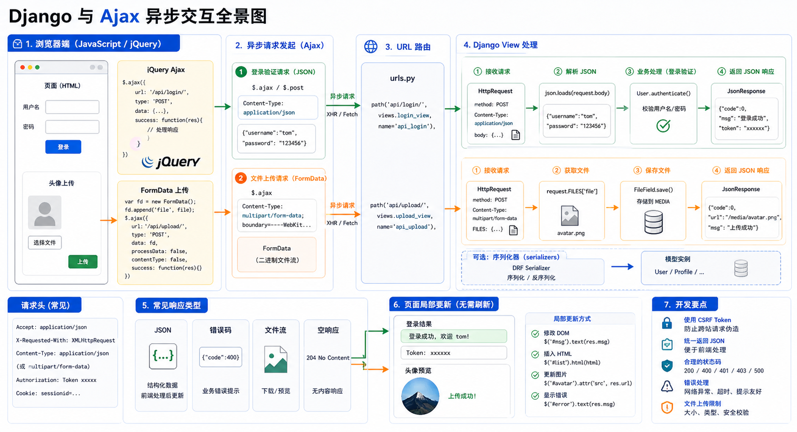

## 什么是Ajax

AJAX（Asynchronous Javascript And XML）翻译成中文就是"异步Javascript和XML"。即使用Javascript语言与服务器进行异步交互，传输的数据为XML（当然，传输的数据不只是XML，现在更多使用json数据）。

**同步交互**：客户端发出一个请求后，需要等待服务器响应结束后，才能发出第二个请求。

**异步交互**：客户端发出一个请求后，无需等待服务器响应结束，就可以发出第二个请求。

AJAX除了**异步**的特点外，还有一个就是：浏览器页面**局部刷新**；（这一特点给用户的感受是在不知不觉中完成请求和响应过程）



### 优点

- AJAX使用Javascript技术向服务器发送异步请求
- AJAX无须刷新整个页面

## 基于jquery的Ajax实现

```javascript
<button class="send_Ajax">send_Ajax</button>

<script>
    $(".send_Ajax").click(function() {
        $.ajax({
            url: "/handle_Ajax/",
            type: "POST",
            data: {username: "Yuan", password: 123},
            success: function(data) {
                console.log(data)
            },
            error: function(jqXHR, textStatus, err) {
                console.log(arguments);
            },
            complete: function(jqXHR, textStatus) {
                console.log(textStatus);
            },
            statusCode: {
                '403': function(jqXHR, textStatus, err) {
                    console.log(arguments);
                },
                '400': function(jqXHR, textStatus, err) {
                    console.log(arguments);
                }
            }
        })
    })
</script>
```

## Ajax执行流程

```
浏览器 -> Ajax -> 服务器 -> Ajax执行流程
```

## 案例

### 案例一：通过Ajax实现加法计算

通过Ajax，实现前端输入两个数字，服务器做加法，返回到前端页面。

**服务器端**

```python
def test_ajax(request):
    n1 = int(request.POST.get('n1'))
    n2 = int(request.POST.get('n2'))
    return HttpResponse(n1 + n2)
```

**前端**

```html
<input type="text" id="num1">+<input type="text" id="num2">=<input type="text" id="sum">
<button id="submit">计算</button>

<script>
    $("#submit").click(function () {
        $.ajax({
            url: '/test_ajax/',
            type: 'post',
            data: {
                n1: $("#num1").val(),
                n2: $("#num2").val()
            },
            success: function (data) {
                console.log(data)
                $("#sum").val(data)
            },
        })
    })
</script>
```

### 案例二：基于Ajax进行登录验证

用户在表单输入用户名与密码，通过Ajax提交给服务器，服务器验证后返回响应信息，客户端通过响应信息确定是否登录成功，成功，则跳转到首页，否则，在页面上显示相应的错误信息。

**服务器端**

```python
def auth(request):
    back_dic = {'user': None, 'message': None}
    name = request.POST.get('user')
    password = request.POST.get('password')
    print(name)
    print(password)
    user = models.user.objects.filter(name=name, password=password).first()
    print(user)
    if user:
        back_dic['user'] = user.name
        back_dic['message'] = '成功'
    else:
        back_dic['message'] = '用户名或密码错误'
    import json
    return HttpResponse(json.dumps(back_dic))
```

**前端**

```html
<script>
    $("#submit3").click(function () {
        $.ajax({
            url: '/auth/',
            type: 'post',
            data: {
                'user': $("#id_name").val(),
                'password': $('#id_password').val()
            },
            success: function (data) {
                var data = JSON.parse(data)
                if (data.user) {
                    location.href = 'https://www.baidu.com'
                } else {
                    $(".error").html(data.message).css({'color': 'red', 'margin-left': '20px'})
                }
            }
        })
    })
</script>
```

**注意**：`traditional: true` 可以序列化一层列表，多层不行，要转成json格式上传。

## 文件上传

### 请求头ContentType

#### 1 application/x-www-form-urlencoded

这应该是最常见的 POST 提交数据的方式了。浏览器的原生`<form>`表单，如果不设置`enctype`属性，那么最终就会以application/x-www-form-urlencoded方式提交数据。请求类似于下面这样：

```
POST http://www.example.com HTTP/1.1
Content-Type: application/x-www-form-urlencoded;charset=utf-8

user=lqz&age=22
```

#### 2 multipart/form-data

这又是一个常见的 POST 数据提交的方式。我们使用表单上传文件时，必须让`<form>`表单的`enctype`等于multipart/form-data。

```
POST http://www.example.com HTTP/1.1
Content-Type:multipart/form-data; boundary=----WebKitFormBoundaryrGKCBY7qhFd3TrwA

------WebKitFormBoundaryrGKCBY7qhFd3TrwA
Content-Disposition: form-data; name="user"

yuan
------WebKitFormBoundaryrGKCBY7qhFd3TrwA
Content-Disposition: form-data; name="file"; filename="chrome.png"
Content-Type: image/png

PNG ... content of chrome.png ...
------WebKitFormBoundaryrGKCBY7qhFd3TrwA--
```

这种方式一般用来上传文件，各大服务端语言对它也有着良好的支持。

#### 3 application/json

这个Content-Type作为响应头大家肯定不陌生。实际上，现在越来越多的人把它作为请求头，用来告诉服务端消息主体是序列化后的JSON字符串。由于JSON规范的流行，除了低版本IE之外的各大浏览器都原生支持JSON.stringify，服务端语言也都有处理JSON的函数，使用JSON不会遇上什么麻烦。

### 基于Form表单上传文件

```html
<form action="/file_put/" method="post" enctype="multipart/form-data">
    用户名：<input type="text" name="name">
    头像：<input type="file" name="avatar" id="avatar1">
    <input type="submit" value="提交">
</form>
```

**必须指定`enctype="multipart/form-data"`**

**视图函数**

```python
def file_put(request):
    if request.method == 'GET':
        return render(request, 'file_put.html')
    else:
        print(request.body)  # 原始的请求体数据
        print(request.GET)  # GET请求数据
        print(request.POST)  # POST请求数据
        print(request.FILES)  # 上传的文件数据

        file_obj = request.FILES.get('avatar')
        print(type(file_obj))
        with open(file_obj.name, 'wb') as f:
            for line in file_obj:
                f.write(line)
        return HttpResponse('ok')
```

### 基于Ajax上传文件

```javascript
$("#ajax_button").click(function () {
    var formdata = new FormData()
    formdata.append('name', $("#id_name2").val())
    formdata.append('avatar', $("#avatar2")[0].files[0])
    $.ajax({
        url: '',
        type: 'post',
        processData: false,  // 告诉jQuery不要去处理发送的数据
        contentType: false,  // 告诉jQuery不要去设置Content-Type请求头
        data: formdata,
        success: function (data) {
            console.log(data)
        }
    })
})
```

浏览器请求头为：

```
Content-Type: multipart/form-data; boundary=----WebKitFormBoundaryA5O53SvUXJaF11O2
```

## Ajax提交json格式数据

```javascript
$("#ajax_test").click(function () {
    var dic = {'name': 'lqz', 'age': 18}
    $.ajax({
        url: '',
        type: 'post',
        contentType: 'application/json',  // 一定要指定格式 contentType: 'application/json;charset=utf-8',
        data: JSON.stringify(dic),  // 转换成json字符串格式
        success: function (data) {
            console.log(data)
        }
    })
})
```

提交到服务器的数据都在`request.body`里，取出来自行处理。

## Django内置的serializers

把对象序列化成json字符串：

```python
from django.core import serializers

def test(request):
    book_list = Book.objects.all()
    ret = serializers.serialize("json", book_list)
    return HttpResponse(ret)
```
