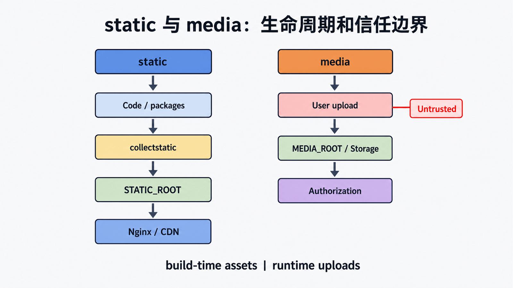

## 前置知识与学习目标

你需要知道 URL、文件路径、上传与 Django settings。读完后应能：

1. 区分源码静态资产、`collectstatic` 输出和用户上传媒体。
2. 解释开发服务器、Nginx/CDN 与对象存储各自的职责。
3. 配置图书封面上传，并验证路径隔离、缓存和安全边界。

## 两类文件不能混在一起

<!-- figure:s20-f01:start -->



<!-- figure:s20-f01:end -->

`static` 是随代码发布的可信资产，如 CSS、JavaScript 和站点图标；`media` 是运行时由用户或后台上传的不可信内容，如图书封面。前者可长时间缓存并带内容哈希，后者需要授权、类型探测、随机文件名、大小限制与不可执行存储。

| 对象         | 来源             | 关键设置                             | 生产服务者                         |
| ------------ | ---------------- | ------------------------------------ | ---------------------------------- |
| 应用静态文件 | 仓库和第三方 app | `STATIC_URL`、`STATIC_ROOT`          | Nginx、CDN 或对象存储              |
| 用户媒体     | 上传请求/后台    | `MEDIA_URL`、`MEDIA_ROOT` 或 Storage | 独立媒体域、对象存储或受控下载视图 |

## 开发环境配置

<!-- snippet: id=django-static-settings mode=project python=3.12-3.14 deps=Django~=6.0 file=config/settings.py -->

```python
from pathlib import Path

BASE_DIR = Path(__file__).resolve().parent.parent

STATIC_URL = "static/"
STATIC_ROOT = BASE_DIR / "var" / "static"
MEDIA_URL = "media/"
MEDIA_ROOT = BASE_DIR / "var" / "media"
```

`django.contrib.staticfiles` 在 `DEBUG=True` 时帮助 `runserver` 查找静态文件。开发媒体路由可用 `static()` 临时追加；它只在 debug 模式工作，不适合生产。

<!-- snippet: id=django-media-dev-urls mode=project python=3.12-3.14 deps=Django~=6.0 file=config/urls.py -->

```python
from django.conf import settings
from django.conf.urls.static import static
from django.contrib import admin
from django.urls import path

urlpatterns = [path("admin/", admin.site.urls)]

if settings.DEBUG:
    urlpatterns += static(settings.MEDIA_URL, document_root=settings.MEDIA_ROOT)
```

模板引用应用静态文件时使用 `` 与 ``；`ImageField` 的媒体 URL 来自 `book.cover.url`。不要用字符串拼接猜路径。

## 生产流程：收集与服务分离

`python manage.py collectstatic --noinput` 按 storage 后端把各 app 的静态文件收集到 `STATIC_ROOT`。应用进程不应在请求中逐个读取并发送大文件；Nginx/CDN 更擅长范围请求、缓存、压缩和零拷贝。部署必须先收集版本化资产，再切换应用版本，避免 HTML 已引用新哈希而文件尚未存在。

媒体文件不要执行 `collectstatic`。使用本地磁盘时，它必须持久化并被备份；多实例部署通常改用共享对象存储。若文件是私有的，可由 Django 完成授权后返回内部重定向头或短期签名 URL，而不是把整个文件读入 Python 内存。

## 上传安全与失败边界

- 同时限制请求体、单文件大小、图片像素和解压后大小，防止压缩炸弹。
- 扩展名和浏览器 `Content-Type` 都不可信；应探测实际类型并重新编码高风险图片。
- 服务端生成随机文件名，拒绝路径穿越；存储目录禁止脚本执行。
- 媒体最好使用与主站不同的域名，并设置 `Content-Disposition`、`X-Content-Type-Options: nosniff` 与合适 CSP。
- 删除数据库记录与删除对象存储文件不是同一事务，需用可重试清理任务和审计记录处理。

## 最小验证

开发环境上传一张封面，确认数据库只保存相对名称、URL 返回正确媒体、非法文件被拒绝。生产发布前运行 `collectstatic --dry-run`（按实际后端能力）、检查目标文件和哈希，再用 `curl -I` 验证静态资源的内容类型、缓存头和 `nosniff`。不要以“浏览器能打开”作为唯一验收。

## 常见误区与适用边界

- `STATIC_ROOT` 是收集目标，不是日常手写源文件目录。
- `MEDIA_ROOT` 与 `STATIC_ROOT` 必须分离。
- `DEBUG=False` 后开发辅助路由不会替你服务媒体。
- 允许外部访问不等于允许匿名访问；私有文件必须先授权。
- WhiteNoise 类应用内方案适合一部分静态部署，但不解决用户媒体的持久化与授权。

## 自检题

1. 为什么用户上传文件不能放进 `STATIC_ROOT`？
2. `collectstatic` 会不会收集 `MEDIA_ROOT`？
3. 私有借阅附件为什么不应直接暴露固定公共 URL？

<details><summary>答案</summary>

1. static 被当作可信、可公开和可长缓存资产，用户文件需要完全不同的安全策略。2. 不会，两条管线独立。3. 固定 URL 绕过逐次授权且难以撤销，宜使用授权下载或短期签名 URL。

</details>

## 本篇总结与下一篇

static 随发布构建，media 随业务产生；两者的信任、生命周期和服务者不同。下一篇把 Nginx、Gunicorn、systemd、数据库迁移和这些文件管线组合成可回滚生产部署。

## 资料来源

- [Django 静态文件管理](https://docs.djangoproject.com/en/6.0/howto/static-files/)
- [staticfiles 应用](https://docs.djangoproject.com/en/6.0/ref/contrib/staticfiles/)
- [文件上传](https://docs.djangoproject.com/en/6.0/topics/http/file-uploads/)
