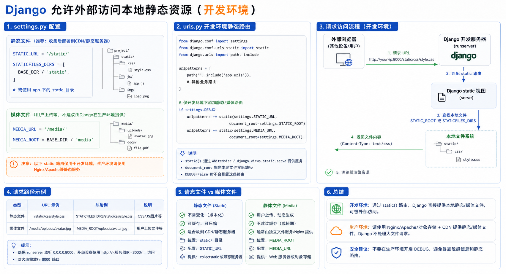

## 简单使用

> 在 Django 中开放外部访问 media 文件的入口



### 第一步：配置 settings

```python
MEDIA_ROOT = os.path.join(BASE_DIR, 'media')
```

### 第二步：配置路由

```python
from django.views.static import serve

url(r'^media/(?P<path>.*)$', serve, {'document_root': settings.MEDIA_ROOT})
```
