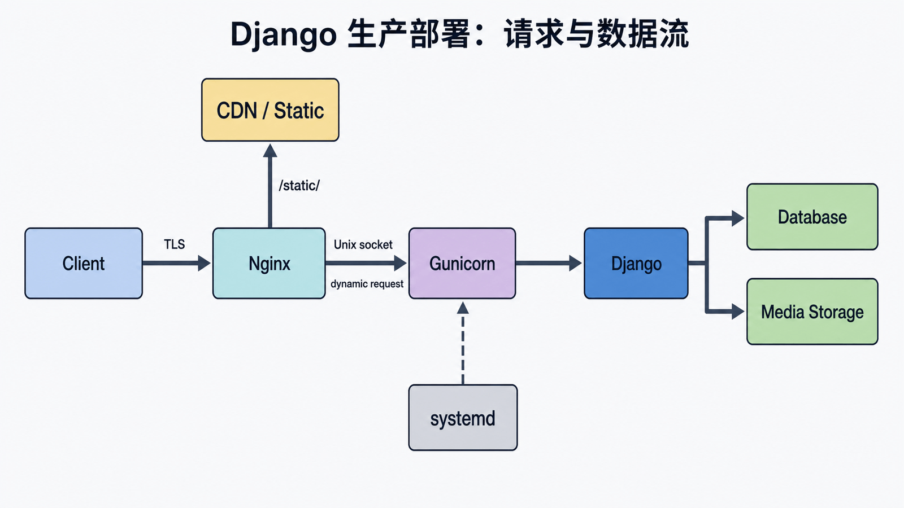
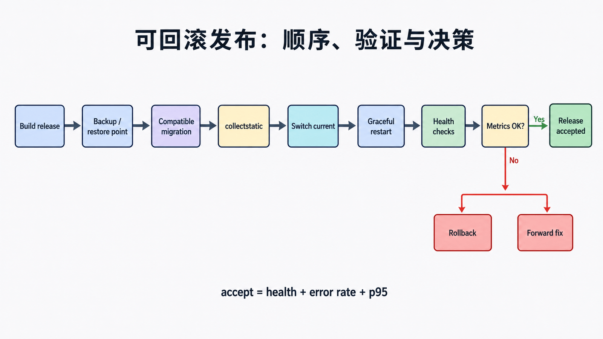

## 前置知识与学习目标

你需要理解 WSGI、settings、静态/媒体文件、Linux 用户和 Unix socket。本文淘汰已结束维护的 CentOS 7、Ubuntu 16.04 与 Python 2 主线，示例基线为 Ubuntu 24.04、Python 3.12+、Django 6.0.x。

读完后应能：

1. 解释 Nginx、Gunicorn、systemd、Django 与数据库的职责和信任边界。
2. 完成环境、迁移、静态文件、进程与反向代理配置。
3. 用健康检查、日志、回滚点和部署清单证明发布成功。

## 生产拓扑与数据流

<!-- figure:s21-f01:start -->



<!-- figure:s21-f01:end -->

客户端 TLS 连接终止在 Nginx。静态文件由 Nginx/CDN 直接返回，动态请求经 Unix socket 交给非 root 的 Gunicorn worker，再进入 `config.wsgi.application`。systemd 只负责进程生命周期；它不替代应用健康检查。数据库与媒体存储位于独立持久层。

```text
Browser -> Nginx -> /static/ 直接响应
                 -> Unix socket -> Gunicorn -> Django -> Database
```

WSGI 适合典型同步请求。需要大量长连接或异步并发时，选择 ASGI 服务器，并重新检查中间件与依赖的异步兼容性；不要只替换启动命令就宣称完成异步化。

## 构建不可变应用环境

<!-- snippet: id=django-deploy-bootstrap mode=display python=3.12-3.14 deps=stdlib -->

```bash
sudo install -d -o library -g www-data /srv/library/releases /srv/library/shared
python3 -m venv /srv/library/releases/20260717/.venv
/srv/library/releases/20260717/.venv/bin/python -m pip install --require-hashes -r requirements.txt
```

依赖应锁定并校验哈希，密钥放在仅服务用户可读的环境文件或密钥系统中。发布目录不可原地覆盖；`current` 软链接指向已验证版本，回滚时可切回上一版本。迁移必须先判断向后兼容性：新增可空字段、回填、切流、再收紧约束通常比一次破坏性迁移安全。

## 发布前 Django 验收

<!-- snippet: id=django-deploy-checks mode=display python=3.12-3.14 deps=stdlib -->

```bash
APP=/srv/library/releases/20260717
$APP/.venv/bin/python $APP/manage.py check --deploy
$APP/.venv/bin/python $APP/manage.py migrate --plan
$APP/.venv/bin/python $APP/manage.py migrate --noinput
$APP/.venv/bin/python $APP/manage.py collectstatic --noinput
```

生产设置至少包括 `DEBUG=False`、精确 `ALLOWED_HOSTS`、外部注入的 `SECRET_KEY`、HTTPS Cookie、安全代理头、数据库连接超时和结构化日志。`check --deploy` 是检查项，不是渗透测试或容量证明。

## systemd：最小权限与可观察进程

<!-- snippet: id=django-gunicorn-systemd mode=display python=3.12-3.14 deps=stdlib file=/etc/systemd/system/library.service -->

```ini
[Unit]
Description=library_site Gunicorn
After=network.target

[Service]
User=library
Group=www-data
WorkingDirectory=/srv/library/current
EnvironmentFile=/etc/library.env
RuntimeDirectory=library
ExecStart=/srv/library/current/.venv/bin/gunicorn config.wsgi:application --bind unix:/run/library/gunicorn.sock --workers 3 --timeout 30 --access-logfile - --error-logfile -
Restart=on-failure
PrivateTmp=true
NoNewPrivileges=true

[Install]
WantedBy=multi-user.target
```

`workers=3` 只是示例，不是公式。最终数量、超时、连接上限和数据库池必须用真实流量与资源压测决定。应用应响应一个轻量健康端点；存活检查不必每次查询数据库，就绪检查可以验证关键依赖但要设置严格超时。

## Nginx：代理头、静态文件和超时边界

<!-- snippet: id=django-nginx-proxy mode=display python=3.12-3.14 deps=stdlib file=/etc/nginx/sites-available/library -->

```nginx
server {
    listen 443 ssl;
    server_name library.example.com;
    client_max_body_size 10m;

    location /static/ {
        alias /srv/library/shared/static/;
        add_header X-Content-Type-Options nosniff always;
    }

    location / {
        proxy_set_header Host $host;
        proxy_set_header X-Forwarded-Proto $scheme;
        proxy_set_header X-Forwarded-For $proxy_add_x_forwarded_for;
        proxy_connect_timeout 3s;
        proxy_read_timeout 35s;
        proxy_pass http://unix:/run/library/gunicorn.sock;
    }
}
```

只有确实信任并控制代理链时才配置 `SECURE_PROXY_SSL_HEADER`。Nginx、Gunicorn 与下游超时应形成明确预算，避免外层已断开、内层仍持续占用 worker。用户媒体应按第 20 篇的策略放在独立存储或授权下载路径。

## 可回滚发布流程

<!-- figure:s21-f02:start -->



<!-- figure:s21-f02:end -->

1. 构建并测试新 release，保存上一版本和数据库备份/恢复点。
2. 执行兼容迁移和 `collectstatic`，不删除旧哈希资产。
3. `nginx -t`、`systemd-analyze verify`，再切换 `current`。
4. 优雅重启 worker，检查 `/health/`、错误率、p95 延迟、数据库连接和日志。
5. 指标异常则切回旧 release；若迁移不可逆，按预先演练的前向修复方案处理。

## 常见误区与适用边界

- `runserver` 没有生产稳定性、安全和性能承诺。
- 不用 root 运行应用，不把 `.env`、源码仓库或媒体目录暴露为静态根。
- “进程 active”不等于应用可用，必须发真实 HTTP 探针。
- 不在发布窗口临时发明回滚；迁移兼容策略需要提前设计和演练。
- uWSGI 仍可作为 WSGI 服务器，但本文选择 Gunicorn 是为了聚焦职责，不代表协议只能由它实现。

## 自检题

1. 为什么静态文件不应由 Gunicorn worker 常规返回？
2. `systemctl status` 显示 active，为什么仍不能判定发布成功？
3. 增加非空列为什么可能阻断旧版本回滚？

<details><summary>答案</summary>

1. 代理/CDN 更擅长文件缓存、范围请求和零拷贝，应用 worker 应留给动态请求。2. 进程可能启动但路由、数据库、设置或迁移仍错误。3. 旧代码可能不会提供新字段值，数据库约束会拒绝其写入。

</details>

## 本篇总结与下一篇

生产部署是代理、进程、配置、数据和发布协议的组合，不是一组复制粘贴命令。下一篇配置 Django Admin，让可信运营人员在权限、审计和性能边界内管理书籍。

## 资料来源

- [Django 部署指南](https://docs.djangoproject.com/en/6.0/howto/deployment/)
- [Django 部署检查清单](https://docs.djangoproject.com/en/6.0/howto/deployment/checklist/)
- [使用 Gunicorn 部署 Django](https://docs.djangoproject.com/en/6.0/howto/deployment/wsgi/gunicorn/)
