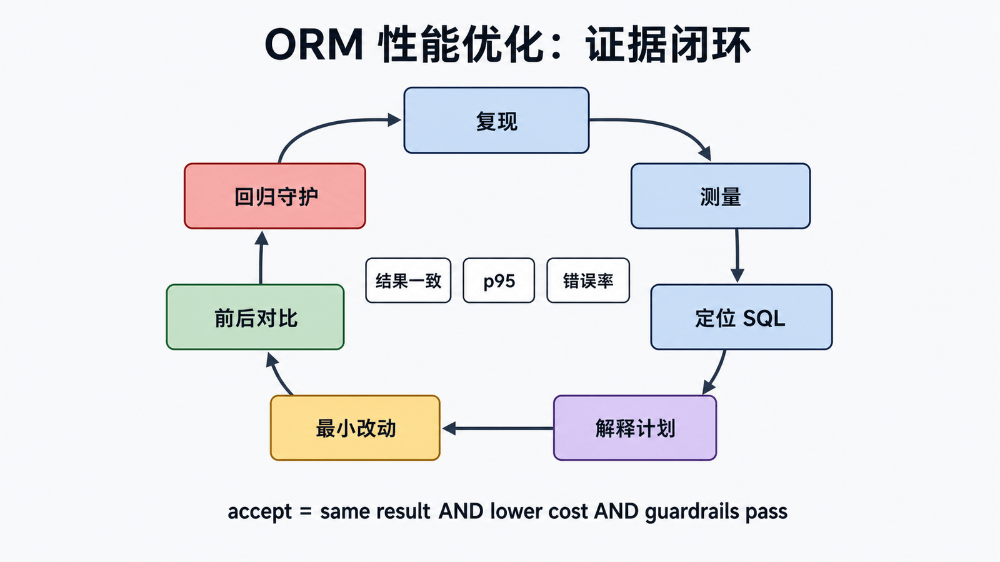
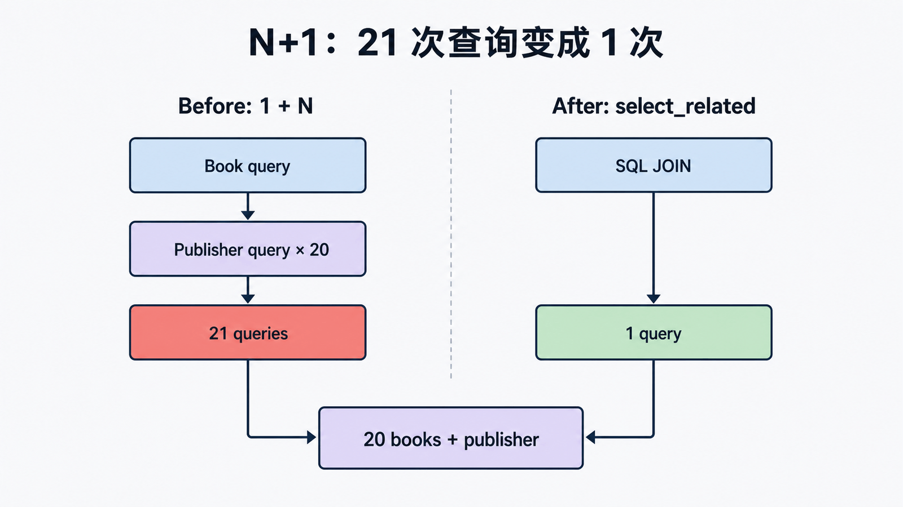

## 前置知识与学习目标

你需要掌握 QuerySet、关联加载、分页和 Admin。读完后应能：

1. 从慢页面建立查询数量、重复 SQL、数据库时间和响应延迟基线。
2. 识别 N+1、过量加载、错误聚合与缺失索引，并选择最小改动。
3. 用 `explain()`、真实数据和查询预算证明优化有效且语义未变。

贯穿页面显示 20 本书、作者名与未归还次数。目标不是“零查询”，而是在正确性、延迟、内存和写成本之间建立可守护的预算。

## 证据闭环

<!-- figure:s23-f01:start -->



<!-- figure:s23-f01:end -->

```text
复现 -> 测量 -> 定位 SQL -> 解释计划 -> 最小改动 -> 对比 -> 回归守护
```

先固定请求、数据规模、数据库版本、冷/热缓存和并发条件。开发环境可查看 `connection.queries`，但它依赖 `DEBUG` 且有额外开销；生产使用 APM、慢查询日志和数据库统计。不要在生产为排障长期打开 `DEBUG=True`。

## 第一类问题：N+1

<!-- figure:s23-f02:start -->



<!-- figure:s23-f02:end -->

<!-- snippet: id=django-orm-opt-n-plus-one mode=project python=3.12-3.14 deps=Django~=6.0 -->

```python
# 1 条 Book 查询 + 每本书 1 条 publisher 查询
books = Book.objects.order_by("title", "id")[:20]
for book in books:
    print(book.publisher.name)

# 外键是单值关系，用 JOIN 合并
books = Book.objects.select_related("publisher").order_by("title", "id")[:20]
```

多值 `loans` 不能直接用 `select_related()`，应使用过滤后的 `Prefetch` 或聚合。选择依据来自第 4 篇的关系形状，不再重复 API 定义。

```python
from django.db.models import Count, Q

books = (
    Book.objects.select_related("publisher")
    .annotate(open_loan_count=Count("loans", filter=Q(loans__returned_at__isnull=True)))
    .order_by("title", "id")[:20]
)
```

聚合 JOIN 可能因多个一对多关系产生笛卡尔放大；用小型种子数据验证计数守恒，必要时使用 `distinct=True`、子查询或拆分查询。

## 第二类问题：读取和求值超出需要

- 只判断存在时用 `.exists()`；但如果随后一定迭代同一 QuerySet，额外的 exists 查询可能更慢。
- 只要标量投影时用 `values_list(..., flat=True)`；需要模型方法和关系时保留实例。
- `only()`/`defer()` 可能在稍后访问延迟字段时制造额外查询，先用 profile 证明宽行是瓶颈。
- 流式处理大结果可考虑 `.iterator(chunk_size=...)`，但要评估预取、数据库游标与事务持续时间。
- 批量写减少往返，但会改变逐对象 `save()`/信号语义，并受数据库参数上限限制。

## 第三类问题：索引与执行计划

ORM 优化不能绕过数据库。索引应由查询形状驱动：等值过滤列、范围列、排序列与选择性共同决定复合索引顺序。索引会增加写放大和存储，不能为每个字段机械添加。

<!-- snippet: id=django-orm-opt-explain mode=project python=3.12-3.14 deps=Django~=6.0 -->

```python
queryset = Book.objects.filter(is_active=True).order_by("title", "id")
print(queryset.explain())
```

`explain()` 输出和可用选项依数据库而异；带执行的 analyze 选项可能真正运行查询，对写语句或高成本查询必须谨慎。检查估算行数、扫描方式、排序和实际行数差异，而不是只找某个“好”关键字。

## 分页与缓存边界

OFFSET 深分页可能扫描并丢弃大量行；连续翻页可使用基于完整稳定排序键的 keyset 游标，但会牺牲任意跳页。缓存应在查询正确、失效规则清晰后使用；缓存一个 N+1 页面只会把问题隐藏到失效瞬间。

## 用测试锁定预算

<!-- snippet: id=django-orm-opt-query-budget mode=project python=3.12-3.14 deps=Django~=6.0 file=catalog/tests/test_views.py -->

```python
from django.test import TestCase
from django.urls import reverse


class BookListQueryBudgetTests(TestCase):
    def test_book_list_query_budget(self):
        # 工厂先创建足够数据；不要把 fixture 查询计入请求预算。
        with self.assertNumQueries(3):
            response = self.client.get(reverse("book-list"))
            self.assertEqual(response.status_code, 200)
```

预算数字必须来自当前实现并注明包含哪些查询；会因认证、会话或数据库后端变化而调整。查询数相同也可能因执行计划退化而变慢，因此还需端到端延迟和数据库指标。

## 常见误区与适用边界

- 不要凭“ORM 看起来复杂”猜测慢点；先抓 SQL 与时间。
- 不要把 `count()`、`exists()`、`only()` 当无条件最佳实践。
- 不要在没有结果守恒测试时重写 JOIN/聚合。
- 不要用 SQLite 的计划推断 PostgreSQL/MySQL 生产行为。
- 不要只优化平均值；关注 p95/p99、锁等待、连接池和错误率护栏。

## 最小验收表

记录优化前后：数据规模、请求查询数、重复 SQL 数、数据库时间、p95、峰值内存、执行计划摘要和写入开销。只有结果一致、主要指标改善、护栏未退化且回归测试通过，才接受改动。

## 自检题

1. `exists()` 为什么可能增加而不是减少查询？
2. 查询数从 21 降到 2，为什么仍不能直接宣布优化成功？
3. 为什么索引不是越多越好？

<details><summary>答案</summary>

1. 随后若仍迭代原 QuerySet，会再执行一次结果查询。2. 还需验证结果语义、执行计划、延迟、内存和并发写影响。3. 索引消耗存储并增加写入、维护和规划成本。

</details>

## 本篇总结与系列收束

可靠优化从证据开始，以回归预算结束：解释 SQL、验证结果、比较计划、测量延迟并守住错误率和写成本。至此，`library_site` 已从最小页面走过运行时、组件、安全、部署与性能闭环；后续演进应继续遵循“先定义边界，再用测试和指标证明”的方法。

## 资料来源

- [Django 数据库优化](https://docs.djangoproject.com/en/6.0/topics/db/optimization/)
- [QuerySet.explain](https://docs.djangoproject.com/en/6.0/ref/models/querysets/#explain)
- [Django 测试工具](https://docs.djangoproject.com/en/6.0/topics/testing/tools/)
