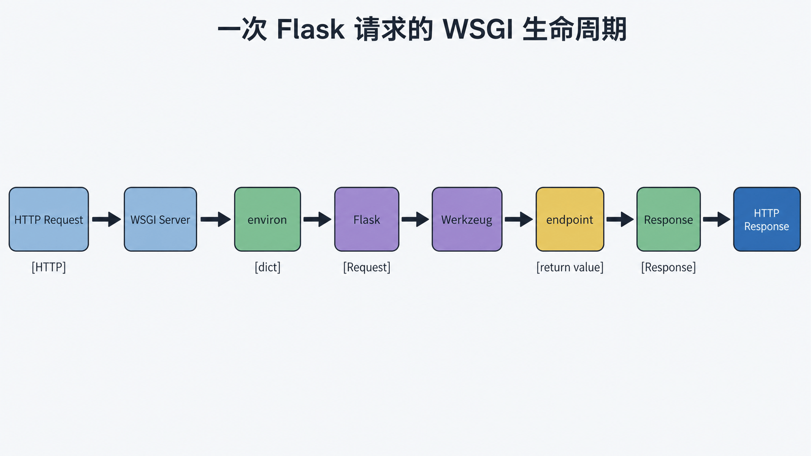
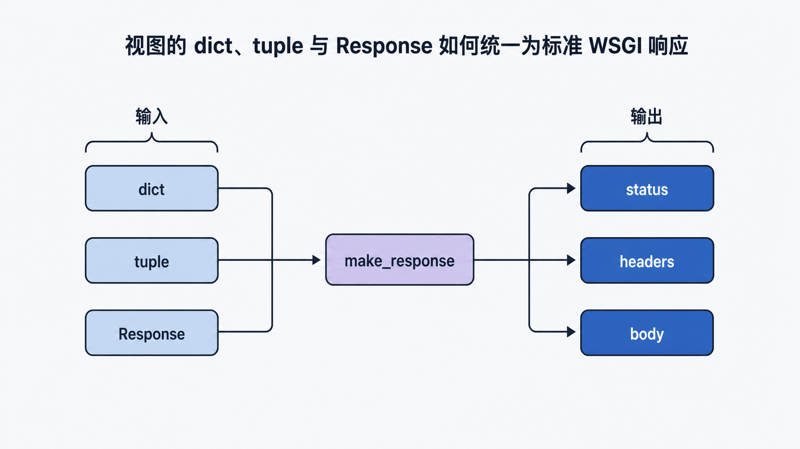

## 前置知识与学习目标

你只需要会运行 Python、理解函数和字典，并知道浏览器通过 HTTP 请求服务器。本系列将持续构建一个 **TaskBoard 任务看板**：用户登录后创建任务、按状态筛选并分页浏览，最后把应用部署到生产环境。

学完本篇，你应该能：

1. 解释 HTTP 服务器、WSGI 服务器、Werkzeug 与 Flask 各自负责什么。
2. 沿着一次请求说清 `environ -> Request -> 视图 -> Response` 的转换。
3. 用 Flask 测试客户端验证状态码、JSON 和失败路径，而不是只看浏览器页面。

## 从一个问题切入：`app.run()` 到底运行了什么

下面的程序能返回一条任务，但“能访问”不等于“理解了调用链”。

```python
from flask import Flask, jsonify

app = Flask(__name__)

@app.get("/tasks/<int:task_id>")
def get_task(task_id: int):
    if task_id != 1:
        return {"error": "task not found"}, 404
    return jsonify(id=1, title="阅读 Flask 调用链", done=False)

if __name__ == "__main__":
    app.run(debug=True)
```

开发服务器接收 HTTP 请求后，并不是直接调用 `get_task`。它先把请求翻译为 WSGI 约定的数据，再把 Flask 应用当作一个 WSGI callable 调用。`debug=True` 只适合本地开发；生产环境不能使用开发服务器或调试器。

## 核心机制：HTTP 到 WSGI，再到 Flask

<!-- figure-anchor:s01-f01 -->

<!-- figure:s01-f01:start -->



<!-- figure:s01-f01:end -->

WSGI 是 Python Web 服务器与 Web 应用之间的同步调用约定。服务器调用应用时传入两个对象：

- `environ`：一个字典，包含请求方法、路径、查询参数、请求体流和服务器信息。
- `start_response`：应用用它提交状态行与响应头。
- 应用返回一个可迭代的 bytes 序列作为响应体。

最小 WSGI 应用可以写成：

```python
def application(environ, start_response):
    method = environ["REQUEST_METHOD"]
    path = environ.get("PATH_INFO", "/")
    body = f"{method} {path}".encode("utf-8")
    start_response(
        "200 OK",
        [
            ("Content-Type", "text/plain; charset=utf-8"),
            ("Content-Length", str(len(body))),
        ],
    )
    return [body]
```

Flask 实例实现了这个 callable 协议。Werkzeug 在中间完成两类关键工作：

1. `Request` 把 `environ` 包装成可读的请求对象，例如 `request.args`、`request.form`。
2. `Response` 把视图返回值标准化为状态、响应头和 bytes 响应体。

<!-- figure-anchor:s01-f02 -->

<!-- figure:s01-f02:start -->



<!-- figure:s01-f02:end -->

因此完整主路径是：

```text
HTTP request
  -> WSGI server builds environ
  -> Flask creates request context
  -> Werkzeug matches URL rule
  -> Flask calls endpoint
  -> return value becomes Response
  -> WSGI server sends HTTP response
```

Flask 负责应用级调度，Werkzeug 提供底层 WSGI、路由和请求响应工具；Jinja 负责模板，Click 负责命令行。所谓“微框架”是核心保持小而可组合，不是功能简陋。

## 返回值如何变成响应

视图可以返回多种形态，Flask 会统一调用 `make_response` 语义完成转换：

```python
@app.get("/health")
def health():
    return {"status": "ok"}, 200, {"Cache-Control": "no-store"}
```

这三个位置依次是 body、status、headers。字典会被 JSON 化；字符串会变成文本响应；`Response` 实例会直接使用。返回裸列表、生成器或流式响应时还要考虑序列化和上下文生命周期，不能只凭“本地能跑”判断安全。

## 最小行为测试：验证成功与失败

测试客户端在进程内构造 WSGI 请求，不需要占用端口：

```python
def test_get_task():
    client = app.test_client()

    ok = client.get("/tasks/1")
    assert ok.status_code == 200
    assert ok.get_json() == {
        "id": 1,
        "title": "阅读 Flask 调用链",
        "done": False,
    }

    missing = client.get("/tasks/999")
    assert missing.status_code == 404
    assert missing.get_json()["error"] == "task not found"
```

输入是路径和方法；关键中间状态是匹配到的 endpoint 与 `task_id=1`；输出是状态码、响应头和响应体。路由不存在与任务不存在都可能是 404，但前者发生在路由匹配阶段，后者发生在业务视图中。

## Flask 与 Django 怎么选

选择框架应看约束，不看“轻”或“重”的标签：

| 约束     | Flask 更合适                     | Django 更合适                 |
| -------- | -------------------------------- | ----------------------------- |
| 项目形态 | 小型服务、定制集成、逐步组装     | 需要统一约定的完整站点        |
| 内置能力 | 希望自行选择 ORM、认证与管理后台 | 希望开箱获得 ORM、Admin、认证 |
| 团队治理 | 团队能维护自己的架构约定         | 团队希望框架提供强约定        |

Flask 不会自动解决目录失控、权限设计、数据库事务或可观测性；自由度越高，团队越需要明确边界。

## 常见误区与适用边界

- **把 `app.run` 当生产服务器**：它用于开发便利，不以生产安全、稳定和吞吐为目标。
- **把 Flask 等同 HTTP 服务器**：Flask 是 WSGI 应用，生产中通常由 Gunicorn 等 WSGI 服务器承载。
- **把 WSGI 当异步协议**：WSGI 是同步接口。需要原生 ASGI 生态时，应评估 ASGI 框架或适配层。
- **只测 200**：至少同时验证状态码、响应结构与一条失败路径。
- **在响应中泄露异常详情**：调试器只应在可信本地环境启用。

## 自检题

1. `environ` 与 Flask 的 `request` 是同一个层级的对象吗？
2. 为什么测试客户端不需要真的监听端口？
3. `GET /tasks/999` 和 `GET /unknown` 都返回 404，它们的失败阶段有何不同？

<details>
<summary>答案</summary>

1. 不是。`environ` 是 WSGI 字典，`request` 是 Werkzeug 基于它构造并由 Flask 上下文代理暴露的对象。
2. 测试客户端直接构造 WSGI 调用，在进程内执行应用并收集响应。
3. 前者通常已匹配路由，在业务视图中发现资源不存在；后者在 URL 匹配阶段就失败。

</details>

## 本篇总结

一次 Flask 请求的主线是：服务器把 HTTP 转成 WSGI `environ`，Flask 建立上下文并让 Werkzeug 匹配路由，视图返回值再被标准化为响应。理解这条链，后续的路由、上下文、认证和部署才有稳定坐标。

## 下一篇衔接

下一篇把注意力放到链路中段：路由规则如何匹配、视图如何读取输入并构造输出，以及配置为什么必须在处理请求前完成。

## 资料来源

- [Flask 官方文档：Welcome to Flask](https://flask.palletsprojects.com/en/stable/)
- [Werkzeug 官方文档：Request / Response Objects](https://werkzeug.palletsprojects.com/en/stable/wrappers/)
- [Flask 官方文档：Deploying to Production](https://flask.palletsprojects.com/en/stable/deploying/)
- [PEP 3333：Python Web Server Gateway Interface](https://peps.python.org/pep-3333/)
