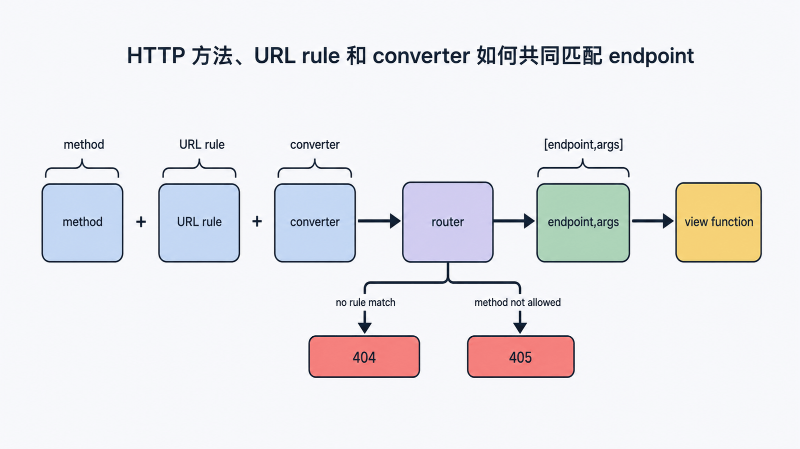
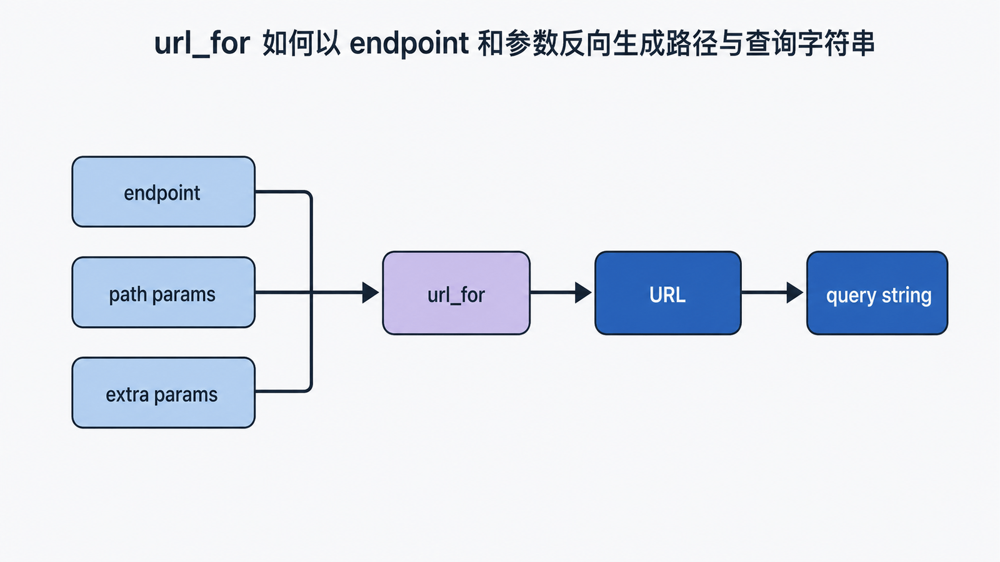
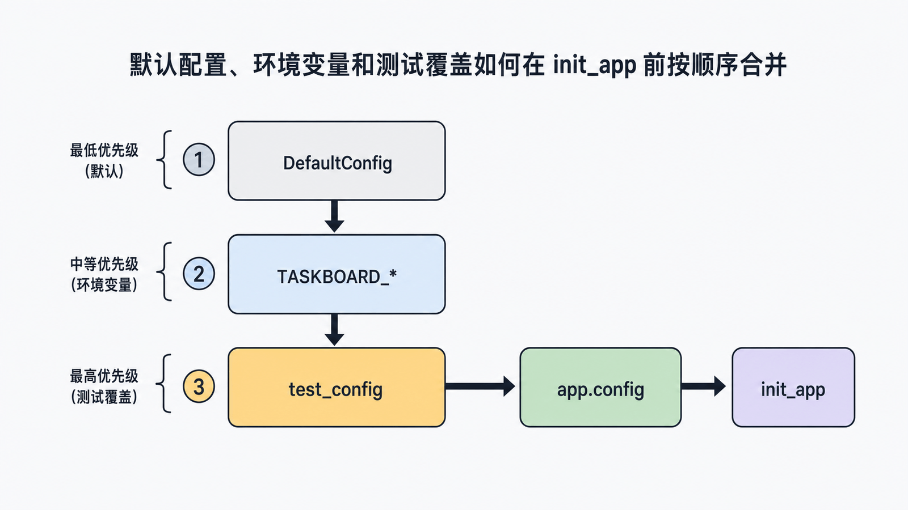

## 前置知识与学习目标

你应已理解 WSGI 请求会进入 Flask，并最终变成 `Response`。本篇只解决一个问题：**Flask 如何把请求稳定地分派给正确视图，并让不同环境使用正确配置？**

学完后你能够：

1. 区分 URL rule、endpoint 与 view function。
2. 解释方法、转换器、尾斜杠和 `url_for` 的行为。
3. 按“默认值 → 环境配置 → 测试覆盖”加载配置，并在初始化前冻结它。
4. 用测试客户端验证 200、404、405 和配置差异。

## 场景：TaskBoard 的任务接口

我们需要三个动作：

```text
GET    /tasks          列出任务
POST   /tasks          创建任务
GET    /tasks/<int:id> 查询单个任务
```

URL 只是外部地址，endpoint 才是 Flask 内部反向生成 URL 和定位视图的稳定标识。

## 路由表的三个对象

<!-- figure-anchor:s02-f01 -->

<!-- figure:s02-f01:start -->



<!-- figure:s02-f01:end -->

`@app.get("/tasks")` 是 `app.add_url_rule` 的声明式写法：

```python
from flask import Flask, request, url_for

app = Flask(__name__)

@app.get("/tasks", endpoint="task_list")
def list_tasks():
    status = request.args.get("status", "open")
    return {"items": [], "filter": status}

def create_task():
    payload = request.get_json(silent=True) or {}
    title = str(payload.get("title", "")).strip()
    if not title:
        return {"error": "title is required"}, 400
    return {"id": 1, "title": title, "done": False}, 201

app.add_url_rule(
    "/tasks",
    endpoint="task_create",
    view_func=create_task,
    methods=["POST"],
)
```

路由记录至少包含：

- **rule**：`/tasks` 或 `/tasks/<int:task_id>`。
- **methods**：允许的 HTTP 方法。
- **endpoint**：内部名称，蓝图中通常是 `blueprint_name.view_name`。
- **view_func**：匹配成功后调用的 Python 函数。

相同路径可以按方法分派到不同 endpoint；相同 endpoint 则不能无意重复注册。

## 转换器与失败阶段

```python
@app.get("/tasks/<int:task_id>")
def task_detail(task_id: int):
    return {"id": task_id}
```

`int` 转换器不仅把字符串转为整数，也参与匹配：

| 请求              | 结果 | 原因                      |
| ----------------- | ---- | ------------------------- |
| `GET /tasks/7`    | 200  | rule 和方法都匹配         |
| `GET /tasks/abc`  | 404  | `abc` 不满足 `int` 转换器 |
| `DELETE /tasks/7` | 405  | 路径匹配，但方法不允许    |

以斜杠结尾的 rule 通常表示“分支”。默认严格斜杠行为可能把缺少尾斜杠的请求重定向到规范地址。API 客户端对 308 重定向的处理可能不同，因此应在接口设计阶段统一风格。

## 用 `url_for` 反向生成 URL

<!-- figure-anchor:s02-f02 -->

<!-- figure:s02-f02:start -->



<!-- figure:s02-f02:end -->

```python
with app.test_request_context():
    assert url_for("task_detail", task_id=7) == "/tasks/7"
    assert url_for("task_list", status="open") == "/tasks?status=open"
```

`url_for` 接收 endpoint，而不是函数调用结果。这样改动路径时，调用方不必散落硬编码。多余参数会进入查询字符串；缺少必需路径参数会抛出 `BuildError`。

## 请求输入与响应输出

输入来源要按语义区分：

- 路径参数：资源身份，如 `task_id`。
- 查询参数：筛选、排序、分页，如 `?status=open`。
- JSON 或表单体：创建或修改资源的数据。
- 请求头：内容协商、追踪、认证信息。

不要把“字段缺失”“JSON 语法错误”“资源不存在”混成同一种 400。稳定 API 应返回明确状态码和可机器识别的错误结构。

```python
@app.post("/tasks")
def create_task_v2():
    if not request.is_json:
        return {"error": "content_type", "message": "JSON required"}, 415

    payload = request.get_json()
    title = str(payload.get("title", "")).strip()
    if not title:
        return {"error": "validation", "fields": {"title": "required"}}, 422

    return {"id": 2, "title": title, "done": False}, 201
```

## 配置必须先于扩展初始化

<!-- figure-anchor:s02-f03 -->

<!-- figure:s02-f03:start -->



<!-- figure:s02-f03:end -->

推荐按可预测的覆盖顺序加载：

```python
import os
from flask import Flask

class DefaultConfig:
    TESTING = False
    TASKS_PER_PAGE = 20
    SECRET_KEY = None

def create_app(test_config=None):
    app = Flask(__name__)
    app.config.from_object(DefaultConfig)
    app.config.from_prefixed_env(prefix="TASKBOARD")

    if test_config is not None:
        app.config.from_mapping(test_config)

    if not app.config["SECRET_KEY"]:
        raise RuntimeError("SECRET_KEY is required")

    return app
```

环境变量 `TASKBOARD_TASKS_PER_PAGE=50` 会映射为配置键。秘密信息不应提交到仓库。更重要的是，许多扩展只在 `init_app` 时读取配置；初始化后再改数据库 URI 或 session backend，通常不会重新配置已经创建的对象。

## 最小行为测试

```python
def test_route_boundaries():
    client = app.test_client()

    assert client.get("/tasks/7").status_code == 200
    assert client.get("/tasks/not-an-int").status_code == 404
    assert client.delete("/tasks/7").status_code == 405

def test_config_override():
    test_app = create_app(
        {"TESTING": True, "SECRET_KEY": "test-only", "TASKS_PER_PAGE": 3}
    )
    assert test_app.config["TESTING"] is True
    assert test_app.config["TASKS_PER_PAGE"] == 3
```

测试输入、预期状态和失败阶段必须明确。测试密钥只用于测试，不能复制到生产配置。

## 常见误区与适用边界

- **路径与 endpoint 混用**：`url_for("/tasks")` 是错的，它需要 endpoint。
- **用 GET 修改状态**：GET 应保持安全、可缓存语义；创建任务使用 POST。
- **在模块导入时读取请求**：`request` 只在请求上下文内有效。
- **初始化扩展后再改配置**：可能出现“配置看似变了，扩展仍用旧值”。
- **把所有异常都返回 200**：这破坏客户端重试、监控和缓存判断。
- **从不可信输入导入 Python 配置文件**：`from_pyfile` 会执行 Python 代码，只能加载可信文件。

## 自检题

1. rule、endpoint、view function 分别回答什么问题？
2. 为什么 `/tasks/abc` 对 `<int:task_id>` 通常是 404，而不是视图返回的 400？
3. 为什么测试覆盖应放在扩展初始化之前？

<details>
<summary>答案</summary>

1. rule 描述外部路径，endpoint 是内部稳定标识，view function 是实际处理函数。
2. 转换器在路由匹配阶段拒绝了该路径，视图根本没有被调用。
3. 测试需要让扩展从一开始读取测试配置；初始化后修改可能不会重建扩展状态。

</details>

## 本篇总结

路由不是“路径映射到函数”这么简单，而是方法、rule、转换器、endpoint 与视图共同形成的分派合同。配置也不是随时可变的全局字典：应在工厂中按顺序加载，并在扩展初始化前完成。

## 下一篇衔接

当路由和配置增多，单文件应用会失去边界。下一篇用蓝图拆分模块，并解释应用上下文、请求上下文和数据库连接为什么必须随请求生命周期释放。

## 资料来源

- [Flask 官方文档：URL Route Registrations](https://flask.palletsprojects.com/en/stable/api/#url-route-registrations)
- [Werkzeug 官方文档：URL Routing](https://werkzeug.palletsprojects.com/en/stable/routing/)
- [Flask 官方文档：Configuration Handling](https://flask.palletsprojects.com/en/stable/config/)
- [Flask 官方文档：Testing Flask Applications](https://flask.palletsprojects.com/en/stable/testing/)
