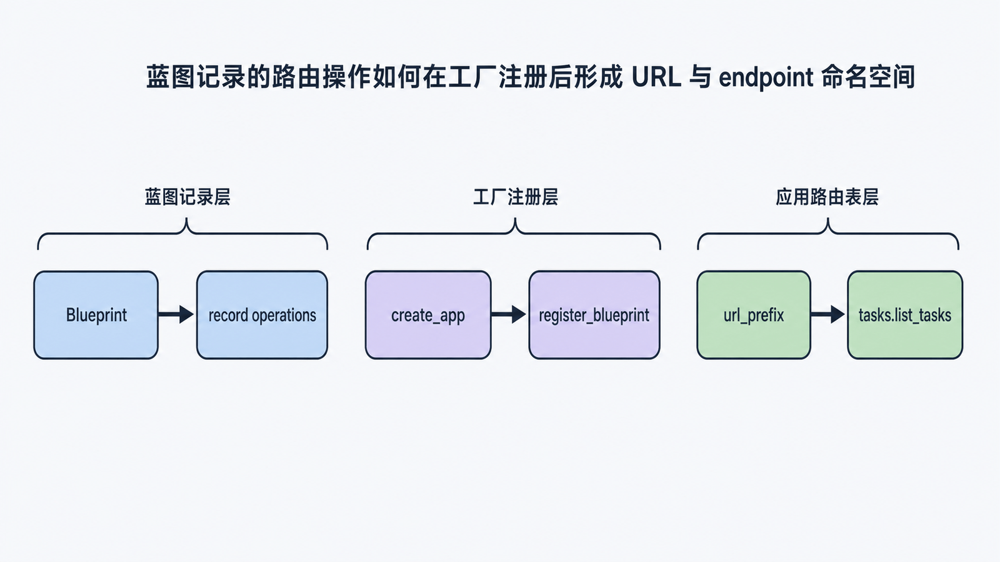
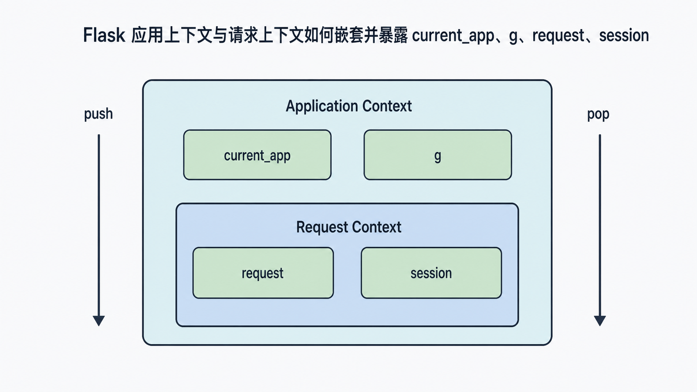
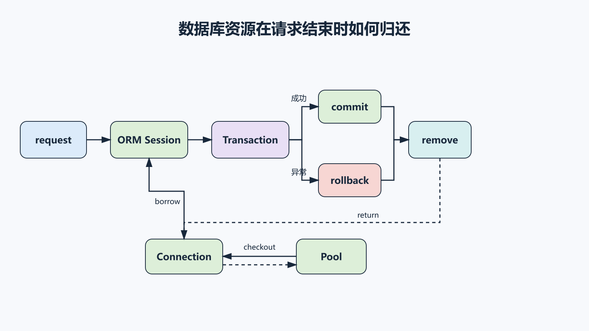

## 前置知识与学习目标

你应已理解路由、endpoint 和配置加载顺序。本篇只解决：**模块拆分后，路由注册与请求级数据库资源如何保持明确生命周期？**

完成后你能够：

1. 解释蓝图是“待注册操作的集合”，不是独立 Flask 应用。
2. 区分应用上下文与请求上下文，并知道 `current_app`、`g`、`request` 的可用范围。
3. 区分连接池、连接与 ORM Session，不把它们作为跨请求全局对象滥用。
4. 为连接获取、事务回滚和资源释放写最小测试。

## 场景：把 TaskBoard 拆成模块

一个可维护的最小目录可以是：

```text
taskboard/
├── __init__.py          # create_app
├── extensions.py        # 扩展对象，不绑定具体 app
├── tasks/
│   ├── __init__.py      # tasks_bp
│   └── views.py
└── auth/
    ├── __init__.py      # auth_bp
    └── views.py
```

目录结构不是目的。真正边界是：模块只声明自己的路由和行为，应用工厂负责配置、初始化与注册。

## 蓝图记录操作，应用完成注册

<!-- figure-anchor:s03-f01 -->

<!-- figure:s03-f01:start -->



<!-- figure:s03-f01:end -->

```python
# taskboard/tasks/views.py
from flask import Blueprint, jsonify

tasks_bp = Blueprint("tasks", __name__)

@tasks_bp.get("/")
def list_tasks():
    return jsonify(items=[])
```

```python
# taskboard/__init__.py
from flask import Flask
from .tasks.views import tasks_bp

def create_app(test_config=None):
    app = Flask(__name__)
    app.config.from_mapping(SECRET_KEY="dev-only")
    if test_config:
        app.config.from_mapping(test_config)

    app.register_blueprint(tasks_bp, url_prefix="/tasks")
    return app
```

注册后 endpoint 是 `tasks.list_tasks`，外部路径是 `/tasks/`。蓝图名称提供 endpoint 命名空间；`url_prefix` 决定挂载路径。一个蓝图可以按不同名称或前缀注册多次，但蓝图一旦注册进已创建的应用，不能像插件一样随意卸载。

## 两层上下文解决什么问题

<!-- figure-anchor:s03-f02 -->

<!-- figure:s03-f02:start -->



<!-- figure:s03-f02:end -->

一次请求通常会同时推入两层上下文：

| 上下文              | 主要代理             | 生命周期         |
| ------------------- | -------------------- | ---------------- |
| Application Context | `current_app`、`g`   | 当前应用活动期间 |
| Request Context     | `request`、`session` | 当前请求活动期间 |

`current_app` 避免在模块导入时绑定一个全局应用实例；`g` 是当前应用上下文中的临时存储，适合缓存“本次请求第一次用到时才创建”的资源。

```python
from flask import current_app, g

def get_db():
    if "db" not in g:
        g.db = current_app.config["DB_CONNECT"]()
    return g.db

def close_db(error=None):
    connection = g.pop("db", None)
    if connection is not None:
        if error is not None:
            connection.rollback()
        connection.close()

def init_app(app):
    app.teardown_appcontext(close_db)
```

`teardown_appcontext` 无论正常响应还是异常路径都会执行。关闭一个池化连接通常意味着把它归还连接池，不一定关闭底层 TCP 连接。

## 连接池、连接、事务与 Session

<!-- figure-anchor:s03-f03 -->

<!-- figure:s03-f03:start -->



<!-- figure:s03-f03:end -->

这四个概念不能混为一谈：

1. **连接池 Pool**：进程级资源管理器，复用有限数量的数据库连接。
2. **Connection**：某次操作借出的连接；完成后必须归还。
3. **Transaction**：连接上的原子工作边界；失败必须回滚。
4. **ORM Session**：对象与事务工作单元，不等同 HTTP session，也不等同底层连接。

SQLAlchemy 的 `Engine` 默认集成连接池；Flask-SQLAlchemy 把 `db.session` 绑定到当前应用上下文，并在上下文退出时清理。对新项目，优先使用维护良好的集成，而不是手写线程局部连接管理。

`DBUtils.PooledDB` 仍可用于直接 DB-API 场景，但它解决的是连接复用，不会替你定义事务边界、请求清理或 ORM 单元工作。`PersistentDB` 的线程亲和语义也不等同 Flask 上下文，遇到 greenlet、异步或混合并发模型时尤其不能想当然。

## 最小事务边界

```python
from sqlalchemy import select
from .extensions import db
from .models import Task

def create_task(title: str) -> Task:
    task = Task(title=title, done=False)
    try:
        db.session.add(task)
        db.session.commit()
    except Exception:
        db.session.rollback()
        raise
    return task

def find_task(task_id: int) -> Task | None:
    return db.session.execute(
        select(Task).where(Task.id == task_id)
    ).scalar_one_or_none()
```

输入是规范化后的 title；中间状态是 pending ORM object 与数据库事务；输出是已持久化任务。失败时回滚当前事务，再由上层把异常映射为稳定 HTTP 响应。不要在底层函数里吞掉异常后继续复用脏 Session。

## 生命周期测试

```python
def test_blueprint_registration(app):
    rules = {rule.endpoint for rule in app.url_map.iter_rules()}
    assert "tasks.list_tasks" in rules

def test_connection_closed_on_failure(app, monkeypatch):
    events = []

    class FakeConnection:
        def rollback(self):
            events.append("rollback")
        def close(self):
            events.append("close")

    app.config["DB_CONNECT"] = FakeConnection

    with app.app_context():
        assert get_db() is get_db()
        close_db(RuntimeError("boom"))

    assert events == ["rollback", "close"]
```

第一个测试验证注册结果；第二个验证同一上下文复用、异常回滚与关闭顺序。真实数据库还应增加集成测试，验证连接池耗尽、断连恢复和事务隔离行为。

## 常见误区与适用边界

- **把蓝图当子应用**：蓝图共享主应用配置和上下文；真正隔离的多应用要在 WSGI 层分发。
- **在导入时访问 `current_app`**：导入阶段通常没有应用上下文。
- **把连接保存在模块全局变量**：并发请求会共享事务状态或泄漏连接。
- **把 `g` 当跨请求缓存**：`g` 随上下文结束清空。
- **只在成功路径 close**：异常时连接池会被逐步耗尽。
- **重复叠加 DBUtils 与 SQLAlchemy Pool**：双层池会让容量、超时和故障定位更复杂。
- **手动长期 push 全局上下文**：这会掩盖资源清理问题，测试中也应只在最小范围 push。

## 自检题

1. 蓝图注册前后，`tasks.list_tasks` 和 `/tasks/` 分别属于哪种标识？
2. 为什么 `g` 适合存本次请求的连接，却不适合保存用户长期数据？
3. ORM Session 与 HTTP session 的职责有何不同？

<details>
<summary>答案</summary>

1. `tasks.list_tasks` 是 endpoint，`/tasks/` 是外部 URL rule。
2. `g` 绑定当前应用上下文，请求结束后会被清理；长期用户状态应进入数据库或受控会话存储。
3. ORM Session 管理数据库对象和事务工作单元；HTTP session 管理跨请求的用户会话状态。

</details>

## 本篇总结

蓝图提供模块化注册边界，上下文提供请求级可见性，连接池提供进程级连接复用。三者只有配合 teardown 与事务回滚，才能形成可验证的资源生命周期。

## 下一篇衔接

资源生命周期明确后，可以在关键事件旁增加观察者。下一篇解释 Flask 信号何时适合做审计与观测，以及为什么它不应承担必须成功的核心业务流程。

## 资料来源

- [Flask 官方文档：Modular Applications with Blueprints](https://flask.palletsprojects.com/en/stable/blueprints/)
- [Flask 官方文档：The Application Context](https://flask.palletsprojects.com/en/stable/appcontext/)
- [Flask 官方文档：The Request Context](https://flask.palletsprojects.com/en/stable/reqcontext/)
- [Flask-SQLAlchemy 官方文档：Application Context](https://flask-sqlalchemy.palletsprojects.com/en/stable/contexts/)
- [SQLAlchemy 官方文档：Connection Pooling](https://docs.sqlalchemy.org/en/20/core/pooling.html)
