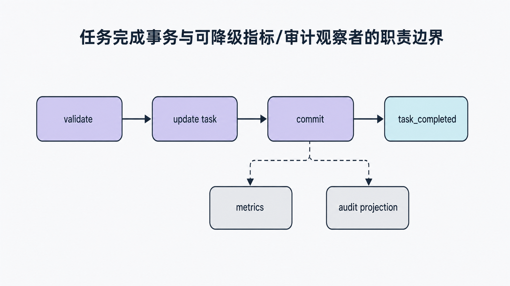
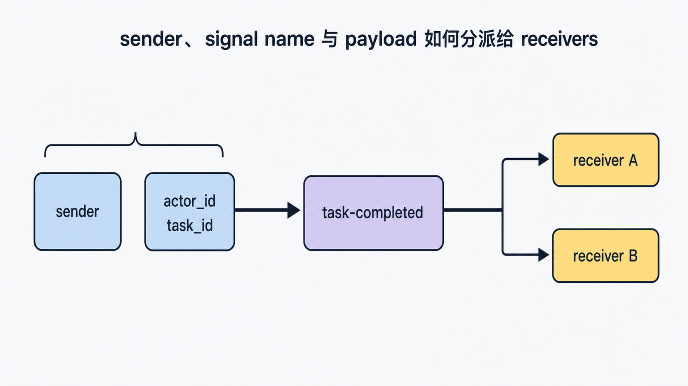
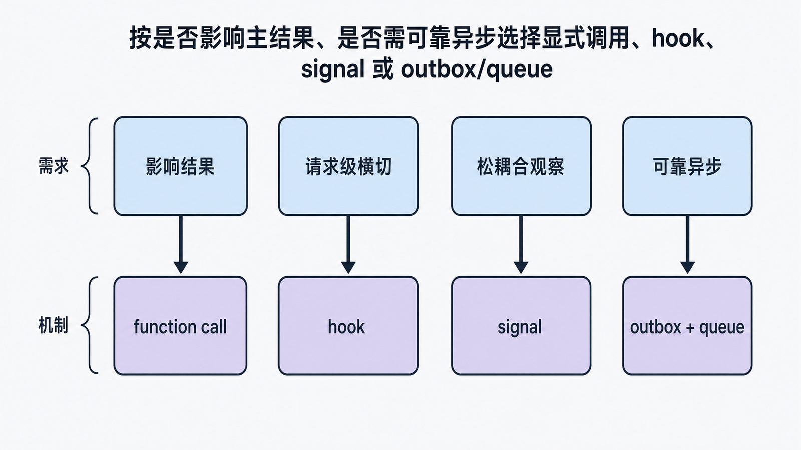

## 前置知识与学习目标

你应理解 Flask 请求生命周期与应用上下文。本篇只解决：**如何让旁路观察者感知事件，同时不把核心业务正确性交给不可见的信号链？**

学完后你能够：

1. 区分 Flask 生命周期信号、请求钩子与普通函数调用。
2. 正确选择 sender、命名空间和附加数据。
3. 为自定义信号写可隔离测试，并处理订阅者异常。
4. 判断何时不应该使用信号。

## 场景：任务完成后的旁路动作

当用户完成任务时，我们可能希望记录指标、审计日志和缓存失效。数据库更新必须成功，指标上报可以降级。若把所有动作塞进视图，核心路径会被旁路逻辑污染；若全部交给信号，又可能隐藏关键依赖。

<!-- figure-anchor:s04-f01 -->

<!-- figure:s04-f01:start -->



<!-- figure:s04-f01:end -->

正确边界是：

```text
核心路径：校验 -> 更新任务 -> 提交事务 -> 返回响应
旁路观察：                 └-> task_completed signal
                                   ├-> metrics
                                   └-> audit projection
```

## Flask 信号的调用模型

Flask 使用 Blinker 提供信号。发送者调用 `send`，订阅者通过 `connect` 或装饰器注册。对 Flask 内置信号，sender 通常是发出事件的应用实例。

```python
from flask import Flask, request_started

def log_request_start(sender: Flask, **extra):
    sender.logger.info("request started")

def init_signals(app: Flask):
    request_started.connect(log_request_start, app)
```

显式指定 `app` 作为 sender，可避免测试中多个应用实例互相接收事件。订阅函数应接收 `sender` 和 `**extra`，以兼容信号提供的额外参数。

常见内置信号包括：

- `request_started`：请求开始分派。
- `request_finished`：响应构造完成。
- `got_request_exception`：请求处理中出现异常。
- `appcontext_pushed` / `appcontext_tearing_down`：应用上下文进出。

信号名称描述观察点，不保证它适合修改响应或提交关键数据。

## 自定义信号：事件名与数据合同

<!-- figure-anchor:s04-f02 -->

<!-- figure:s04-f02:start -->



<!-- figure:s04-f02:end -->

使用独立命名空间可以避免名称碰撞：

```python
from blinker import Namespace

signals = Namespace()
task_completed = signals.signal("task-completed")

def complete_task(task, actor_id: int):
    if task.done:
        return False

    task.done = True
    # 此处由调用方提交数据库事务
    task_completed.send(
        task,
        actor_id=actor_id,
        task_id=task.id,
    )
    return True
```

这里 sender 选择 `task`，附加数据是稳定、短小的标量。若订阅者只需要 ID，就不要传入整个请求对象或未提交的数据库 Session。

订阅者：

```python
def count_completion(sender, *, actor_id: int, task_id: int, **extra):
    metrics.increment(
        "task.completed",
        tags={"actor_id": str(actor_id)},
    )

task_completed.connect(count_completion, weak=False)
```

默认弱引用可能让局部定义的接收器被垃圾回收；应用级接收器通常定义在模块顶层。测试或动态注册时若使用 `weak=False`，必须在结束后断开，避免泄漏到其他测试。

## 异常传播与事务顺序

Blinker 默认同步调用接收器。接收器慢，发送方也慢；接收器抛异常，`send` 也会抛异常。它不是后台队列。

因此顺序要根据一致性要求决定：

- 必须与业务提交原子一致的审计记录：放在同一数据库事务中，不依赖普通信号。
- 可丢失或可重建的指标：事务成功后发送，接收器自身捕获并记录失败。
- 必须可靠异步处理：使用事务 outbox 与消息队列，而不是把信号当队列。

```python
def safe_emit_task_completed(task, actor_id: int):
    try:
        task_completed.send(
            task,
            actor_id=actor_id,
            task_id=task.id,
        )
    except Exception:
        current_app.logger.exception("task_completed observer failed")
```

这段代码只适用于允许降级的旁路信号。不要为了“接口返回成功”吞掉核心业务异常。

## 与请求钩子的选择

<!-- figure-anchor:s04-f03 -->

<!-- figure:s04-f03:start -->



<!-- figure:s04-f03:end -->

| 需求                     | 更合适的机制          |
| ------------------------ | --------------------- |
| 所有请求前统一鉴权       | `before_request`      |
| 响应统一加 Header        | `after_request`       |
| 无论成功失败都释放资源   | `teardown_appcontext` |
| 多个松耦合观察者感知事件 | signal                |
| 必须按顺序执行且影响结果 | 显式函数调用          |
| 跨进程可靠异步处理       | 消息队列 / outbox     |

信号适合观察，不适合隐藏主流程控制。

## 最小行为测试

```python
from types import SimpleNamespace

def test_task_completed_signal():
    received = []

    def receiver(sender, **extra):
        received.append((sender.id, extra["actor_id"], extra["task_id"]))

    task_completed.connect(receiver, weak=False)
    try:
        task = SimpleNamespace(id=7, done=False)
        assert complete_task(task, actor_id=3) is True
        assert complete_task(task, actor_id=3) is False
        assert received == [(7, 3, 7)]
    finally:
        task_completed.disconnect(receiver)
```

测试同时验证发送次数、payload 和幂等边界：已完成任务不重复发送。

## 常见误区与适用边界

- **把信号当异步任务**：它通常在当前调用栈同步执行。
- **让信号决定核心事务**：依赖隐藏且失败语义不清。
- **不限制 sender**：多应用测试会交叉接收。
- **在接收器中读取已结束的请求上下文**：异步或延迟处理时代理对象可能不可用。
- **动态连接后不 disconnect**：测试会相互污染。
- **发送庞大可变对象**：接收器看到的状态可能受后续修改影响。

## 自检题

1. 为什么信号接收器变慢会拖慢请求？
2. 必须可靠写入的审计记录为何不应只靠普通信号？
3. 哪个测试断言证明事件具备幂等边界？

<details>
<summary>答案</summary>

1. Blinker 默认在 `send` 的当前调用栈同步调用接收器。
2. 接收器异常、进程退出或注册缺失都会造成不可控失败；应使用同事务记录或 outbox。
3. 第二次完成同一任务返回 `False`，且 `received` 只有一条记录。

</details>

## 本篇总结

信号是应用内的同步观察机制。它最适合指标、诊断和可降级投影；关键业务应保持显式调用与清晰事务边界，需要可靠异步时使用 outbox 或消息队列。

## 下一篇衔接

下一篇处理另一个容易写成“能用但不可验证”的组件：分页。我们会把总数、页码、窗口和边界条件变成明确不变量。

## 资料来源

- [Flask 官方文档：Signals](https://flask.palletsprojects.com/en/stable/signals/)
- [Blinker 官方文档](https://blinker.readthedocs.io/en/stable/)
- [Flask 官方文档：Callbacks and Errors](https://flask.palletsprojects.com/en/stable/reqcontext/#callbacks-and-errors)
