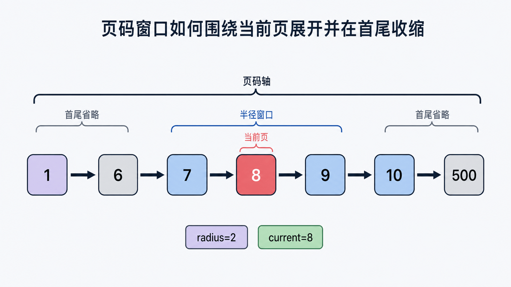
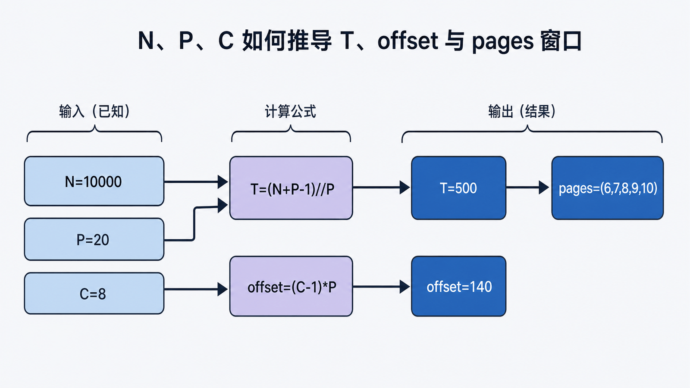

## 前置知识与学习目标

你需要会 Python 切片、整数除法和查询参数。本篇只解决：**如何把分页展示规则写成有明确输入、输出和边界的纯组件？**

完成后你能够：

1. 从 `total_items` 与 `per_page` 推导总页数。
2. 生成固定宽度附近的页码窗口，并处理首尾边界。
3. 区分 UI 页码、数据库 OFFSET 和稳定排序。
4. 用性质测试覆盖空集合、越界页和超大总数。

## 场景：TaskBoard 的任务列表

假设每页 20 条，用户位于第 8 页。界面不应列出 1 到 500 的所有页码，而应显示：

```text
上一页  1 … 6 7 [8] 9 10 … 500  下一页
```

这不是字符串拼接问题，而是三个层次：

1. 数据层返回当前页数据与总数。
2. 领域层计算总页数、当前页和页码窗口。
3. 模板层负责链接与可访问性标记。

## 分页不变量

<!-- figure-anchor:s05-f01 -->

<!-- figure:s05-f01:start -->



<!-- figure:s05-f01:end -->

设：

- `N`：总记录数，必须 ≥ 0。
- `P`：每页记录数，必须 > 0。
- `C`：请求页码，从 1 开始。
- `T = ceil(N / P)`：总页数。空集合约定 `T = 0`。
- `offset = (C - 1) * P`：数据库跳过条数。

整数安全写法：

```python
def page_count(total_items: int, per_page: int) -> int:
    if total_items < 0:
        raise ValueError("total_items must be >= 0")
    if per_page <= 0:
        raise ValueError("per_page must be > 0")
    return (total_items + per_page - 1) // per_page
```

空集合若强行显示第 1 页，会混淆“当前页存在”与“列表为空”。组件可以在展示层显示“第 0/0 页”或隐藏页码，但内部不变量要明确。

## 纯分页模型

<!-- figure-anchor:s05-f02 -->

<!-- figure:s05-f02:start -->



<!-- figure:s05-f02:end -->

```python
from dataclasses import dataclass

@dataclass(frozen=True)
class Pagination:
    page: int
    per_page: int
    total_items: int
    total_pages: int
    pages: tuple[int, ...]

    @property
    def has_prev(self) -> bool:
        return self.total_pages > 0 and self.page > 1

    @property
    def has_next(self) -> bool:
        return self.total_pages > 0 and self.page < self.total_pages

def build_pagination(
    *,
    page: int,
    per_page: int,
    total_items: int,
    radius: int = 2,
) -> Pagination:
    if page < 1:
        raise ValueError("page must be >= 1")
    if radius < 0:
        raise ValueError("radius must be >= 0")

    total_pages = page_count(total_items, per_page)
    if total_pages == 0:
        current = 1
        pages: tuple[int, ...] = ()
    else:
        current = min(page, total_pages)
        start = max(1, current - radius)
        end = min(total_pages, current + radius)
        pages = tuple(range(start, end + 1))

    return Pagination(
        page=current,
        per_page=per_page,
        total_items=total_items,
        total_pages=total_pages,
        pages=pages,
    )
```

输入 `page=8, per_page=20, total_items=10000, radius=2`，关键中间状态是 `total_pages=500, start=6, end=10`，输出窗口为 `(6, 7, 8, 9, 10)`。

这里选择把过大页码夹到最后一页。API 也可以改为返回 404；两种合同都合理，但必须文档化并测试，不能有时夹取、有时报错。

## 在 Flask 视图中组合

```python
from flask import abort, render_template, request
from sqlalchemy import func, select

@app.get("/tasks")
def task_list():
    page = request.args.get("page", default=1, type=int)
    if page is None or page < 1:
        abort(400, description="page must be a positive integer")

    per_page = 20
    total = db.session.scalar(select(func.count()).select_from(Task))
    pagination = build_pagination(
        page=page,
        per_page=per_page,
        total_items=total,
    )

    tasks = db.session.scalars(
        select(Task)
        .order_by(Task.created_at.desc(), Task.id.desc())
        .offset((pagination.page - 1) * per_page)
        .limit(per_page)
    ).all()

    return render_template(
        "tasks/list.html",
        tasks=tasks,
        pagination=pagination,
    )
```

`created_at DESC, id DESC` 提供稳定、唯一的排序合同。没有 `ORDER BY` 时数据库不承诺行顺序；只按可重复的时间排序，翻页时也可能漏行或重行。

## 模板只负责表达

```html
<nav aria-label="任务分页">
  
  <a href="{{ url_for('tasks.task_list', page=pagination.page - 1) }}"
    >上一页</a
  >
   
  <a
    href="{{ url_for('tasks.task_list', page=number) }}"
    aria-current="page"
    
    >{{ number }}</a
  >
   
  <a href="{{ url_for('tasks.task_list', page=pagination.page + 1) }}"
    >下一页</a
  >
  
</nav>
```

省略号、第一页和最后一页可以作为展示策略添加，但不要把数据库查询塞进模板。

## 最小行为测试

```python
def test_middle_window():
    p = build_pagination(page=8, per_page=20, total_items=10_000)
    assert p.total_pages == 500
    assert p.pages == (6, 7, 8, 9, 10)
    assert p.has_prev and p.has_next

def test_empty_collection():
    p = build_pagination(page=9, per_page=20, total_items=0)
    assert p.total_pages == 0
    assert p.pages == ()
    assert not p.has_prev and not p.has_next

def test_last_page_is_partial():
    p = build_pagination(page=3, per_page=20, total_items=41)
    assert p.total_pages == 3
    assert p.page == 3
```

还可验证性质：`pages` 严格递增、都在 `[1, total_pages]` 内、长度不超过 `2 * radius + 1`。

## 什么时候不适用页码分页

- **深分页**：`OFFSET` 越大，数据库通常要扫描并丢弃更多行；连续浏览应评估 keyset/cursor 分页。
- **数据频繁变化**：相邻请求之间插入或删除会导致跨页漂移。
- **无限滚动**：游标比“第几页”更符合交互语义。
- **昂贵总数**：复杂查询的精确 `COUNT(*)` 可能成为主成本，可使用无总数的“是否有下一页”合同。

## 常见误区

- 使用浮点 `ceil(total / per_page)` 处理超大整数。
- 把页码从 0 开始，但 UI 和 URL 又从 1 开始。
- 没有稳定唯一排序就使用 OFFSET。
- 为每个页码都查询一次数据库。
- 把过大页码夹取、404 和空列表三种策略混用。

## 自检题

1. 41 条记录、每页 20 条共有多少页？第 3 页最多几条？
2. 为什么 `ORDER BY created_at DESC` 仍可能不稳定？
3. 页码分页在哪类数据访问中应让位于 keyset 分页？

<details>
<summary>答案</summary>

1. 3 页，第 3 页最多 1 条。
2. 多行可拥有相同时间，需要追加唯一键如 `id DESC` 形成全序。
3. 大表深分页、连续滚动且不要求随机跳页时。

</details>

## 本篇总结

可靠分页从不变量开始：总页数、页码范围、窗口宽度、稳定排序与越界策略都必须显式。把计算写成纯函数，数据库只负责按稳定顺序取一页，模板只负责表达。

## 下一篇衔接

分页已经暴露出数据库 Session 与配置初始化的需求。下一篇把扩展、模型和迁移纳入应用工厂，形成可创建、可测试、可升级的完整应用骨架。

## 资料来源

- [Flask-SQLAlchemy 官方文档：Pagination](https://flask-sqlalchemy.palletsprojects.com/en/stable/pagination/)
- [SQLAlchemy 官方文档：SELECT and Related Constructs](https://docs.sqlalchemy.org/en/20/core/selectable.html)
- [Flask 官方文档：Templates](https://flask.palletsprojects.com/en/stable/templating/)
