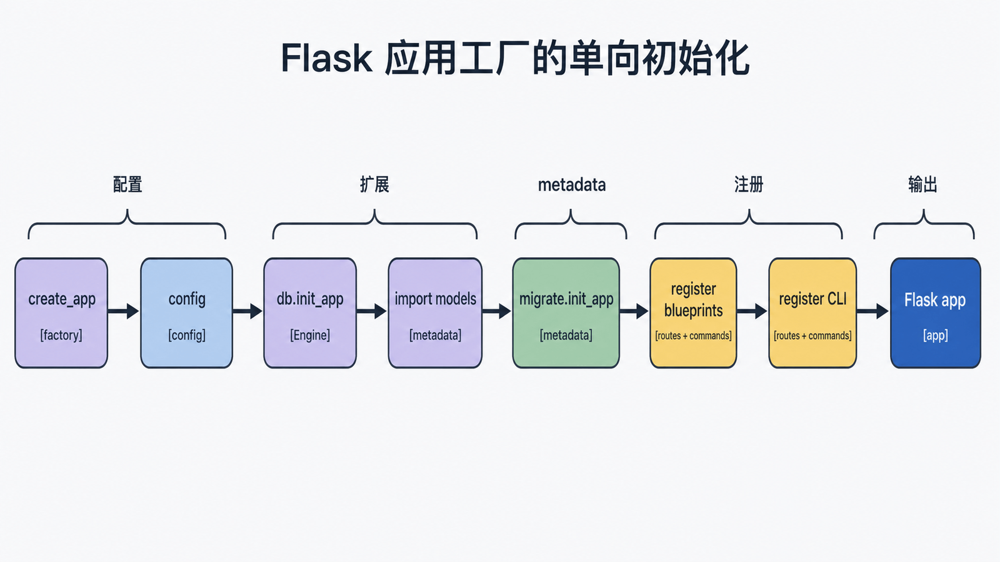
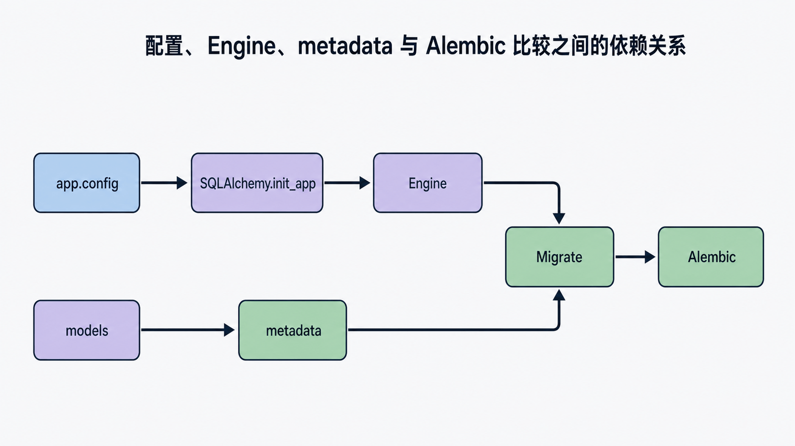
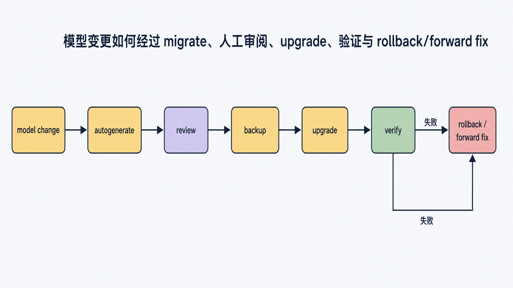
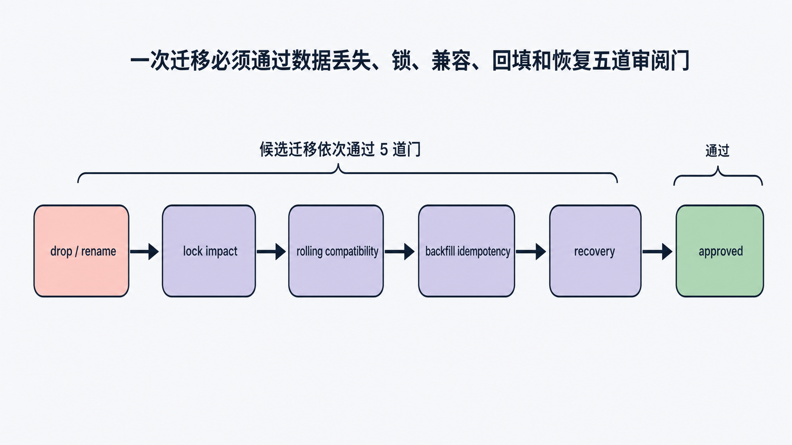

## 前置知识与学习目标

你应理解蓝图、应用上下文、连接池与事务。本篇只解决：**如何让配置、扩展、模型和迁移按可重复顺序组装，而不是依赖导入副作用？**

完成后你能够：

1. 写出无全局应用绑定的 `db`、`migrate` 扩展对象。
2. 解释配置必须先于 `init_app`，模型导入必须先于迁移比较。
3. 区分 `create_all` 与版本化迁移。
4. 在应用上下文内验证数据库，并为迁移建立审阅与回滚边界。

## TaskBoard 的初始化拓扑

<!-- figure-anchor:s06-f01 -->

<!-- figure:s06-f01:start -->



<!-- figure:s06-f01:end -->

推荐目录：

```text
taskboard/
├── __init__.py
├── extensions.py
├── models.py
├── tasks/
│   └── views.py
└── commands.py
migrations/
tests/
```

扩展对象可以全局存在，但不能在导入时绑定某个具体应用。

```python
# taskboard/extensions.py
from flask_migrate import Migrate
from flask_sqlalchemy import SQLAlchemy
from sqlalchemy.orm import DeclarativeBase

class Base(DeclarativeBase):
    pass

db = SQLAlchemy(model_class=Base)
migrate = Migrate()
```

## 模型是迁移的输入

```python
# taskboard/models.py
from datetime import datetime
from sqlalchemy import Boolean, DateTime, String
from sqlalchemy.orm import Mapped, mapped_column
from .extensions import db

class Task(db.Model):
    id: Mapped[int] = mapped_column(primary_key=True)
    title: Mapped[str] = mapped_column(String(200))
    done: Mapped[bool] = mapped_column(Boolean, default=False, nullable=False)
    created_at: Mapped[datetime] = mapped_column(
        DateTime,
        default=datetime.utcnow,
        nullable=False,
    )
```

模型 metadata 是自动生成迁移差异的依据。若模型模块从未导入，Alembic 看不到表定义，就可能生成空迁移。

## 工厂的单向初始化顺序

<!-- figure-anchor:s06-f02 -->

<!-- figure:s06-f02:start -->



<!-- figure:s06-f02:end -->

```python
# taskboard/__init__.py
from flask import Flask
from .extensions import db, migrate

def create_app(test_config=None):
    app = Flask(__name__)
    app.config.from_mapping(
        SQLALCHEMY_DATABASE_URI="sqlite:///taskboard.db",
        SQLALCHEMY_TRACK_MODIFICATIONS=False,
    )
    app.config.from_prefixed_env(prefix="TASKBOARD")
    if test_config:
        app.config.from_mapping(test_config)

    db.init_app(app)

    from . import models
    migrate.init_app(app, db)

    from .tasks.views import tasks_bp
    app.register_blueprint(tasks_bp, url_prefix="/tasks")

    from .commands import register_commands
    register_commands(app)

    return app
```

顺序的因果关系：

1. 配置决定数据库 URI 和 Engine 参数。
2. `db.init_app` 根据配置创建引擎注册。
3. 导入模型填充 metadata。
4. `migrate.init_app` 绑定应用与 metadata。
5. 蓝图和 CLI 使用已初始化扩展。

Flask-SQLAlchemy 3.x 在 `init_app` 时读取配置，之后修改 URI 不会重新创建 Engine。

## 迁移不是 `create_all`

<!-- figure-anchor:s06-f03 -->

<!-- figure:s06-f03:start -->



<!-- figure:s06-f03:end -->

```bash
flask --app taskboard:create_app db init
flask --app taskboard:create_app db migrate -m "create task table"
flask --app taskboard:create_app db upgrade
flask --app taskboard:create_app db current
```

- `db.create_all()` 只创建缺失表，不会把已有表升级到新模型。
- `db migrate` 根据 metadata 与数据库状态生成候选脚本。
- 生成脚本必须人工审阅；重命名字段常被识别成“删除旧列 + 新增列”，可能丢数据。
- `db upgrade` 执行版本迁移；生产前要有备份、锁影响评估和回滚/前滚方案。

## SQLAlchemy-Utils 的边界

SQLAlchemy-Utils 提供 `EmailType`、`PasswordType`、数据库存在性辅助等扩展能力，但它不是 Flask 初始化必需层。引入自定义类型前要回答：

1. 数据库实际列类型是什么？
2. Alembic 能否稳定渲染与回滚？
3. 序列化、校验和数据迁移由哪一层负责？
4. 未来移除依赖是否可行？

例如邮箱规范化通常还涉及业务规则，不能因为使用 `EmailType` 就跳过表单验证和唯一约束。

## 应用上下文中的最小验证

```python
from sqlalchemy import select

def test_factory_uses_isolated_database(tmp_path):
    db_file = tmp_path / "test.db"
    app = create_app(
        {
            "TESTING": True,
            "SQLALCHEMY_DATABASE_URI": f"sqlite:///{db_file}",
        }
    )

    with app.app_context():
        db.create_all()
        task = Task(title="验证应用工厂")
        db.session.add(task)
        db.session.commit()

        saved = db.session.scalar(
            select(Task).where(Task.title == "验证应用工厂")
        )
        assert saved is not None
```

输入是测试专用数据库 URI；中间状态是当前应用上下文和 ORM Session；输出是可查询记录。测试结束应删除临时数据库或回滚事务，不能连接开发/生产库。

## 迁移验收清单

<!-- figure-anchor:s06-f04 -->

<!-- figure:s06-f04:start -->



<!-- figure:s06-f04:end -->

每次迁移至少检查：

- upgrade 与 downgrade 是否符合预期。
- 是否出现意外 drop、nullable 变化或默认值变化。
- 大表 DDL 是否会长时间锁表。
- 新旧应用版本能否在滚动发布期间共存。
- 数据回填是否幂等、可观测、可暂停。
- 空数据库从头 upgrade 与生产快照 upgrade 都能成功。

对于不可逆数据转换，downgrade 不应伪装可逆；应明确恢复依赖备份或前滚修复。

## 常见误区与适用边界

- **在模型模块创建 `Flask()`**：导致循环导入和多实例测试困难。
- **`SQLAlchemy(app)` 与工厂混用**：扩展提前绑定具体应用。
- **先 `init_app` 后改 URI**：引擎仍使用旧配置。
- **用 `create_all` 替代迁移**：已有表不会自动演化。
- **未经审阅直接执行 autogenerate**：自动比较不知道业务重命名与数据语义。
- **把 ORM Session 跨线程传递**：Session 不是通用线程安全容器。
- **在请求中运行迁移**：迁移属于受控运维流程。

## 自检题

1. 为什么扩展对象可以全局定义，应用对象却放在工厂中创建？
2. 模型导入晚于迁移初始化可能造成什么结果？
3. `db.create_all` 为什么不能替代 `flask db upgrade`？

<details>
<summary>答案</summary>

1. 未绑定的扩展对象只保存通用声明，可通过 `init_app` 服务多个应用实例；具体应用含环境配置和运行状态。
2. Alembic metadata 不完整，自动迁移可能为空或遗漏表。
3. `create_all` 只创建不存在的表，不维护版本历史，也不修改已有结构。

</details>

## 本篇总结

应用工厂把初始化变成可重复的单向过程：先配置，再初始化扩展，再加载模型、迁移、蓝图和命令。迁移脚本是需要审阅和演练的生产变更，不是自动生成后直接执行的附属文件。

## 下一篇衔接

应用骨架稳定后，输入校验成为下一条边界。下一篇从 WTForms 的 `process -> validate -> errors` 调用链解释自定义 Form、字段与验证器。

## 资料来源

- [Flask 官方文档：Application Factories](https://flask.palletsprojects.com/en/stable/patterns/appfactories/)
- [Flask-SQLAlchemy 官方文档：Configuration](https://flask-sqlalchemy.palletsprojects.com/en/stable/config/)
- [Flask-SQLAlchemy 官方文档：Quick Start](https://flask-sqlalchemy.palletsprojects.com/en/stable/quickstart/)
- [Flask-Migrate 官方文档](https://flask-migrate.readthedocs.io/en/latest/)
- [Alembic 官方文档：Autogenerating Migrations](https://alembic.sqlalchemy.org/en/latest/autogenerate.html)
