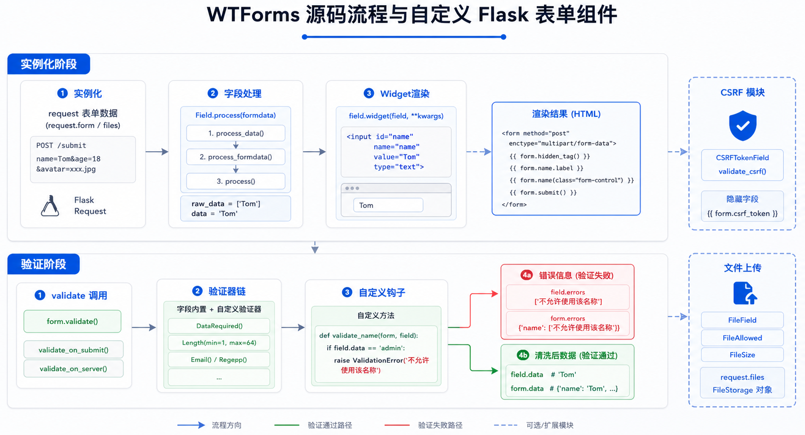

## wtforms源码流程



### 实例化流程分析

```python
'''
源码流程
1. 执行type的 __call__ 方法，读取字段到静态字段 cls._unbound_fields 中
   meta类读取到cls._wtforms_meta中
2. 执行构造方法

a. 循环cls._unbound_fields中的字段，并执行字段的bind方法
   然后将返回值添加到 self._fields[name] 中
   即：
       _fields = {
           name: wtforms.fields.core.StringField(),
       }

   PS：由于字段中的__new__方法，实例化时：
       name = simple.StringField(label='用户名')
       创建的是UnboundField(cls, *args, **kwargs)
       当执行完bind之后，才变成执行 wtforms.fields.core.StringField()

b. 循环_fields，为对象设置属性
       for name, field in iteritems(self._fields):
           setattr(self, name, field)

c. 执行process，为字段设置默认值
       self.process(formdata, obj, data=data, **kwargs)
       优先级：obj, data, formdata
       再循环执行每个字段的process方法，为每个字段设置值：
       for name, field in iteritems(self._fields):
           if obj is not None and hasattr(obj, name):
               field.process(formdata, getattr(obj, name))
           elif name in kwargs:
               field.process(formdata, kwargs[name])
           else:
               field.process(formdata)
'''
# 执行每个字段的process方法，为字段的data和字段的raw_data赋值
def process(self, formdata, data=unset_value):
    self.process_errors = []
    if data is unset_value:
        try:
            data = self.default()
        except TypeError:
            data = self.default

    self.object_data = data

    try:
        self.process_data(data)
    except ValueError as e:
        self.process_errors.append(e.args[0])

    if formdata:
        try:
            if self.name in formdata:
                self.raw_data = formdata.getlist(self.name)
            else:
                self.raw_data = []
            self.process_formdata(self.raw_data)
        except ValueError as e:
            self.process_errors.append(e.args[0])

    try:
        for filter in self.filters:
            self.data = filter(self.data)
    except ValueError as e:
        self.process_errors.append(e.args[0])

# d. 页面上执行print(form.name)时，打印标签
#    因为执行了：
#        字段的 __str__ 方法
#        字符的 __call__ 方法
#        self.meta.render_field(self, kwargs)
#            def render_field(self, field, render_kw):
#                other_kw = getattr(field, 'render_kw', None)
#                if other_kw is not None:
#                    render_kw = dict(other_kw, **render_kw)
#                return field.widget(field, **render_kw)
#    执行字段的插件对象的 __call__ 方法，返回标签字符串
```

### 验证流程分析

```python
# a. 执行form的validate方法，获取钩子方法
def validate(self):
    extra = {}
    for name in self._fields:
        inline = getattr(self.__class__, 'validate_%s' % name, None)
        if inline is not None:
            extra[name] = [inline]

    return super(Form, self).validate(extra)

# b. 循环每一个字段，执行字段的validate方法进行校验（参数传递了钩子函数）
def validate(self, extra_validators=None):
    self._errors = None
    success = True
    for name, field in iteritems(self._fields):
        if extra_validators is not None and name in extra_validators:
            extra = extra_validators[name]
        else:
            extra = tuple()
        if not field.validate(self, extra):
            success = False
    return success

# c. 每个字段进行验证时候
#        字段的pre_validate【预留的扩展】
#        字段的_run_validation_chain，对正则和字段的钩子函数进行校验
#        字段的post_validate【预留的扩展】
```

## 自定义Form组件

### 完整示例

```python
#!usr/bin/env python
# -*- coding:utf-8 -*-
from flask import Flask, render_template, request, Markup

app = Flask(__name__, template_folder="templates")
app.debug = True

# ==============通过这几个类就可以显示了-==============

# 插件
class Widget(object):
    pass

class InputText(Widget):
    def __call__(self, *args, **kwargs):
        return "<input type='text' name='name'>"

class TextArea(Widget):
    def __call__(self, *args, **kwargs):
        return Markup("<textarea name='email'></textarea>")

# Form
class BaseForm(object):
    def __init__(self):
        # 获取当前所有的字段
        _fields = {}
        for name, field in self.__class__.__dict__.items():
            if isinstance(field, Field):  # 筛选出字段是name和email的
                _fields[name] = field
        self._fields = _fields
        self.data = {}

    def validate(self, request_data):
        # 先找到所有的字段，在执行每一个字段的validate方法
        flag = True
        for name, field in self._fields.items():
            input_val = request_data.get(name, "")  # 用户输入的值
            result = field.validate(input_val)  # 每一个字段自己校验
            print("???????????", input_val, result)
            if not result:
                flag = False
            else:
                self.data[name] = input_val
        return flag

# 字段
class Field(object):
    """所有类的基类"""
    def __str__(self):
        # python中的静态字段通过类能找到，通过对象也能找到
        return Markup(self.widget())  # self就是StringField，self

class StringField(Field):
    # 每个字段打印的时候都要去执行__str__，所以选择放在基类里面，自己没有就调用父类的
    widget = InputText()

    def validate(self, val):
        if val:
            return True

class EmailField(Field):
    widget = TextArea()

    def validate(self, val):
        if '@' in val:
            return True
```

## 进阶：自定义验证器

```python
from wtforms import Form, StringField, IntegerField
from wtforms.validators import DataRequired, Length, Email

class MyForm(Form):
    name = StringField('用户名', validators=[DataRequired(), Length(min=3, max=20)])
    email = StringField('邮箱', validators=[Email()])
    age = IntegerField('年龄', validators=[DataRequired()])

    # 自定义局部验证器
    def validate_name(self, field):
        if field.data.startswith('admin'):
            raise ValidationError('用户名不能以admin开头')

    # 自定义全局验证器
    def validate(self):
        if not super(MyForm, self).validate():
            return False

        if self.password.data != self.password2.data:
            self.password2.errors.append('两次密码不一致')
            return False

        return True
```

## 使用Flask-WTF

```python
from flask import Flask, render_template, request
from flask_wtf import FlaskForm
from wtforms import StringField, PasswordField, SubmitField
from wtforms.validators import DataRequired, Length, Email, EqualTo

app = Flask(__name__)
app.config['SECRET_KEY'] = 'your-secret-key'

class RegistrationForm(FlaskForm):
    username = StringField('用户名', validators=[DataRequired(), Length(min=6, max=20)])
    email = StringField('邮箱', validators=[DataRequired(), Email()])
    password = PasswordField('密码', validators=[DataRequired(), Length(min=6)])
    confirm = PasswordField('确认密码', validators=[DataRequired(), EqualTo('password')])
    submit = SubmitField('注册')

@app.route('/register', methods=['GET', 'POST'])
def register():
    form = RegistrationForm()
    if form.validate_on_submit():
        # 处理表单数据
        username = form.username.data
        email = form.email.data
        password = form.password.data
        # 保存到数据库等操作
        return f'注册成功：{username}'
    return render_template('register.html', form=form)
```

### 模板中使用

```html
<form method="POST">
    {{ form.hidden_tag() }}

    <div>
        {{ form.username.label }}
        {{ form.username() }}
        
            <span style="color: red;">{{ error }}</span>
        
    </div>

    <div>
        {{ form.email.label }}
        {{ form.email() }}
        
            <span style="color: red;">{{ error }}</span>
        
    </div>

    {{ form.submit() }}
</form>
```

## 常见问题

### 1. CSRF保护

```python
from flask_wtf.csrf import CSRFProtect

csrf = CSRFProtect()
csrf.init_app(app)
```

### 2. 文件上传表单

```python
from flask_wtf import FlaskForm
from flask_wtf.file import FileField, FileAllowed
from wtforms import SubmitField

class UploadForm(FlaskForm):
    file = FileField('上传文件', validators=[FileAllowed(['jpg', 'png', 'gif'], '只能上传图片')])
    submit = SubmitField('上传')
```

### 3. 表单数据回填

```python
# 当验证失败时，表单数据会自动回填
# 也可以手动设置
form.username.data = 'admin'
```
