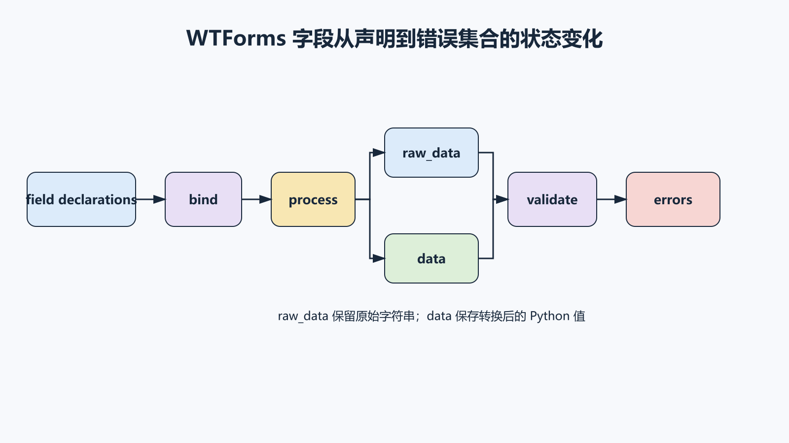
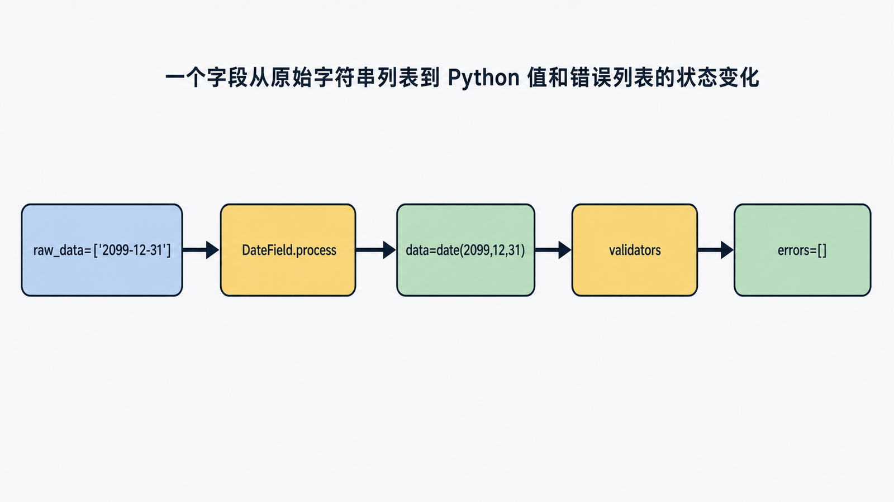
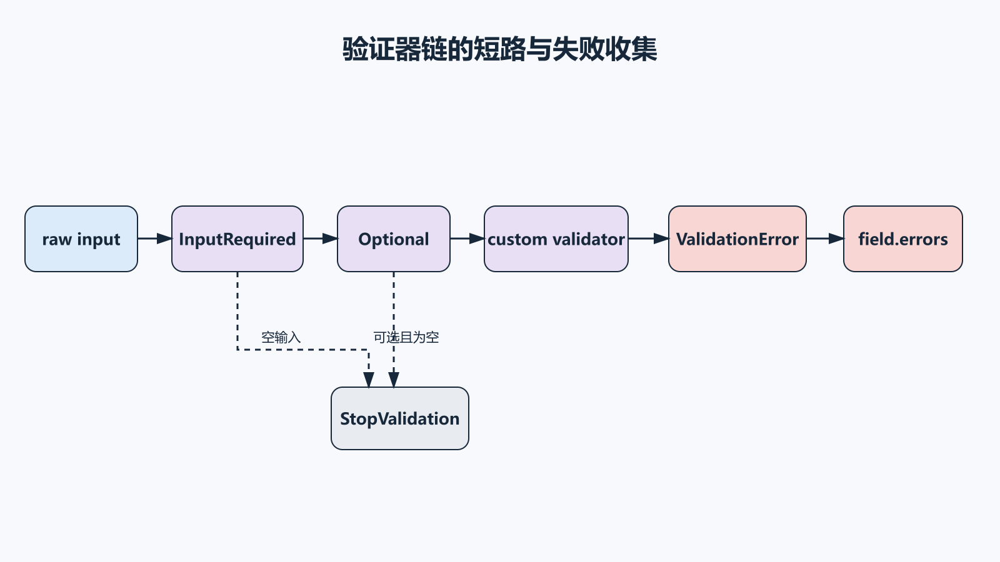

## 前置知识与学习目标

你应会 Python 类、继承和可调用对象，并理解 HTTP 表单只是多值输入。本篇只解决：**WTForms 如何把声明式字段变成已绑定字段，并依次处理输入和验证？**

完成后你能够：

1. 区分未绑定字段、已绑定字段、`raw_data`、`data` 与 `errors`。
2. 解释 `process` 与 `validate` 为什么是两个阶段。
3. 实现字段级、自定义类验证器和跨字段验证。
4. 判断何时应扩展 WTForms，何时只写普通领域函数。

## 场景：TaskBoard 创建任务

任务表单需要标题、截止日期和优先级：

```python
from wtforms import DateField, Form, SelectField, StringField
from wtforms.validators import DataRequired, Length

class TaskForm(Form):
    title = StringField(
        "标题",
        validators=[DataRequired(), Length(min=1, max=200)],
    )
    due_date = DateField("截止日期", validators=[])
    priority = SelectField(
        "优先级",
        choices=[("low", "低"), ("normal", "普通"), ("high", "高")],
    )
```

类属性看起来像字段实例，但创建表单对象时，WTForms 会把声明复制并绑定到本次表单。否则多个请求会共享同一个可变字段状态。

## 四阶段调用链

<!-- figure-anchor:s07-f01 -->

<!-- figure:s07-f01:start -->



<!-- figure:s07-f01:end -->

核心阶段：

1. **收集声明**：元类按定义顺序收集字段。
2. **绑定字段**：为当前 Form 实例创建带 name、label、flags 的字段。
3. **process**：从 formdata 或 object/default 取得原始值，转换为 Python `data`。
4. **validate**：依次运行字段验证器和表单内联验证器，收集 `errors`。

<!-- figure-anchor:s07-f02 -->

<!-- figure:s07-f02:start -->



<!-- figure:s07-f02:end -->

关键状态示例：

```python
from werkzeug.datastructures import MultiDict

form = TaskForm(
    MultiDict(
        {
            "title": "写测试",
            "due_date": "2026-07-31",
            "priority": "high",
        }
    )
)

assert form.title.raw_data == ["写测试"]
assert form.title.data == "写测试"
assert form.due_date.data.isoformat() == "2026-07-31"
assert form.validate() is True
assert form.errors == {}
```

`raw_data` 保留接收到的字符串列表；`data` 是字段转换后的 Python 值。日期格式错误可能在字段处理阶段形成错误，之后的验证器不一定会按你预期继续运行。

## 验证链与停止语义

```python
from wtforms.validators import Optional

class OptionalTaskForm(Form):
    due_date = DateField(
        "截止日期",
        validators=[Optional()],
    )
```

验证器按顺序执行。`DataRequired`、`InputRequired`、`Optional` 语义不同：

- `InputRequired` 检查原始输入是否存在，适合 `0`、`False` 也是合法值的字段。
- `DataRequired` 检查转换后的 data 是否“有值”，可能把合法的 `0` 视为空。
- `Optional` 在输入为空时停止后续验证器，并清除先前处理错误的方式需要谨慎理解。

不要机械地给所有字段添加 `DataRequired`。

## 自定义可调用验证器

<!-- figure-anchor:s07-f03 -->

<!-- figure:s07-f03:start -->



<!-- figure:s07-f03:end -->

```python
from datetime import date
from wtforms.validators import ValidationError

class NotPast:
    def __init__(self, message="日期不能早于今天"):
        self.message = message

    def __call__(self, form, field):
        if field.data is not None and field.data < date.today():
            raise ValidationError(self.message)

class TaskForm(Form):
    due_date = DateField(
        "截止日期",
        validators=[NotPast()],
    )
```

验证器输入是 Form 和 Field；输出不是布尔值，而是“正常返回表示通过，抛 `ValidationError` 表示失败”。需要立即终止链时才使用 `StopValidation`。

日期依赖当前时间，这个验证器在测试中应注入 clock，而不是永久依赖 `date.today()`，否则跨时区和午夜测试会不稳定。

## 跨字段验证

表单内联方法命名为 `validate_<fieldname>`：

```python
from datetime import date
from wtforms import BooleanField

class TaskScheduleForm(TaskForm):
    no_deadline = BooleanField("无截止日期")

    def validate_due_date(self, field):
        if not self.no_deadline.data and field.data is None:
            raise ValidationError("请选择截止日期或勾选无截止日期")
```

这适合输入层的字段关联。如果规则决定领域状态，例如“已完成任务不能修改截止日期”，应放在领域服务中，因为 CLI、API 和批处理也需要执行，不能只依赖 HTML Form。

## 可复用 Form 基类的边界

可以统一去除字符串首尾空白：

```python
from wtforms import Form

class TrimmedForm(Form):
    def process(self, formdata=None, obj=None, data=None, **kwargs):
        super().process(formdata=formdata, obj=obj, data=data, **kwargs)
        for field in self._fields.values():
            if isinstance(field.data, str):
                field.data = field.data.strip()
```

但修改框架生命周期有风险：密码字段、签名字段或原始文本可能不应 strip。更安全的方式通常是自定义字段 filter：

```python
def strip_text(value):
    return value.strip() if isinstance(value, str) else value

title = StringField("标题", filters=[strip_text])
```

只对需要的字段启用，影响范围更可见。

## 最小行为测试

```python
def test_task_form_success():
    form = TaskForm(
        MultiDict(
            {
                "title": "  写测试  ",
                "due_date": "2099-12-31",
                "priority": "high",
            }
        )
    )
    assert form.validate()
    assert form.title.data == "写测试"

def test_task_form_collects_field_errors():
    form = TaskForm(
        MultiDict(
            {
                "title": "",
                "due_date": "not-a-date",
                "priority": "urgent",
            }
        )
    )
    assert not form.validate()
    assert {"title", "due_date", "priority"} <= form.errors.keys()
```

测试应断言错误归属，不要把完整中文错误字符串作为唯一合同；国际化后文案会变化。

## 常见误区与适用边界

- **把 `form.data` 当原始输入**：它已经过字段转换。
- **验证器返回 False**：WTForms 约定失败时抛 `ValidationError`。
- **用 `DataRequired` 校验所有数字/布尔字段**：合法零值可能被拒绝。
- **把业务权限只写在 Form**：API、CLI 会绕过。
- **全局复用一个 Form 实例**：字段状态会跨请求污染。
- **覆盖 `process` 却不调用 `super()`**：字段绑定和默认处理会失效。
- **把 WTForms 当 CSRF 实现**：纯 WTForms 不自动完成 Flask 的 CSRF 集成；下一篇整合 Flask-WTF。

## 自检题

1. `raw_data` 与 `data` 的区别是什么？
2. 验证器为什么抛异常而不是返回布尔值？
3. “当前用户是否可编辑此任务”为什么不应只写在 Form 中？

<details>
<summary>答案</summary>

1. `raw_data` 是输入字符串列表，`data` 是字段解析、过滤后的 Python 值。
2. 异常携带错误消息并参与验证链的停止/收集语义。
3. 权限是跨入口的领域规则，API、CLI 和后台任务都必须执行。

</details>

## 本篇总结

WTForms 的主线是声明收集、实例绑定、输入处理和验证收集。理解 `raw_data -> data -> errors` 后，自定义字段和验证器才不会破坏生命周期；领域规则仍应放在所有入口都能调用的服务层。

## 下一篇衔接

下一篇把经过验证的登录表单接入 Flask-Login，沿着凭据校验、`login_user`、session 中的 user id、`user_loader` 和权限视图建立认证链。

## 资料来源

- [WTForms 官方文档：Forms](https://wtforms.readthedocs.io/en/stable/forms/)
- [WTForms 官方文档：Fields](https://wtforms.readthedocs.io/en/stable/fields/)
- [WTForms 官方文档：Validators](https://wtforms.readthedocs.io/en/stable/validators/)
