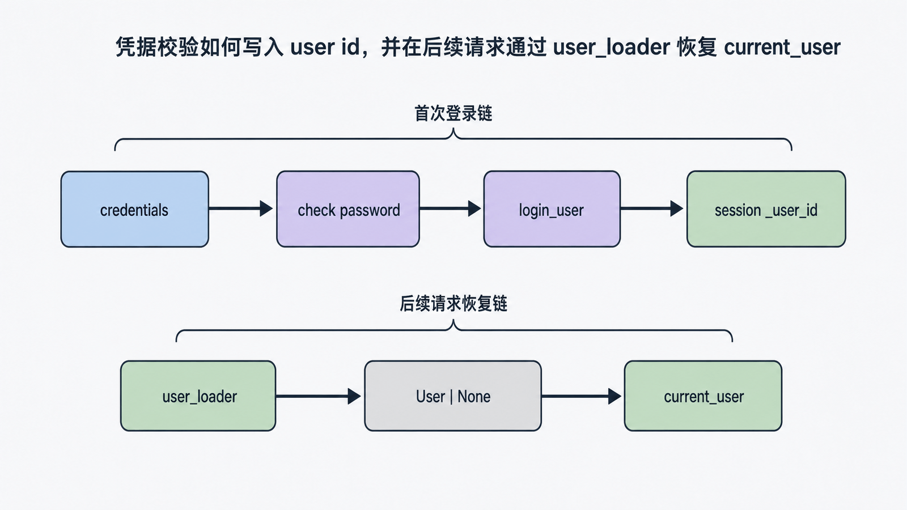
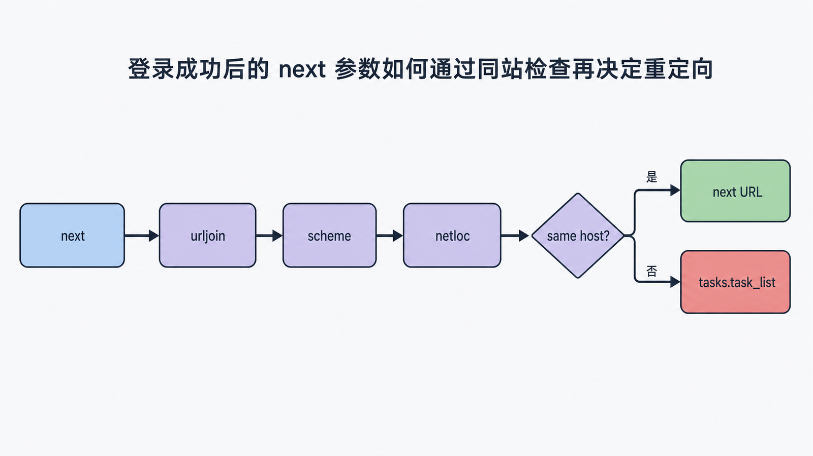
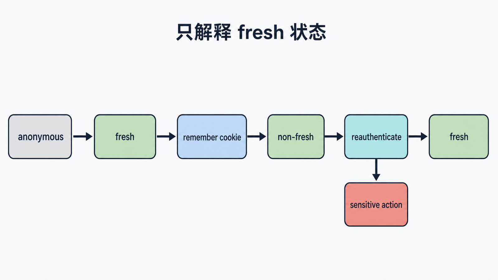

## 前置知识与学习目标

你应理解 Flask session、应用工厂和表单验证。本篇只解决：**Flask-Login 如何在请求之间恢复登录身份，以及哪些安全责任仍属于应用？**

完成后你能够：

1. 沿 `login_user -> session user id -> user_loader -> current_user` 解释身份恢复。
2. 区分认证、授权、remember cookie 与 fresh login。
3. 安全处理密码哈希、`next` 重定向和登出。
4. 用测试覆盖匿名、登录、退出和敏感操作再认证。

## Flask-Login 做什么，不做什么

Flask-Login 提供登录状态管理：

- 把用户 ID 存入 Flask session。
- 在后续请求中加载用户对象。
- 提供 `current_user`、`login_required`、`logout_user`。
- 支持 remember cookie 与 fresh login。

它不负责用户注册、密码存储、多因素认证、角色权限或数据库模型。这些仍由应用设计。

## 初始化与用户合同

```python
# extensions.py
from flask_login import LoginManager

login_manager = LoginManager()
login_manager.login_view = "auth.login"
login_manager.refresh_view = "auth.reauthenticate"
```

```python
# factory
login_manager.init_app(app)
```

用户对象可以继承 `UserMixin`，但稳定身份必须由应用提供：

```python
from flask_login import UserMixin

class User(UserMixin, db.Model):
    id: Mapped[int] = mapped_column(primary_key=True)
    email: Mapped[str] = mapped_column(unique=True)
    password_hash: Mapped[str]

    def get_id(self) -> str:
        return str(self.id)
```

`get_id` 返回可序列化字符串。不要把密码哈希、权限列表或整个用户对象放进 session。

## 身份恢复链

<!-- figure-anchor:s08-f01 -->

<!-- figure:s08-f01:start -->



<!-- figure:s08-f01:end -->

```python
from .extensions import db, login_manager
from .models import User

@login_manager.user_loader
def load_user(user_id: str) -> User | None:
    try:
        key = int(user_id)
    except (TypeError, ValueError):
        return None
    return db.session.get(User, key)
```

`user_loader` 接收 session 中保存的字符串 ID。无效、已删除或已禁用用户应返回 `None`，不要抛出“用户不存在”异常造成 500。

后续请求的关键状态：

```text
signed session cookie
  -> "_user_id"
  -> user_loader(user_id)
  -> User | None
  -> current_user proxy
```

## 登录：先验证凭据，再建立会话

<!-- figure-anchor:s08-f02 -->

<!-- figure:s08-f02:start -->



<!-- figure:s08-f02:end -->

```python
from flask import redirect, request, url_for
from flask_login import login_user
from sqlalchemy import select
from werkzeug.security import check_password_hash

@auth_bp.post("/login")
def login():
    form = LoginForm(request.form)
    if not form.validate():
        return {"errors": form.errors}, 422

    user = db.session.scalar(
        select(User).where(User.email == form.email.data.lower())
    )
    valid = user is not None and check_password_hash(
        user.password_hash,
        form.password.data,
    )
    if not valid or not user.is_active:
        return {"error": "invalid credentials"}, 401

    login_user(user, remember=form.remember.data, fresh=True)

    next_url = request.args.get("next")
    if next_url and is_safe_next_url(next_url):
        return redirect(next_url)
    return redirect(url_for("tasks.task_list"))
```

失败响应不要区分“邮箱不存在”和“密码错误”，避免账户枚举。生产系统还应加入速率限制、登录审计与可选 MFA。

安全重定向只接受同站相对路径：

```python
from urllib.parse import urljoin, urlsplit

def is_safe_next_url(target: str) -> bool:
    base = urlsplit(request.host_url)
    candidate = urlsplit(urljoin(request.host_url, target))
    return (
        candidate.scheme in {"http", "https"}
        and candidate.netloc == base.netloc
    )
```

未经检查直接 `redirect(request.args["next"])` 会形成开放重定向。

## 授权与 fresh login

`login_required` 只回答“是否已登录”，不回答“能否编辑此任务”。

```python
from flask import abort
from flask_login import current_user, fresh_login_required, login_required

@tasks_bp.post("/<int:task_id>/complete")
@login_required
def complete_task(task_id: int):
    task = db.get_or_404(Task, task_id)
    if task.owner_id != current_user.id:
        abort(403)
    task.done = True
    db.session.commit()
    return {"id": task.id, "done": True}

@auth_bp.post("/change-password")
@fresh_login_required
def change_password():
    ...
```

remember cookie 恢复的登录可能是 non-fresh。改密码、改邮箱、绑定 MFA 等敏感操作应要求 fresh login，某些操作仍应再次校验密码。

## Cookie 与会话安全

<!-- figure-anchor:s08-f03 -->

<!-- figure:s08-f03:start -->



<!-- figure:s08-f03:end -->

至少配置：

```python
app.config.update(
    SECRET_KEY="from-environment",
    SESSION_COOKIE_SECURE=True,
    SESSION_COOKIE_HTTPONLY=True,
    SESSION_COOKIE_SAMESITE="Lax",
    REMEMBER_COOKIE_SECURE=True,
    REMEMBER_COOKIE_HTTPONLY=True,
    REMEMBER_COOKIE_SAMESITE="Lax",
)
```

`Secure` 依赖 HTTPS；本地 HTTP 测试要使用测试配置。修改 `SECRET_KEY` 会使已有签名失效，应纳入密钥轮换与强制登出计划。

登出端点应使用 POST 并受 CSRF 保护：

```python
from flask_login import logout_user

@auth_bp.post("/logout")
@login_required
def logout():
    logout_user()
    return "", 204
```

## 最小行为测试

```python
def test_protected_view_requires_login(client):
    response = client.get("/tasks/")
    assert response.status_code in {302, 401}

def test_login_and_logout(client, user):
    response = client.post(
        "/auth/login",
        data={"email": user.email, "password": "correct-password"},
    )
    assert response.status_code == 302

    assert client.get("/tasks/").status_code == 200
    assert client.post("/auth/logout").status_code == 204

def test_rejects_external_next(client, user):
    response = client.post(
        "/auth/login?next=https://evil.example/",
        data={"email": user.email, "password": "correct-password"},
    )
    assert response.headers["Location"].endswith("/tasks/")
```

真实测试需生成密码哈希，不能把明文作为模型字段。

## 常见误区与适用边界

- **把 Flask-Login 当权限系统**：`login_required` 不检查资源所有权或角色。
- **把整个用户对象存 session**：状态会过期且暴露面增大。
- **`user_loader` 抛异常**：失效 cookie 会变成 500。
- **明文或可逆加密存密码**：使用专用密码哈希。
- **信任 `next`**：会产生开放重定向。
- **GET 登出**：第三方页面可诱导用户退出，应使用 POST + CSRF。
- **API 盲用 Cookie 登录**：跨域 API 可能更适合独立 token/OAuth 方案，并明确 CSRF/CORS 边界。

## 自检题

1. 为什么后续请求仍要调用 `user_loader`？
2. remember 登录与 fresh login 的差别是什么？
3. `login_required` 为什么不能防止用户 A 修改用户 B 的任务？

<details>
<summary>答案</summary>

1. session 通常只保存用户 ID，需要从持久层恢复当前用户对象并处理失效身份。
2. remember cookie 恢复的会话可能是 non-fresh；敏感操作应要求近期重新认证。
3. 它只检查是否登录，不检查资源级授权。

</details>

## 本篇总结

Flask-Login 管理的是“登录状态恢复”，不是完整认证授权系统。安全链必须同时包含密码哈希、稳定 user loader、资源授权、safe next、cookie 配置、CSRF 和敏感操作再认证。

## 下一篇衔接

登录表单已经使用 WTForms，但尚未处理 Flask 请求绑定、CSRF 和文件上传。下一篇用 Flask-WTF 把表单验证接入真实请求，并明确浏览器校验与服务端校验的边界。

## 资料来源

- [Flask-Login 官方文档](https://flask-login.readthedocs.io/en/latest/)
- [Werkzeug 官方文档：Security Helpers](https://werkzeug.palletsprojects.com/en/stable/utils/#module-werkzeug.security)
- [Flask 官方文档：Security Considerations](https://flask.palletsprojects.com/en/stable/web-security/)
