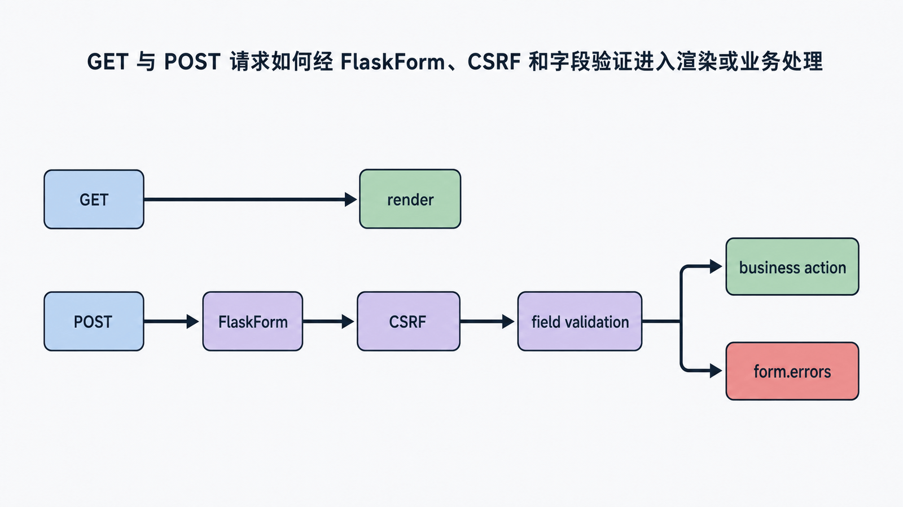
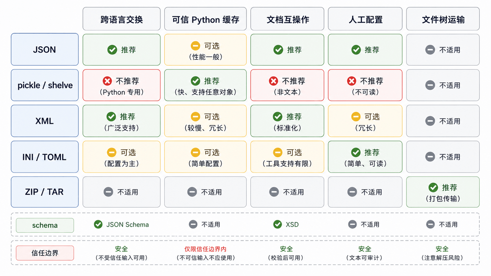
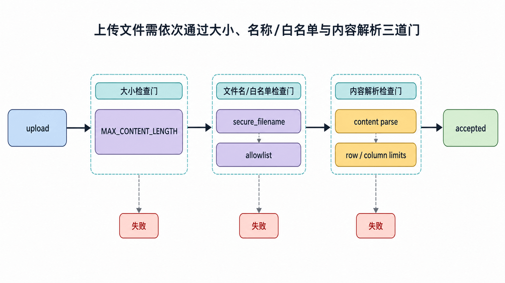

## 前置知识与学习目标

你应理解 WTForms 的 `process -> validate -> errors`，以及登录视图的输入风险。本篇只解决：**如何把纯 WTForms 模型安全接入 Flask 请求与模板？**

完成后你能够：

1. 解释 `FlaskForm` 如何绑定请求数据并提供 CSRF token。
2. 区分 `is_submitted`、`validate` 与 `validate_on_submit`。
3. 正确展示字段错误和全局 CSRF 错误。
4. 校验上传文件的类型、大小与安全文件名，并识别其边界。

## 从纯 Form 到 FlaskForm

<!-- figure-anchor:s09-f01 -->

<!-- figure:s09-f01:start -->



<!-- figure:s09-f01:end -->

Flask-WTF 提供 `FlaskForm`，在活动请求中自动选择 formdata，并集成 CSRF：

```python
from flask_wtf import FlaskForm
from wtforms import BooleanField, PasswordField, StringField, SubmitField
from wtforms.validators import DataRequired, Email, Length

class LoginForm(FlaskForm):
    email = StringField(
        "邮箱",
        validators=[DataRequired(), Email(), Length(max=254)],
    )
    password = PasswordField(
        "密码",
        validators=[DataRequired(), Length(max=200)],
    )
    remember = BooleanField("记住我")
    submit = SubmitField("登录")
```

`Email()` 负责格式，不负责证明邮箱存在；`Length` 也不是密码强度策略。输入层验证只应做结构与可接受性检查。

## 请求到错误输出的链路

<!-- figure-anchor:s09-f02 -->

<!-- figure:s09-f02:start -->



<!-- figure:s09-f02:end -->

```python
from flask import render_template

@auth_bp.route("/login", methods=["GET", "POST"])
def login():
    form = LoginForm()
    if form.validate_on_submit():
        return authenticate_and_redirect(form)
    return render_template("auth/login.html", form=form)
```

`validate_on_submit()` 近似于“请求是提交方法且 `validate()` 通过”。GET 请求不会被当作验证失败。若写成 `if form.validate():`，GET 页也可能出现不必要错误。

状态变化：

```text
GET  /login -> form 未提交 -> 渲染空表单
POST /login -> 绑定 request.form/files -> CSRF + 字段验证
              -> 成功：认证
              -> 失败：form.errors -> 原页面
```

## 模板必须提交 CSRF，并逐字段显示错误

```html
<form method="post" novalidate>
  {{ form.hidden_tag() }} {{ form.email.label }} {{
  form.email(autocomplete="email") }} 
  <p role="alert">{{ error }}</p>
   {{ form.password.label }} {{
  form.password(autocomplete="current-password") }} 
  <p role="alert">{{ error }}</p>
   {{ form.submit() }}
</form>
```

`novalidate` 关闭浏览器原生阻断，便于统一展示服务端错误；即使保留浏览器校验，服务端仍必须验证，因为客户端规则可被绕过。

CSRF 依赖稳定、保密的 `SECRET_KEY` 或专用 `WTF_CSRF_SECRET_KEY`。token 证明请求来自获得过页面的一方，不替代认证、授权或幂等控制。

## 全局 CSRF 错误

<!-- figure-anchor:s09-f03 -->

<!-- figure:s09-f03:start -->



<!-- figure:s09-f03:end -->

请求可能在进入视图前就因 CSRF 失败。应给 HTML 与 JSON 客户端稳定响应：

```python
from flask import jsonify, request
from flask_wtf.csrf import CSRFError

@app.errorhandler(CSRFError)
def handle_csrf_error(error):
    if request.accept_mimetypes.best == "application/json":
        return jsonify(error="csrf", message=error.description), 400
    return render_template(
        "errors/csrf.html",
        reason=error.description,
    ), 400
```

不要把原始 token、cookie 或密钥写入日志。

## 文件上传的三道检查

```python
from flask_wtf.file import FileAllowed, FileField, FileRequired
from werkzeug.utils import secure_filename

class ImportTasksForm(FlaskForm):
    file = FileField(
        "CSV 文件",
        validators=[
            FileRequired(),
            FileAllowed(["csv"], "只允许 CSV"),
        ],
    )

@tasks_bp.route("/import", methods=["GET", "POST"])
@login_required
def import_tasks():
    form = ImportTasksForm()
    if form.validate_on_submit():
        upload = form.file.data
        filename = secure_filename(upload.filename)
        if not filename:
            return {"error": "invalid filename"}, 422

        rows = parse_csv_with_limits(upload.stream)
        enqueue_import(rows, owner_id=current_user.id)
        return {"accepted": len(rows)}, 202

    return render_template("tasks/import.html", form=form)
```

需要同时限制：

1. 请求体大小：`MAX_CONTENT_LENGTH`。
2. 文件名与扩展名：`secure_filename` 和 allowlist。
3. 实际内容：解析器限制行数、列数、编码、单元格长度与公式注入风险。

扩展名不是 MIME 或内容真实性证明。上传内容应存到非可执行位置，使用服务端生成的文件名，并按业务需要进行病毒扫描。

## 自定义验证与数据库竞态

“邮箱必须唯一”可以在 Form 中给出友好提示，但不能替代数据库唯一约束：

```python
def validate_email(self, field):
    normalized = field.data.strip().lower()
    exists = db.session.scalar(
        select(User.id).where(User.email == normalized)
    )
    if exists is not None:
        raise ValidationError("该邮箱已注册")
```

两个并发请求可能都先查询为不存在，再同时插入。最终正确性由数据库 UNIQUE 约束保证，应用捕获 `IntegrityError` 并映射为稳定错误。

## 最小行为测试

```python
def test_login_rejects_missing_csrf(app, client):
    app.config["WTF_CSRF_ENABLED"] = True
    response = client.post(
        "/auth/login",
        data={"email": "a@example.com", "password": "secret"},
    )
    assert response.status_code == 400

def test_form_validation_without_csrf(app):
    app.config["WTF_CSRF_ENABLED"] = False
    with app.test_request_context(
        method="POST",
        data={"email": "bad", "password": ""},
    ):
        form = LoginForm()
        assert not form.validate_on_submit()
        assert {"email", "password"} <= form.errors.keys()
```

不要在所有测试中永久关闭 CSRF；至少保留一组集成测试验证 token 获取和提交链。

## 常见误区与适用边界

- **只依赖 HTML5 required**：客户端可绕过。
- **忘记 `hidden_tag()`**：POST 会因缺 token 失败。
- **GET 也调用并展示 `validate()` 错误**：页面首次打开就报错。
- **只检查上传扩展名**：内容仍可能恶意或超大。
- **表单唯一性查询替代数据库约束**：存在并发竞态。
- **API token 接口机械启用 Cookie CSRF 模式**：应先明确认证载体与跨域边界。
- **把密码回填到表单**：密码字段不应在失败后回显。

## 自检题

1. `validate_on_submit` 比直接 `validate` 多判断了什么？
2. CSRF token 能否证明当前用户有权修改任务？
3. 为什么 `FileAllowed(["csv"])` 仍不足以安全导入 CSV？

<details>
<summary>答案</summary>

1. 它先判断请求是否属于表单提交方法，再运行验证。
2. 不能。CSRF 防跨站伪造；认证和资源授权仍需单独检查。
3. 它主要检查文件名扩展，仍需限制大小、解析内容、行列和公式注入等风险。

</details>

## 本篇总结

Flask-WTF 把请求绑定、CSRF 和模板集成在 WTForms 之上。安全边界由服务端验证、稳定错误、数据库约束和上传内容检查共同组成，任何一层都不能机械替代其他层。

## 下一篇衔接

CSRF 与登录都依赖 session。下一篇比较 Flask 内置签名 Cookie 会话和 Flask-Session 的服务端存储，重点解释“客户端保存什么、服务端保存什么、如何过期与清理”。

## 资料来源

- [Flask-WTF 官方文档：Quickstart](https://flask-wtf.readthedocs.io/en/latest/quickstart/)
- [Flask-WTF 官方文档：CSRF Protection](https://flask-wtf.readthedocs.io/en/latest/csrf/)
- [Flask-WTF 官方文档：File Uploads](https://flask-wtf.readthedocs.io/en/latest/form/)
- [Flask 官方文档：Security Considerations](https://flask.palletsprojects.com/en/stable/web-security/)
