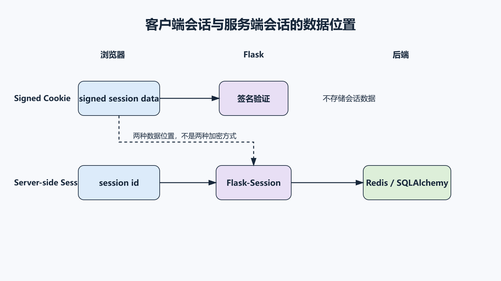
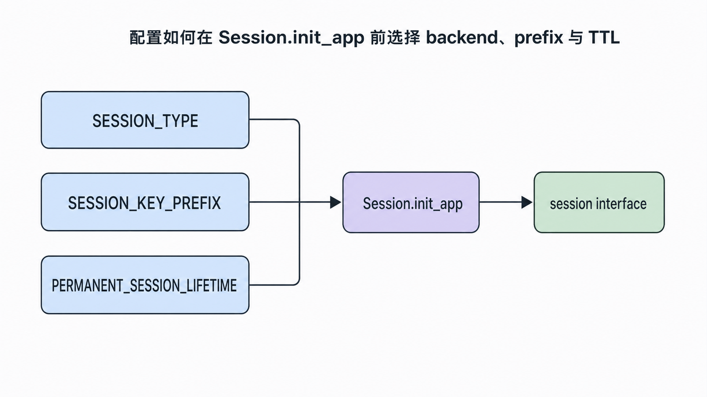
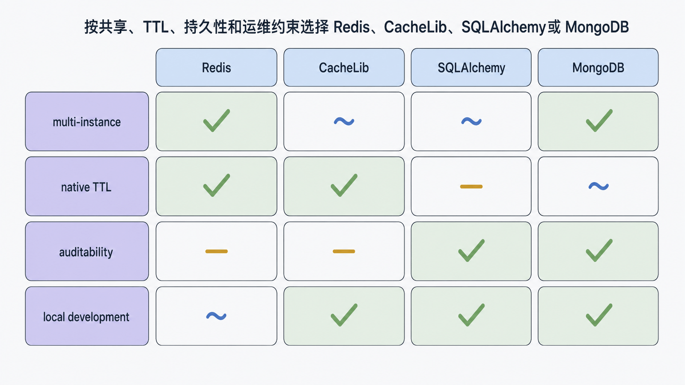
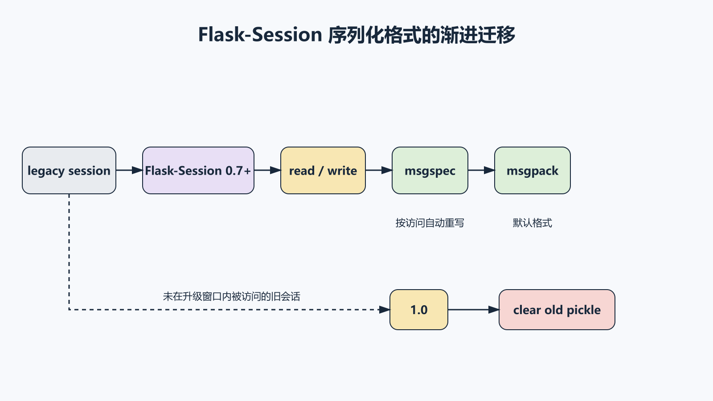

## 前置知识与学习目标

你应理解 Cookie、Flask-Login 的用户 ID 恢复和 CSRF。本篇只解决：**会话状态究竟存在哪里，如何过期、撤销、扩容与故障恢复？**

完成后你能够：

1. 区分 Flask 内置签名 Cookie session 与服务端 session。
2. 解释 session ID、cookie 属性、后端 TTL 和清理任务的关系。
3. 在 Redis、CacheLib、SQLAlchemy 等后端间做约束驱动选择。
4. 规划序列化迁移、密钥轮换、故障降级与最小验收。

## 先纠正一个常见说法

Flask 默认 session **不是服务器内存里的字典**。默认 `SecureCookieSessionInterface` 把会话数据序列化并签名后放在客户端 Cookie 中。

- 客户端能看到编码后的内容，因此不要存秘密。
- 签名能检测篡改，但默认不等于加密。
- 服务端无会话记录，横向扩容简单。
- 单个用户强制撤销、体积限制和数据更新较困难。

服务端 session 则让 Cookie 通常只保存随机 session ID，实际数据存后端。

## 两种存储模型

<!-- figure-anchor:s10-f01 -->

<!-- figure:s10-f01:start -->



<!-- figure:s10-f01:end -->

```text
Signed cookie:
browser [signed session data] <-> Flask [SECRET_KEY verify]

Server-side:
browser [session id] <-> Flask-Session <-> Redis/SQLAlchemy/CacheLib
```

服务端存储减少 Cookie 数据量并便于撤销，但新增后端可用性、TTL、清理、序列化和容量治理。

## 内置签名 Cookie 的最小配置

```python
from datetime import timedelta

app.config.update(
    SECRET_KEY="from-secret-manager",
    SESSION_COOKIE_NAME="taskboard_session",
    SESSION_COOKIE_SECURE=True,
    SESSION_COOKIE_HTTPONLY=True,
    SESSION_COOKIE_SAMESITE="Lax",
    PERMANENT_SESSION_LIFETIME=timedelta(hours=8),
)
```

登录成功后可设置 `session.permanent = True`。过期语义同时受浏览器 Cookie 与服务端校验影响。不能把银行卡号、密码、token 私钥或大对象放入 session。

## Flask-Session 的工厂初始化

<!-- figure-anchor:s10-f02 -->

<!-- figure:s10-f02:start -->



<!-- figure:s10-f02:end -->

```python
from flask_session import Session

server_session = Session()

def create_app(test_config=None):
    app = Flask(__name__)
    app.config.from_mapping(
        SESSION_TYPE="redis",
        SESSION_PERMANENT=True,
        SESSION_KEY_PREFIX="taskboard:",
    )
    if test_config:
        app.config.from_mapping(test_config)

    server_session.init_app(app)
    return app
```

同其他扩展一样，后端配置必须在 `init_app` 之前完成。

Redis 客户端应显式配置超时与重试策略：

```python
from redis import Redis
from redis.backoff import ExponentialBackoff
from redis.retry import Retry
from redis.exceptions import BusyLoadingError, ConnectionError, TimeoutError

app.config["SESSION_REDIS"] = Redis.from_url(
    app.config["SESSION_REDIS_URL"],
    socket_connect_timeout=1,
    socket_timeout=1,
    retry=Retry(
        ExponentialBackoff(),
        3,
    ),
    retry_on_error=[BusyLoadingError, ConnectionError, TimeoutError],
)
```

重试会增加尾延迟；会话后端不可用时，是拒绝请求、让用户重新登录，还是只让匿名页面降级，必须由业务风险决定。

## 后端选择不是功能清单

<!-- figure-anchor:s10-f03 -->

<!-- figure:s10-f03:start -->



<!-- figure:s10-f03:end -->

| 后端       | 优势                        | 主要边界                                            | 适用场景                   |
| ---------- | --------------------------- | --------------------------------------------------- | -------------------------- |
| Redis      | TTL 原生、吞吐高、共享方便  | 需治理内存、持久化与网络故障                        | 多实例 Web 应用            |
| CacheLib   | 接口简单，可用文件/缓存实现 | filesystem 类型已被新版本弃用；单机文件不适合多副本 | 本地开发、受控单机         |
| SQLAlchemy | 可审计、可用现有数据库      | 清理过期行、写放大和数据库压力                      | 低吞吐、需集中持久化       |
| MongoDB    | 文档存储、TTL 索引能力      | 增加独立依赖与索引治理                              | 已有 MongoDB 平台          |
| Memcached  | 简单内存缓存                | 淘汰后会登出、持久性弱                              | 可接受会话丢失的缓存型场景 |

新项目不要继续使用已弃用的 `SESSION_TYPE="filesystem"`；应改用 CacheLib 接口。不要因为某后端“支持”就同时启用多个后端。

## TTL、清理与撤销

服务端 session 有两种时间：

1. Cookie 的浏览器过期时间。
2. 后端记录的 TTL 或过期字段。

两者不一致会产生幽灵记录或提前登出。Redis 使用 TTL 自动清理；SQLAlchemy 等后端需要定期清理，可在部署平台用定时任务执行清理命令，而不是每个请求都扫描。

用户改密、禁用或退出时，应用还要决定是否轮换/删除 session ID。只清除浏览器 Cookie 不一定立刻删除服务端记录。

## 序列化迁移

<!-- figure-anchor:s10-f04 -->

<!-- figure:s10-f04:start -->



<!-- figure:s10-f04:end -->

Flask-Session 0.7+ 使用 `msgspec`，默认格式为 msgpack；旧会话会在读取或写入时迁移。升级前应：

- 盘点当前 Flask-Session 版本与序列化格式。
- 在预发布环境读取旧会话并观察转换。
- 允许强制全部用户重新登录的回退方案。
- 禁止使用不可信 pickle 会话数据。
- 监控反序列化失败、后端容量和登录率。

会话格式是运行数据合同，不能只升级依赖不做迁移验证。

## 最小行为测试

```python
def test_session_cookie_attributes(client):
    response = client.get("/session-probe")
    cookie = response.headers.get("Set-Cookie", "")
    assert "HttpOnly" in cookie
    assert "SameSite=Lax" in cookie

def test_logout_clears_identity(client, logged_in_user):
    assert client.get("/tasks/").status_code == 200
    client.post("/auth/logout")
    response = client.get("/tasks/")
    assert response.status_code in {302, 401}

def test_backend_failure_has_stable_response(app, client, monkeypatch):
    def fail(*args, **kwargs):
        raise TimeoutError("session backend timeout")

    monkeypatch.setattr(app.session_interface, "open_session", fail)
    response = client.get("/tasks/")
    assert response.status_code in {503, 500}
```

最后一个测试的期望取决于统一错误处理策略；生产推荐将基础设施故障映射为可监控的 503，而不是泄露异常。

## 常见误区与适用边界

- **把签名当加密**：客户端仍可读取 Cookie 内容。
- **把 ORM Session 与 HTTP session 混淆**：前者管理数据库工作单元。
- **服务端 session 就不需要安全 Cookie**：session ID 仍是凭据。
- **无 TTL 或清理任务**：存储会持续增长。
- **把 Redis 淘汰策略当普通缓存**：淘汰 session 会让用户随机登出。
- **升级序列化器不做演练**：旧会话可能全部失效。
- **session 存大对象或权限快照**：数据陈旧且放大存储与网络成本。

## 自检题

1. Flask 默认 session 的数据主要存在哪里？签名提供什么、不提供什么？
2. 服务端 session 为何仍要设置 `Secure`、`HttpOnly` 和 `SameSite`？
3. SQLAlchemy 后端为什么需要单独的清理计划？

<details>
<summary>答案</summary>

1. 存在客户端 Cookie；签名检测篡改，不默认保密。
2. Cookie 中的 session ID 仍是可被窃取和滥用的凭据。
3. 过期记录不会像 Redis TTL 那样天然及时删除，需要计划任务清理。

</details>

## 本篇总结

会话设计的核心不是后端枚举，而是数据位置、凭据保护、TTL、撤销、容量、故障和格式迁移。默认签名 Cookie 与服务端 session 各有清晰优势和代价，应从风险与运维能力选择。

## 下一篇衔接

有了稳定应用和会话后端，还需要可审计的运维入口。下一篇使用 Flask CLI 编写幂等的建库、创建用户与清理会话命令，并解释命令为何自动获得应用上下文。

## 资料来源

- [Flask 官方文档：Sessions](https://flask.palletsprojects.com/en/stable/api/#sessions)
- [Flask-Session 官方文档](https://flask-session.readthedocs.io/en/latest/)
- [Flask-Session 官方文档：Configuration](https://flask-session.readthedocs.io/en/latest/config.html)
- [Flask 官方文档：Security Considerations](https://flask.palletsprojects.com/en/stable/web-security/)
