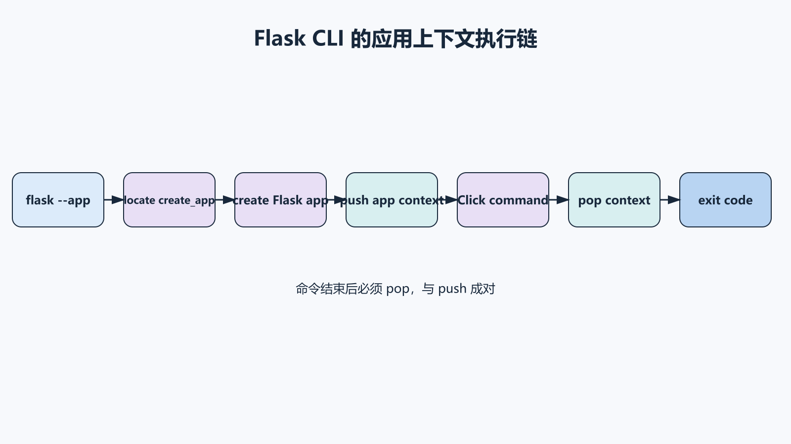
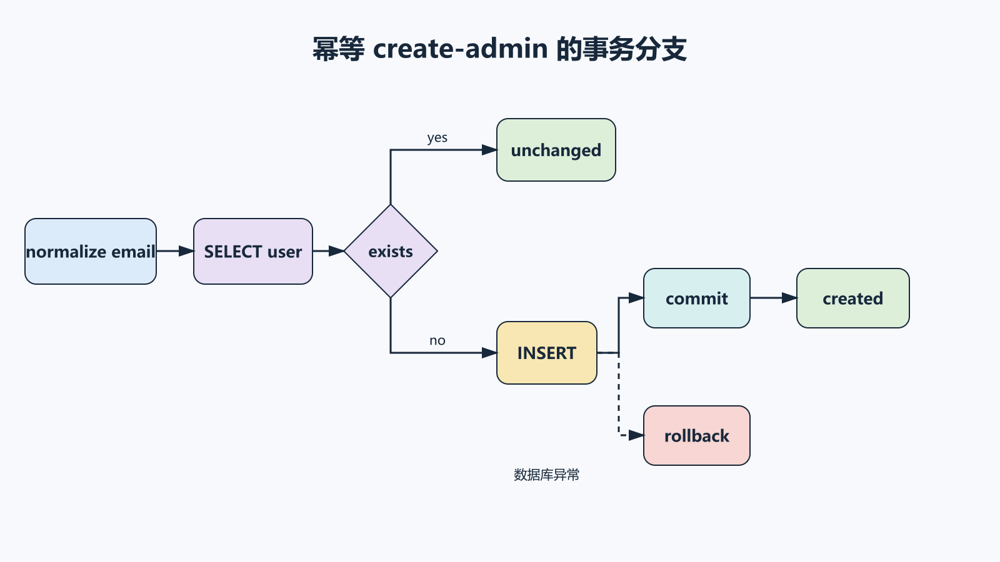
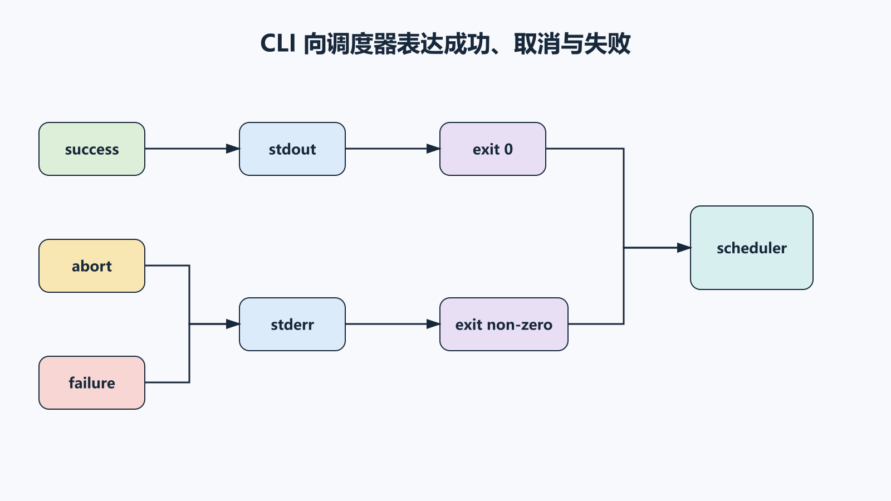

## 前置知识与学习目标

你应理解应用工厂、数据库 Session 和迁移。本篇只解决：**如何把运维动作做成可重复、可审计、可测试的 CLI 合同？**

完成后你能够：

1. 解释 `flask --app` 如何发现应用工厂并推入应用上下文。
2. 用 Click option、argument、group 和 prompt 设计命令。
3. 为写操作增加幂等性、确认门、事务和退出码。
4. 使用 `test_cli_runner` 覆盖成功、拒绝和失败路径。

## CLI 不是把 Python 函数暴露出去

一个可靠命令至少定义：

- 输入参数与来源。
- 是否幂等。
- 会修改什么状态。
- 成功输出与退出码。
- 失败是否回滚。
- 是否支持 dry-run 或确认。
- 日志中哪些数据必须脱敏。

Flask CLI 建立在 Click 之上，并能加载应用工厂。

## 应用发现与上下文

<!-- figure-anchor:s11-f01 -->

<!-- figure:s11-f01:start -->



<!-- figure:s11-f01:end -->

```bash
flask --app taskboard:create_app routes
flask --app taskboard:create_app shell
```

当工厂命名为 `create_app` 或 `make_app` 时，Flask 能自动识别。通过 `app.cli.command` 注册的命令在执行时自动获得应用上下文，因此可以使用 `current_app` 和 `db.session`；普通 Click 命令需要 `with_appcontext`。

## 幂等的初始化命令

<!-- figure-anchor:s11-f02 -->

<!-- figure:s11-f02:start -->



<!-- figure:s11-f02:end -->

```python
import click
from flask import current_app
from flask.cli import with_appcontext
from sqlalchemy import select
from werkzeug.security import generate_password_hash

@click.command("create-admin")
@click.option("--email", required=True)
@click.option(
    "--password",
    prompt=True,
    hide_input=True,
    confirmation_prompt=True,
)
@with_appcontext
def create_admin(email: str, password: str):
    normalized = email.strip().lower()
    existing = db.session.scalar(
        select(User).where(User.email == normalized)
    )
    if existing is not None:
        click.echo(f"unchanged: {normalized}")
        return

    user = User(
        email=normalized,
        password_hash=generate_password_hash(password),
        is_admin=True,
    )
    try:
        db.session.add(user)
        db.session.commit()
    except Exception as exc:
        db.session.rollback()
        raise click.ClickException("create-admin failed") from exc

    current_app.logger.info("admin created", extra={"email": normalized})
    click.echo(f"created: {normalized}")
```

重复运行对同一邮箱返回 `unchanged`，而不是创建重复用户或报模糊异常。密码通过隐藏 prompt 输入，不作为命令行参数暴露在 shell history 和进程列表中。

注册：

```python
def register_commands(app):
    app.cli.add_command(create_admin)
```

## Group 与职责边界

```python
@click.group("tasks")
def task_commands():
    """Task maintenance commands."""

@task_commands.command("recount")
@click.option("--dry-run", is_flag=True, help="只报告，不写入")
@with_appcontext
def recount_tasks(dry_run: bool):
    changes = calculate_counter_repairs()
    click.echo(f"planned changes: {len(changes)}")
    if dry_run:
        return

    if not click.confirm("Apply changes?"):
        raise click.Abort()

    apply_counter_repairs(changes)
    db.session.commit()
    click.echo("applied")
```

Group 用于组织同一领域命令，不应形成一个包揽迁移、用户、缓存和部署的“万能命令”。

## 退出码、stdout 与 stderr

<!-- figure-anchor:s11-f03 -->

<!-- figure:s11-f03:start -->



<!-- figure:s11-f03:end -->

Unix 约定 `0` 表示成功，非零表示失败。Click 的 `ClickException` 会输出错误并返回非零码；`Abort` 表示用户取消。

自动化脚本需要稳定输出。建议：

- stdout 输出机器可消费的结果。
- stderr 输出诊断。
- 秘密信息永不输出。
- 重要批处理支持 `--format json`。
- 部分成功时明确计数并返回团队约定的非零码。

不要依赖中文文本解析判断成功，优先使用退出码和 JSON 结构。

## 数据库命令的事务与批次

长任务不能一次加载全部数据：

```python
@click.command("expire-overdue")
@click.option("--batch-size", default=500, type=click.IntRange(1, 5000))
@with_appcontext
def expire_overdue(batch_size: int):
    total = 0
    while True:
        tasks = load_overdue_batch(limit=batch_size)
        if not tasks:
            break

        try:
            for task in tasks:
                task.status = "expired"
            db.session.commit()
        except Exception as exc:
            db.session.rollback()
            raise click.ClickException(
                f"failed after {total} tasks"
            ) from exc

        total += len(tasks)
        click.echo(f"processed={total}")

    click.echo(f"done total={total}")
```

批次边界降低锁与内存压力，但也意味着命令可能部分提交。要可恢复，筛选条件必须让已处理记录不会再次产生副作用，或记录 checkpoint。

## Shell 上下文

`shell_context_processor` 可给交互 shell 提供常用对象：

```python
@app.shell_context_processor
def make_shell_context():
    return {"db": db, "User": User, "Task": Task}
```

这只是开发便利。不要把生产修改依赖于不可审计的交互 shell；稳定操作应落到版本化 CLI 命令。

## 最小行为测试

```python
def test_create_admin_is_idempotent(app):
    runner = app.test_cli_runner()

    first = runner.invoke(
        args=["create-admin", "--email", "admin@example.com"],
        input="secret-password\nsecret-password\n",
    )
    assert first.exit_code == 0
    assert "created:" in first.output

    second = runner.invoke(
        args=["create-admin", "--email", "admin@example.com"],
        input="another-password\nanother-password\n",
    )
    assert second.exit_code == 0
    assert "unchanged:" in second.output

def test_recount_can_abort(app):
    runner = app.test_cli_runner()
    result = runner.invoke(args=["tasks", "recount"], input="n\n")
    assert result.exit_code != 0
    assert "Aborted" in result.output
```

测试要使用隔离数据库与测试配置，不调用真实外部服务。

## 常见误区与适用边界

- **密码放 option 值**：会进入 history 和进程参数。
- **命令不可重跑**：中断恢复会造成重复副作用。
- **异常后不 rollback**：Session 留在失败状态。
- **把交互 shell 当生产流程**：缺少版本、审计和测试。
- **所有错误都返回 0**：调度系统无法识别失败。
- **长事务处理全表**：锁、内存与恢复成本过高。
- **Web 请求里运行迁移或重任务**：应交给受控 CLI/作业系统。

## 自检题

1. 为什么 `create-admin` 重复执行应返回 unchanged？
2. 密码为什么适合隐藏 prompt，不适合 `--password value`？
3. 批处理每批 commit 带来什么好处与新风险？

<details>
<summary>答案</summary>

1. 幂等性让部署重试和中断恢复不产生重复账户。
2. 命令行参数可能被 shell history 和进程列表记录。
3. 降低单次事务锁和内存，但可能部分成功，必须设计 checkpoint 或天然幂等。

</details>

## 本篇总结

可靠 CLI 是有输入、状态变化、幂等性、事务、输出和退出码的运维接口。Flask 提供应用发现与上下文，Click 提供参数和交互；正确性仍来自清晰的领域边界与恢复策略。

## 下一篇衔接

最后一篇把同一个工厂应用交给生产 WSGI 服务器，并沿客户端、Nginx、Gunicorn、Flask、数据库/Redis 的信任边界完成部署与验收。

## 资料来源

- [Flask 官方文档：Command Line Interface](https://flask.palletsprojects.com/en/stable/cli/)
- [Click 官方文档](https://click.palletsprojects.com/en/stable/)
- [Flask 官方文档：Testing CLI Commands](https://flask.palletsprojects.com/en/stable/testing/#running-commands-with-the-cli-runner)
