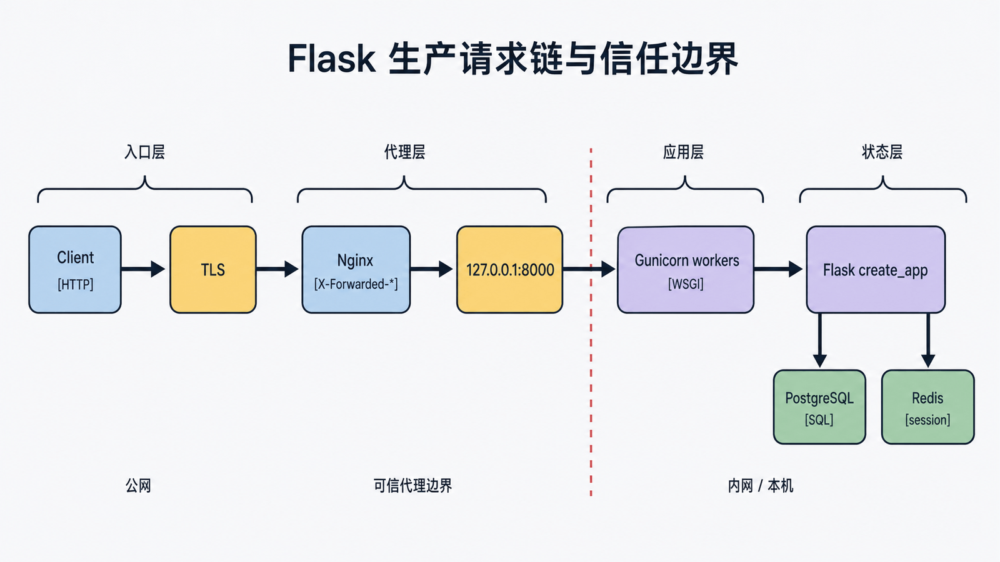
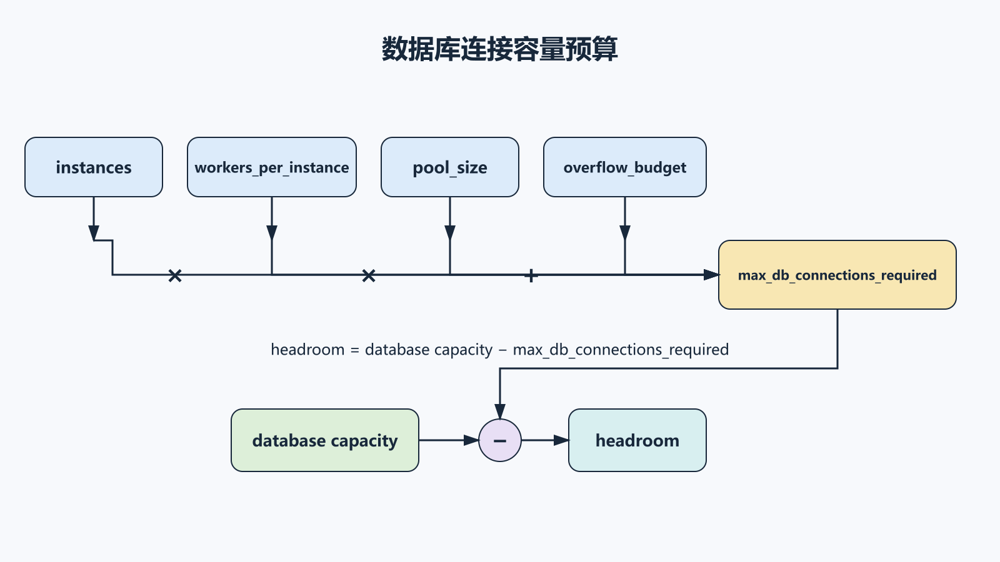
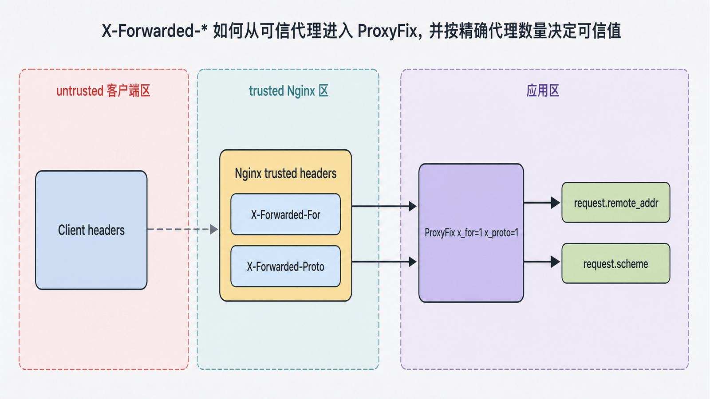
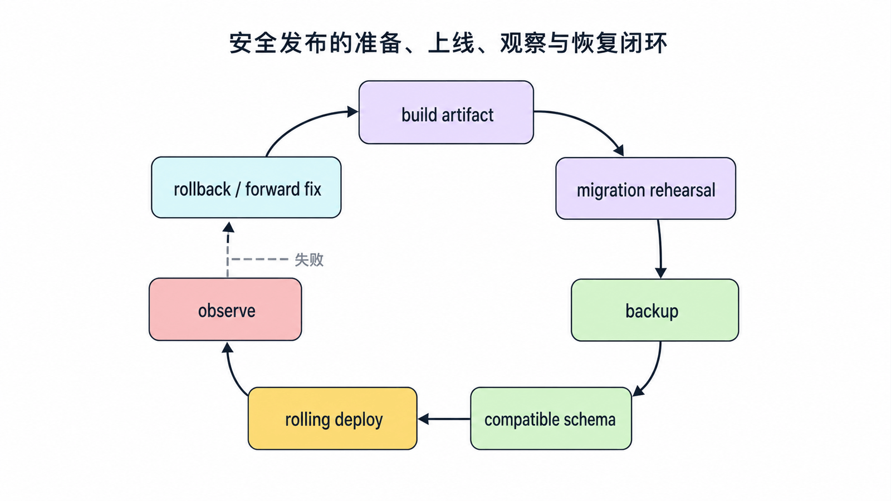
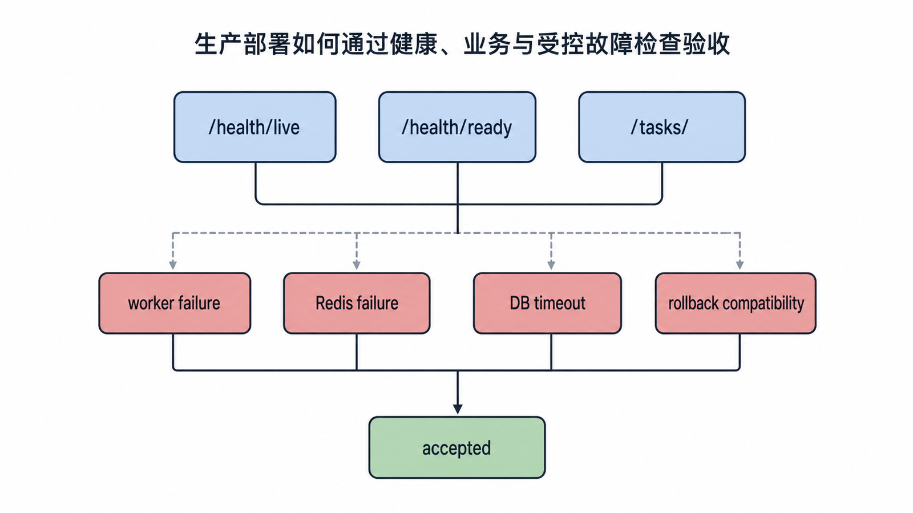

## 前置知识与学习目标

你应已完成应用工厂、数据库迁移、session 后端与 CLI。本篇只解决：**如何把 TaskBoard 放进可观测、可回滚、信任边界明确的生产请求链？**

完成后你能够：

1. 解释 Nginx、Gunicorn、Flask 和进程管理器的职责。
2. 正确加载应用工厂，并按负载实测选择 worker。
3. 配置反向代理与 `ProxyFix` 的精确信任数量。
4. 在 Supervisor 与容器编排中选择一套进程所有权模型。
5. 用健康检查、迁移、回滚与故障演练验收部署。

## 生产请求拓扑

<!-- figure-anchor:s12-f01 -->

<!-- figure:s12-f01:start -->



<!-- figure:s12-f01:end -->

```text
Client
  -> TLS / Nginx reverse proxy
  -> Unix socket or 127.0.0.1:8000
  -> Gunicorn workers
  -> Flask create_app()
  -> PostgreSQL + Redis
```

职责：

- **Nginx**：TLS、请求体限制、静态资源、反向代理、基础超时。
- **Gunicorn**：加载 WSGI 应用、管理 worker、并发与优雅重启。
- **Flask**：路由、业务、认证与响应。
- **Supervisor/systemd 或容器平台**：进程拉起、重启、日志与生命周期。
- **数据库/Redis**：持久状态与会话；不应与 Web 进程生命周期绑定。

Flask 开发服务器不能用于生产。

## 可部署入口

```python
# wsgi.py
from taskboard import create_app

app = create_app()
```

Gunicorn 可以直接调用工厂：

```bash
gunicorn --workers 4 --bind 127.0.0.1:8000 "taskboard:create_app()"
```

Gunicorn 官方文档说明它不原生支持 Windows；Windows 主机应使用 WSL/Linux 容器或选择支持 Windows 的 WSGI 服务器。不要用本地 Windows 成功运行的开发服务器推断生产拓扑。

## Worker 不是固定公式

<!-- figure-anchor:s12-f02 -->

<!-- figure:s12-f02:start -->



<!-- figure:s12-f02:end -->

“CPU × 2 + 1”最多是历史起点，不是容量结论。选择需要测量：

- CPU 密集还是 I/O 密集。
- 单 worker 内存占用。
- 数据库连接池容量。
- 请求延迟分位数与超时。
- 长连接/流式响应数量。
- worker 重启与冷启动成本。

默认 sync worker 适合很多普通请求。大量长时间并发连接可评估 gevent，但它不是 Python `async/await` 或 ASGI；第三方库、上下文局部和 monkey patch 兼容性必须验证。

连接预算示例：

```text
max_db_connections_required
  = instances × workers_per_instance × pool_size
    + overflow_budget
```

结果必须小于数据库允许容量并留出迁移、CLI 和管理连接余量。

## Nginx 反向代理

```nginx
server {
    listen 443 ssl;
    server_name taskboard.example.com;

    client_max_body_size 4m;

    location / {
        proxy_pass http://127.0.0.1:8000;
        proxy_set_header Host $host;
        proxy_set_header X-Forwarded-For $proxy_add_x_forwarded_for;
        proxy_set_header X-Forwarded-Proto $scheme;
        proxy_set_header X-Forwarded-Host $host;
        proxy_set_header X-Forwarded-Prefix /;

        proxy_connect_timeout 3s;
        proxy_read_timeout 30s;
    }
}
```

Gunicorn 绑定 `127.0.0.1` 或 Unix socket，避免绕过 Nginx。若确实需要容器网络暴露，使用网络策略限制来源。

## `ProxyFix` 是信任配置

<!-- figure-anchor:s12-f03 -->

<!-- figure:s12-f03:start -->



<!-- figure:s12-f03:end -->

```python
from werkzeug.middleware.proxy_fix import ProxyFix

def create_app(test_config=None):
    app = Flask(__name__)
    ...
    app.wsgi_app = ProxyFix(
        app.wsgi_app,
        x_for=1,
        x_proto=1,
        x_host=1,
        x_prefix=1,
    )
    return app
```

每个数字表示应用前有多少个可信代理设置对应 Header。填大或在没有受控代理时启用，会信任客户端伪造的 `X-Forwarded-*`，影响 IP、scheme、host 与安全 URL。多层 CDN/LB/Nginx 架构必须按真实链路配置，不能复制粘贴 `1`。

## Supervisor 与 Docker 不重复拥有同一进程

### 传统主机

Supervisor 或 systemd 启动 Gunicorn：

```ini
[program:taskboard]
directory=/srv/taskboard
command=/srv/taskboard/.venv/bin/gunicorn --workers 4 --bind unix:/run/taskboard.sock "taskboard:create_app()"
user=taskboard
autostart=true
autorestart=true
stopsignal=TERM
stopasgroup=true
killasgroup=true
stdout_logfile=/var/log/taskboard/stdout.log
stderr_logfile=/var/log/taskboard/stderr.log
environment=TASKBOARD_ENV="production"
```

### 容器

一个容器直接运行一个前台 Gunicorn 主进程，由容器平台负责重启；通常不再在容器里套 Supervisor。

```dockerfile
FROM python:3.13-slim

WORKDIR /app
COPY requirements.txt .
RUN pip install --no-cache-dir -r requirements.txt

COPY . .
RUN useradd --create-home appuser
USER appuser

EXPOSE 8000
CMD ["gunicorn", "--workers", "4", "--bind", "0.0.0.0:8000", "taskboard:create_app()"]
```

镜像应固定依赖、以非 root 运行、不要包含密钥。实际 Python 版本要以依赖兼容矩阵和测试结果为准。

## 发布、迁移与回滚顺序

<!-- figure-anchor:s12-f04 -->

<!-- figure:s12-f04:start -->



<!-- figure:s12-f04:end -->

安全发布闭环：

1. 构建不可变制品并完成依赖/漏洞扫描。
2. 在预发布执行从真实版本升级的迁移演练。
3. 备份并确认恢复目标。
4. 先执行向后兼容 schema 变更。
5. 滚动发布应用，观察错误率、延迟、连接与登录率。
6. 完成数据回填，再删除旧字段。
7. 回滚应用或前滚修复；不要假设所有数据迁移可 downgrade。

应用启动时自动跑迁移会让多个副本竞争，且把 schema 变更与健康检查耦合。迁移应由单独受控作业执行。

## 健康检查与优雅关闭

```python
@app.get("/health/live")
def live():
    return {"status": "alive"}

@app.get("/health/ready")
def ready():
    checks = {
        "database": check_database(timeout=0.5),
        "session": check_session_backend(timeout=0.5),
    }
    status = 200 if all(checks.values()) else 503
    return {"checks": checks}, status
```

liveness 只判断进程是否卡死，不应因数据库瞬时失败反复重启所有实例；readiness 决定是否接收流量。关闭时先停止新请求，给现有请求限时完成，再终止 worker。

## 最小部署验收

<!-- figure-anchor:s12-f05 -->

<!-- figure:s12-f05:start -->



<!-- figure:s12-f05:end -->

至少自动验证：

```bash
curl --fail --silent https://taskboard.example.com/health/live
curl --fail --silent https://taskboard.example.com/health/ready
curl --fail --silent https://taskboard.example.com/tasks/
```

并进行一次受控故障演练：

- 停止一个 worker，确认流量继续且自动恢复。
- 暂停 Redis，确认登录/匿名页面按策略响应。
- 制造数据库连接超时，确认返回稳定 503 且连接不泄漏。
- 回滚一个应用版本，确认 schema 仍兼容。
- 检查日志没有 session、密码或密钥。

## 常见误区与适用边界

- **开发服务器上生产**：缺少生产安全与稳定性。
- **Gunicorn 直接暴露且 Nginx 仍存在**：客户端可绕过代理策略。
- **照抄 worker 公式**：可能耗尽内存或数据库连接。
- **无条件信任所有 forwarded headers**：客户端可伪造来源和 scheme。
- **容器里再用 Supervisor 管同一进程**：生命周期所有权重复。
- **每个副本启动时迁移**：并发竞争和回滚不可控。
- **把 liveness 绑定所有依赖**：依赖抖动会形成重启风暴。
- **只验证首页 200**：无法证明迁移、认证、session 和故障边界正常。

## 自检题

1. 为什么 Gunicorn 通常只绑定本机地址或 Unix socket？
2. `ProxyFix(x_for=1)` 中的 1 表示什么？
3. 为什么容器部署通常不再在容器内运行 Supervisor？

<details>
<summary>答案</summary>

1. 避免客户端绕过 Nginx 的 TLS、限制与可信 Header 设置。
2. 应用前恰有一个可信代理设置 `X-Forwarded-For`；不是“开启代理支持”的布尔值。
3. 容器平台已经拥有拉起、重启和停止主进程的职责，重复管理会让信号与状态不清。

</details>

## 本篇总结

生产部署是一条有信任边界的请求链，而不是工具清单。Nginx、Gunicorn、Flask、进程管理器和状态后端各自只拥有一层职责；容量、迁移、代理信任、健康检查与回滚都必须通过行为验收。

## 下一篇衔接

本系列到此闭环。建议回到第一篇，从 WSGI 请求链开始，在隔离环境完整演练：创建应用、注册蓝图、迁移数据库、验证表单与登录、切换 session 后端、运行 CLI，再部署并执行故障演练。

## 资料来源

- [Flask 官方文档：Deploying to Production](https://flask.palletsprojects.com/en/stable/deploying/)
- [Flask 官方文档：Gunicorn](https://flask.palletsprojects.com/en/stable/deploying/gunicorn/)
- [Flask 官方文档：nginx](https://flask.palletsprojects.com/en/stable/deploying/nginx/)
- [Flask 官方文档：Tell Flask it is Behind a Proxy](https://flask.palletsprojects.com/en/stable/deploying/proxy_fix/)
- [Gunicorn 官方文档：Design](https://docs.gunicorn.org/en/stable/design.html)
