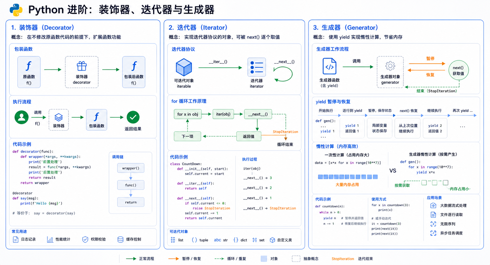

# Python 装饰器、迭代器、生成器



## 装饰器

### 什么是装饰器

>装饰器本身可以是任意可调用的对象 => 函数
>被装饰的对象也可以是任意可调用的对象 => 函数

>一个另一个函数作为参数另一个函数作为参数的函数。在装饰器内部动态定义一个函数：`wrapper`。这个函数将被包装在原始函数的四周，因此就可以在原始函数`之前`和`之后`执行一些代码。

### 为何要用装饰器

>开放封闭原则：软件一旦上线就应该对修改封闭，对扩展开放

- 对修改封闭：
  1. 不能修改功能的源代码
  2. 也不能修改功能的调用方式
- 对扩展开放：可以为原有的功能添加新的功能

>装饰器就是要在`不修改功能源代码`以及`调用方式`的前提下，为原功能添加额外新的功能。

### 无参装饰器

>无参装饰器是最基础的装饰器类型，它不接受额外参数，直接接收函数作为参数。

```python
def decorator(func):
    def wrapper(*args, **kwargs):
        # 在函数执行前做点什么
        print("Before function")
        
        result = func(*args, **kwargs)
        
        # 在函数执行后做点什么
        print("After function")
        
        return result
    return wrapper

@decorator
def say_hello():
    print("Hello!")

say_hello()
# 输出：
# Before function
# Hello!
# After function
```

### 简单装饰器

```python
import time

def index():
    print('welcome to index page')
    time.sleep(3)
    return 123

def home(name):
    print('welcome %s to home page' % name)
    time.sleep(1)

def decorator(func):
    # func = 最原始那个home的内地址
    def wrapper(*args, **kwargs):
        start = time.time()
        res = func(*args, **kwargs)
        stop = time.time()
        print('run time is %s' % (stop - start))
        return res
    return wrapper
```

### 装饰器的语法糖

```python
# @装饰器的名字: 要在被装饰对象正上方单独一行写上
import time
from functools import wraps

def timmer(func):
    @wraps(func)  # 自动保存原函数的属性
    def wrapper(*args, **kwargs):
        start = time.time()
        res = func(*args, **kwargs)
        stop = time.time()
        print('run time is %s' % (stop - start))
        return res
    return wrapper

@timmer
def index():
    """这是index功能"""
    print('welcome to index page')
    time.sleep(3)
    return 123

@timmer
def home(name):
    """这是home功能"""
    print('welcome %s to home page' % name)
    time.sleep(1)

# 查看函数属性
print(home.__name__)  # 输出: home
print(home.__doc__)   # 输出: 这是home功能
```

### 有参装饰器

>有参装饰器可以接受参数，比无参装饰器多一层嵌套。参数在装饰时确定，影响包装函数的行为。

```python
# 参数默认为空字符串
def title(show=''):
    def printStar(func):
        def f(a, b):
            print(show, "*************************")
            return func(a, b)
        return f
    return printStar

@title('add')
def add(a, b):
    return a + b

@title('sub')
def sub(a, b):
    return a - b

print(add(1, 1))  # 输出: add *************************
                      #   2
print(sub(2, 1))  # 输出: sub *************************
                      #   1
```

### 完整的有参装饰器示例

```python
def outter2(xxx, yyy):
    def outter(func):
        def wrapper(*args, **kwargs):
            res = func(*args, **kwargs)
            print(xxx)
            print(yyy)
            return res
        return wrapper
    return outter

import time

user_info = {'current_user': None}

def auth2(engine=''):
    def auth(func):
        def wrapper(*args, **kwargs):
            if user_info['current_user'] is not None:
                res = func(*args, **kwargs)
                return res
            inp_user = input('username>>>: ').strip()
            inp_pwd = input('password>>>: ').strip()
            if engine == 'file':
                print('基于文件的认证')
                if inp_user == 'mark' and inp_pwd == '123':
                    user_info['current_user'] = inp_user
                    print('login successful')
                    res = func(*args, **kwargs)
                    return res
                else:
                    print('user or password error')
            elif engine == 'mysql':
                print('基于mysql数据的认证')
            elif engine == 'ldap':
                print('基于ldap的认证')
            else:
                print('无法识别认证源')
        return wrapper
    return auth

@auth2(engine='file')
def index():
    """这是index功能"""
    print('welcome to index page')
    time.sleep(2)
    return 123

@auth2(engine='file')
def home(name):
    """这是home功能"""
    print('welcome %s to home page' % name)
    time.sleep(1)

index()
home('mark')
```

### 类作为装饰器
```python
class CountCalls:
    def __init__(self, func):
        self.func = func
        self.count = 0
    
    def __call__(self, *args, **kwargs):
        self.count += 1
        print(f"调用次数: {self.count}")
        return self.func(*args, **kwargs)

@CountCalls
def say_hello():
    print("Hello!")

say_hello()  # 调用次数: 1
say_hello()  # 调用次数: 2
```

### 叠加多个装饰器

当一个被装饰的对象同时叠加多个装饰器时：

- 装饰器的加载顺序是：自下而上
- 装饰器内 wrapper 函数的执行顺序是：自上而下

```python
@A
@B
@C
def f():
    pass

# 等价于：
f = A(B(C(f)))

# 调用时的执行顺序：
# 1. A 的前置代码
# 2.   B 的前置代码
# 3.     C 的前置代码
# 4.       原始函数 f
# 5.     C 的后置代码
# 6.   B 的后置代码
# 7. A 的后置代码
```
记忆技巧：装饰器像洋葱，从外到内应用，从内到外执行。

## 迭代器

### 什么是迭代器

>迭代指的是一个重复的过程，每一次重复都是基于上一次的结果而来的。
>迭代器指的是迭代取值的工具，该工具的特点是可以不依赖于索引取值。

### 为何要用迭代器

>为了找出一种通用的、可以不依赖于索引的迭代取值方式。

### 如何用迭代器

- **可迭代的对象**：但凡内置有 `.__iter__` 方法的对象都称之为可迭代的对象
- **迭代器对象**：既内置有 `__iter__` 方法，又内置有 `__next__` 方法

### 迭代器示例

```python
dic = {'x': 1, 'y': 2, 'z': 3}

# 把字典转化成迭代器
iter_dic = dic.__iter__()
print(iter_dic)

# __iter__返回迭代器本身
print(iter_dic.__iter__())

# 迭代取值
res1 = iter_dic.__next__()
print(res1)  # x
res2 = iter_dic.__next__()
print(res2)  # y
res3 = iter_dic.__next__()
print(res3)  # z
```

### for循环的原理

>for准确地说应该是迭代器循环，for循环的原理如下：
1. 先调用 in 后面那个值的 `__iter__` 方法，得到迭代器对象
2. 执行迭代器的 `__next__()` 方法得到一个返回值，然后赋值给一个变量k，运行循环体代码
3. 循环往复，直到迭代器取值完毕抛出异常然后捕捉异常自动结束循环

```python
dic = {'x': 1, 'y': 2, 'z': 3}

for k in dic:
    print(k)

# 等价于:
# iter_dic = dic.__iter__()
# while True:
#     try:
#         k = iter_dic.__next__()
#         print(k)
#     except StopIteration:
#         break
```

### 文件也是可迭代对象

>文件也是可迭代对象，文件对象的 `__iter__` 方法返回一个迭代器对象，该迭代器对象的 `__next__` 方法返回文件的一行内容。

```python
# 读取文件内容
with open(r'db.txt', mode='rt', encoding='utf-8') as f:
    for line in f:
        print(line)

# 等价于:
# iter_file = f.__iter__()
# while True:
#     try:
#         line = iter_file.__next__()
#         print(line)
#     except StopIteration:
#         break
```

### 自定义迭代器（生成器）

>yield关键字：只能用在函数内。在函数内凡包含有yield关键字，再去执行函数，就不会立刻运行函数体代码了，会得到一个返回值，该返回值称之为生成器对象，生成器本质就是迭代器。

```python
def func():
    print('=====>第一次')
    yield 1
    print('=====>第二次')
    yield 2
    print('=====>第三次')
    yield 3
    print('=====>第四次')

g = func()
print(next(g))  # 输出: =====>第一次
                  #       1
print(next(g))  # 输出: =====>第二次
                  #       2
```

### yield VS return

**相同点**：都可以用于返回值

**不同点**：yield可以暂停函数，可以返回多次值，而return只能返回值一次函数就立刻终止

```python
def my_range(start, stop, step=1):
    while start < stop:
        yield start
        start += step

# 生成器按需产生值，节省内存
for item in my_range(1, 5, 2):
    print(item)
# 输出: 1
#       3
```

## 生成器

### 生成器函数

>生成器函数：常规函数定义，但是使用yield语句而不是return语句返回结果。

**本质**：迭代器（自带了 `__iter__` 方法和 `__next__` 方法，不需要我们去实现）

**特点**：惰性运算，开发者自定义

```python
import time

def generator_fun1():
    a = 1
    print('现在定义了a变量')
    yield a
    b = 2
    print('现在又定义了b变量')
    yield b

g1 = generator_fun1()
print('g1 : ', g1)  # 输出: g1 :  <generator object generator_fun1 at 0x...>
print('-' * 20)
print(next(g1))
# 输出: 现在定义了a变量
#       1
time.sleep(1)
print(next(g1))
# 输出: 现在又定义了b变量
#       2
```

### 生成器监听文件输入的例子

>监听文件输入的例子，当文件有新的内容写入时，会实时打印出来。

```python
import time

def tail(filename):
    f = open(filename)
    f.seek(0, 2)  # 从文件末尾算起
    while True:
        line = f.readline()  # 读取文件中新的文本行
        if not line:
            time.sleep(0.1)
            continue
        yield line

# 使用生成器实时监控日志文件
# g = tail('access.log')
# for line in g:
#     print(line)
```

### 生成器与内存优化

```python
import sys
import time
import psutil  # 需要安装: pip install psutil

# 不使用生成器 - 列表方式
def get_squares_list(n):
    result = []
    for i in range(n):
        result.append(i * i)
    return result

# 使用生成器 - 生成器方式
def get_squares_generator(n):
    for i in range(n):
        yield i * i

# 内存占用对比
def memory_usage():
    """获取当前进程内存使用（MB）"""
    process = psutil.Process()
    return process.memory_info().rss / 1024 / 1024

# 测试大数量级
n = 10_000_000

# 列表方式
print("=== 列表方式 ===")
mem_before = memory_usage()
squares_list = get_squares_list(n)  # 立即创建所有数据
mem_after = memory_usage()
print(f"内存占用: {mem_after - mem_before:.2f} MB")
print(f"列表长度: {len(squares_list)}")
print(f"列表类型: {type(squares_list)}")

# 生成器方式
print("\n=== 生成器方式 ===")
mem_before = memory_usage()
squares_gen = get_squares_generator(n)  # 只创建生成器对象
mem_after = memory_usage()
print(f"内存占用: {mem_after - mem_before:.2f} MB")  # 几乎为0
print(f"生成器类型: {type(squares_gen)}")
print(f"生成器对象大小: {sys.getsizeof(squares_gen)} bytes")
```
输出示例
```bash
=== 列表方式 ===
内存占用: 762.94 MB  # 10M个整数占用约763MB
列表长度: 10000000

=== 生成器方式 ===
内存占用: 0.01 MB     # 只占用极少量内存
生成器类型: <class 'generator'>
生成器对象大小: 112 bytes  # 固定大小，与n无关！
```

### 生成器的优势与局限

生成器不是银弹，了解其适用场景才能用得恰到好处。

#### 适合使用生成器的场景

##### 1. 处理大数据集（内存有限）

```python
def process_logs(log_files):
    for file in log_files:
        with open(file) as f:
            for line in f:
                yield parse_line(line)
```

**适用场景**：日志分析、大文件处理

##### 2. 无限序列

```python
import random

def lottery_numbers():
    while True:
        yield random.randint(1, 49)
```

**适用场景**：游戏、随机数生成、实时数据流

##### 3. 流式处理

```python
def streaming_average(data_stream):
    total = 0
    count = 0
    for value in data_stream:
        total += value
        count += 1
        yield total / count  # 实时计算平均值
```

**适用场景**：监控系统、实时统计

##### 4. 分页/分批处理

```python
def paginate(items, page_size=100):
    for i in range(0, len(items), page_size):
        yield items[i:i + page_size]
```

**适用场景**：API 分页、数据库查询

#### 不适合使用生成器的场景

##### 1. 需要多次遍历

生成器只能遍历一次，耗尽后无法重新使用：

```python
data_gen = (x**2 for x in range(5))
print(sum(data_gen))  # 30
print(sum(data_gen))  # 0 - 已经耗尽了！
```

**解决方案**：根据数据量选择

```python
# 数据量小：直接用列表
data_list = [x**2 for x in range(5)]
print(sum(data_list))  # 30
print(sum(data_list))  # 30 - 可以重复使用

# 数据量大：重新创建生成器
data_gen = (x**2 for x in range(5))
gen1 = sum(data_gen)
gen2 = sum((x**2 for x in range(5)))
```

##### 2. 需要随机访问

生成器不支持索引访问：

```python
def get_squares(n):
    for i in range(n):
        yield i * i

gen = get_squares(10)
# print(gen[5])  # TypeError: 'generator' object is not subscriptable
```

**解决方案**：使用列表或实现支持索引的迭代器类

#### 生成器适用场景总结

| 场景 | 推荐使用 | 不推荐使用 |
|------|---------|------------|
| 数据量 | 大数据集、无限序列 | 小数据集、需多次遍历 |
| 访问方式 | 顺序访问、流式处理 | 随机访问、索引访问 |
| 内存 | 内存敏感场景 | 内存充足、需要缓存 |
```
